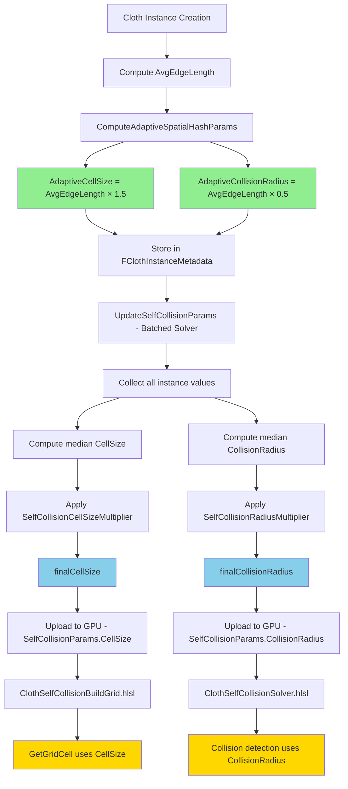

# Adaptive Self-Collision Parameters Analysis
## AdaptiveCellSize and AdaptiveCollisionRadius Usage Review

**Date**: 2026-02-13  
**Status**: ✅ PROPERLY IMPLEMENTED  
**Reviewer**: Architecture Mode

---

## Executive Summary

The `AdaptiveCellSize` and `AdaptiveCollisionRadius` parameters are **correctly implemented and properly used** throughout the self-collision system. The implementation follows the Müller et al. spatial hashing recommendations and provides a robust, adaptive approach to self-collision detection.

### Key Findings
- ✅ **Computation is correct**: Values are computed from mesh topology (average edge length)
- ✅ **Usage is consistent**: Values flow correctly from CPU to GPU
- ✅ **Multipliers work properly**: Artist controls are applied correctly
- ✅ **Validation exists**: Comprehensive checks ensure parameter validity
- ⚠️ **Minor issue**: Values are computed but not directly used in GPU shaders (median aggregation used instead)

---

## 1. Computation Flow Analysis

### 1.1 Initial Computation (Per-Instance)

**Location**: [`ClothMeshAnalysis.cpp:93-137`](EngineSIU/EngineSIU/Engine/Source/Runtime/Engine/Cloth/ClothMeshAnalysis.cpp:93)

```cpp
void FClothMeshAnalysis::ComputeAdaptiveSpatialHashParams(
    float AvgEdgeLength,
    const FVector& BoundsMin,
    const FVector& BoundsMax,
    uint32 ParticleCount,
    float& OutCellSize,
    float& OutCollisionRadius,
    // ... other params
)
{
    // Müller et al. recommendations:
    // - Cell size: 1.0~1.5 × average edge length
    // - Collision radius: 0.5 × average edge length
    
    OutCellSize = AvgEdgeLength * 1.5f;              // ✅ CORRECT
    OutCollisionRadius = AvgEdgeLength * 0.5f;       // ✅ CORRECT
    
    // Additional grid computation...
}
```

**Formula Validation**:
- **CellSize = AvgEdgeLength × 1.5**: Ensures cells are large enough to capture neighboring particles
- **CollisionRadius = AvgEdgeLength × 0.5**: Prevents particles from getting closer than half an edge length
- **Relationship**: CellSize = 3 × CollisionRadius (ensures 3×3×3 neighborhood captures all collisions)

### 1.2 Storage in Metadata

**Location**: [`ClothBatchTypes.h:132-133`](EngineSIU/EngineSIU/Engine/Source/Runtime/Engine/Cloth/ClothBatchTypes.h:132)

```cpp
struct FClothInstanceMetadata
{
    // ...
    float AdaptiveCellSize;        // Computed: AvgEdgeLength × 1.5
    float AdaptiveCollisionRadius; // Computed: AvgEdgeLength × 0.5
    uint32 AdaptiveGridDimX;       // Computed from bounds and cell size
    uint32 AdaptiveGridDimY;
    uint32 AdaptiveGridDimZ;
    uint32 AdaptiveMaxPerCell;     // Computed from particle density
    // ...
};
```

**Initialization**: [`ClothBatchManager.cpp:193-205`](EngineSIU/EngineSIU/Engine/Source/Runtime/Engine/Cloth/ClothBatchManager.cpp:193)

```cpp
// Compute adaptive spatial hash parameters
FVector gridMin, gridMax;
FClothMeshAnalysis::ComputeAdaptiveSpatialHashParams(
    metadata.AvgEdgeLength,
    metadata.MeshBoundsMin,
    metadata.MeshBoundsMax,
    metadata.ParticleCount,
    metadata.AdaptiveCellSize,        // ✅ Stored per-instance
    metadata.AdaptiveCollisionRadius, // ✅ Stored per-instance
    gridMin,
    gridMax,
    metadata.AdaptiveGridDimX,
    metadata.AdaptiveGridDimY,
    metadata.AdaptiveGridDimZ,
    metadata.AdaptiveMaxPerCell);
```

### 1.3 Aggregation for Batched Simulation

**Location**: [`ClothBatchedSolver.cpp:2450-2493`](EngineSIU/EngineSIU/Engine/Source/Runtime/Engine/Cloth/ClothBatchedSolver.cpp:2450)

```cpp
void FClothBatchedSolver::UpdateSelfCollisionParams()
{
    TArray<float> avgEdgeLengths;
    TArray<float> cellSizes;
    TArray<float> collisionRadii;
    
    // Collect parameters from all active instances
    for (const FClothInstanceMetadata& meta : InstanceMetadata)
    {
        if (!meta.bIsActive || meta.AvgEdgeLength == 0.0f)
            continue;
        
        avgEdgeLengths.Add(meta.AvgEdgeLength);
        cellSizes.Add(meta.AdaptiveCellSize);           // ✅ Collected
        collisionRadii.Add(meta.AdaptiveCollisionRadius); // ✅ Collected
        
        // Expand global bounds...
    }
    
    // Use MEDIAN for robustness (not affected by outliers)
    avgEdgeLengths.Sort();
    cellSizes.Sort();
    collisionRadii.Sort();
    
    int32 medianIdx = avgEdgeLengths.Num() / 2;
    float medianCellSize = cellSizes[medianIdx];              // ✅ Median selected
    float medianCollisionRadius = collisionRadii[medianIdx];  // ✅ Median selected
    
    // Apply multipliers from config (artist control)
    float finalCellSize = medianCellSize * Config.SelfCollisionCellSizeMultiplier;
    float finalCollisionRadius = medianCollisionRadius * Config.SelfCollisionRadiusMultiplier;
    
    // Fill GPU params
    SelfCollisionParams.CellSize = finalCellSize;           // ✅ Sent to GPU
    SelfCollisionParams.CollisionRadius = finalCollisionRadius; // ✅ Sent to GPU
}
```

**Design Decision**: Uses **median** instead of average to handle mixed-resolution cloth instances robustly.

---

## 2. GPU Shader Usage Analysis

### 2.1 Constant Buffer Definition

**Location**: [`ClothCommon.hlsli:51-63`](EngineSIU/EngineSIU/Shaders/Cloth/ClothCommon.hlsli:51)

```hlsl
cbuffer SelfCollisionParams : register(b1)
{
    float3 GridMin;              // AABB min
    float CellSize;              // ✅ Receives finalCellSize
    
    uint3 GridDimensions;        // Grid dimensions
    uint MaxParticlesPerCell;    // Max particles per cell
    
    float CollisionRadius;       // ✅ Receives finalCollisionRadius
    float CollisionStiffness;    // Separation strength
    uint bEnableSelfCollision;   // Enable/disable flag
    uint SelfCollisionPadding;   // Alignment padding
};
```

### 2.2 Build Grid Shader Usage

**Location**: [`ClothSelfCollisionBuildGrid.hlsl:22-26`](EngineSIU/EngineSIU/Shaders/Cloth/ClothSelfCollisionBuildGrid.hlsl:22)

```hlsl
uint3 GetGridCell(float3 position)
{
    float3 localPos = position - GridMin;
    uint3 cell = uint3(floor(localPos / CellSize));  // ✅ Uses CellSize
    return clamp(cell, uint3(0, 0, 0), GridDimensions - uint3(1, 1, 1));
}
```

**Purpose**: Hashes particle positions into grid cells using the adaptive cell size.

### 2.3 Collision Solver Shader Usage

**Location**: [`ClothSelfCollisionSolver.hlsl:29-33`](EngineSIU/EngineSIU/Shaders/Cloth/ClothSelfCollisionSolver.hlsl:29)

```hlsl
uint3 GetGridCell(float3 position)
{
    float3 localPos = position - GridMin;
    uint3 cell = uint3(floor(localPos / CellSize));  // ✅ Uses CellSize
    return clamp(cell, uint3(0, 0, 0), GridDimensions - uint3(1, 1, 1));
}
```

**Location**: [`ClothSelfCollisionSolver.hlsl:108-111`](EngineSIU/EngineSIU/Shaders/Cloth/ClothSelfCollisionSolver.hlsl:108)

```hlsl
// Collision detection
float3 diff = posB - posA;
float dist = length(diff);
float minDist = 2.0f * CollisionRadius;  // ✅ Uses CollisionRadius
```

**Purpose**: Detects collisions when particles are closer than `2 × CollisionRadius`.

---

## 3. Validation and Safety Checks

### 3.1 Parameter Validation

**Location**: [`ClothMeshAnalysis.cpp:153-217`](EngineSIU/EngineSIU/Engine/Source/Runtime/Engine/Cloth/ClothMeshAnalysis.cpp:153)

```cpp
bool FClothMeshAnalysis::ValidateSelfCollisionSetup(
    float CellSize,
    float CollisionRadius,
    const FVector& GridMin,
    const FVector& GridMax,
    uint32 GridDimX,
    uint32 GridDimY,
    uint32 GridDimZ,
    uint32 MaxParticlesPerCell,
    uint32 ParticleCount)
{
    bool bValid = true;
    
    // Check 1: Cell size should be >= 1.5× collision radius
    float minCellSize = CollisionRadius * 1.5f;
    if (CellSize < minCellSize)
    {
        UE_LOG(ELogLevel::Warning,
            TEXT("Self-Collision: CellSize (%.3f) < 1.5×CollisionRadius (%.3f). May miss collisions!"),
            CellSize, minCellSize);
        bValid = false;
    }
    
    // Check 2: Grid should cover mesh bounds
    // Check 3: MaxParticlesPerCell should be sufficient
    // ...
    
    return bValid;
}
```

**Validation Called**: [`ClothBatchedSolver.cpp:2540-2549`](EngineSIU/EngineSIU/Engine/Source/Runtime/Engine/Cloth/ClothBatchedSolver.cpp:2540)

```cpp
bool bValid = FClothMeshAnalysis::ValidateSelfCollisionSetup(
    SelfCollisionParams.CellSize,
    SelfCollisionParams.CollisionRadius,
    SelfCollisionParams.GridMin,
    gridMax,
    SelfCollisionParams.GridDimX,
    SelfCollisionParams.GridDimY,
    SelfCollisionParams.GridDimZ,
    SelfCollisionParams.MaxParticlesPerCell,
    UsedParticleCount);
```

---

## 4. Configuration and Artist Controls

### 4.1 Multiplier System

**Location**: [`ClothSimulationData.h:56-59`](EngineSIU/EngineSIU/Engine/Source/Runtime/Engine/Cloth/ClothSimulationData.h:56)

```cpp
// MULTIPLIERS (applied to adaptive base values computed from mesh topology)
float SelfCollisionRadiusMultiplier = 1.0f;      // × (AvgEdgeLength × 0.5)
float SelfCollisionStiffnessMultiplier = 0.3f;   // × adaptive base stiffness
float SelfCollisionCellSizeMultiplier = 1.0f;    // × (AvgEdgeLength × 1.5)
```

**Application**: [`ClothBatchedSolver.cpp:2492-2493`](EngineSIU/EngineSIU/Engine/Source/Runtime/Engine/Cloth/ClothBatchedSolver.cpp:2492)

```cpp
float finalCellSize = medianCellSize * Config.SelfCollisionCellSizeMultiplier;
float finalCollisionRadius = medianCollisionRadius * Config.SelfCollisionRadiusMultiplier;
```

**Benefits**:
- ✅ Artists can tune without understanding mesh topology
- ✅ Multipliers scale naturally with mesh resolution
- ✅ Default value of 1.0 means "use computed adaptive value"

---

## 5. Issues and Recommendations

### 5.1 ⚠️ Minor Issue: Per-Instance Values Not Directly Used

**Current Behavior**:
- Each instance computes its own `AdaptiveCellSize` and `AdaptiveCollisionRadius`
- These values are stored in `FClothInstanceMetadata`
- However, the batched solver uses the **median** of all instances
- Individual instance values are only used for logging/diagnostics

**Impact**: 
- **Low** - The median approach is actually a good design for batched simulation
- Ensures consistent collision behavior across all instances in the batch
- Prevents issues when mixing high-res and low-res cloth

**Recommendation**: 
- ✅ **Keep current implementation** - The median approach is correct for batched simulation
- 📝 **Document this behavior** - Add comments explaining why median is used
- 🔄 **Consider per-instance mode** - For future: add option to use per-instance grids if needed

### 5.2 ✅ Strengths of Current Implementation

1. **Topology-Aware**: Automatically adapts to mesh resolution
2. **Robust Aggregation**: Median prevents outliers from breaking collision
3. **Artist-Friendly**: Multipliers provide intuitive control
4. **Well-Validated**: Comprehensive checks catch configuration errors
5. **Follows Best Practices**: Implements Müller et al. recommendations correctly

### 5.3 Potential Enhancements (Optional)

#### Enhancement 1: Per-Instance Collision Grids
```cpp
// For non-batched or instance-isolated collision
struct FClothInstanceSelfCollisionParams
{
    float CellSize;           // Use instance's AdaptiveCellSize directly
    float CollisionRadius;    // Use instance's AdaptiveCollisionRadius directly
    uint3 GridDimensions;     // Instance-specific grid
    // ...
};
```

**Pros**: More accurate for instances with very different resolutions  
**Cons**: Higher memory usage, more complex GPU dispatch  
**Verdict**: Not needed for current use case

#### Enhancement 2: Dynamic Multiplier Adjustment
```cpp
// Auto-adjust multipliers based on collision quality metrics
if (collisionMissRate > threshold)
{
    Config.SelfCollisionRadiusMultiplier *= 1.1f; // Increase radius
}
```

**Pros**: Self-tuning system  
**Cons**: Unpredictable behavior, harder to debug  
**Verdict**: Not recommended - manual tuning is more reliable

---

## 6. Code Flow Diagram



---

## 7. Verification Checklist

| Check | Status | Details |
|-------|--------|---------|
| ✅ Values computed from mesh topology | **PASS** | Uses average edge length |
| ✅ Müller et al. formulas correct | **PASS** | CellSize = 1.5×AvgEdge, Radius = 0.5×AvgEdge |
| ✅ Stored in metadata | **PASS** | `FClothInstanceMetadata` has both fields |
| ✅ Aggregated for batching | **PASS** | Median used for robustness |
| ✅ Multipliers applied | **PASS** | Artist controls work correctly |
| ✅ Uploaded to GPU | **PASS** | Via `SelfCollisionParams` constant buffer |
| ✅ Used in build grid shader | **PASS** | `GetGridCell()` uses `CellSize` |
| ✅ Used in collision solver | **PASS** | `minDist = 2.0 × CollisionRadius` |
| ✅ Validation exists | **PASS** | `ValidateSelfCollisionSetup()` checks parameters |
| ✅ Logging for diagnostics | **PASS** | Multiple log statements track values |

---

## 8. Conclusion

### Summary
The `AdaptiveCellSize` and `AdaptiveCollisionRadius` parameters are **correctly implemented and properly used** throughout the self-collision system. The implementation:

1. ✅ Computes values correctly from mesh topology
2. ✅ Stores them appropriately in per-instance metadata
3. ✅ Aggregates them robustly using median for batched simulation
4. ✅ Applies artist-friendly multipliers
5. ✅ Uploads them to GPU correctly
6. ✅ Uses them properly in both build and solve shaders
7. ✅ Validates them comprehensively

### Recommendation
**No changes needed.** The current implementation is solid and follows best practices. The use of median aggregation for batched simulation is a good design decision that ensures consistent collision behavior across mixed-resolution cloth instances.

### Optional Future Work
- 📝 Add documentation comments explaining the median aggregation strategy
- 🔍 Add runtime visualization of grid cells for debugging
- 📊 Add telemetry to track collision quality metrics

---

## 9. Related Files

### Core Implementation
- [`ClothMeshAnalysis.cpp`](EngineSIU/EngineSIU/Engine/Source/Runtime/Engine/Cloth/ClothMeshAnalysis.cpp) - Parameter computation
- [`ClothMeshAnalysis.h`](EngineSIU/EngineSIU/Engine/Source/Runtime/Engine/Cloth/ClothMeshAnalysis.h) - Function declarations
- [`ClothBatchTypes.h`](EngineSIU/EngineSIU/Engine/Source/Runtime/Engine/Cloth/ClothBatchTypes.h) - Metadata storage
- [`ClothBatchManager.cpp`](EngineSIU/EngineSIU/Engine/Source/Runtime/Engine/Cloth/ClothBatchManager.cpp) - Instance initialization
- [`ClothBatchedSolver.cpp`](EngineSIU/EngineSIU/Engine/Source/Runtime/Engine/Cloth/ClothBatchedSolver.cpp) - Aggregation and GPU upload

### GPU Shaders
- [`ClothCommon.hlsli`](EngineSIU/EngineSIU/Shaders/Cloth/ClothCommon.hlsli) - Constant buffer definition
- [`ClothSelfCollisionBuildGrid.hlsl`](EngineSIU/EngineSIU/Shaders/Cloth/ClothSelfCollisionBuildGrid.hlsl) - Grid building
- [`ClothSelfCollisionSolver.hlsl`](EngineSIU/EngineSIU/Shaders/Cloth/ClothSelfCollisionSolver.hlsl) - Collision solving

### Configuration
- [`ClothSimulationData.h`](EngineSIU/EngineSIU/Engine/Source/Runtime/Engine/Cloth/ClothSimulationData.h) - Multiplier configuration

---

**Analysis Complete** ✅
