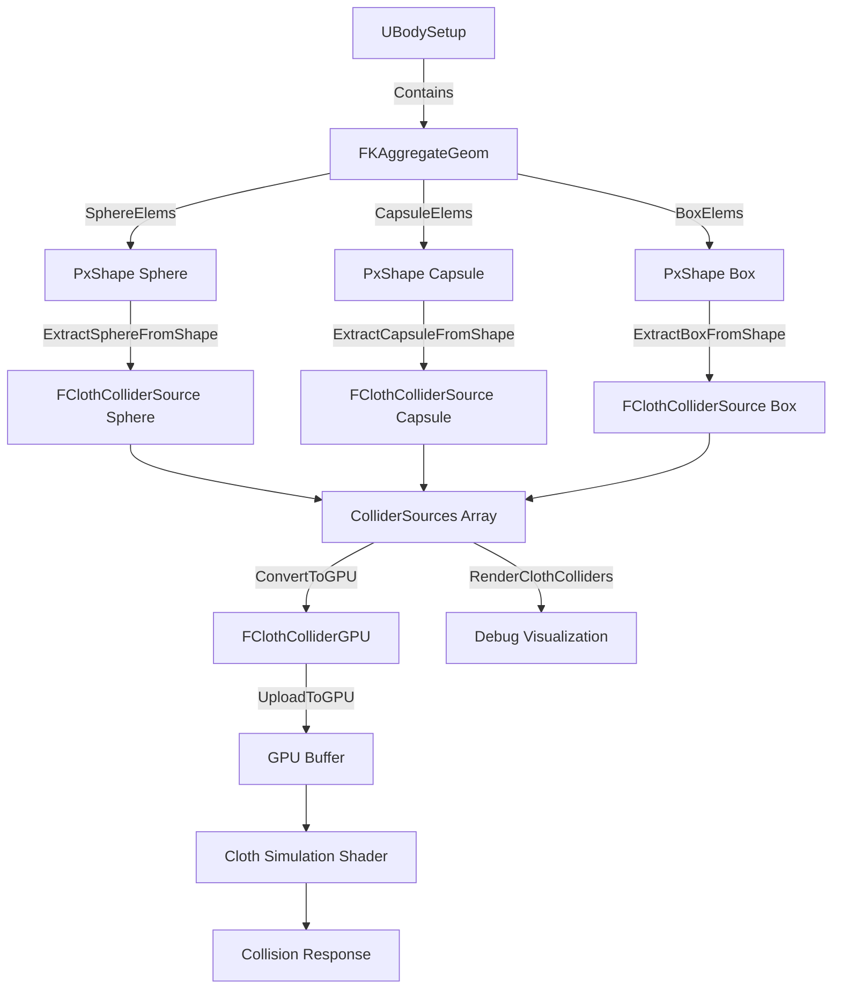

# Capsule Collision Primitive Fix Plan

## Problem Summary

When adding a Capsule collision primitive to cloth collision system, two critical issues occur:

1. **D3D11 Warning during rendering**: Vertex buffer too small for DrawInstanced call
2. **Missing capsule collision in PIE mode**: Capsules are not being extracted, rendered, or applied for cloth collision

## Root Cause Analysis

### Issue 1: Missing Capsule Extraction from PhysX Shapes

**Location**: [`ClothCollisionManager.cpp:304-338`](EngineSIU/EngineSIU/Engine/Source/Runtime/Engine/Cloth/ClothCollisionManager.cpp:304)

**Problem**: The `ExtractCollidersFromBodySetup()` function calls extraction methods with **PhysX PxShape pointers**, but the function signatures expect **PhysX shapes** to be passed:

```cpp
void FClothCollisionManager::ExtractCollidersFromBodySetup(UBodySetup* BodySetup, UPrimitiveComponent* Component)
{
    FKAggregateGeom& AggGeom = BodySetup->AggGeom;
    
    // Extract spheres from PhysX shapes
    for (int32 i = 0; i < AggGeom.SphereElems.Num(); ++i)
    {
        ExtractSphereFromShape(AggGeom.SphereElems[i], Component, i);  // ✓ Works
    }
    
    // Extract capsules from PhysX shapes
    for (int32 i = 0; i < AggGeom.CapsuleElems.Num(); ++i)
    {
        ExtractCapsuleFromShape(AggGeom.CapsuleElems[i], Component, i);  // ✓ Works
    }
    
    // Extract boxes from PhysX shapes
    for (int32 i = 0; i < AggGeom.BoxElems.Num(); ++i)
    {
        ExtractBoxFromShape(AggGeom.BoxElems[i], Component, i);  // ✓ Works
    }
}
```

**Analysis**: The extraction functions are correctly implemented and should work. However, there might be an issue with:
- PhysX shape geometry retrieval
- Capsule-specific PhysX API calls
- Local pose transformation

### Issue 2: Vertex Buffer Size Mismatch

**Location**: [`EditorRenderPass.cpp:897-1008`](EngineSIU/EngineSIU/Engine/Source/Runtime/Renderer/EditorRenderPass.cpp:897)

**Problem**: The D3D11 warning indicates that when rendering capsules from `StaticMeshComponent->GeomAttributes`, the vertex buffer is too small.

**Current Code**:
```cpp
void FEditorRenderPass::RenderCapsuleInstanced(uint64 ShowFlag)
{
    BindShaderResource(L"CapsuleVS", L"CapsulePS", D3D11_PRIMITIVE_TOPOLOGY_LINELIST);
    
    // NOTE: No BindBuffers() call here! Unlike Box and Sphere rendering
    
    TArray<FConstantBufferDebugCapsule> BufferAll;
    
    // Collect from CapsuleComponents
    for (UShapeComponent* ShapeComponent : Resources.Components.CapsuleComponents) { ... }
    
    // Collect from StaticMeshComponent GeomAttributes
    for (const UStaticMeshComponent* StaticComp : Resources.Components.StaticMeshComponent)
    {
        if (ShowFlag & EEngineShowFlags::SF_CollisionSelectedOnly)
        {
            for (const auto& GeomAttribute : StaticComp->GeomAttributes)
            {
                if (GeomAttribute.GeomType == EGeomType::ECapsule)
                {
                    // Build capsule data and add to BufferAll
                }
            }
        }
    }
    
    // Draw with procedural vertex generation
    Graphics->DeviceContext->DrawInstanced(1184, SubBuffer.Num(), 0, 0);
}
```

**Analysis**: 
- Capsule rendering uses **procedural vertex generation** in the shader (no vertex buffer needed)
- The shader [`CapsuleVS`](EngineSIU/EngineSIU/Shaders/EditorShader.hlsl:628) generates 1184 vertices per instance procedurally
- The D3D11 warning suggests that somewhere a vertex buffer IS being bound when it shouldn't be
- **Root cause**: Missing vertex buffer unbinding or incorrect buffer state from previous render calls

### Issue 3: Capsule Not Applied in PIE Cloth Collision

**Location**: [`ClothCollisionManager.cpp:366-399`](EngineSIU/EngineSIU/Engine/Source/Runtime/Engine/Cloth/ClothCollisionManager.cpp:366)

**Problem**: The `ExtractCapsuleFromShape()` function may have issues with:

1. **PhysX capsule geometry retrieval**
2. **Local rotation handling** 
3. **Axis transformation**

**Current Implementation**:
```cpp
void FClothCollisionManager::ExtractCapsuleFromShape(physx::PxShape* Shape, UPrimitiveComponent* Component, int32 ElementIndex)
{
    if (!Shape)
        return;
    
    // Get capsule geometry from PhysX shape
    physx::PxCapsuleGeometry capsuleGeom;
    if (!Shape->getCapsuleGeometry(capsuleGeom))  // ← May fail silently
        return;
    
    // Get local pose from shape
    physx::PxTransform localPose = Shape->getLocalPose();
    
    FClothColliderSource Source;
    Source.Type = EClothColliderType::Capsule;
    Source.Component = Component;
    Source.ElementIndex = ElementIndex;
    Source.CachedTransform = Component->GetComponentTransform();
    Source.CachedLocalCenter = FVector(localPose.p.x, localPose.p.y, localPose.p.z);
    Source.CachedLocalRotation = FQuat(localPose.q.x, localPose.q.y, localPose.q.z, localPose.q.w);
    
    // PhysX capsule axis is along X by default
    physx::PxQuat quat = localPose.q;
    FVector axis = FVector(1, 0, 0); // Default axis along X
    physx::PxVec3 pxAxis = quat.rotate(physx::PxVec3(1, 0, 0));
    Source.CachedLocalAxis = FVector(pxAxis.x, pxAxis.y, pxAxis.z).GetSafeNormal();
    Source.CachedRadius = capsuleGeom.radius;
    Source.CachedExtents = FVector(capsuleGeom.halfHeight, 0, 0);  // Store half-height in X
    Source.bIsDirty = true;
    Source.GPUBufferIndex = ColliderSources.Num();
    
    ColliderSources.Add(Source);
}
```

**Potential Issues**:
- `getCapsuleGeometry()` might return false if the shape is not a capsule
- Need to add logging to verify capsule extraction is being called
- Need to verify PhysX shape type before extraction

## Diagnostic Information Needed

To properly diagnose the issue, we need to add logging:

1. **In `ExtractCollidersFromBodySetup()`**:
   - Log the number of capsule elements found in `AggGeom.CapsuleElems`
   - Log whether extraction succeeds or fails

2. **In `ExtractCapsuleFromShape()`**:
   - Log when function is called
   - Log if `getCapsuleGeometry()` fails
   - Log extracted capsule parameters (radius, half-height, local pose)

3. **In `RenderClothColliders()`**:
   - Log the number of capsule colliders being rendered
   - Verify capsule data is present in the collision manager

## Solution Plan

### Step 1: Add Diagnostic Logging

Add comprehensive logging to identify where the capsule extraction fails:

```cpp
void FClothCollisionManager::ExtractCollidersFromBodySetup(UBodySetup* BodySetup, UPrimitiveComponent* Component)
{
    if (!BodySetup || !Component)
        return;
    
    FKAggregateGeom& AggGeom = BodySetup->AggGeom;
    TArray<int32> NewColliderIndices;
    
    UE_LOG(ELogLevel::Display, TEXT("ClothCollisionManager: Extracting colliders from %s"), *Component->GetName());
    UE_LOG(ELogLevel::Display, TEXT("  - Spheres: %d, Capsules: %d, Boxes: %d"), 
        AggGeom.SphereElems.Num(), AggGeom.CapsuleElems.Num(), AggGeom.BoxElems.Num());
    
    // Extract spheres
    for (int32 i = 0; i < AggGeom.SphereElems.Num(); ++i)
    {
        ExtractSphereFromShape(AggGeom.SphereElems[i], Component, i);
        NewColliderIndices.Add(ColliderSources.Num() - 1);
    }
    
    // Extract capsules
    for (int32 i = 0; i < AggGeom.CapsuleElems.Num(); ++i)
    {
        int32 BeforeCount = ColliderSources.Num();
        ExtractCapsuleFromShape(AggGeom.CapsuleElems[i], Component, i);
        if (ColliderSources.Num() > BeforeCount)
        {
            NewColliderIndices.Add(ColliderSources.Num() - 1);
            UE_LOG(ELogLevel::Display, TEXT("  - Capsule %d extracted successfully"), i);
        }
        else
        {
            UE_LOG(ELogLevel::Warning, TEXT("  - Capsule %d extraction FAILED"), i);
        }
    }
    
    // Extract boxes
    for (int32 i = 0; i < AggGeom.BoxElems.Num(); ++i)
    {
        ExtractBoxFromShape(AggGeom.BoxElems[i], Component, i);
        NewColliderIndices.Add(ColliderSources.Num() - 1);
    }
    
    // Track component to colliders mapping
    if (NewColliderIndices.Num() > 0)
    {
        ComponentToColliderMap.Add(Component, NewColliderIndices);
    }
}
```

### Step 2: Enhanced Capsule Extraction with Error Handling

```cpp
void FClothCollisionManager::ExtractCapsuleFromShape(physx::PxShape* Shape, UPrimitiveComponent* Component, int32 ElementIndex)
{
    if (!Shape)
    {
        UE_LOG(ELogLevel::Warning, TEXT("ClothCollisionManager: ExtractCapsuleFromShape - Shape is null"));
        return;
    }
    
    // Verify shape type first
    physx::PxGeometryType::Enum geomType = Shape->getGeometryType();
    if (geomType != physx::PxGeometryType::eCAPSULE)
    {
        UE_LOG(ELogLevel::Warning, TEXT("ClothCollisionManager: Shape is not a capsule (type=%d)"), (int)geomType);
        return;
    }
    
    // Get capsule geometry from PhysX shape
    physx::PxCapsuleGeometry capsuleGeom;
    if (!Shape->getCapsuleGeometry(capsuleGeom))
    {
        UE_LOG(ELogLevel::Error, TEXT("ClothCollisionManager: Failed to get capsule geometry from shape"));
        return;
    }
    
    // Get local pose from shape
    physx::PxTransform localPose = Shape->getLocalPose();
    
    UE_LOG(ELogLevel::Display, TEXT("ClothCollisionManager: Extracting capsule - Radius=%.2f, HalfHeight=%.2f, Pos=(%.2f,%.2f,%.2f)"),
        capsuleGeom.radius, capsuleGeom.halfHeight,
        localPose.p.x, localPose.p.y, localPose.p.z);
    
    FClothColliderSource Source;
    Source.Type = EClothColliderType::Capsule;
    Source.Component = Component;
    Source.ElementIndex = ElementIndex;
    Source.CachedTransform = Component->GetComponentTransform();
    Source.CachedLocalCenter = FVector(localPose.p.x, localPose.p.y, localPose.p.z);
    Source.CachedLocalRotation = FQuat(localPose.q.x, localPose.q.y, localPose.q.z, localPose.q.w);
    
    // PhysX capsule axis is along X by default
    physx::PxQuat quat = localPose.q;
    physx::PxVec3 pxAxis = quat.rotate(physx::PxVec3(1, 0, 0));
    Source.CachedLocalAxis = FVector(pxAxis.x, pxAxis.y, pxAxis.z).GetSafeNormal();
    Source.CachedRadius = capsuleGeom.radius;
    Source.CachedExtents = FVector(capsuleGeom.halfHeight, 0, 0);  // Store half-height in X
    Source.bIsDirty = true;
    Source.GPUBufferIndex = ColliderSources.Num();
    
    ColliderSources.Add(Source);
    
    UE_LOG(ELogLevel::Display, TEXT("ClothCollisionManager: Capsule added to ColliderSources (index=%d)"), Source.GPUBufferIndex);
}
```

### Step 3: Fix Vertex Buffer State Issue in Rendering

The D3D11 warning occurs because a vertex buffer is bound when it shouldn't be. Fix by explicitly unbinding:

```cpp
void FEditorRenderPass::RenderCapsuleInstanced(uint64 ShowFlag)
{
    BindShaderResource(L"CapsuleVS", L"CapsulePS", D3D11_PRIMITIVE_TOPOLOGY_LINELIST);
    
    // CRITICAL FIX: Unbind vertex buffer since capsule uses procedural generation
    ID3D11Buffer* nullBuffer = nullptr;
    UINT stride = 0;
    UINT offset = 0;
    Graphics->DeviceContext->IASetVertexBuffers(0, 1, &nullBuffer, &stride, &offset);
    Graphics->DeviceContext->IASetIndexBuffer(nullptr, DXGI_FORMAT_R32_UINT, 0);
    
    // Rest of the function remains the same...
    TArray<FConstantBufferDebugCapsule> BufferAll;
    
    // ... collection code ...
    
    if (BufferAll.Num() > 0)
    {
        BufferManager->BindConstantBuffer("CapsuleConstantBuffer", 11, EShaderStage::Vertex);
        int BufferIndex = 0;
        for (int i = 0; i < (1 + BufferAll.Num() / ConstantBufferSizeCapsule) * ConstantBufferSizeCapsule; ++i)
        {
            TArray<FConstantBufferDebugCapsule> SubBuffer;
            for (int j = 0; j < ConstantBufferSizeCapsule; ++j)
            {
                if (BufferIndex < BufferAll.Num())
                {
                    SubBuffer.Add(BufferAll[BufferIndex]);
                    ++BufferIndex;
                }
                else
                {
                    break;
                }
            }
        
            if (SubBuffer.Num() > 0)
            {
                BufferManager->UpdateConstantBuffer<FConstantBufferDebugCapsule>(TEXT("CapsuleConstantBuffer"), SubBuffer);
                Graphics->DeviceContext->DrawInstanced(1184, SubBuffer.Num(), 0, 0);
            }
        }
    }
}
```

### Step 4: Verify Capsule Rendering in PIE Mode

Ensure [`RenderClothColliders()`](EngineSIU/EngineSIU/Engine/Source/Runtime/Renderer/EditorRenderPass.cpp:1010) properly handles capsules:

```cpp
void FEditorRenderPass::RenderClothColliders(uint64 ShowFlag)
{
    // ... existing sphere rendering code ...
    
    // Render capsules
    {
        BindShaderResource(L"CapsuleVS", L"CapsulePS", D3D11_PRIMITIVE_TOPOLOGY_LINELIST);
        
        // CRITICAL FIX: Unbind vertex buffer for procedural generation
        ID3D11Buffer* nullBuffer = nullptr;
        UINT stride = 0;
        UINT offset = 0;
        Graphics->DeviceContext->IASetVertexBuffers(0, 1, &nullBuffer, &stride, &offset);
        Graphics->DeviceContext->IASetIndexBuffer(nullptr, DXGI_FORMAT_R32_UINT, 0);
        
        TArray<FConstantBufferDebugCapsule> BufferAll;
        for (const FClothColliderSource& Source : Colliders)
        {
            if (Source.Type == EClothColliderType::Capsule)
            {
                FConstantBufferDebugCapsule b;
                
                // Build local transform from PhysX shape data (rotation + offset)
                FTransform LocalTransform(Source.CachedLocalRotation, Source.CachedLocalCenter, FVector::OneVector);
                
                // Compose: LocalTransform * ComponentTransform = World transform
                FTransform WorldTransform = LocalTransform * Source.CachedTransform;
                
                b.WorldMatrix = WorldTransform.ToMatrixWithScale();
                b.Radius = Source.CachedRadius;
                b.Height = Source.CachedExtents.X;  // Half-height stored in X
                
                BufferAll.Add(b);
            }
        }
        
        UE_LOG(ELogLevel::Display, TEXT("RenderClothColliders: Rendering %d capsules"), BufferAll.Num());
        
        if (BufferAll.Num() > 0)
        {
            // ... existing batched rendering code ...
        }
    }
    
    // ... existing box rendering code ...
}
```

## Implementation Checklist

- [ ] Add diagnostic logging to `ExtractCollidersFromBodySetup()`
- [ ] Add error handling and logging to `ExtractCapsuleFromShape()`
- [ ] Add geometry type verification before extraction
- [ ] Fix vertex buffer unbinding in `RenderCapsuleInstanced()`
- [ ] Fix vertex buffer unbinding in `RenderClothColliders()` capsule section
- [ ] Add logging to verify capsule count in PIE rendering
- [ ] Test with a simple scene containing capsule collision primitives
- [ ] Verify D3D11 warning is resolved
- [ ] Verify capsules render correctly in PIE mode
- [ ] Verify cloth collision with capsules works correctly

## Testing Strategy

### Test Case 1: Editor Mode Capsule Rendering
1. Create a static mesh with capsule collision primitive
2. Enable collision visualization (SF_Collision flag)
3. Verify capsule wireframe renders without D3D11 warnings
4. Check console for extraction logs

### Test Case 2: PIE Mode Capsule Collision
1. Create a skeletal mesh with physics asset containing capsule primitives
2. Add cloth component to scene
3. Enter PIE mode
4. Verify capsules are extracted (check logs)
5. Verify capsules render in debug visualization
6. Verify cloth collides with capsules

### Test Case 3: Multiple Capsule Instances
1. Create multiple objects with capsule colliders
2. Verify all capsules are extracted and rendered
3. Check for performance issues with batched rendering

## Expected Outcomes

After implementing these fixes:

1. ✅ No D3D11 vertex buffer warnings
2. ✅ Capsules extracted successfully from PhysX shapes
3. ✅ Capsules render correctly in both Editor and PIE modes
4. ✅ Cloth collision with capsules works as expected
5. ✅ Consistent behavior with Box and Sphere collision primitives

## Architecture Diagram



## Related Files

- [`ClothCollisionManager.cpp`](EngineSIU/EngineSIU/Engine/Source/Runtime/Engine/Cloth/ClothCollisionManager.cpp)
- [`ClothCollisionManager.h`](EngineSIU/EngineSIU/Engine/Source/Runtime/Engine/Cloth/ClothCollisionManager.h)
- [`EditorRenderPass.cpp`](EngineSIU/EngineSIU/Engine/Source/Runtime/Renderer/EditorRenderPass.cpp)
- [`EditorShader.hlsl`](EngineSIU/EngineSIU/Shaders/EditorShader.hlsl)
- [`PhysicsAsset.h`](EngineSIU/EngineSIU/Engine/Source/Runtime/Engine/Classes/PhysicsEngine/PhysicsAsset.h)

## Notes

- The capsule shader uses procedural vertex generation (1184 vertices per instance)
- PhysX capsules have their axis along X by default
- The local rotation must be properly composed with component transform
- Vertex buffer must be explicitly unbound for procedural rendering
