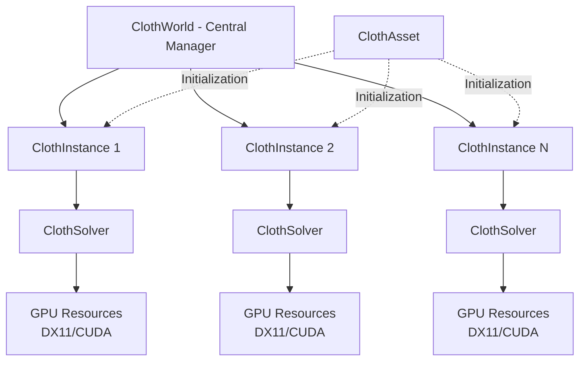
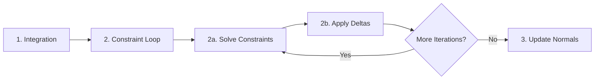
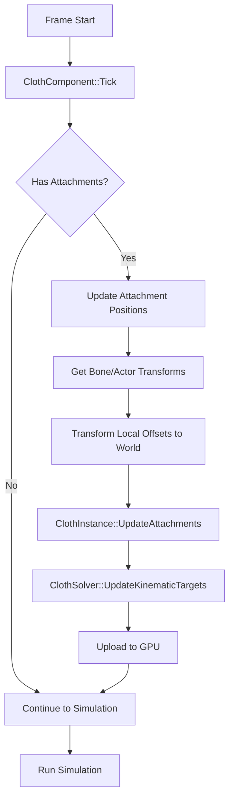
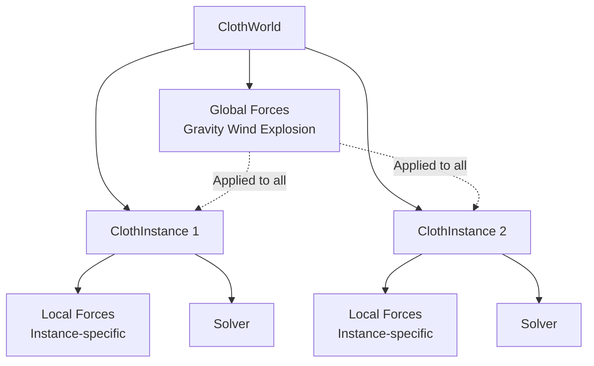

# Cloth Simulation Advanced Features Architecture

**Target Features:**
1. Bend Constraints
2. Kinematic Attachment to Moving Meshes
3. Global World-Space Forces

---

## Part 1: Current System Architecture Analysis

### 1.1 Overall Structure



### 1.2 Class Responsibilities

#### ClothWorld
- **Purpose**: Central manager for all cloth simulations in a world
- **Responsibilities**:
  - Registers/unregisters cloth instances
  - Calls `Update()` once per frame for all instances
  - Manages instance lifecycle
- **Current Limitations**:
  - No global force management
  - Each instance simulates independently

#### ClothInstance
- **Purpose**: Per-instance simulation state and runtime data
- **Responsibilities**:
  - Owns a ClothSolver
  - Stores per-instance forces (Gravity, Wind)
  - Manages attachments (currently stub)
  - Calls `Solver->Simulate()` per frame
- **Current Limitations**:
  - Forces are per-instance only
  - Attachment system is not implemented

#### ClothSolver
- **Purpose**: GPU-based PBD solver
- **Responsibilities**:
  - Manages GPU buffers (DX11 + CUDA interop)
  - Executes simulation pipeline (Integration → Constraints → Normals)
  - Uploads/downloads data between CPU/GPU
- **Dual Backend**: DX11 Compute Shaders OR CUDA kernels
- **Current Limitations**:
  - Only distance constraints implemented
  - No kinematic constraint handling
  - No separate bend constraint support

#### ClothAsset
- **Purpose**: Authoring data for cloth simulation
- **Stores**:
  - Rest positions, indices, inverse masses
  - Distance constraints (structural/shear)
  - Bend constraints (exists but unused)
  - Attachment indices (exists but unused)
- **Note**: BendConstraints array exists but is not processed by solver

### 1.3 Current Constraint System

#### Data Structure
```cpp
struct FClothConstraint {
    uint32 ParticleA, ParticleB;
    float RestLength;    // For distance constraints
    float Stiffness;     // Per-constraint stiffness
    float Compliance;    // XPBD parameter
    float Lambda;        // XPBD state
};
```

**Problem**: This structure is generic but only used for distance constraints. Bend constraints need different data (e.g., 4 particles, rest angle).

#### GPU Structure
```cpp
struct FClothConstraintGPU {
    uint32 ParticleA, ParticleB;
    float RestLength, Stiffness;
    float Compliance, Lambda;
    float Padding0, Padding1;  // 32 bytes aligned
};
```

#### Current Pipeline (per frame)



**Details**:
1. **Integration** (`ClothIntegrate.hlsl`):
   - Apply forces: `force = Gravity + Wind * AirDrag`
   - Update velocity: `v += a * dt`
   - Predict position: `x += v * dt`

2. **Constraint Solver** (`ClothConstraintSolver.hlsl`):
   - Per constraint: Calculate correction for ParticleA and ParticleB
   - Atomic accumulation into `PositionDelta[particle]` and `PositionWeight[particle]`
   - Uses integer atomics (scaled floats) to avoid float atomic issues

3. **Apply Deltas** (`ClothApplyDelta.hlsl`):
   - Per particle: `newPosition = currentPosition + delta / weight`
   - Averages all corrections affecting each particle

4. **Ping-Pong Buffers**:
   - Two position buffers swap each step
   - Ensures thread-safe read/write

### 1.4 Current Force Application

**Per-Instance Forces** (in `FClothSimulationData`):
```cpp
FVector Gravity;        // Per-instance gravity
FVector Wind;           // Per-instance wind
FVector ExternalForce;  // Accumulated one-time forces
```

**Integration Shader**:
```hlsl
float3 force = Gravity + Wind * AirDrag;
float3 acceleration = force * particle.InvMass;
velocity += acceleration * DeltaTime;
```

**Problem**: All forces are in the constant buffer, which is per-instance. No concept of world-space vs. local-space forces.

### 1.5 Current Attachment System

**Status**: Stubbed but not implemented
- `UpdateAttachmentConstraints()` exists but is empty
- `FClothAttachmentData` structure exists with bone/world position support
- No GPU integration

---

## Part 2: Feature Design - Bend Constraints

### 2.1 Requirements

**Goal**: Add bending resistance to cloth to prevent unrealistic folding.

**Approach**: Use dihedral angle constraints between adjacent triangles.

### 2.2 Data Structures

#### CPU-Side Bend Constraint
```cpp
struct FClothBendConstraint {
    uint32 ParticleA;      // Shared edge vertex 1
    uint32 ParticleB;      // Shared edge vertex 2
    uint32 ParticleC;      // Triangle 1 opposite vertex
    uint32 ParticleD;      // Triangle 2 opposite vertex
    float RestAngle;       // Dihedral angle at rest (radians)
    float Stiffness;       // Bend stiffness [0-1]
    float Compliance;      // XPBD compliance
    float Lambda;          // XPBD lambda (warm start)
};
```

**Diagram**:
```
     C
     /\
    /  \
   /    \
  A------B
   \    /
    \  /
     \/
     D

Edge A-B is shared by triangles ABC and ABD
Bend constraint: maintains dihedral angle between the two triangles
```

#### GPU-Side Bend Constraint
```cpp
struct FClothBendConstraintGPU {
    uint32 ParticleA;      // 4 bytes
    uint32 ParticleB;      // 4 bytes
    uint32 ParticleC;      // 4 bytes
    uint32 ParticleD;      // 4 bytes
    
    float RestAngle;       // 4 bytes
    float Stiffness;       // 4 bytes
    float Compliance;      // 4 bytes
    float Lambda;          // 4 bytes
    // Total: 32 bytes (same as distance constraint)
};
```

### 2.3 Bend Constraint Generation

**At Asset Load Time** (in `UClothAsset` or preprocessing tool):

```cpp
void GenerateBendConstraints() {
    // Build edge map: edge -> adjacent triangles
    TMap<FEdge, TArray<uint32>> EdgeToTriangles;
    
    for (uint32 triIdx = 0; triIdx < NumTriangles; triIdx++) {
        uint32 i0 = Indices[triIdx * 3 + 0];
        uint32 i1 = Indices[triIdx * 3 + 1];
        uint32 i2 = Indices[triIdx * 3 + 2];
        
        EdgeToTriangles.FindOrAdd(FEdge(i0, i1)).Add(triIdx);
        EdgeToTriangles.FindOrAdd(FEdge(i1, i2)).Add(triIdx);
        EdgeToTriangles.FindOrAdd(FEdge(i2, i0)).Add(triIdx);
    }
    
    // For each edge shared by exactly 2 triangles, create bend constraint
    for (auto& Pair : EdgeToTriangles) {
        if (Pair.Value.Num() == 2) {
            FEdge edge = Pair.Key;
            uint32 tri0 = Pair.Value[0];
            uint32 tri1 = Pair.Value[1];
            
            // Find opposite vertices
            uint32 opposite0 = FindOppositeVertex(tri0, edge);
            uint32 opposite1 = FindOppositeVertex(tri1, edge);
            
            // Calculate rest angle
            float restAngle = CalculateDihedralAngle(
                RestPositions[edge.A], 
                RestPositions[edge.B],
                RestPositions[opposite0], 
                RestPositions[opposite1]
            );
            
            FClothBendConstraint bc;
            bc.ParticleA = edge.A;
            bc.ParticleB = edge.B;
            bc.ParticleC = opposite0;
            bc.ParticleD = opposite1;
            bc.RestAngle = restAngle;
            bc.Stiffness = Config.BendStiffness;
            bc.Compliance = 0.0f;  // or calculate from stiffness
            bc.Lambda = 0.0f;
            
            BendConstraints.Add(bc);
        }
    }
}
```

### 2.4 Bend Constraint Solver (GPU)

**HLSL Shader** (`ClothBendConstraintSolver.hlsl`):

```hlsl
#include "ClothCommon.hlsli"

StructuredBuffer<FClothParticle> PositionRead : register(t0);
StructuredBuffer<FClothBendConstraintGPU> BendConstraintBuffer : register(t1);

RWStructuredBuffer<int3> PositionDelta : register(u0);
RWStructuredBuffer<int> PositionWeight : register(u1);

static const float kScale = 1000.0f;

[numthreads(64, 1, 1)]
void SolveBendConstraintsCS(uint3 DTid : SV_DispatchThreadID)
{
    uint idx = DTid.x;
    if (idx >= NumBendConstraints) return;
    
    FClothBendConstraintGPU constraint = BendConstraintBuffer[idx];
    
    // Load particle positions
    FClothParticle pA = PositionRead[constraint.ParticleA];
    FClothParticle pB = PositionRead[constraint.ParticleB];
    FClothParticle pC = PositionRead[constraint.ParticleC];
    FClothParticle pD = PositionRead[constraint.ParticleD];
    
    // Calculate current dihedral angle
    float3 e = pB.Position - pA.Position;  // Shared edge
    float3 n1 = cross(pC.Position - pA.Position, e);  // Normal of tri 1
    float3 n2 = cross(e, pD.Position - pA.Position);  // Normal of tri 2
    
    float n1Len = length(n1);
    float n2Len = length(n2);
    
    if (n1Len < 1e-6f || n2Len < 1e-6f) return;  // Degenerate triangle
    
    n1 /= n1Len;
    n2 /= n2Len;
    
    float currentAngle = acos(clamp(dot(n1, n2), -1.0f, 1.0f));
    
    // Calculate error
    float angleError = currentAngle - constraint.RestAngle;
    
    // PBD formulation for dihedral angle constraint
    // Compute gradients and corrections (simplified)
    float stiffness = constraint.Stiffness * BendStiffness;
    
    // Inverse masses
    float w1 = pA.InvMass;
    float w2 = pB.InvMass;
    float w3 = pC.InvMass;
    float w4 = pD.InvMass;
    
    // Gradient magnitudes (approximate, full derivation is complex)
    float edgeLen = length(e);
    float k = -stiffness * angleError / (edgeLen * (w1 + w2 + w3 + w4) + 1e-6f);
    
    // Compute corrections (cross products give gradient directions)
    float3 corrA = k * w1 * cross(n2 - n1, e);
    float3 corrB = k * w2 * cross(n1 - n2, e);
    float3 corrC = k * w3 * n1 * edgeLen;
    float3 corrD = k * w4 * n2 * edgeLen;
    
    // Atomic accumulation (scaled integer)
    int3 deltaA = int3(corrA * kScale);
    int3 deltaB = int3(corrB * kScale);
    int3 deltaC = int3(corrC * kScale);
    int3 deltaD = int3(corrD * kScale);
    
    InterlockedAdd(PositionDelta[constraint.ParticleA].x, deltaA.x);
    InterlockedAdd(PositionDelta[constraint.ParticleA].y, deltaA.y);
    InterlockedAdd(PositionDelta[constraint.ParticleA].z, deltaA.z);
    InterlockedAdd(PositionWeight[constraint.ParticleA], 1);
    
    InterlockedAdd(PositionDelta[constraint.ParticleB].x, deltaB.x);
    InterlockedAdd(PositionDelta[constraint.ParticleB].y, deltaB.y);
    InterlockedAdd(PositionDelta[constraint.ParticleB].z, deltaB.z);
    InterlockedAdd(PositionWeight[constraint.ParticleB], 1);
    
    InterlockedAdd(PositionDelta[constraint.ParticleC].x, deltaC.x);
    InterlockedAdd(PositionDelta[constraint.ParticleC].y, deltaC.y);
    InterlockedAdd(PositionDelta[constraint.ParticleC].z, deltaC.z);
    InterlockedAdd(PositionWeight[constraint.ParticleC], 1);
    
    InterlockedAdd(PositionDelta[constraint.ParticleD].x, deltaD.x);
    InterlockedAdd(PositionDelta[constraint.ParticleD].y, deltaD.y);
    InterlockedAdd(PositionDelta[constraint.ParticleD].z, deltaD.z);
    InterlockedAdd(PositionWeight[constraint.ParticleD], 1);
}
```

**Note**: The above is a simplified formulation. For accurate dihedral angle constraints, refer to Müller et al. 2007 or Bridson 2003.

### 2.5 Integration into Solver

#### Modified ClothSolver.h
```cpp
class FClothSolver {
    // ... existing members ...
    
    // New bend constraint resources
    ID3D11Buffer* BendConstraintBuffer;
    ID3D11ShaderResourceView* BendConstraintSRV;
    ID3D11ComputeShader* BendConstraintSolverCS;
    
    TArray<FClothBendConstraint> BendConstraints;
    uint32 NumBendConstraints;
    
#ifdef CUDA_ENABLED
    void* BendConstraintDevicePtr;
#endif
    
    // New method
    void DispatchBendConstraintSolver(int32 Iteration);
};
```

#### Modified Simulation Loop
```cpp
void FClothSolver::SimulateDX11(float DeltaTime) {
    // 1. Integration
    DispatchIntegration(DeltaTime);
    readIdx = writeIdx;
    writeIdx = 1 - writeIdx;
    
    // 2. Constraint iterations
    for (int32 i = 0; i < Config.NumIterations; ++i) {
        // 2a. Distance constraints
        DispatchConstraintSolver(i);
        
        // 2b. NEW: Bend constraints
        if (NumBendConstraints > 0) {
            DispatchBendConstraintSolver(i);
        }
        
        // 2c. Apply all deltas
        DispatchApplyConstraintDeltas();
        
        readIdx = writeIdx;
        writeIdx = 1 - writeIdx;
    }
    
    // 3. Update normals
    // DispatchNormalUpdate();
    
    CurrentBufferIndex = 1 - CurrentBufferIndex;
}
```

### 2.6 Bend Constraint Configuration

Add to `FClothConfig`:
```cpp
struct FClothConfig {
    // ... existing ...
    float BendStiffness;     // Already exists, now actually used
    bool bEnableBendConstraints;  // NEW: toggle
};
```

Add to constant buffer:
```cpp
struct FClothSimConstants {
    // ... existing ...
    uint32 NumBendConstraints;  // NEW
    // BendStiffness already exists
};
```

---

## Part 3: Feature Design - Kinematic Attachments

### 3.1 Requirements

**Goal**: Attach specific cloth vertices to moving objects (e.g., flag to pole, cape to shoulders).

**Behavior**:
- Attached vertices follow kinematic target positions exactly
- They ignore forces and constraints
- They pull surrounding dynamic particles via existing constraints

### 3.2 Attachment Data Structures

#### Enhanced FClothAttachmentData
```cpp
struct FClothAttachmentData {
    uint32 ClothVertexIndex;       // Which vertex to attach
    
    // Attachment target (one of these)
    enum EAttachmentType {
        WorldPosition,              // Static world position
        SkeletalBone,               // Follow bone transform
        ActorTransform              // Follow actor transform
    } Type;
    
    // For skeletal bone attachment
    FName BoneName;
    int32 BoneIndex;
    FTransform LocalOffset;         // Offset from bone in bone space
    
    // For world/actor attachment
    FVector WorldPosition;          // Updated each frame
    
    // Constraint properties
    float Stiffness;                // 1.0 = hard kinematic
    bool bIsKinematic;              // True = position constraint, False = soft spring
};
```

#### GPU Attachment Data
```cpp
struct FClothKinematicTargetGPU {
    uint32 ParticleIndex;           // 4 bytes
    float3 TargetPosition;          // 12 bytes
    float Stiffness;                // 4 bytes (1.0 for hard kinematic)
    // Total: 20 bytes -> pad to 32 bytes
    float Padding0, Padding1, Padding2;  // 12 bytes padding
};
```

### 3.3 Attachment Update Flow



### 3.4 Kinematic Constraint Application

**Option 1: Hard Kinematic (Recommended)**
Set InvMass = 0 and directly override position after integration:

```hlsl
// In ApplyKinematicTargets shader (run after integration)
[numthreads(64, 1, 1)]
void ApplyKinematicTargetsCS(uint3 DTid : SV_DispatchThreadID) {
    uint idx = DTid.x;
    if (idx >= NumKinematicTargets) return;
    
    FClothKinematicTargetGPU target = KinematicTargetBuffer[idx];
    
    // Directly set position (overrides integration)
    FClothParticle particle = PositionBuffer[target.ParticleIndex];
    
    if (target.Stiffness >= 0.99f) {
        // Hard kinematic - set position exactly
        particle.Position = target.TargetPosition;
        particle.InvMass = 0.0f;  // Make it fixed
    } else {
        // Soft attachment - apply as spring force (not recommended for kinematic)
        float3 delta = target.TargetPosition - particle.Position;
        particle.Position += delta * target.Stiffness;
    }
    
    PositionBuffer[target.ParticleIndex] = particle;
}
```

**Option 2: Velocity Update**
Update velocity to move toward target:

```hlsl
// In integration shader, before position update
if (IsKinematicParticle(idx)) {
    FVector targetPos = GetKinematicTarget(idx);
    velocity.Velocity = (targetPos - particle.Position) / DeltaTime;
    particle.InvMass = 0.0f;  // Ignore forces
}
```

### 3.5 Implementation in ClothSolver

```cpp
class FClothSolver {
    // New attachment resources
    ID3D11Buffer* KinematicTargetBuffer;
    ID3D11ShaderResourceView* KinematicTargetSRV;
    ID3D11ComputeShader* ApplyKinematicTargetsCS;
    
    TArray<FClothKinematicTargetGPU> KinematicTargets;
    uint32 NumKinematicTargets;
    
    // Update method (called before each simulation frame)
    void UpdateKinematicTargets(const TArray<FClothAttachmentData>& Attachments);
    
    // Dispatch method (called after integration)
    void DispatchApplyKinematicTargets();
};

void FClothSolver::UpdateKinematicTargets(const TArray<FClothAttachmentData>& Attachments) {
    if (!KinematicTargetBuffer) return;
    
    // Convert attachments to GPU format
    TArray<FClothKinematicTargetGPU> targets;
    targets.Reserve(Attachments.Num());
    
    for (const auto& attach : Attachments) {
        FClothKinematicTargetGPU target;
        target.ParticleIndex = attach.ClothVertexIndex;
        target.TargetPosition = attach.WorldPosition;  // Already transformed
        target.Stiffness = attach.Stiffness;
        targets.Add(target);
    }
    
    // Upload to GPU
    if (targets.Num() > 0) {
        Graphics->DeviceContext->UpdateSubresource(
            KinematicTargetBuffer, 0, nullptr, 
            targets.GetData(), 0, 0
        );
    }
    
    NumKinematicTargets = targets.Num();
}
```

### 3.6 Integration into ClothInstance

```cpp
void FClothInstance::UpdateKinematicData(float DeltaTime) {
    if (Attachments.Num() == 0) return;
    
    // Transform attachments to world space
    for (auto& attach : Attachments) {
        switch (attach.Type) {
            case EAttachmentType::SkeletalBone:
                // Get bone transform from skeletal mesh component
                if (USkeletalMeshComponent* SkelComp = GetAttachedSkeletalMesh()) {
                    FTransform boneTransform = SkelComp->GetBoneTransform(attach.BoneIndex);
                    attach.WorldPosition = boneTransform.TransformPosition(attach.LocalOffset.GetLocation());
                }
                break;
                
            case EAttachmentType::ActorTransform:
                // Get actor transform
                if (AActor* Actor = GetAttachedActor()) {
                    attach.WorldPosition = Actor->GetTransform().TransformPosition(attach.LocalOffset.GetLocation());
                }
                break;
                
            case EAttachmentType::WorldPosition:
                // Already in world space, no update needed
                break;
        }
    }
    
    // Upload to solver
    if (Solver) {
        Solver->UpdateKinematicTargets(Attachments);
    }
}
```

### 3.7 Modified Simulation Pipeline

```cpp
void FClothSolver::SimulateDX11(float DeltaTime) {
    readIdx = CurrentBufferIndex;
    writeIdx = 1 - CurrentBufferIndex;
    
    UpdateConstantBuffers();
    
    // 1. Integration
    DispatchIntegration(DeltaTime);
    readIdx = writeIdx;
    writeIdx = 1 - writeIdx;
    
    // 1b. NEW: Apply kinematic targets (overrides integration)
    if (NumKinematicTargets > 0) {
        DispatchApplyKinematicTargets();
    }
    
    // 2. Constraint iterations
    for (int32 i = 0; i < Config.NumIterations; ++i) {
        DispatchConstraintSolver(i);
        if (NumBendConstraints > 0) {
            DispatchBendConstraintSolver(i);
        }
        DispatchApplyConstraintDeltas();
        
        // 2d. NEW: Reapply kinematic targets after constraints
        if (NumKinematicTargets > 0) {
            DispatchApplyKinematicTargets();
        }
        
        readIdx = writeIdx;
        writeIdx = 1 - writeIdx;
    }
    
    // 3. Update normals
    CurrentBufferIndex = 1 - CurrentBufferIndex;
}
```

---

## Part 4: Feature Design - Global World-Space Forces

### 4.1 Requirements

**Goal**: Apply forces that affect all cloth instances in world-space coordinates.

**Examples**:
- Global gravity (always -Z regardless of cloth orientation)
- Global wind (world-space direction)
- Explosion forces (radial from world position)

**Key Distinction**:
- **Local forces** (per-instance): Transform with the cloth's local transform
- **Global forces** (world-space): Always in world coordinates, never transform

### 4.2 Force Architecture



### 4.3 Data Structures

#### Global Force Manager (in ClothWorld)
```cpp
struct FClothGlobalForces {
    FVector GlobalGravity;          // World-space gravity (e.g., 0,0,-980)
    FVector GlobalWind;             // World-space wind direction and strength
    TArray<FClothExplosionForce> Explosions;  // Transient forces
    
    FClothGlobalForces()
        : GlobalGravity(0, 0, -980.0f)
        , GlobalWind(0, 0, 0)
    {}
};

struct FClothExplosionForce {
    FVector WorldPosition;
    float Strength;
    float Radius;
    float TimeRemaining;  // Auto-remove when expired
};

class FClothWorld {
    // ... existing ...
    
    FClothGlobalForces GlobalForces;
    
public:
    // Force API
    void SetGlobalGravity(const FVector& InGravity);
    void SetGlobalWind(const FVector& InWind);
    void AddExplosionForce(const FVector& Position, float Strength, float Radius, float Duration);
    
    const FClothGlobalForces& GetGlobalForces() const { return GlobalForces; }
};
```

#### Per-Instance Force Accumulation
```cpp
struct FClothSimulationData {
    // ... existing ...
    
    // Local forces (transform with instance)
    FVector LocalGravity;        // Additional local gravity
    FVector LocalWind;           // Local wind offset
    
    // These are combined with global forces before simulation
    // Note: ExternalForce is already a one-frame accumulator
};
```

### 4.4 Force Application Strategy

**Option A: CPU-Side Combination (Simpler)**
Combine global + local forces on CPU before uploading to GPU:

```cpp
void FClothInstance::Simulate(float DeltaTime) {
    if (!Solver) return;
    
    // Get global forces from world
    FClothWorld* World = GetClothWorld();
    const FClothGlobalForces& GlobalForces = World->GetGlobalForces();
    
    // Combine global + local forces
    FVector totalGravity = GlobalForces.GlobalGravity + SimData.LocalGravity;
    FVector totalWind = GlobalForces.GlobalWind + SimData.LocalWind;
    
    // Add explosion forces (evaluate for this instance's position)
    for (const auto& explosion : GlobalForces.Explosions) {
        FVector forceToAdd = CalculateExplosionForce(explosion, GetWorldPosition());
        ExternalForceAccum += forceToAdd;
    }
    
    // Apply to solver
    Solver->SetGravity(totalGravity);
    Solver->SetWind(totalWind);
    Solver->AddExternalForce(ExternalForceAccum);
    ExternalForceAccum = FVector::ZeroVector;
    
    // Run simulation
    Solver->Simulate(DeltaTime);
}
```

**Option B: GPU-Side Combination (More Flexible)**
Upload both global and local forces to GPU, combine in integration shader:

```cpp
// Extended constant buffer
struct FClothSimConstants {
    // ... existing ...
    
    // Global forces (world-space)
    float3 GlobalGravity;
    float3 GlobalWind;
    
    // Local forces (instance-space, need transform)
    float3 LocalGravity;
    float3 LocalWind;
    
    float4x4 WorldMatrix;       // Instance world transform
    float4x4 InvWorldMatrix;    // For transforming world forces to local
};
```

```hlsl
// Integration shader
[numthreads(64, 1, 1)]
void IntegrateCS(uint3 DTid : SV_DispatchThreadID) {
    // ... load particle ...
    
    // Combine forces
    float3 worldGravity = GlobalGravity;  // Already in world space
    float3 worldWind = GlobalWind;        // Already in world space
    
    // Transform local forces to world space
    float3 localGravityWorld = mul(float4(LocalGravity, 0.0), WorldMatrix).xyz;
    float3 localWindWorld = mul(float4(LocalWind, 0.0), WorldMatrix).xyz;
    
    // Total force
    float3 totalForce = worldGravity + localGravityWorld + 
                        (worldWind + localWindWorld) * AirDrag;
    
    // Apply as before
    float3 acceleration = totalForce * particle.InvMass;
    velocity.Velocity += acceleration * DeltaTime;
    // ... continue integration ...
}
```

**Recommendation**: Use Option A (CPU-side) for simplicity. Option B is more powerful but requires transform logic in the shader.

### 4.5 Implementation

#### ClothWorld Methods
```cpp
void FClothWorld::SetGlobalGravity(const FVector& InGravity) {
    GlobalForces.GlobalGravity = InGravity;
}

void FClothWorld::SetGlobalWind(const FVector& InWind) {
    GlobalForces.GlobalWind = InWind;
}

void FClothWorld::AddExplosionForce(const FVector& Position, float Strength, float Radius, float Duration) {
    FClothExplosionForce explosion;
    explosion.WorldPosition = Position;
    explosion.Strength = Strength;
    explosion.Radius = Radius;
    explosion.TimeRemaining = Duration;
    GlobalForces.Explosions.Add(explosion);
}

void FClothWorld::Update(float DeltaTime) {
    // Update transient forces
    for (int32 i = GlobalForces.Explosions.Num() - 1; i >= 0; --i) {
        GlobalForces.Explosions[i].TimeRemaining -= DeltaTime;
        if (GlobalForces.Explosions[i].TimeRemaining <= 0.0f) {
            GlobalForces.Explosions.RemoveAt(i);
        }
    }
    
    // Update kinematic data
    UpdateKinematicData(DeltaTime);
    
    // Simulate all instances
    SimulateAllInstances(DeltaTime);
    
    // Cleanup
    CleanupDestroyedInstances();
}
```

#### Helper: Calculate Explosion Force
```cpp
FVector CalculateExplosionForce(const FClothExplosionForce& Explosion, const FVector& ParticlePos) {
    FVector delta = ParticlePos - Explosion.WorldPosition;
    float distance = delta.Size();
    
    if (distance < 1e-6f || distance > Explosion.Radius) {
        return FVector::ZeroVector;
    }
    
    // Radial force, falloff with distance
    float falloff = 1.0f - (distance / Explosion.Radius);
    falloff = falloff * falloff;  // Quadratic falloff
    
    FVector direction = delta / distance;
    return direction * Explosion.Strength * falloff;
}
```

### 4.6 API Usage Example

```cpp
// In game code
void AMyGameMode::BeginPlay() {
    FClothWorld* ClothWorld = GetWorld()->GetClothWorld();
    
    // Set global gravity
    ClothWorld->SetGlobalGravity(FVector(0, 0, -980.0f));
    
    // Set global wind
    ClothWorld->SetGlobalWind(FVector(300, 0, 0));
}

void AMyExplosion::Explode() {
    FClothWorld* ClothWorld = GetWorld()->GetClothWorld();
    
    // Add explosion force affecting all cloth
    ClothWorld->AddExplosionForce(
        GetActorLocation(),
        5000.0f,   // Strength
        500.0f,    // Radius
        2.0f       // Duration (seconds)
    );
}
```

---

## Part 5: Recommended Architecture Changes

### 5.1 Constraint Type Separation

**Problem**: Currently, all constraints use the same `FClothConstraint` structure, which is only suitable for distance constraints.

**Solution**: Separate constraint types with their own buffers and solvers.

```cpp
class FClothSolver {
    // Distance constraints
    ID3D11Buffer* DistanceConstraintBuffer;
    TArray<FClothConstraint> DistanceConstraints;
    uint32 NumDistanceConstraints;
    
    // Bend constraints
    ID3D11Buffer* BendConstraintBuffer;
    TArray<FClothBendConstraint> BendConstraints;
    uint32 NumBendConstraints;
    
    // Kinematic constraints
    ID3D11Buffer* KinematicTargetBuffer;
    TArray<FClothKinematicTargetGPU> KinematicTargets;
    uint32 NumKinematicTargets;
};
```

### 5.2 Unified ClothWorld Force Management

Add force manager to ClothWorld:

```cpp
class FClothWorld {
    FClothGlobalForces GlobalForces;
    
    // Provide read-only access to instances
    const FClothGlobalForces& GetGlobalForces() const;
};
```

Update ClothInstance to query global forces:

```cpp
void FClothInstance::Simulate(float DeltaTime) {
    // Get global forces
    const FClothGlobalForces& globalForces = ClothWorld->GetGlobalForces();
    
    // Combine with local
    FVector totalGravity = globalForces.GlobalGravity + SimData.LocalGravity;
    
    // Apply to solver
    Solver->SetGravity(totalGravity);
    // ... etc
}
```

### 5.3 Shader Organization

**New Shaders Needed**:
1. `ClothBendConstraintSolver.hlsl` - Dihedral angle constraints
2. `ClothApplyKinematicTargets.hlsl` - Override positions for attached vertices

**Modified Shaders**:
1. `ClothIntegrate.hlsl` - Optionally support global/local force combination
2. `ClothCommon.hlsli` - Add bend constraint and kinematic target structures

### 5.4 Constant Buffer Updates

Add new fields to `FClothSimConstants`:

```cpp
struct FClothSimConstants {
    uint32 NumParticles;
    uint32 NumConstraints;           // Distance constraints
    float DeltaTime;
    float Damping;
    
    float3 Gravity;                  // Combined gravity
    float StretchStiffness;
    
    float3 Wind;                     // Combined wind
    float BendStiffness;
    
    float AirDrag;
    uint32 NumIterations;
    uint32 CurrentIteration;
    uint32 UseXPBD;
    
    // NEW FIELDS
    uint32 NumBendConstraints;       // Bend constraint count
    uint32 NumKinematicTargets;      // Kinematic attachment count
    float Padding0;
    float Padding1;
    
    float4x4 WorldMatrix;
};
```

---

## Part 6: Step-by-Step Implementation Plan

### Phase 1: Bend Constraints

**1.1 Data Structure Setup**
- [ ] Define `FClothBendConstraint` in `ClothSimulationData.h`
- [ ] Define `FClothBendConstraintGPU` in `ClothGPUStructs.h`
- [ ] Add bend constraint structures to `ClothCommon.hlsli`

**1.2 Asset Generation**
- [ ] Implement `GenerateBendConstraints()` in `ClothAsset.cpp`
  - Build edge-to-triangle map
  - Create bend constraints for internal edges
  - Calculate rest angles
- [ ] Update `UClothAsset::SerializeAsset()` to save/load bend constraints

**1.3 Solver Integration (CPU)**
- [ ] Add bend constraint members to `ClothSolver.h`:
  - Buffer, SRV, shader pointers
  - CPU array
- [ ] Update `ClothSolver::SetupFromAsset()` to load bend constraints
- [ ] Update `ClothSolver::CreateBuffers()` to create bend constraint buffer
- [ ] Update `ClothSolver::UploadInitialData()` to upload bend constraints

**1.4 Shader Implementation**
- [ ] Create `ClothBendConstraintSolver.hlsl`
  - Implement dihedral angle calculation
  - Compute gradients and corrections
  - Atomic accumulation
- [ ] Update `ClothSolver::LoadComputeShaders()` to load new shader

**1.5 Simulation Integration**
- [ ] Implement `ClothSolver::DispatchBendConstraintSolver()`
- [ ] Update `ClothSolver::SimulateDX11()` to call bend solver
- [ ] Update `ClothSolver::SimulateCUDA()` for CUDA path
  - Create CUDA kernel for bend constraints
  - Integrate into CUDA pipeline

**1.6 Testing**
- [ ] Create test cloth asset with bend constraints
- [ ] Verify visual difference with/without bend constraints
- [ ] Tune bend stiffness parameter

---

### Phase 2: Kinematic Attachments

**2.1 Data Structure Setup**
- [ ] Update `FClothAttachmentData` in `ClothSimulationData.h`
  - Add attachment type enum
  - Add target position fields
- [ ] Define `FClothKinematicTargetGPU` in `ClothGPUStructs.h`
- [ ] Add kinematic target structure to `ClothCommon.hlsli`

**2.2 Solver Integration (CPU)**
- [ ] Add kinematic target members to `ClothSolver.h`
- [ ] Implement `ClothSolver::UpdateKinematicTargets()`
  - Convert attachments to GPU format
  - Upload to buffer each frame
- [ ] Update buffer creation to include kinematic target buffer

**2.3 Shader Implementation**
- [ ] Create `ClothApplyKinematicTargets.hlsl`
  - Override particle positions
  - Set InvMass = 0 for attached particles
- [ ] Update `ClothSolver::LoadComputeShaders()` to load new shader

**2.4 ClothInstance Integration**
- [ ] Implement `ClothInstance::UpdateKinematicData()`
  - Transform bone/actor attachments to world space
  - Call solver update method
- [ ] Add helper methods for getting skeletal mesh / actor transforms

**2.5 ClothComponent Integration**
- [ ] Add API to `UClothComponent` for managing attachments:
  - `AttachToSkeletalBone()`
  - `AttachToActor()`
  - `AttachToWorldPosition()`
  - `DetachVertex()`

**2.6 Simulation Integration**
- [ ] Implement `ClothSolver::DispatchApplyKinematicTargets()`
- [ ] Update `ClothSolver::SimulateDX11()`:
  - Call after integration
  - Call after constraint iterations (to enforce)
- [ ] Update CUDA path similarly

**2.7 Testing**
- [ ] Create test scene with flag on moving pole
- [ ] Verify attachments follow pole transform
- [ ] Test skeletal bone attachment with animated character

---

### Phase 3: Global Forces

**3.1 Data Structure Setup**
- [ ] Define `FClothGlobalForces` in `ClothWorld.h`
- [ ] Define `FClothExplosionForce` structure
- [ ] Add force manager member to `FClothWorld`

**3.2 ClothWorld Integration**
- [ ] Implement `FClothWorld::SetGlobalGravity()`
- [ ] Implement `FClothWorld::SetGlobalWind()`
- [ ] Implement `FClothWorld::AddExplosionForce()`
- [ ] Update `FClothWorld::Update()` to decay explosion forces

**3.3 Force Combination**
- [ ] Implement force combination in `FClothInstance::Simulate()`
  - Query global forces from ClothWorld
  - Combine with local forces
  - Pass to solver
- [ ] Implement `CalculateExplosionForce()` helper

**3.4 Constant Buffer Updates**
- [ ] Update `FClothSimConstants` with new fields if using GPU-side combination
- [ ] Update `ClothSolver::UpdateConstantBuffers()` to upload new data

**3.5 API Exposure**
- [ ] Expose global force API to Blueprint/game code
- [ ] Add console commands for testing:
  - `cloth.SetGlobalGravity`
  - `cloth.SetGlobalWind`
  - `cloth.AddExplosion`

**3.6 Testing**
- [ ] Spawn multiple cloth instances
- [ ] Set global wind and verify all instances respond
- [ ] Trigger explosion and verify radial force
- [ ] Test local vs global gravity interaction

---

### Phase 4: CUDA Support

**4.1 Bend Constraints CUDA**
- [ ] Create `ClothBendConstraintSolver.cu`
- [ ] Implement `LaunchBendConstraintSolverKernel()`
- [ ] Allocate device memory for bend constraints
- [ ] Integrate into `ClothSolver::SimulateCUDA()`

**4.2 Kinematic Targets CUDA**
- [ ] Create `ClothApplyKinematicTargets.cu`
- [ ] Implement `LaunchApplyKinematicTargetsKernel()`
- [ ] Allocate device memory for kinematic targets
- [ ] Update kinematic targets before each frame
- [ ] Integrate into CUDA pipeline

**4.3 Testing**
- [ ] Verify CUDA and DX11 paths produce same results
- [ ] Performance comparison

---

## Part 7: Potential Pitfalls & Solutions

### 7.1 Numerical Stability

**Problem**: Bend constraints can be numerically unstable, especially for high stiffness or small time steps.

**Solutions**:
- Use smaller bend stiffness values (0.01 - 0.1)
- Use XPBD formulation for stability
- Clamp corrections to prevent explosions
- Increase constraint iterations for stiff materials

### 7.2 Kinematic Attachment Jitter

**Problem**: Attached particles may jitter if constraints pull them away from kinematic targets.

**Solutions**:
- Reapply kinematic targets **after** each constraint iteration, not just once
- Set InvMass = 0 for attached particles to ignore all forces
- Use hard position override rather than velocity-based approach

### 7.3 Order of Constraint Solving

**Problem**: Order matters for stability. Distance constraints should run before bend constraints.

**Recommended Order**:
1. Integration (forces → velocity → predicted position)
2. Apply kinematic targets (override attached particles)
3. **For each iteration**:
   a. Solve distance constraints
   b. Solve bend constraints
   c. Apply averaged deltas
   d. Re-apply kinematic targets (enforce attachments)

### 7.4 Force Transform Issues

**Problem**: When combining global and local forces, transform confusion can occur.

**Solutions**:
- Always store global forces in world space
- Always transform local forces from instance space to world space before combining
- Document clearly which vectors are in which space
- Use naming convention: `WorldGravity`, `LocalWind`, etc.

### 7.5 Performance - Too Many Constraints

**Problem**: Bend constraints can double the total constraint count, impacting performance.

**Solutions**:
- Make bend constraints optional (toggle in config)
- Use LOD: Only apply bend constraints for nearby cloth
- Simplify mesh topology for distant cloth instances
- Consider using angle constraints only for important edges (e.g., silhouette)

### 7.6 Memory Overhead

**Problem**: Each new constraint type requires separate GPU buffers.

**Current**: ~32 bytes per distance constraint
**Bend**: +32 bytes per bend constraint (≈ same count as distance)
**Kinematic**: ~32 bytes per attached vertex (usually << particle count)

**Total overhead**: Roughly 2x constraint memory

**Mitigation**:
- Reuse delta accumulation buffers (already shared)
- Pack data tightly
- Use LOD to reduce constraint counts

### 7.7 CUDA Synchronization

**Problem**: Adding new kernels increases synchronization points.

**Solutions**:
- Use async CUDA streams where possible
- Launch multiple kernels in same stream without sync
- Only sync when mapping/unmapping D3D11 resources

### 7.8 World Transform Handling

**Problem**: If cloth instances have non-identity transforms, forces need careful handling.

**Clarification**:
- **Global forces**: Always in world space, no transform needed
- **Local forces**: In instance local space, need `WorldMatrix` to convert
- **Particle positions**: Usually in world space for rendering
- **If simulation is in local space**: Need inverse transform for global forces

**Recommendation**: Keep simulation in world space to avoid confusion.

---

## Part 8: Testing & Validation

### 8.1 Unit Tests

**Bend Constraint Generation**:
- [ ] Verify edge map is built correctly
- [ ] Check that only internal edges get bend constraints
- [ ] Validate rest angle calculation

**Kinematic Target Updates**:
- [ ] Test bone transform extraction
- [ ] Verify world space transformation
- [ ] Check attachment data upload

**Force Combination**:
- [ ] Verify global + local force math
- [ ] Test explosion force falloff curve

### 8.2 Integration Tests

**Bend Constraint Behavior**:
- [ ] Drop two cloth pieces: one with bend, one without
- [ ] Verify bend-enabled cloth resists folding
- [ ] Tune stiffness to get desired look

**Kinematic Attachments**:
- [ ] Flag on moving pole: Verify flag follows pole
- [ ] Cape on animated character: Check shoulder attachments
- [ ] Multiple attachment points: Test stability

**Global Forces**:
- [ ] Multiple cloth instances: All respond to global wind
- [ ] Explosion force: Verify radial outward motion
- [ ] Gravity change: Immediate response

### 8.3 Performance Tests

- [ ] Measure frame time with/without bend constraints
- [ ] Measure impact of kinematic target count
- [ ] Profile GPU time for each shader dispatch
- [ ] Compare DX11 vs CUDA performance

### 8.4 Visual Tests

- [ ] Flag waving in wind (kinematic + global wind)
- [ ] Tablecloth settling (bend constraints prevent unrealistic folding)
- [ ] Cape animation (skeletal attachments + gravity)
- [ ] Explosion affecting multiple cloth pieces

---

## Part 9: Final Recommendations

### 9.1 Implementation Priority

1. **Start with Bend Constraints** (Foundation)
   - Self-contained feature
   - Improves cloth quality significantly
   - Tests the constraint pipeline extension

2. **Then Kinematic Attachments** (High Value)
   - Enables practical use cases (flags, capes)
   - Moderate complexity

3. **Finally Global Forces** (Polish)
   - Easier to implement
   - Nice-to-have for large-scale scenes

### 9.2 Code Organization

**Keep clean separation**:
- One shader file per constraint type
- One kernel file per constraint type (CUDA)
- Clear naming: `DistanceConstraint`, `BendConstraint`, `KinematicTarget`

**Document transforms**:
- Always comment which space vectors are in
- Add asserts for sanity checks

### 9.3 Configuration Exposure

Add to `FClothConfig`:
```cpp
struct FClothConfig {
    // Distance constraints
    float StretchStiffness = 0.9f;
    
    // Bend constraints
    bool bEnableBendConstraints = true;
    float BendStiffness = 0.1f;
    
    // Solver
    int32 NumIterations = 5;
    bool bUseXPBD = false;
    
    // Attachments
    bool bEnableKinematicAttachments = true;
    
    // Forces
    bool bUseGlobalForces = true;
};
```

### 9.4 Debugging Tools

Add visualization:
- [ ] Draw bend constraint edges (different color)
- [ ] Draw kinematic target positions (gizmos)
- [ ] Visualize global force vectors
- [ ] Show per-particle force accumulation

Add console variables:
```cpp
static TAutoConsoleVariable<bool> CVarClothEnableBend(
    TEXT("cloth.EnableBend"),
    true,
    TEXT("Enable bend constraints"));

static TAutoConsoleVariable<float> CVarClothBendStiffness(
    TEXT("cloth.BendStiffness"),
    0.1f,
    TEXT("Global bend stiffness multiplier"));
```

---

## Summary

This architecture provides:

1. **Bend Constraints**: Dihedral angle constraints between adjacent triangles using a separate constraint type and solver pass.

2. **Kinematic Attachments**: Hard position constraints that override particle positions, supporting attachment to skeletal bones, actors, or world positions.

3. **Global Forces**: World-space forces (gravity, wind, explosions) applied to all cloth instances, distinct from per-instance local forces.

**Key Design Principles**:
- Separate constraint types with dedicated buffers and shaders
- Reuse delta accumulation buffers for all constraint types
- Clean separation between global (world) and local (instance) forces
- Maintain dual DX11/CUDA backend support
- Preserve existing PBD pipeline structure

The implementation can proceed incrementally, with each feature buildable and testable independently. All changes maintain backward compatibility with existing cloth assets.
