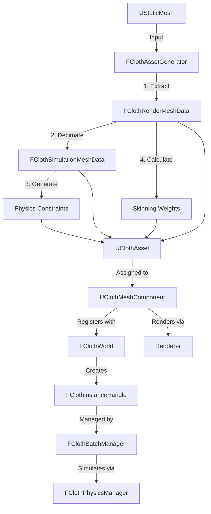
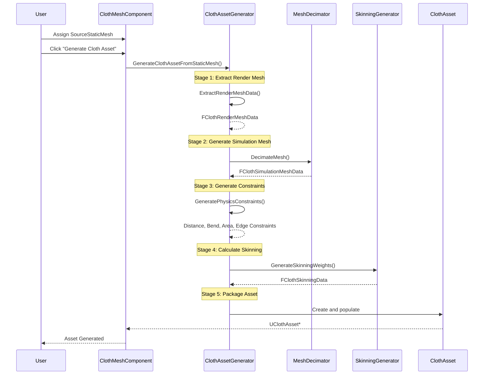
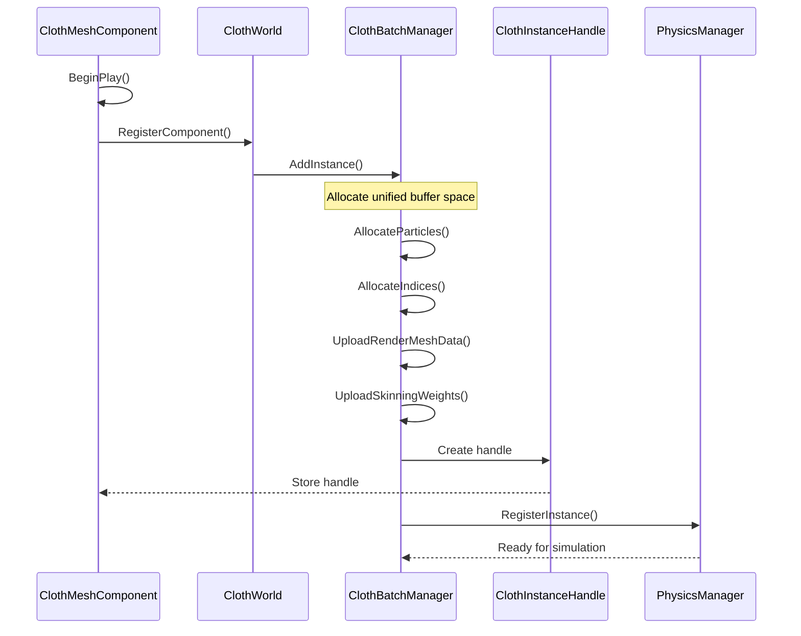
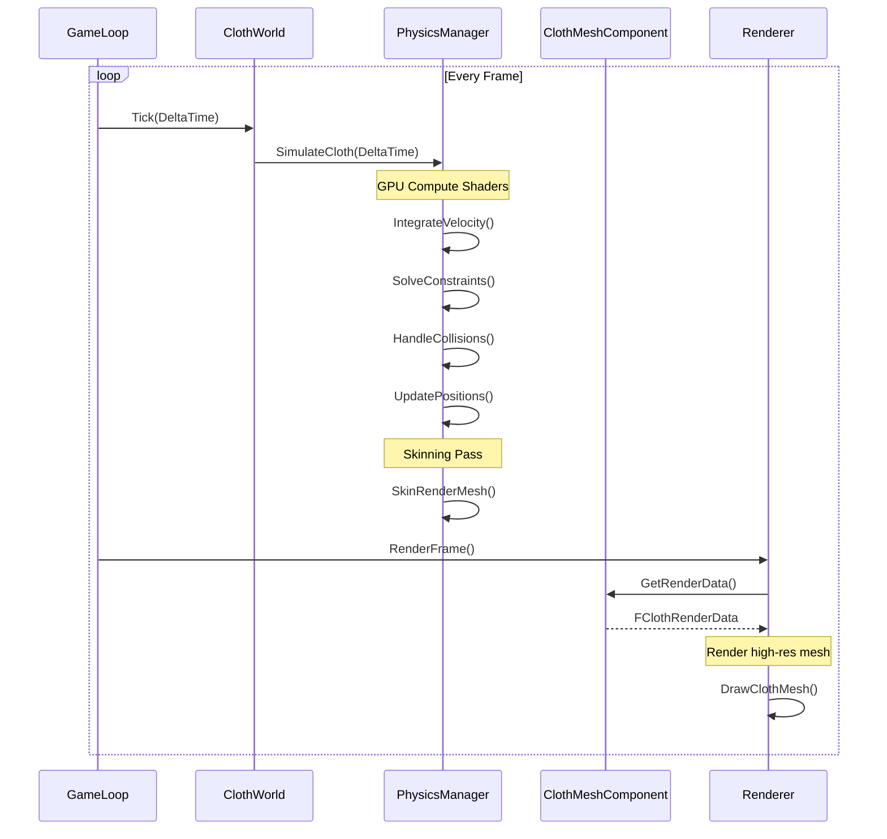
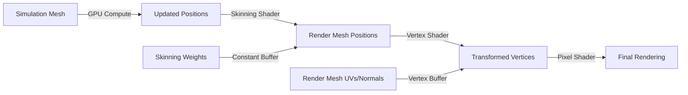

# Cloth Asset Pipeline Documentation

## Overview

This document describes the cloth asset pipeline in the EngineSIU codebase, detailing the complete flow from a Static Mesh to a fully functional ClothAsset and ClothMeshComponent with simulation and rendering capabilities.

## Pipeline Architecture

The cloth asset pipeline follows a multi-stage process that separates high-resolution rendering meshes from low-resolution simulation meshes, using skinning weights to map between them.

### High-Level Pipeline Flow



## Key Classes and Components

### 1. Asset Generation Layer

#### UStaticMesh
- **Location**: [`Engine/Classes/Engine/StaticMesh.h`](../EngineSIU/EngineSIU/Engine/Source/Runtime/Engine/Classes/Engine/StaticMesh.h)
- **Purpose**: Source mesh containing high-resolution geometry
- **Key Data**:
  - `FStaticMeshRenderData* RenderData` - Vertex positions, normals, UVs, indices
  - `TArray<FStaticMaterial*> Materials` - Material assignments

#### FClothAssetGenerator
- **Location**: [`Engine/Cloth/ClothAssetGenerator.h`](../EngineSIU/EngineSIU/Engine/Source/Runtime/Engine/Cloth/ClothAssetGenerator.h)
- **Purpose**: Orchestrates the complete asset generation pipeline
- **Key Method**: `GenerateClothAssetFromStaticMesh()`
- **Pipeline Stages**:
  1. **Extract Render Mesh** - Extracts positions, normals, UVs from UStaticMesh
  2. **Generate Simulation Mesh** - Uses QEM decimation to create low-poly version
  3. **Generate Physics Constraints** - Creates distance, bend, area, and edge collision constraints
  4. **Calculate Skinning Weights** - Maps render vertices to simulation vertices
  5. **Package Asset** - Combines all data into UClothAsset

#### FClothMeshDecimator
- **Location**: [`Engine/Cloth/ClothMeshDecimator.h`](../EngineSIU/EngineSIU/Engine/Source/Runtime/Engine/Cloth/ClothMeshDecimator.h)
- **Purpose**: Reduces mesh complexity using Quadric Error Metric (QEM) decimation
- **Features**:
  - Preserves boundary edges
  - Preserves UV seams
  - Voronoi or QEM-based decimation methods
  - Configurable reduction ratio (e.g., 10% of original vertices)

#### FClothSkinningWeightGenerator
- **Location**: [`Engine/Cloth/ClothSkinningWeightGenerator.h`](../EngineSIU/EngineSIU/Engine/Source/Runtime/Engine/Cloth/ClothSkinningWeightGenerator.h)
- **Purpose**: Calculates skinning weights to map render mesh to simulation mesh
- **Algorithm**: Uses barycentric coordinates and nearest triangle search
- **Output**: `FClothSkinningWeight` per render vertex (4 influences max)

### 2. Asset Storage Layer

#### UClothAsset
- **Location**: [`Engine/Classes/Engine/ClothAsset.h`](../EngineSIU/EngineSIU/Engine/Source/Runtime/Engine/Classes/Engine/ClothAsset.h)
- **Purpose**: Stores all cloth simulation and rendering data
- **Key Data Structures**:

**Simulation Mesh Data** (Low-resolution):
```cpp
TArray<FVector> RestPositions;      // Simulation vertex positions
TArray<uint32> Indices;             // Simulation mesh indices
TArray<float> InvMasses;            // Inverse masses for physics
```

**Render Mesh Data** (High-resolution):
```cpp
TArray<FVector> RenderRestPositions;    // High-detail render positions
TArray<FVector> RenderNormals;          // Render mesh normals
TArray<FVector2D> RenderUVs;            // Render mesh UVs
TArray<uint32> RenderIndices;           // Render mesh indices
TArray<FClothSkinningWeight> SkinningWeights;  // Render → Sim mapping
```

**Physics Constraints**:
```cpp
TArray<FClothDistanceConstraint> DistanceConstraints;  // Edge stretch
TArray<FClothBendConstraint> BendConstraints;          // Bending resistance
TArray<FClothAreaConstraint> AreaConstraints;          // Area preservation
TArray<FClothEdgeCollisionConstraint> EdgeCollisions;  // Self-collision
```

**Metadata**:
```cpp
bool bUseRenderMesh;              // Enable render/sim separation
float QEMReductionRatio;          // Decimation ratio used
uint32 OriginalVertexCount;       // Original render mesh vertex count
uint32 DecimatedVertexCount;      // Decimated sim mesh vertex count
```

### 3. Component Layer

#### UClothComponent
- **Location**: [`Engine/Classes/Components/ClothComponent.h`](../EngineSIU/EngineSIU/Engine/Source/Runtime/Engine/Classes/Components/ClothComponent.h)
- **Purpose**: Base component for cloth simulation lifecycle
- **Responsibilities**:
  - Manages cloth asset reference
  - Controls simulation start/stop/reset
  - Handles external forces (gravity, wind, impulses)
  - Manages attachments to other components

#### UClothMeshComponent
- **Location**: [`Engine/Classes/Components/ClothMeshComponent.h`](../EngineSIU/EngineSIU/Engine/Source/Runtime/Engine/Classes/Components/ClothMeshComponent.h)
- **Purpose**: Renderable cloth component extending UClothComponent
- **Key Features**:
  - Generates ClothAsset from SourceStaticMesh
  - Provides rendering interface via `GetRenderData()`
  - Manages materials
  - Supports debug visualization modes
  - Exposes editor properties for asset generation parameters

**Editor Properties**:
```cpp
UStaticMesh* SourceStaticMesh;                    // Input mesh
UClothMaterial* ClothMaterial;                    // Optional material override
UClothAsset* GeneratedClothAsset;                 // Generated asset (read-only)

// Generation Parameters
float SimulationMeshReductionRatio = 0.1f;        // 10% of original vertices
bool bPreserveBoundaryEdges = true;
bool bPreserveUVSeams = true;
bool bGenerateDistanceConstraints = true;
bool bGenerateBendConstraints = true;
bool bGenerateAreaConstraints = true;
bool bGenerateEdgeCollisions = true;

// Simulation Parameters
float StretchStiffness = 0.9f;
float BendStiffness = 0.1f;
float AreaStiffness = 0.001f;
float TotalMass = 1.0f;
```

### 4. Simulation Management Layer

#### FClothWorld
- **Location**: [`Engine/Cloth/ClothWorld.h`](../EngineSIU/EngineSIU/Engine/Source/Runtime/Engine/Cloth/ClothWorld.h)
- **Purpose**: Per-world cloth simulation manager
- **Responsibilities**:
  - Registers/unregisters cloth components
  - Creates cloth instances via FClothBatchManager
  - Coordinates simulation updates
  - Manages cloth-world interactions

#### FClothBatchManager
- **Location**: [`Engine/Cloth/ClothBatchManager.h`](../EngineSIU/EngineSIU/Engine/Source/Runtime/Engine/Cloth/ClothBatchManager.h)
- **Purpose**: Batched cloth simulation manager for performance
- **Key Features**:
  - Unified GPU buffers for all cloth instances
  - Batch simulation updates
  - Efficient memory management
  - Returns FClothInstanceHandle for each instance

#### FClothInstanceHandle
- **Location**: [`Engine/Cloth/ClothInstanceHandle.h`](../EngineSIU/EngineSIU/Engine/Source/Runtime/Engine/Cloth/ClothInstanceHandle.h)
- **Purpose**: Handle to a specific cloth instance in the batch
- **Key Data**:
  - Particle offset in unified buffer
  - Index offset in unified buffer
  - Vertex/triangle counts
  - Reference to owning component

#### FClothPhysicsManager
- **Location**: [`Engine/Cloth/ClothPhysicsManager.h`](../EngineSIU/EngineSIU/Engine/Source/Runtime/Engine/Cloth/ClothPhysicsManager.h)
- **Purpose**: GPU-accelerated cloth physics simulation
- **Features**:
  - Compute shader-based simulation
  - Constraint solving (distance, bend, area)
  - Collision detection and response
  - Integration and velocity updates

## Detailed Pipeline Flow

### Stage 1: Asset Generation



### Stage 2: Component Initialization



### Stage 3: Runtime Simulation and Rendering



## Data Structures

### FClothRenderMeshData
High-resolution mesh data extracted from UStaticMesh:
```cpp
struct FClothRenderMeshData
{
    TArray<FVector> Positions;      // Vertex positions
    TArray<FVector> Normals;        // Vertex normals
    TArray<FVector2D> UVs;          // Texture coordinates
    TArray<uint32> Indices;         // Triangle indices
};
```

### FClothSimulationMeshData
Low-resolution mesh data for physics simulation:
```cpp
struct FClothSimulationMeshData
{
    TArray<FVector> Positions;      // Simulation vertex positions
    TArray<uint32> Indices;         // Simulation triangle indices
    TArray<float> InvMasses;        // Inverse masses for dynamics
};
```

### FClothSkinningWeight
Maps render vertices to simulation vertices:
```cpp
struct FClothSkinningWeight
{
    uint32 SimVertexIndices[4];    // Up to 4 simulation vertices
    float Weights[4];               // Barycentric weights
    uint32 NumInfluences;           // Actual number of influences (1-4)
};
```

### Physics Constraints

#### FClothDistanceConstraint
Maintains edge lengths (stretch resistance):
```cpp
struct FClothDistanceConstraint
{
    uint32 ParticleA;               // First vertex index
    uint32 ParticleB;               // Second vertex index
    float RestLength;               // Target edge length
    float Stiffness;                // Constraint stiffness [0-1]
};
```

#### FClothBendConstraint
Resists bending between adjacent triangles:
```cpp
struct FClothBendConstraint
{
    uint32 ParticleA, ParticleB;    // Shared edge vertices
    uint32 ParticleC, ParticleD;    // Opposite vertices
    float RestAngle;                // Target dihedral angle
    float Stiffness;                // Bending stiffness [0-1]
};
```

#### FClothAreaConstraint
Preserves triangle areas (volume preservation):
```cpp
struct FClothAreaConstraint
{
    uint32 ParticleA, ParticleB, ParticleC;  // Triangle vertices
    float RestArea;                          // Target triangle area
    FVector RestNormal;                      // Target normal direction
    float Stiffness;                         // Area stiffness [0-1]
};
```

#### FClothEdgeCollisionConstraint
Prevents self-intersection:
```cpp
struct FClothEdgeCollisionConstraint
{
    uint32 ParticleA, ParticleB;    // Edge vertices
    float RestLength;               // Edge length for collision radius
};
```

## Rendering Architecture

### Dual-Mesh Rendering System

The system uses two meshes for optimal performance:

1. **Simulation Mesh** (Low-resolution)
   - Used for physics calculations
   - Typically 5-10% of original vertex count
   - Updated by GPU compute shaders

2. **Render Mesh** (High-resolution)
   - Used for final rendering
   - Maintains original mesh detail
   - Skinned to simulation mesh via GPU

### Rendering Data Flow



### FClothRenderData
Data structure passed to renderer:
```cpp
struct FClothRenderData
{
    // Batched mode: Unified buffers
    ID3D11Buffer* UnifiedRenderVertexBuffer;        // Render vertex buffer
    ID3D11Buffer* UnifiedRenderIndexBuffer;         // Render index buffer
    ID3D11ShaderResourceView* SkinningWeightBufferSRV;  // Skinning weights
    
    uint32 RenderVertexOffset;                      // Offset in unified buffer
    uint32 RenderVertexCount;                       // Number of render vertices
    uint32 RenderIndexOffset;                       // Offset in index buffer
    uint32 RenderIndexCount;                        // Number of indices
    
    bool bUseProductionRendering;                   // Use high-res rendering
    
    // Transform and material
    FMatrix WorldTransform;
    UMaterial* Material;
};
```

## Usage Example

### Creating a Cloth Asset

```cpp
// 1. Create ClothMeshComponent
UClothMeshComponent* clothComponent = CreateComponent<UClothMeshComponent>();

// 2. Assign source mesh
clothComponent->SetStaticMesh(myStaticMesh);

// 3. Configure generation parameters
clothComponent->SimulationMeshReductionRatio = 0.1f;  // 10% vertices
clothComponent->bPreserveBoundaryEdges = true;
clothComponent->bPreserveUVSeams = true;

// 4. Configure simulation parameters
clothComponent->StretchStiffness = 0.9f;
clothComponent->BendStiffness = 0.1f;
clothComponent->AreaStiffness = 0.001f;
clothComponent->TotalMass = 1.0f;

// 5. Generate cloth asset
clothComponent->GenerateClothAsset();

// 6. Component automatically registers with ClothWorld on BeginPlay()
```

### Manual Asset Generation

```cpp
// Setup parameters
FClothAssetGenerationParams params;
params.DecimationParams.TargetReductionRatio = 0.1f;
params.DecimationParams.bPreserveBoundaryEdges = true;
params.DecimationParams.bPreserveUVSeams = true;
params.DecimationParams.Method = EClothDecimationMethod::QEM;

params.SkinningParams.MaxInfluences = 4;
params.SkinningParams.SearchRadius = 10.0f;

params.bGenerateDistanceConstraints = true;
params.bGenerateBendConstraints = true;
params.bGenerateAreaConstraints = true;
params.bGenerateEdgeCollisions = true;

// Generate asset
FClothAssetGenerationResult result;
bool success = FClothAssetGenerator::GenerateClothAssetFromStaticMesh(
    sourceStaticMesh,
    params,
    result
);

if (success)
{
    UClothAsset* clothAsset = result.Asset;
    // Use the asset...
}
```

## Performance Considerations

### Memory Layout

The batched system uses unified GPU buffers for all cloth instances:

```
Unified Particle Buffer:
[Instance0 Particles][Instance1 Particles][Instance2 Particles]...

Unified Index Buffer:
[Instance0 Indices][Instance1 Indices][Instance2 Indices]...

Unified Render Vertex Buffer:
[Instance0 RenderVerts][Instance1 RenderVerts][Instance2 RenderVerts]...

Unified Skinning Weight Buffer:
[Instance0 Weights][Instance1 Weights][Instance2 Weights]...
```

### Optimization Strategies

1. **Mesh Decimation**: Reduces simulation cost by 90%+ while maintaining visual quality
2. **Batched Simulation**: All cloth instances simulated in single GPU dispatch
3. **GPU Skinning**: Render mesh skinning performed entirely on GPU
4. **Unified Buffers**: Minimizes GPU state changes and draw calls
5. **Constraint Batching**: Constraints solved in parallel on GPU

### Typical Performance Metrics

For a cloth with 10,000 render vertices:
- **Simulation Mesh**: ~1,000 vertices (10% reduction)
- **Distance Constraints**: ~3,000 constraints
- **Bend Constraints**: ~2,000 constraints
- **Area Constraints**: ~2,000 constraints
- **GPU Simulation Time**: ~0.5ms per frame
- **GPU Skinning Time**: ~0.2ms per frame

## File Locations Reference

### Core Classes
- [`UStaticMesh`](../EngineSIU/EngineSIU/Engine/Source/Runtime/Engine/Classes/Engine/StaticMesh.h)
- [`UClothAsset`](../EngineSIU/EngineSIU/Engine/Source/Runtime/Engine/Classes/Engine/ClothAsset.h)
- [`UClothComponent`](../EngineSIU/EngineSIU/Engine/Source/Runtime/Engine/Classes/Components/ClothComponent.h)
- [`UClothMeshComponent`](../EngineSIU/EngineSIU/Engine/Source/Runtime/Engine/Classes/Components/ClothMeshComponent.h)

### Generation Pipeline
- [`FClothAssetGenerator`](../EngineSIU/EngineSIU/Engine/Source/Runtime/Engine/Cloth/ClothAssetGenerator.h)
- [`FClothMeshDecimator`](../EngineSIU/EngineSIU/Engine/Source/Runtime/Engine/Cloth/ClothMeshDecimator.h)
- [`FClothSkinningWeightGenerator`](../EngineSIU/EngineSIU/Engine/Source/Runtime/Engine/Cloth/ClothSkinningWeightGenerator.h)

### Simulation Management
- [`FClothWorld`](../EngineSIU/EngineSIU/Engine/Source/Runtime/Engine/Cloth/ClothWorld.h)
- [`FClothBatchManager`](../EngineSIU/EngineSIU/Engine/Source/Runtime/Engine/Cloth/ClothBatchManager.h)
- [`FClothInstanceHandle`](../EngineSIU/EngineSIU/Engine/Source/Runtime/Engine/Cloth/ClothInstanceHandle.h)
- [`FClothPhysicsManager`](../EngineSIU/EngineSIU/Engine/Source/Runtime/Engine/Cloth/ClothPhysicsManager.h)

### Data Structures
- [`ClothSimulationData.h`](../EngineSIU/EngineSIU/Engine/Source/Runtime/Engine/Cloth/ClothSimulationData.h)
- [`ClothBatchTypes.h`](../EngineSIU/EngineSIU/Engine/Source/Runtime/Engine/Cloth/ClothBatchTypes.h)

## Summary

The cloth asset pipeline provides a complete solution for converting static meshes into simulated cloth:

1. **Asset Generation**: Automated pipeline from UStaticMesh to UClothAsset
2. **Dual-Mesh System**: Separate simulation and render meshes for optimal performance
3. **Skinning**: Automatic weight calculation for render-to-simulation mapping
4. **Batched Simulation**: Efficient GPU-based simulation for multiple cloth instances
5. **Production Rendering**: High-quality rendering with full material support

The system is designed for both ease of use (automatic generation from components) and flexibility (manual control over all parameters).
