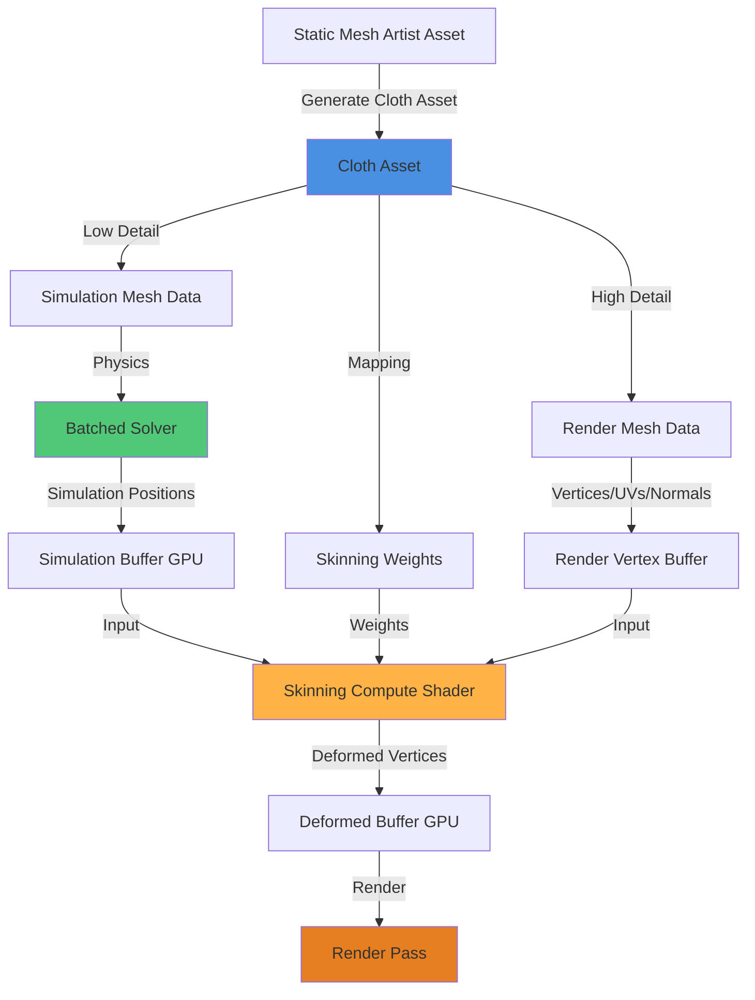

# Cloth Asset Workflow - Render Mesh Integration Architecture

**Status**: Architecture Design  
**Date**: 2026-02-02  
**Goal**: Implement render/simulation mesh separation with automatic mesh generation and GPU skinning

---

## Executive Summary

This plan extends the existing batched cloth simulation system to support high-quality render meshes separate from low-resolution simulation meshes. The system will automatically generate simulation meshes from artist-created Static Meshes and use GPU skinning to deform the render mesh based on simulation results.

### Key Achievements from Analysis

**Current System Strengths**:
- ✅ Robust batched GPU simulation with XPBD solver
- ✅ Efficient unified buffer architecture for multiple instances
- ✅ Working constraint system (distance, bend, area, edge collision)
- ✅ SDF-based collision detection
- ✅ Kinematic attachment system

**Current Limitations**:
- ❌ No render/simulation mesh separation
- ❌ Simulation and rendering use the same mesh resolution
- ❌ No automatic mesh decimation
- ❌ No skinning weights for render-to-sim mapping
- ❌ Manual mesh creation in test actor (not artist-friendly)

---

## Architecture Overview



---

## Phase 1: Data Structure Foundation

### 1.1 Enhanced Cloth Asset Data

**File**: [`ClothAsset.h`](EngineSIU/EngineSIU/Engine/Source/Runtime/Engine/Classes/Engine/ClothAsset.h:18)

```cpp
// NEW: Separate render and simulation mesh data
struct FClothRenderMeshData
{
    TArray<FVector> Positions;      // High-detail vertices
    TArray<FVector> Normals;        // Vertex normals
    TArray<FVector2D> UVs;          // Texture coordinates
    TArray<uint32> Indices;         // Triangle indices
    TArray<FVector> Tangents;       // Tangent vectors
    uint32 NumVertices;
    uint32 NumTriangles;
};

struct FClothSimulationMeshData
{
    TArray<FVector> Positions;      // Low-res simulation vertices
    TArray<uint32> Indices;         // Simulation triangle indices
    TArray<float> InvMasses;        // Per-vertex inverse mass
    uint32 NumVertices;
    uint32 NumTriangles;
};

struct FClothSkinningWeight
{
    uint32 SimVertexIndices[4];    // Up to 4 influences (like skeletal mesh)
    float Weights[4];               // Normalized weights
    uint8 NumInfluences;            // Actual number of influences (1-4)
    uint8 Padding[3];               // Alignment
};

struct FClothSkinningData
{
    // Per render vertex: mapping to simulation vertices
    TArray<FClothSkinningWeight> RenderToSimMapping;
};

// Extend UClothAsset class
class UClothAsset : public UObject
{
    // ... existing members ...
    
    // NEW: Render/Simulation separation
    FClothRenderMeshData RenderMesh;
    FClothSimulationMeshData SimulationMesh;
    FClothSkinningData SkinningWeights;
    
    // Source reference
    UStaticMesh* SourceStaticMesh;
    
    // Generation parameters (stored for re-generation)
    float SimulationMeshReductionRatio;  // e.g., 0.1 = 10% of original
    uint32 TargetSimVertexCount;
    EClothMeshDecimationMethod DecimationMethod;
};
```

### 1.2 GPU-Side Skinning Data Structures

**File**: [`ClothGPUStructs.h`](EngineSIU/EngineSIU/Engine/Source/Runtime/Engine/Cloth/ClothGPUStructs.h)

```cpp
// NEW: GPU skinning weight structure
struct FClothGPUSkinningWeight
{
    uint32 SimVertexIndices[4];
    float Weights[4];
    uint32 NumInfluences;
    uint32 Padding[3];
};

// NEW: Skinning constant buffer
struct FClothSkinningConstants
{
    uint32 NumRenderVertices;
    uint32 NumSimVertices;
    uint32 RenderVertexOffset;    // For batching
    uint32 SimVertexOffset;       // For batching
};
```

---

## Phase 2: Mesh Generation Utilities

### 2.1 Extract and Refactor from TestBatchedClothActor

**Current Location**: [`TestBatchedClothActor.cpp`](EngineSIU/EngineSIU/Engine/Source/Runtime/Engine/Classes/Actors/TestBatchedClothActor.cpp:120-520)

The test actor contains mesh generation and constraint building logic that should be extracted into reusable utilities.

### 2.2 New Utility Classes

**File**: `Engine/Source/Runtime/Engine/Cloth/ClothMeshGenerator.h` (NEW)

```cpp
/**
 * Cloth Mesh Generation Utilities
 * Extracted and generalized from TestBatchedClothActor
 */
class FClothMeshGenerator
{
public:
    // Grid generation (for testing/prototyping)
    static void CreateGridMesh(
        int32 GridSize,
        float Spacing,
        TArray<FVector>& OutPositions,
        TArray<uint32>& OutIndices,
        TArray<float>& OutInvMasses,
        const FClothGridParams& Params
    );
    
    // Constraint generation from mesh topology
    static void GenerateDistanceConstraints(
        const TArray<FVector>& Positions,
        const TArray<uint32>& Indices,
        TArray<FClothDistanceConstraint>& OutConstraints,
        bool bIncludeShearSprings = true
    );
    
    static void GenerateBendConstraints(
        const TArray<FVector>& Positions,
        const TArray<uint32>& Indices,
        TArray<FClothBendConstraint>& OutConstraints,
        float DefaultCompliance = 1e-4f
    );
    
    static void GenerateAreaConstraints(
        const TArray<FVector>& Positions,
        const TArray<uint32>& Indices,
        TArray<FClothAreaConstraint>& OutConstraints,
        float DefaultCompliance = 1e-5f
    );
    
    static void GenerateEdgeCollisionConstraints(
        const TArray<uint32>& Indices,
        const TArray<FVector>& Positions,
        TArray<FClothEdgeCollisionConstraint>& OutConstraints
    );
    
private:
    // Helper: Compute dihedral angle (shared with GPU shader logic)
    static float ComputeDihedralAngle(
        const FVector& pA, const FVector& pB,
        const FVector& pC, const FVector& pD
    );
};
```

**File**: `Engine/Source/Runtime/Engine/Cloth/ClothMeshDecimator.h` (NEW)

```cpp
/**
 * Mesh Decimation for Cloth Simulation
 * Reduces high-detail render mesh to low-resolution simulation mesh
 */

enum class EClothMeshDecimationMethod : uint8
{
    QEM,              // Quadric Error Metrics (default, best quality)
    EdgeCollapse,     // Simple edge collapse with length priority
    Clustering,       // Vertex clustering (fastest)
    Adaptive          // Adaptive based on curvature
};

struct FClothDecimationParams
{
    EClothMeshDecimationMethod Method = EClothMeshDecimationMethod::QEM;
    
    // Target reduction
    float ReductionRatio = 0.1f;        // 0.0-1.0 (0.1 = 10% of original)
    uint32 TargetVertexCount = 0;       // Alternative: specific vertex count
    
    // Quality control
    bool bPreserveTopology = true;      // Prevent mesh self-intersection
    bool bPreserveBoundaryEdges = true; // Keep mesh boundaries intact
    bool bPreserveUVSeams = false;      // Maintain UV seam topology
    float MaxEdgeLength = FLT_MAX;      // Limit edge collapse length
    
    // Validation
    float MinTriangleArea = 0.001f;     // Discard degenerate triangles
    bool bValidateTopology = true;
};

class FClothMeshDecimator
{
public:
    /**
     * Decimate mesh from high-detail to low-detail simulation mesh
     * @param SourcePositions - Input high-detail vertices
     * @param SourceIndices - Input high-detail triangles
     * @param Params - Decimation parameters
     * @param OutSimPositions - Output low-detail vertices
     * @param OutSimIndices - Output low-detail triangles
     * @param OutVertexMapping - Optional: mapping from sim vertex to source vertices
     * @return Success/failure
     */
    static bool DecimateMesh(
        const TArray<FVector>& SourcePositions,
        const TArray<uint32>& SourceIndices,
        const FClothDecimationParams& Params,
        TArray<FVector>& OutSimPositions,
        TArray<uint32>& OutSimIndices,
        TMap<uint32, TArray<uint32>>* OutVertexMapping = nullptr
    );
    
private:
    // QEM Implementation
    static bool DecimateUsingQEM(
        const TArray<FVector>& SourcePositions,
        const TArray<uint32>& SourceIndices,
        const FClothDecimationParams& Params,
        TArray<FVector>& OutPositions,
        TArray<uint32>& OutIndices
    );
    
    // Edge Collapse Implementation
    static bool DecimateUsingEdgeCollapse(
        const TArray<FVector>& SourcePositions,
        const TArray<uint32>& SourceIndices,
        const FClothDecimationParams& Params,
        TArray<FVector>& OutPositions,
        TArray<uint32>& OutIndices
    );
    
    // Validation helpers
    static bool ValidateMeshTopology(
        const TArray<FVector>& Positions,
        const TArray<uint32>& Indices
    );
};
```

**File**: `Engine/Source/Runtime/Engine/Cloth/ClothSkinningWeightGenerator.h` (NEW)

```cpp
/**
 * Skinning Weight Generation
 * Maps high-detail render vertices to low-detail simulation vertices
 */

struct FClothSkinningParams
{
    uint32 MaxInfluences = 4;           // Number of sim vertices per render vertex
    float SearchRadius = 50.0f;         // Max distance for influence search (cm)
    bool bUseGeodesicDistance = false;  // Use surface distance vs Euclidean
    bool bNormalizeWeights = true;      // Ensure weights sum to 1.0
    
    // Weight calculation method
    enum class EWeightMethod
    {
        InverseDistance,    // 1/distance weighting (default)
        Barycentric,        // Barycentric coordinates from closest triangle
        RBF,                // Radial basis function
        Harmonic            // Harmonic coordinates (best quality, slow)
    } WeightMethod = EWeightMethod::InverseDistance;
};

class FClothSkinningWeightGenerator
{
public:
    /**
     * Generate skinning weights mapping render mesh to simulation mesh
     * @param RenderPositions - High-detail render vertices
     * @param SimPositions - Low-detail simulation vertices
     * @param SimIndices - Simulation mesh triangles (for barycentric mode)
     * @param Params - Weight generation parameters
     * @param OutSkinningWeights - Output weights per render vertex
     * @return Success/failure
     */
    static bool GenerateSkinningWeights(
        const TArray<FVector>& RenderPositions,
        const TArray<FVector>& SimPositions,
        const TArray<uint32>& SimIndices,
        const FClothSkinningParams& Params,
        TArray<FClothSkinningWeight>& OutSkinningWeights
    );
    
private:
    // Find closest simulation vertices for a render vertex
    static void FindClosestSimVertices(
        const FVector& RenderPos,
        const TArray<FVector>& SimPositions,
        uint32 MaxInfluences,
        float SearchRadius,
        TArray<uint32>& OutIndices,
        TArray<float>& OutDistances
    );
    
    // Calculate weights from distances
    static void CalculateInverseDistanceWeights(
        const TArray<float>& Distances,
        TArray<float>& OutWeights
    );
    
    // Find closest triangle and compute barycentric coordinates
    static bool FindClosestTriangleAndBarycentricCoords(
        const FVector& RenderPos,
        const TArray<FVector>& SimPositions,
        const TArray<uint32>& SimIndices,
        uint32& OutTriIndex,
        FVector& OutBarycentricCoords
    );
};
```

---

## Phase 3: GPU Skinning Pipeline

### 3.1 Skinning Compute Shader

**File**: `EngineSIU/EngineSIU/Shaders/Cloth/ClothSkinning.hlsl` (NEW)

```hlsl
/**
 * Cloth Skinning Compute Shader
 * Deforms high-detail render mesh using low-detail simulation results
 */

#include "../ComputeDefine.hlsl"

// Input: Simulation results (from physics solver)
StructuredBuffer<float4> SimulationPositions : register(t0);  // xyz=pos, w=invMass
StructuredBuffer<float3> SimulationNormals : register(t1);

// Input: Render mesh (original high-detail)
StructuredBuffer<float3> RenderRestPositions : register(t2);
StructuredBuffer<float3> RenderRestNormals : register(t3);

// Input: Skinning weights (render-to-sim mapping)
StructuredBuffer<FClothGPUSkinningWeight> SkinningWeights : register(t4);

// Output: Deformed render mesh
RWStructuredBuffer<float3> DeformedRenderPositions : register(u0);
RWStructuredBuffer<float3> DeformedRenderNormals : register(u1);

cbuffer SkinningConstants : register(b0)
{
    uint NumRenderVertices;
    uint NumSimVertices;
    uint RenderVertexOffset;  // For batched instances
    uint SimVertexOffset;     // For batched instances
};

[numthreads(256, 1, 1)]
void ClothSkinningCS(uint3 DispatchThreadID : SV_DispatchThreadID)
{
    uint renderVertexID = DispatchThreadID.x;
    if (renderVertexID >= NumRenderVertices)
        return;
    
    // Get skinning weights for this render vertex
    uint weightIndex = RenderVertexOffset + renderVertexID;
    FClothGPUSkinningWeight weights = SkinningWeights[weightIndex];
    
    // Blend simulation positions and normals
    float3 blendedPos = float3(0, 0, 0);
    float3 blendedNormal = float3(0, 0, 0);
    
    for (uint i = 0; i < weights.NumInfluences; ++i)
    {
        uint simIndex = SimVertexOffset + weights.SimVertexIndices[i];
        float weight = weights.Weights[i];
        
        // Blend position
        float3 simPos = SimulationPositions[simIndex].xyz;
        blendedPos += simPos * weight;
        
        // Blend normal
        float3 simNormal = SimulationNormals[simIndex];
        blendedNormal += simNormal * weight;
    }
    
    // Normalize blended normal
    blendedNormal = normalize(blendedNormal);
    
    // Write deformed results
    uint outputIndex = RenderVertexOffset + renderVertexID;
    DeformedRenderPositions[outputIndex] = blendedPos;
    DeformedRenderNormals[outputIndex] = blendedNormal;
}
```

### 3.2 Integration with Batched Rendering

**Modify**: [`ClothBatchedSolver.h`](EngineSIU/EngineSIU/Engine/Source/Runtime/Engine/Cloth/ClothBatchedSolver.h)

```cpp
class FClothBatchedSolver
{
    // ... existing members ...
    
    // NEW: Skinning stage (called after simulation, before rendering)
    void ExecuteSkinningPass();
    
private:
    // NEW: Skinning resources
    ID3D11ComputeShader* SkinningComputeShader;
    
    // NEW: Render mesh buffers
    ID3D11Buffer* RenderRestPositionsBuffer;      // High-detail rest positions
    ID3D11Buffer* RenderRestNormalsBuffer;        // High-detail rest normals
    ID3D11Buffer* SkinningWeightsBuffer;          // Render-to-sim mapping
    ID3D11Buffer* DeformedPositionsBuffer;        // Output: deformed positions
    ID3D11Buffer* DeformedNormalsBuffer;          // Output: deformed normals
    
    ID3D11ShaderResourceView* RenderRestPositionsSRV;
    ID3D11ShaderResourceView* RenderRestNormalsSRV;
    ID3D11ShaderResourceView* SkinningWeightsSRV;
    ID3D11UnorderedAccessView* DeformedPositionsUAV;
    ID3D11UnorderedAccessView* DeformedNormalsUAV;
    
    // Statistics
    uint32 TotalRenderVertexCount;
};
```

### 3.3 Modified Rendering Pipeline

**Modify**: [`ClothRenderPass.cpp`](EngineSIU/EngineSIU/Engine/Source/Runtime/Renderer/ClothRenderPass.cpp:215)

```cpp
void FClothRenderPass::RenderClothComponent(UClothMeshComponent* ClothComponent, ...)
{
    // ... existing setup ...
    
    // NEW: Check if component uses render mesh skinning
    if (renderData.bUseRenderMesh)
    {
        // Bind deformed render buffers (output from skinning shader)
        ID3D11ShaderResourceView* renderSRVs[] = {
            renderData.DeformedPositionsSRV,
            renderData.DeformedNormalsSRV
        };
        Graphics->DeviceContext->VSSetShaderResources(9, 2, renderSRVs);
        
        // Use render mesh index buffer (high-detail triangles)
        Graphics->DeviceContext->IASetIndexBuffer(
            renderData.RenderIndexBuffer, 
            DXGI_FORMAT_R32_UINT, 
            0
        );
        
        // Draw with render mesh triangle count
        Graphics->DeviceContext->DrawIndexed(
            renderData.NumRenderTriangles * 3, 
            renderData.RenderIndexOffset, 
            0
        );
    }
    else
    {
        // Legacy path: render simulation mesh directly
        // ... existing code ...
    }
}
```

---

## Phase 4: Editor Workflow

### 4.1 Static Mesh Detail Panel Extension

**File**: `Engine/Source/Editor/PropertyEditor/StaticMeshDetailPanel.h` (NEW or extend existing)

```cpp
/**
 * Static Mesh Detail Panel Extension
 * Adds "Generate Cloth Asset" button to Static Mesh editor
 */
class FStaticMeshDetailCustomization : public IDetailCustomization
{
public:
    virtual void CustomizeDetails(IDetailLayoutBuilder& DetailBuilder) override;
    
private:
    // Button callback
    FReply OnGenerateClothAssetClicked();
    
    // Reference to selected static mesh
    TWeakObjectPtr<UStaticMesh> StaticMeshBeingCustomized;
};
```

### 4.2 Cloth Asset Generation Dialog

**File**: `Engine/Source/Editor/PropertyEditor/ClothAssetGenerationDialog.h` (NEW)

```cpp
/**
 * Dialog for cloth asset generation parameters
 */
class SClothAssetGenerationDialog : public SCompoundWidget
{
public:
    SLATE_BEGIN_ARGS(SClothAssetGenerationDialog) {}
    SLATE_END_ARGS()
    
    void Construct(const FArguments& InArgs, UStaticMesh* SourceMesh);
    
    struct FGenerationResult
    {
        bool bSuccess;
        UClothAsset* GeneratedAsset;
        FString ErrorMessage;
    };
    
    FGenerationResult ShowModalDialog();
    
private:
    // UI elements
    TSharedPtr<SSpinBox<float>> ReductionRatioSpinBox;
    TSharedPtr<SSpinBox<int32>> TargetVertexCountSpinBox;
    TSharedPtr<SComboBox<TSharedPtr<FString>>> DecimationMethodComboBox;
    
    // Generation parameters
    FClothDecimationParams DecimationParams;
    FClothSkinningParams SkinningParams;
    
    // Callbacks
    FReply OnGenerateClicked();
    FReply OnCancelClicked();
    
    UStaticMesh* SourceStaticMesh;
};
```

### 4.3 Cloth Asset Generator

**File**: `Engine/Source/Runtime/Engine/Cloth/ClothAssetGenerator.h` (NEW)

```cpp
/**
 * High-level cloth asset generation from Static Mesh
 * Orchestrates decimation, constraint generation, and skinning weight calculation
 */
class FClothAssetGenerator
{
public:
    struct FGenerationParams
    {
        FClothDecimationParams DecimationParams;
        FClothSkinningParams SkinningParams;
        FClothConfig SimulationConfig;
        
        // Constraint generation options
        bool bGenerateDistanceConstraints = true;
        bool bGenerateBendConstraints = true;
        bool bGenerateAreaConstraints = true;
        bool bGenerateEdgeCollisions = true;
    };
    
    /**
     * Generate complete cloth asset from Static Mesh
     * @param SourceMesh - Input high-detail static mesh
     * @param Params - Generation parameters
     * @param OutAsset - Output cloth asset
     * @param OutErrorMessage - Error details if generation fails
     * @return Success/failure
     */
    static bool GenerateClothAssetFromStaticMesh(
        UStaticMesh* SourceMesh,
        const FGenerationParams& Params,
        UClothAsset*& OutAsset,
        FString& OutErrorMessage
    );
    
private:
    // Pipeline stages
    static bool ExtractRenderMeshData(
        UStaticMesh* SourceMesh,
        FClothRenderMeshData& OutRenderMesh
    );
    
    static bool GenerateSimulationMesh(
        const FClothRenderMeshData& RenderMesh,
        const FClothDecimationParams& Params,
        FClothSimulationMeshData& OutSimMesh
    );
    
    static bool GenerateConstraints(
        const FClothSimulationMeshData& SimMesh,
        const FGenerationParams& Params,
        UClothAsset* Asset
    );
    
    static bool GenerateSkinningWeights(
        const FClothRenderMeshData& RenderMesh,
        const FClothSimulationMeshData& SimMesh,
        const FClothSkinningParams& Params,
        FClothSkinningData& OutSkinningData
    );
    
    static bool ValidateAsset(
        const UClothAsset* Asset,
        FString& OutErrorMessage
    );
};
```

---

## Phase 5: Implementation Sequence

### Phase 5.1: Foundation (Utility Layer)
**Goal**: Extract and generalize mesh generation logic

- [ ] Create `FClothMeshGenerator` class
  - Extract grid generation from `TestBatchedClothActor`
  - Extract constraint generation (distance, bend, area, edge)
  - Add unit tests for constraint generation
  
- [ ] Implement `FClothMeshDecimator`
  - Start with simple edge collapse algorithm
  - Implement QEM decimation (primary method)
  - Add topology validation
  - Create test cases with known meshes

- [ ] Implement `FClothSkinningWeightGenerator`
  - Inverse distance weighting (baseline)
  - Barycentric coordinate method
  - Add weight normalization
  - Validate on simple test meshes

### Phase 5.2: Data Structure Updates
**Goal**: Extend asset and batch manager for render/sim separation

- [ ] Extend [`UClothAsset`](EngineSIU/EngineSIU/Engine/Source/Runtime/Engine/Classes/Engine/ClothAsset.h:18)
  - Add `FClothRenderMeshData`
  - Add `FClothSimulationMeshData`
  - Add `FClothSkinningData`
  - Update serialization
  
- [ ] Update [`ClothGPUStructs.h`](EngineSIU/EngineSIU/Engine/Source/Runtime/Engine/Cloth/ClothGPUStructs.h)
  - Add `FClothGPUSkinningWeight`
  - Add `FClothSkinningConstants`
  
- [ ] Extend [`FClothBatchManager`](EngineSIU/EngineSIU/Engine/Source/Runtime/Engine/Cloth/ClothBatchManager.h:31)
  - Add render vertex tracking
  - Add skinning weight buffer management
  - Update instance metadata for render/sim separation

### Phase 5.3: GPU Skinning Pipeline
**Goal**: Implement GPU skinning compute shader and integration

- [ ] Create skinning compute shader
  - Implement `ClothSkinning.hlsl`
  - Add to shader compilation pipeline
  - Test with simple cloth mesh
  
- [ ] Extend [`FClothBatchedSolver`](EngineSIU/EngineSIU/Engine/Source/Runtime/Engine/Cloth/ClothBatchedSolver.h)
  - Add render mesh buffers (rest positions, normals)
  - Add skinning weight buffer
  - Add deformed vertex buffers (output)
  - Implement `ExecuteSkinningPass()`
  - Integrate into simulation loop (after physics, before render)
  
- [ ] Update [`FClothRenderPass`](EngineSIU/EngineSIU/Engine/Source/Runtime/Renderer/ClothRenderPass.cpp:215)
  - Add render mesh path (uses deformed buffers)
  - Keep legacy simulation mesh path for backward compatibility
  - Update constant buffer bindings

### Phase 5.4: Asset Generation Pipeline
**Goal**: Implement high-level asset generation orchestration

- [ ] Implement `FClothAssetGenerator`
  - Mesh data extraction from Static Mesh
  - Pipeline orchestration (decimate → constrain → skin)
  - Validation and error handling
  - Asset creation and initialization
  
- [ ] Create test cloth assets
  - Simple plane mesh (100x100 → 10x10)
  - Complex character cloth (e.g., cape, skirt)
  - Validate visual quality and performance

### Phase 5.5: Editor Integration
**Goal**: Artist-friendly workflow in editor

- [ ] Implement `FStaticMeshDetailCustomization`
  - Add "Generate Cloth Asset" button to Static Mesh details
  - Hook into asset editor UI framework
  
- [ ] Create `SClothAssetGenerationDialog`
  - Parameter input UI (reduction ratio, method, etc.)
  - Real-time preview (optional, advanced)
  - Asset saving workflow
  
- [ ] Testing and polish
  - Test with various mesh types
  - Error handling and user feedback
  - Documentation for artists

### Phase 5.6: Optimization and Polish
**Goal**: Performance optimization and quality improvements

- [ ] Batch skinning optimization
  - Profile skinning shader performance
  - Optimize buffer layout for cache coherency
  - Consider async skinning (overlap with next frame)
  
- [ ] Quality improvements
  - Implement harmonic skinning weights (optional)
  - Add skinning weight painting tool (optional, future)
  - Improve decimation quality (adaptive method)
  
- [ ] Documentation
  - Code documentation
  - Artist workflow guide
  - Performance guidelines

---

## Implementation Details

### Key Design Decisions

#### 1. **Decimation Algorithm Choice: QEM**

**Rationale**: Quadric Error Metrics provides the best quality-to-performance ratio for cloth:
- Preserves visual features during reduction
- Supports boundary preservation
- Well-documented and proven in production

**Alternative considered**: Simple edge collapse (faster, lower quality)
**Fallback**: Edge collapse for very large meshes or real-time generation

#### 2. **Skinning Weight Method: Inverse Distance + Barycentric**

**Rationale**: 
- Inverse distance: Simple, robust, handles any mesh topology
- Barycentric: Higher quality for well-matched meshes
- 4 influences per vertex: Standard in skeletal mesh skinning

**Future optimization**: Harmonic coordinates for highest quality (expensive to compute)

#### 3. **GPU Skinning vs CPU Skinning**

**Choice**: GPU skinning via compute shader

**Rationale**:
- Leverages existing batched GPU architecture
- Minimal CPU overhead
- Scalable to hundreds of cloth instances
- Simulation data already on GPU

**Implementation**: Single compute dispatch after simulation, before rendering

#### 4. **Batched Skinning Architecture**

Following existing batched simulation pattern:
- Unified render vertex buffer (all instances concatenated)
- Unified skinning weight buffer
- Unified deformed output buffer
- Per-instance offsets for batching

**Benefit**: Maintains performance characteristics of current system

### Memory Layout

```
GPU Memory (Batched Mode):
┌─────────────────────────────────────────────┐
│ Simulation Mesh (Low-Res)                   │
│  - Positions Buffer [SimVertex0...SimVertexN]│
│  - Normals Buffer [SimNormal0...SimNormalN]  │
└─────────────────────────────────────────────┘
                    ↓ (Skinning Pass)
┌─────────────────────────────────────────────┐
│ Render Mesh (High-Res)                      │
│  - Rest Positions [RenderV0...RenderVN]      │
│  - Skinning Weights [Weight0...WeightN]      │
│  - Deformed Positions [Output]               │
│  - Deformed Normals [Output]                 │
└─────────────────────────────────────────────┘
                    ↓ (Render Pass)
┌─────────────────────────────────────────────┐
│ Final Rendering                              │
└─────────────────────────────────────────────┘
```

### Constraint Generation Reusability

Current test actor constraint generation (lines 167-520) will be extracted:

**Extract from `TestBatchedClothActor`**:
- Distance constraints → `FClothMeshGenerator::GenerateDistanceConstraints()`
- Bend constraints → `FClothMeshGenerator::GenerateBendConstraints()`
- Area constraints → `FClothMeshGenerator::GenerateAreaConstraints()`
- Edge collisions → `FClothMeshGenerator::GenerateEdgeCollisionConstraints()`

**Benefit**: Reusable for both procedural and asset-based cloth

---

## Integration with Existing Systems

### Backward Compatibility

**Legacy Mode** (simulation mesh only):
- Keep existing rendering path
- `bUseRenderMesh = false` flag
- TestBatchedClothActor continues to work unchanged

**New Mode** (render + simulation mesh):
- `bUseRenderMesh = true`
- Automatically use skinning pipeline
- Artist-generated assets

### Material Support

**Current**: Basic material support via [`ClothPixelShader.hlsl`](EngineSIU/EngineSIU/Shaders/ClothPixelShader.hlsl:1)

**Enhancement needed**:
- UV coordinates from render mesh (already in pipeline)
- Texture sampling works automatically
- Material parameters passed through as currently

**No changes required**: Existing material system compatible

### LOD System Integration

**Current**: [`EClothLODLevel`](EngineSIU/EngineSIU/Engine/Source/Runtime/Engine/Cloth/ClothBatchTypes.h) enum exists

**Future enhancement**:
- Generate multiple LODs per cloth asset
- Different render/sim mesh pairs per LOD
- Automatic LOD switching based on distance

**Not in this phase**: Focus on single LOD first

---

## Performance Targets

### Target Performance (Based on Current System)

**Current System** (simulation mesh only):
- 10 cloth instances @ 10x10 grid (100 verts each) = 1000 verts total
- ~0.5ms simulation + render per frame @ 60 FPS

**Target with Render Mesh**:
- Same 10 instances @ 100x100 render (10,000 verts) + 10x10 sim (100 verts)
- Simulation: ~0.5ms (unchanged)
- Skinning: ~0.2ms (10,000 render verts)
- Render: ~0.8ms (10x triangle count)
- **Total: ~1.5ms** (3x current, but 100x visual detail)

### Scalability

**Batch skinning efficiency**:
- 256 threads per group
- 40 groups for 10,000 vertices
- Memory bandwidth limited (not compute limited)

**Expected scaling**:
- 100 instances @ 1,000 render verts each = 100k verts
- Skinning: ~2ms
- Still within 16ms frame budget

---

## Testing Strategy

### Unit Tests

1. **Mesh decimation**:
   - Input: Plane mesh 100x100 (10,000 verts)
   - Output: 10x10 (100 verts)
   - Validate: Topology integrity, no degenerate triangles

2. **Skinning weights**:
   - Input: Render mesh + sim mesh
   - Validate: Weights sum to 1.0, all influences valid

3. **Constraint generation**:
   - Validate: Distance/bend/area/edge constraints match expected count
   - Edge cases: Boundary vertices, non-manifold meshes

### Integration Tests

1. **End-to-end asset generation**:
   - Static Mesh → Cloth Asset
   - Validate: All data structures populated correctly

2. **GPU skinning pipeline**:
   - Run skinning pass, readback results
   - Validate: Deformed positions match expected blend

3. **Rendering**:
   - Render cloth with textures
   - Visual validation: Smooth deformation, no artifacts

### Performance Tests

1. **Batch skinning**:
   - Profile: 10, 50, 100 instances
   - Measure: Skinning compute shader time

2. **Memory usage**:
   - Track: Buffer allocations for render vs sim meshes
   - Validate: No memory leaks on instance add/remove

---

## Risk Analysis

### Technical Risks

| Risk | Impact | Mitigation |
|------|--------|------------|
| Decimation quality poor | High | Implement multiple algorithms (QEM + fallback) |
| Skinning artifacts | Medium | Use 4 influences, add weight smoothing |
| Performance regression | Medium | Profile early, optimize batch skinning |
| Memory overhead | Low | Unified buffers, minimal per-instance data |

### Schedule Risks

| Risk | Impact | Mitigation |
|------|--------|------------|
| QEM complexity | Medium | Start with simple edge collapse, iterate to QEM |
| Editor integration | Low | Well-defined patterns in existing code |
| Testing coverage | Medium | Automated tests for core algorithms |

---

## Future Enhancements (Out of Scope)

1. **Skinning Weight Painting**: Artist tool to manually adjust weights
2. **Multi-LOD Generation**: Automatic LOD chain creation
3. **Adaptive Decimation**: Curvature-based vertex importance
4. **Real-time Preview**: In-editor cloth simulation preview
5. **Cloth Tearing**: Dynamic mesh splitting
6. **Cloth-to-Cloth Interaction**: Self-collision and multi-cloth collision

---

## Success Criteria

### Functional Requirements
✅ Static Mesh → Cloth Asset workflow functional  
✅ Decimation generates valid simulation mesh  
✅ Skinning weights provide smooth deformation  
✅ GPU skinning pipeline integrated  
✅ Textures and materials preserved  

### Performance Requirements
✅ Skinning adds < 1ms for typical cloth (1,000 render verts)  
✅ Batched rendering maintains efficiency  
✅ Memory overhead < 2x (render + sim mesh)  

### Quality Requirements
✅ No visible artifacts in skinned deformation  
✅ Simulation behavior matches artist expectations  
✅ Constraint generation produces stable cloth  

---

## Conclusion

This architecture provides a production-ready cloth asset workflow with render/simulation mesh separation. The design:

1. **Leverages existing strengths**: Batched GPU simulation, efficient rendering
2. **Follows established patterns**: Buffer management, shader integration
3. **Enables artist workflow**: Static Mesh → Cloth Asset with one click
4. **Maintains performance**: GPU skinning scales with batched architecture
5. **Preserves compatibility**: Legacy mode still works

The phased implementation allows incremental development and testing, minimizing risk while delivering a complete feature set.
