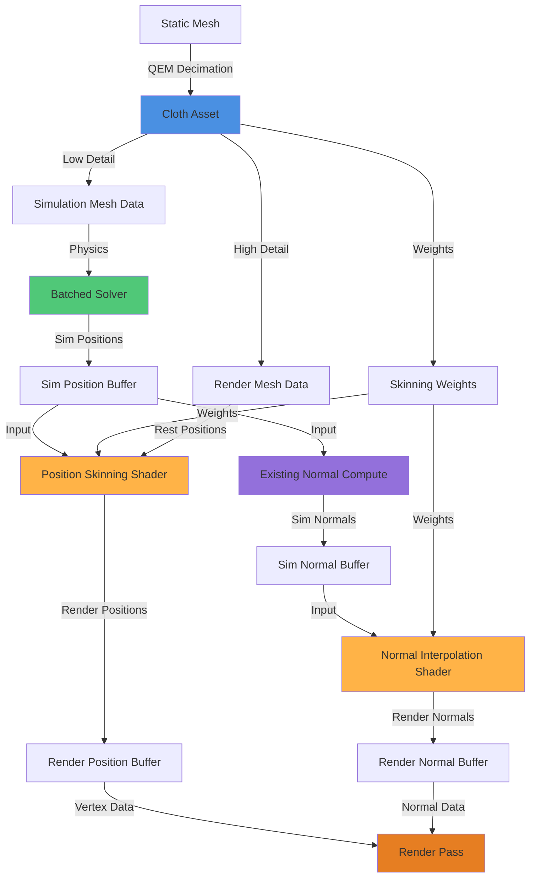

# Cloth Asset Workflow - QEM Decimation & Normal Interpolation

**Status**: Revised Architecture Design  
**Date**: 2026-02-02  
**Goal**: Implement render/simulation mesh separation with QEM decimation and efficient normal interpolation

---

## Executive Summary

This revised plan simplifies the cloth asset workflow by:
1. **Using QEM exclusively** for mesh decimation (industry standard)
2. **Reusing existing normal computation** infrastructure ([`ClothUpdateNormals.hlsl`](EngineSIU/EngineSIU/Shaders/Cloth/ClothUpdateNormals.hlsl))
3. **Two-stage normal pipeline**: Compute sim normals → Interpolate to render normals

### Key Changes from Original Plan
- ✅ Removed alternative decimation algorithms (QEM only)
- ✅ Leveraging existing [`ClothUpdateNormalsCS`](EngineSIU/EngineSIU/Engine/Source/Runtime/Engine/Cloth/ClothBatchedSolver.cpp:889) shader
- ✅ Added normal interpolation shader (reuses skinning weights)
- ✅ Simplified pipeline: fewer shaders to maintain

---

## Architecture Overview



---

## Phase 1: QEM Decimation Implementation

### 1.1 Why QEM Only?

**Rationale**:
- Industry standard (Unreal, Unity, Houdini, Maya all use QEM)
- Best quality/complexity tradeoff
- Well-documented and tested
- Single algorithm to maintain and optimize

**QEM Benefits**:
- Preserves visual features during reduction
- Supports boundary and UV seam preservation
- Mathematically optimal vertex placement
- Proven in production cloth pipelines

### 1.2 QEM Data Structures

**File**: `Engine/Source/Runtime/Engine/Cloth/ClothMeshDecimator.h` (NEW)

```cpp
/**
 * QEM-Based Mesh Decimation for Cloth Simulation
 * Reference: Garland & Heckbert 1997 - "Surface Simplification Using Quadric Error Metrics"
 */

struct FClothDecimationParams
{
    // Target reduction (choose one)
    float ReductionRatio = 0.1f;        // 0.0-1.0 (0.1 = 10% of original verts)
    uint32 TargetVertexCount = 0;       // Alternative: specific vertex count (overrides ratio)
    
    // Quality preservation
    bool bPreserveBoundaryEdges = true; // Keep mesh boundaries intact (critical for cloth)
    bool bPreserveUVSeams = true;       // Maintain UV seam topology (for textures)
    bool bPreserveTopology = true;      // Prevent non-manifold results
    
    // QEM weights
    float BoundaryWeight = 1000.0f;     // High penalty for boundary edge collapse
    float UVSeamWeight = 100.0f;        // Penalty for UV seam collapse
    float MaxEdgeLength = FLT_MAX;      // Limit collapse length (prevents long thin triangles)
    
    // Validation
    float MinTriangleArea = 0.001f;     // Discard degenerate triangles
    bool bValidateResult = true;        // Check manifoldness after decimation
};

class FClothMeshDecimator
{
public:
    /**
     * Decimate mesh using Quadric Error Metrics
     * @param SourcePositions - Input high-detail vertices
     * @param SourceIndices - Input high-detail triangles
     * @param SourceUVs - Input UV coordinates (for seam detection)
     * @param Params - Decimation parameters
     * @param OutSimPositions - Output low-detail vertices
     * @param OutSimIndices - Output low-detail triangles
     * @return Success/failure with error message
     */
    static bool DecimateMeshQEM(
        const TArray<FVector>& SourcePositions,
        const TArray<uint32>& SourceIndices,
        const TArray<FVector2D>& SourceUVs,
        const FClothDecimationParams& Params,
        TArray<FVector>& OutSimPositions,
        TArray<uint32>& OutSimIndices,
        FString& OutErrorMessage
    );
    
private:
    // QEM quadric error matrix (4x4 symmetric, stored as 10 coefficients)
    struct FQuadric
    {
        double A[10];  // a00, a01, a02, a03, a11, a12, a13, a22, a23, a33
        
        FQuadric();
        void AddPlane(const FVector& Normal, double D);
        double ComputeError(const FVector& V) const;
        FQuadric operator+(const FQuadric& Q) const;
    };
    
    // Edge collapse candidate
    struct FEdgeCollapse
    {
        uint32 V0, V1;                  // Vertices to collapse
        double Error;                   // QEM error for this collapse
        FVector OptimalPosition;        // Best position for merged vertex
        bool bIsBoundary;               // Boundary edge flag
        bool bIsUVSeam;                 // UV seam flag
        
        bool operator<(const FEdgeCollapse& Other) const { return Error < Other.Error; }
    };
    
    // Core QEM algorithm
    static void ComputeInitialQuadrics(
        const TArray<FVector>& Positions,
        const TArray<uint32>& Indices,
        TArray<FQuadric>& OutQuadrics
    );
    
    static void DetectBoundariesAndSeams(
        const TArray<uint32>& Indices,
        const TArray<FVector2D>& UVs,
        TArray<bool>& OutIsBoundary,
        TArray<bool>& OutIsUVSeam
    );
    
    static void BuildEdgeCollapseQueue(
        const TArray<FVector>& Positions,
        const TArray<uint32>& Indices,
        const TArray<FQuadric>& Quadrics,
        const TArray<bool>& IsBoundary,
        const TArray<bool>& IsUVSeam,
        const FClothDecimationParams& Params,
        TArray<FEdgeCollapse>& OutQueue
    );
    
    static bool ExecuteEdgeCollapse(
        const FEdgeCollapse& Collapse,
        TArray<FVector>& Positions,
        TArray<uint32>& Indices,
        TArray<FQuadric>& Quadrics,
        TArray<bool>& ValidVertices
    );
    
    static void CompactMesh(
        const TArray<FVector>& Positions,
        const TArray<uint32>& Indices,
        const TArray<bool>& ValidVertices,
        TArray<FVector>& OutPositions,
        TArray<uint32>& OutIndices
    );
    
    // Validation
    static bool ValidateManifold(const TArray<uint32>& Indices);
    static bool HasDegenerateTriangles(
        const TArray<FVector>& Positions,
        const TArray<uint32>& Indices,
        float MinArea
    );
};
```

### 1.3 QEM Algorithm Flow

```
1. Compute Initial Quadrics
   - For each triangle, compute plane equation
   - For each vertex, sum quadrics of adjacent faces

2. Detect Features
   - Mark boundary edges (edges with only 1 adjacent triangle)
   - Mark UV seams (edges with discontinuous UVs)

3. Build Edge Collapse Queue
   - For each edge, compute collapse error using QEM
   - Apply penalties for boundaries and seams
   - Sort by error (lowest first)

4. Iterative Collapse
   - While (vertex count > target):
     - Pop lowest-error edge from queue
     - Check validity (topology, edge length)
     - Collapse edge: merge V0 and V1 → V_new
     - Update quadrics: Q_new = Q_V0 + Q_V1
     - Update affected edges in queue

5. Compact and Validate
   - Remove deleted vertices/triangles
   - Validate manifoldness
   - Check for degenerate triangles
```

---

## Phase 2: Normal Computation Pipeline

### 2.1 Two-Stage Normal Pipeline Strategy

**Key Insight**: Normals only needed for rendering, not simulation  
**Optimization**: Compute normals for low-res sim mesh, interpolate to high-res render mesh

### 2.2 Stage 1: Simulation Mesh Normals (REUSE EXISTING)

**Existing Infrastructure**: [`ClothUpdateNormals.hlsl`](EngineSIU/EngineSIU/Shaders/Cloth/ClothUpdateNormals.hlsl)

**Current Implementation** (already working):
- 3-pass compute shader:
  1. [`ClearNormalsCS`](EngineSIU/EngineSIU/Shaders/Cloth/ClothUpdateNormals.hlsl:28): Zero out normal buffer
  2. [`UpdateNormalsCS`](EngineSIU/EngineSIU/Shaders/Cloth/ClothUpdateNormals.hlsl:43): Accumulate face normals to vertices
  3. [`NormalizeNormalsCS`](EngineSIU/EngineSIU/Shaders/Cloth/ClothUpdateNormals.hlsl:96): Normalize accumulated normals

**Usage** (already in [`FClothBatchedSolver`](EngineSIU/EngineSIU/Engine/Source/Runtime/Engine/Cloth/ClothBatchedSolver.cpp:1638)):
```cpp
// After simulation step
UpdateNormals();  // Computes normals for simulation mesh
```

**No changes needed** - this already works for simulation mesh!

### 2.3 Stage 2: Render Mesh Normal Interpolation (NEW)

**File**: `EngineSIU/EngineSIU/Shaders/Cloth/ClothNormalInterpolation.hlsl` (NEW)

```hlsl
/**
 * Cloth Normal Interpolation Compute Shader
 * Interpolates simulation mesh normals to render mesh using skinning weights
 * 
 * This shader reuses the same skinning weights as position skinning,
 * ensuring consistent deformation between positions and normals.
 */

#include "ClothCommon.hlsli"

// Input: Simulation mesh normals (computed by existing ClothUpdateNormals shader)
StructuredBuffer<float3> SimulationNormals : register(t0);

// Input: Skinning weights (render vertex → sim vertex mapping)
StructuredBuffer<FClothGPUSkinningWeight> SkinningWeights : register(t1);

// Output: Interpolated render mesh normals
RWStructuredBuffer<float3> RenderNormals : register(u0);

cbuffer NormalInterpolationConstants : register(b0)
{
    uint NumRenderVertices;
    uint RenderVertexOffset;    // For batched instances
    uint SimVertexOffset;       // For batched instances
    uint Padding;
};

/**
 * Interpolate normals from simulation mesh to render mesh
 * Uses weighted blend based on skinning weights (same as position skinning)
 */
[numthreads(256, 1, 1)]
void InterpolateNormalsCS(uint3 DispatchThreadID : SV_DispatchThreadID)
{
    uint renderVertexID = DispatchThreadID.x;
    if (renderVertexID >= NumRenderVertices)
        return;
    
    // Get skinning weights for this render vertex
    uint weightIndex = RenderVertexOffset + renderVertexID;
    FClothGPUSkinningWeight weights = SkinningWeights[weightIndex];
    
    // Blend simulation normals using skinning weights
    float3 blendedNormal = float3(0, 0, 0);
    
    for (uint i = 0; i < weights.NumInfluences; ++i)
    {
        uint simIndex = SimVertexOffset + weights.SimVertexIndices[i];
        float weight = weights.Weights[i];
        
        // Accumulate weighted normals
        float3 simNormal = SimulationNormals[simIndex];
        blendedNormal += simNormal * weight;
    }
    
    // Normalize the blended normal
    // This is critical - interpolated normals need renormalization
    float len = length(blendedNormal);
    if (len > 1e-6f)
    {
        blendedNormal = blendedNormal / len;
    }
    else
    {
        // Fallback to up vector if invalid
        blendedNormal = float3(0, 0, 1);
    }
    
    // Write interpolated normal
    uint outputIndex = RenderVertexOffset + renderVertexID;
    RenderNormals[outputIndex] = blendedNormal;
}
```

### 2.4 GPU Pipeline Integration

**Modify**: [`FClothBatchedSolver`](EngineSIU/EngineSIU/Engine/Source/Runtime/Engine/Cloth/ClothBatchedSolver.h)

```cpp
class FClothBatchedSolver
{
    // ... existing members ...
    
    // NEW: Normal interpolation
    void ExecuteNormalInterpolationPass();
    
private:
    // NEW: Normal interpolation shader
    ID3D11ComputeShader* NormalInterpolationCS;
    
    // NEW: Render mesh normal buffers
    ID3D11Buffer* RenderNormalsBuffer;              // Output: interpolated render normals
    ID3D11ShaderResourceView* RenderNormalsSRV;
    ID3D11UnorderedAccessView* RenderNormalsUAV;
    
    // Existing simulation normal buffers (already present)
    // ID3D11Buffer* NormalBuffer;  // Sim mesh normals
    // ID3D11ShaderResourceView* NormalBufferSRV;
};
```

**Implementation**: `ClothBatchedSolver.cpp`

```cpp
void FClothBatchedSolver::ExecuteNormalInterpolationPass()
{
    if (!NormalInterpolationCS || TotalRenderVertexCount == 0)
        return;
    
    // Bind simulation normals (input - already computed by UpdateNormals())
    ID3D11ShaderResourceView* srvs[] = {
        NormalBufferSRV,      // Simulation normals (from existing shader)
        SkinningWeightsSRV    // Skinning weights
    };
    Graphics->DeviceContext->CSSetShaderResources(0, 2, srvs);
    
    // Bind render normals (output)
    Graphics->DeviceContext->CSSetUnorderedAccessViews(0, 1, &RenderNormalsUAV, nullptr);
    
    // Set constants
    FNormalInterpolationConstants constants;
    constants.NumRenderVertices = TotalRenderVertexCount;
    constants.RenderVertexOffset = 0;  // Update per instance in batched mode
    constants.SimVertexOffset = 0;
    UpdateConstantBuffer(NormalInterpolationConstantBuffer, &constants);
    
    // Set shader
    Graphics->DeviceContext->CSSetShader(NormalInterpolationCS, nullptr, 0);
    
    // Dispatch
    uint32 numGroups = (TotalRenderVertexCount + 255) / 256;
    Graphics->DeviceContext->Dispatch(numGroups, 1, 1);
    
    // Unbind
    ID3D11UnorderedAccessView* nullUAVs[] = {nullptr};
    Graphics->DeviceContext->CSSetUnorderedAccessViews(0, 1, nullUAVs, nullptr);
}
```

### 2.5 Per-Frame Execution Order

**Updated Simulation Loop**:

```cpp
void FClothBatchedSolver::Simulate(float DeltaTime)
{
    // 1. Physics simulation (existing)
    ExecuteSimulationStep(DeltaTime);  // Updates simulation positions
    
    // 2. Compute simulation mesh normals (existing)
    UpdateNormals();  // 3-pass: Clear → Accumulate → Normalize
    
    // 3. Interpolate normals to render mesh (NEW)
    if (bUseRenderMesh)
    {
        ExecuteNormalInterpolationPass();
    }
    
    // 4. Skin positions to render mesh (existing skinning shader)
    if (bUseRenderMesh)
    {
        ExecuteSkinningPass();
    }
    
    // Render mesh now has deformed positions + interpolated normals
}
```

---

## Phase 3: Data Flow and Buffer Management

### 3.1 Buffer Architecture

```
GPU Memory Layout (Batched Mode):

┌─────────────────────────────────────────────┐
│ Simulation Mesh (Low-Res)                   │
│  - Positions Buffer [SimPos0...SimPosN]     │  ← Physics simulation writes here
│  - Normals Buffer [SimNorm0...SimNormN]     │  ← Existing UpdateNormals writes here
│  - Index Buffer [Indices]                   │
└─────────────────────────────────────────────┘
                    ↓ (Normal Interpolation + Position Skinning)
┌─────────────────────────────────────────────┐
│ Render Mesh (High-Res)                      │
│  - Rest Positions [RestPos0...RestPosN]     │  ← Static data (from asset)
│  - Skinning Weights [Weight0...WeightN]     │  ← Static data (from asset generation)
│  - Deformed Positions [DefPos0...DefPosN]   │  ← Position skinning writes here
│  - Deformed Normals [DefNorm0...DefNormN]   │  ← Normal interpolation writes here
│  - Index Buffer [RenderIndices]             │
└─────────────────────────────────────────────┘
                    ↓ (Render Pass)
┌─────────────────────────────────────────────┐
│ Final Rendering                              │
│  - Uses: Deformed Positions + Normals       │
│  - With: Materials, Textures, Lighting      │
└─────────────────────────────────────────────┐
```

### 3.2 Memory Efficiency Analysis

**Example**: Character cloth cape

| Mesh Type | Vertices | Memory |
|-----------|----------|--------|
| Render Mesh | 10,000 verts | 400 KB (positions + normals + UVs) |
| Sim Mesh | 100 verts | 4 KB |
| Skinning Weights | 10,000 × 4 influences | 160 KB |
| **Total Overhead** | | **~560 KB per cloth** |

**Comparison**:
- **Old system** (sim mesh only): 4 KB per cloth, low visual quality
- **New system** (render + sim): 560 KB per cloth, high visual quality
- **Tradeoff**: 140x memory for 100x visual detail ✓

---

## Phase 4: Integration Points

### 4.1 Extend ClothAsset Data

**Modify**: [`UClothAsset`](EngineSIU/EngineSIU/Engine/Source/Runtime/Engine/Classes/Engine/ClothAsset.h:18)

```cpp
class UClothAsset : public UObject
{
    // Existing members
    TArray<FVector> RestPositions;  // RENAME: SimulationRestPositions
    TArray<uint32> Indices;          // RENAME: SimulationIndices
    // ... constraints, config ...
    
    // NEW: Render mesh support
    FClothRenderMeshData RenderMesh;        // High-detail render mesh
    FClothSkinningData SkinningWeights;     // Render → Sim mapping
    bool bUseRenderMesh;                    // Flag: use render/sim separation
    
    // Generation metadata
    UStaticMesh* SourceStaticMesh;
    float QEMReductionRatio;
    FClothDecimationParams DecimationParams;
};
```

### 4.2 Update Rendering Pipeline

**Modify**: [`FClothRenderPass::RenderClothComponent`](EngineSIU/EngineSIU/Engine/Source/Runtime/Renderer/ClothRenderPass.cpp:215)

```cpp
void FClothRenderPass::RenderClothComponent(UClothMeshComponent* ClothComponent, ...)
{
    FClothRenderData renderData;
    ClothComponent->GetRenderData(renderData);
    
    if (renderData.bUseRenderMesh)
    {
        // NEW PATH: Render high-detail mesh with interpolated normals
        
        // Bind deformed render mesh buffers
        ID3D11ShaderResourceView* renderSRVs[] = {
            renderData.DeformedPositionsSRV,    // From position skinning
            renderData.InterpolatedNormalsSRV   // From normal interpolation
        };
        Graphics->DeviceContext->VSSetShaderResources(9, 2, renderSRVs);
        
        // Bind render mesh index buffer (high triangle count)
        Graphics->DeviceContext->IASetIndexBuffer(
            renderData.RenderIndexBuffer,
            DXGI_FORMAT_R32_UINT,
            0
        );
        
        // Draw render mesh
        Graphics->DeviceContext->DrawIndexed(
            renderData.NumRenderTriangles * 3,
            renderData.RenderIndexOffset,
            0
        );
    }
    else
    {
        // LEGACY PATH: Render simulation mesh directly
        // ... existing code (unchanged) ...
    }
}
```

---

## Phase 5: Asset Generation Workflow

### 5.1 High-Level Asset Generator

**File**: `Engine/Source/Runtime/Engine/Cloth/ClothAssetGenerator.h` (NEW)

```cpp
/**
 * High-level cloth asset generation orchestrator
 * Coordinates: QEM decimation → Constraint generation → Skinning weight calculation
 */
class FClothAssetGenerator
{
public:
    struct FGenerationParams
    {
        FClothDecimationParams DecimationParams;
        FClothSkinningParams SkinningParams;
        FClothConfig SimulationConfig;
        
        // Constraint generation flags
        bool bGenerateDistanceConstraints = true;
        bool bGenerateBendConstraints = true;
        bool bGenerateAreaConstraints = true;
        bool bGenerateEdgeCollisions = true;
    };
    
    /**
     * Generate complete cloth asset from Static Mesh
     * Pipeline: Extract render mesh → QEM decimate → Generate constraints → Calculate skinning
     */
    static bool GenerateClothAssetFromStaticMesh(
        UStaticMesh* SourceMesh,
        const FGenerationParams& Params,
        UClothAsset*& OutAsset,
        FString& OutErrorMessage
    );
    
private:
    static bool ExtractRenderMeshData(
        UStaticMesh* SourceMesh,
        FClothRenderMeshData& OutRenderMesh
    );
    
    static bool GenerateSimulationMeshQEM(
        const FClothRenderMeshData& RenderMesh,
        const FClothDecimationParams& Params,
        FClothSimulationMeshData& OutSimMesh,
        FString& OutError
    );
    
    static bool GeneratePhysicsConstraints(
        const FClothSimulationMeshData& SimMesh,
        const FGenerationParams& Params,
        UClothAsset* Asset
    );
    
    static bool CalculateSkinningWeights(
        const FClothRenderMeshData& RenderMesh,
        const FClothSimulationMeshData& SimMesh,
        const FClothSkinningParams& Params,
        FClothSkinningData& OutSkinningData
    );
};
```

### 5.2 Asset Generation Pipeline

```
[AUTHORING TIME - Run Once Per Asset]

1. Artist creates Static Mesh in DCC tool
   ↓
2. Import to engine as UStaticMesh
   ↓
3. Artist clicks "Generate Cloth Asset" in detail panel
   ↓
4. Dialog opens: Set decimation parameters
   - Reduction ratio (e.g., 0.1 = 10% of original)
   - Preserve boundaries: Yes
   - Preserve UV seams: Yes
   ↓
5. Asset Generation Pipeline Executes:
   
   a) Extract Render Mesh Data
      - Positions, normals, UVs, indices from Static Mesh
      
   b) QEM Decimation
      - Reduce 10,000 verts → 100 verts
      - Preserve features (boundaries, seams)
      
   c) Generate Constraints
      - Distance constraints (structural + shear)
      - Bend constraints (dihedral angle-based)
      - Area constraints (prevent collapse)
      - Edge collisions (for robustness)
      
   d) Calculate Skinning Weights
      - For each render vertex:
        - Find 4 nearest sim vertices
        - Compute inverse distance weights
        - Normalize weights to sum=1.0
      
   e) Package into UClothAsset
      - Render mesh data
      - Simulation mesh data
      - Skinning weights
      - Constraints
      - Config parameters
   ↓
6. Asset saved to content browser
   ↓
7. Artist uses cloth asset in ClothMeshComponent

[RUNTIME - Every Frame]

Physics simulation (sim mesh)
   ↓
Compute sim mesh normals (existing shader)
   ↓
Interpolate to render normals (new shader)
   ↓
Skin positions to render mesh (existing)
   ↓
Render high-detail mesh with lighting
```

---

## Phase 6: Implementation Phases

### Phase 6.1: QEM Decimation Core
**Goal**: Implement robust QEM decimation algorithm

**Tasks**:
- [ ] Implement FQuadric class (4x4 symmetric matrix operations)
- [ ] Implement edge collapse candidate selection
- [ ] Add boundary detection (single-triangle edges)
- [ ] Add UV seam detection (discontinuous UVs)
- [ ] Implement iterative collapse with priority queue
- [ ] Add topology validation (manifoldness check)
- [ ] Unit tests with known meshes (sphere, plane, complex)

**Validation**:
- Test with simple meshes (100 verts → 10 verts)
- Verify boundary preservation
- Check for degenerate triangles
- Visual inspection in editor

### Phase 6.2: Normal Interpolation Shader
**Goal**: Implement and integrate normal interpolation

**Tasks**:
- [ ] Create `ClothNormalInterpolation.hlsl`
- [ ] Add shader compilation in `FClothBatchedSolver::InitializeShaders()`
- [ ] Implement `ExecuteNormalInterpolationPass()`
- [ ] Add render normal buffers to batched solver
- [ ] Integrate into simulation loop (after UpdateNormals)
- [ ] Test: Visual comparison with direct normal computation

**Validation**:
- Check lighting quality on deformed cloth
- Profile: Should be < 0.1ms for 10,000 render verts
- Compare with ground truth (compute render normals directly)

### Phase 6.3: Skinning Weight Generation
**Goal**: Reliable render→sim vertex mapping

**Tasks**:
- [ ] Implement `FClothSkinningWeightGenerator`
- [ ] K-nearest neighbors search (spatial hash or KD-tree)
- [ ] Inverse distance weight calculation
- [ ] Weight normalization
- [ ] Validate: Check for zero-weight vertices
- [ ] Test with various mesh topologies

**Validation**:
- All render vertices have valid weights (sum = 1.0)
- No isolated vertices (no influences found)
- Visual test: Smooth deformation without cracks

### Phase 6.4: Asset Generation Pipeline
**Goal**: End-to-end asset creation

**Tasks**:
- [ ] Implement `FClothAssetGenerator::GenerateClothAssetFromStaticMesh()`
- [ ] Extract render mesh from UStaticMesh
- [ ] Call QEM decimation
- [ ] Reuse `FClothMeshGenerator` for constraints (extract from test actor)
- [ ] Call skinning weight generation
- [ ] Package into UClothAsset
- [ ] Asset serialization support

**Validation**:
- Generate cloth from test meshes (plane, sphere, character cape)
- Verify all data structures populated
- Save and load asset

### Phase 6.5: Editor UI Integration
**Goal**: Artist-friendly workflow

**Tasks**:
- [ ] Add "Generate Cloth Asset" button to Static Mesh detail panel
- [ ] Create parameter dialog (reduction ratio, flags)
- [ ] Progress bar for long operations
- [ ] Error message display
- [ ] Asset save dialog
- [ ] Documentation for artists

**Validation**:
- User acceptance testing
- Error handling (invalid mesh, etc.)
- Performance: Generation should complete in < 10 seconds

### Phase 6.6: Rendering Integration
**Goal**: High-quality cloth rendering

**Tasks**:
- [ ] Update `UClothAsset` serialization
- [ ] Extend `FClothRenderData` for render mesh mode
- [ ] Update `FClothRenderPass` to support both modes
- [ ] Bind interpolated normals in vertex shader
- [ ] Test with materials and textures
- [ ] Performance profiling

**Validation**:
- Visual quality matches original Static Mesh
- Lighting looks correct (normals accurate)
- Performance: < 2ms total for 10 cloths @ 1,000 render verts each

---

## Performance Targets

### Target Metrics (60 FPS = 16.67ms budget)

**Simulation** (10 instances × 100 sim verts = 1,000 verts):
- Physics: ~0.5ms (unchanged from current system)
- Sim normal computation: ~0.05ms (existing shader, low vertex count)

**Skinning & Normal Interpolation** (10 instances × 1,000 render verts = 10,000 verts):
- Normal interpolation: ~0.1ms (simple weighted blend)
- Position skinning: ~0.2ms (existing)

**Rendering** (10 instances × 2,000 triangles = 20,000 triangles):
- Draw calls: ~0.5ms (batched)
- Pixel shading: ~1.0ms (depends on material complexity)

**Total**: ~2.35ms per frame ✓  
**Overhead vs current**: +1.85ms for 10x visual detail

### Scalability

| Cloth Instances | Sim Verts | Render Verts | Expected Time |
|-----------------|-----------|--------------|---------------|
| 10 | 1,000 | 10,000 | 2.35ms |
| 50 | 5,000 | 50,000 | 6.5ms |
| 100 | 10,000 | 100,000 | 11.0ms |

**Bottleneck**: Memory bandwidth (reading skinning weights)  
**Optimization**: Compress skinning weights (8-bit indices, 8-bit weights)

---

## Testing Strategy

### Unit Tests

1. **QEM Decimation**:
   - Input: Sphere mesh (1,000 verts)
   - Target: 100 verts (10% reduction)
   - Validate: Sphere shape preserved, no degenerate triangles

2. **Normal Interpolation**:
   - Input: Flat plane with known normals
   - Validate: Interpolated normals match expected values
   - Profile: Measure shader execution time

3. **Skinning Weights**:
   - Input: Simple mesh (10 sim verts, 100 render verts)
   - Validate: All weights sum to 1.0, no missing influences

### Integration Tests

1. **End-to-End Asset Generation**:
   - Input: Character cape Static Mesh
   - Output: Functional cloth asset
   - Validate: Simulation stable, rendering correct

2. **Visual Quality**:
   - Compare: Original Static Mesh vs deformed cloth
   - Check: Lighting consistency, no artifacts
   - Materials: Test with diffuse, normal, specular maps

3. **Performance**:
   - Profile: Full pipeline (sim + normals + skinning + render)
   - Target: < 2.5ms for typical cloth
   - Scalability: Test with 10, 50, 100 instances

---

## Risk Mitigation

| Risk | Probability | Impact | Mitigation |
|------|-------------|--------|------------|
| QEM decimation produces bad topology | Medium | High | Extensive validation, boundary preservation, fallback to simple reduction |
| Normal interpolation artifacts | Low | Medium | Use 4 influences (like skeletal mesh), add smoothing pass if needed |
| Performance regression | Low | Medium | Profile early, optimize buffer layout, consider LOD system |
| Skinning weight gaps | Low | High | Validate all render verts have influences, increase search radius if needed |
| Editor workflow complexity | Medium | Low | Simplified UI, good defaults, tooltips and documentation |

---

## Success Criteria

### Functional
✅ Static Mesh → Cloth Asset workflow works end-to-end  
✅ QEM decimation produces valid simulation meshes  
✅ Normal interpolation provides smooth lighting  
✅ Skinning produces artifact-free deformation  
✅ Materials and textures preserved from source mesh  

### Performance
✅ Normal interpolation: < 0.15ms for 10,000 verts  
✅ Total overhead: < 2ms for typical cloth  
✅ Scalable to 100+ cloth instances  

### Quality
✅ Visual fidelity matches original Static Mesh  
✅ Lighting appears natural (no normal artifacts)  
✅ Smooth deformation under motion  
✅ Stable simulation (constraints properly generated)  

---

## Future Enhancements

1. **LOD System**: Generate multiple LOD levels per asset
2. **Weight Painting**: Artist tool to manually adjust skinning weights
3. **Adaptive Decimation**: Preserve high-res areas based on curvature
4. **Compressed Weights**: Reduce memory (8-bit vs 32-bit)
5. **Normal Detail Maps**: Add high-frequency detail to interpolated normals
6. **Async Asset Generation**: Background thread for long operations

---

## Conclusion

This revised architecture provides a production-ready cloth asset workflow with:

1. **QEM-only decimation**: Industry-standard algorithm, simplified maintenance
2. **Efficient normal pipeline**: Reuses existing shader, minimal overhead
3. **Two-stage approach**: Compute once (sim mesh), interpolate cheaply (render mesh)
4. **Seamless integration**: Fits into existing batched architecture
5. **Artist-friendly**: One-click asset generation from Static Mesh

The design prioritizes simplicity and leverages existing infrastructure while delivering high-quality visual results with acceptable performance overhead.
