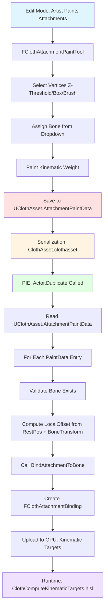

# Cloth-to-Bone Attachment Paint Editor - Implementation Design

## Executive Summary

This document provides a detailed implementation design for an **in-editor cloth attachment workflow** that allows artists to paint vertex-to-bone attachments in Edit Mode, persist the data, and apply it automatically during PIE (Play-In-Editor).

The system replaces the current hardcoded attachment logic in [`ACharacterClothTest::Duplicate()`](EngineSIU/EngineSIU/Engine/Source/Runtime/Engine/Classes/Actors/CharacterClothTest.cpp:225) with a data-driven approach where attachment data is authored in the editor and applied at runtime.

---

## 1. Current State Analysis

### 1.1 Existing Attachment System

**Current Implementation:**
- Location: [`ACharacterClothTest::Duplicate()`](EngineSIU/EngineSIU/Engine/Source/Runtime/Engine/Classes/Actors/CharacterClothTest.cpp:225)
- Hardcoded logic: Finds vertices above Z threshold, attaches to "mixamorig:Neck" bone
- Uses [`UClothComponent::BindAttachmentToBone()`](EngineSIU/EngineSIU/Engine/Source/Runtime/Engine/Classes/Components/ClothComponent.cpp:373) API

**Key Code Pattern (lines 292-377):**
```cpp
// Find vertices to attach (top vertices by Z coordinate)
float MaxZ = -FLT_MAX;
for (const FVector& Pos : CapeAsset->RestPositions) {
    MaxZ = FMath::Max(MaxZ, Pos.Z);
}
float AttachThreshold = MaxZ - (ZRange * 0.10f);

// Get bone transform and compute local offsets
FTransform NeckBoneTransform = SkeletalMeshComponent->GetBoneTransform(NeckBoneIndex);
FVector LocalOffset = InverseNeckBoneMatrix.TransformPosition(VertexRestPos);

// Bind attachment
CapeCloth->BindAttachmentToBone(
    VertexIndex,
    SkeletalMeshComponent,
    NeckBoneName,
    LocalTransform,
    1.0f,   // Stiffness
    0.0f    // AttachDistance
);
```

### 1.2 Existing Data Structures

**Asset-Level (UClothAsset):**
- [`RestPositions`](EngineSIU/EngineSIU/Engine/Source/Runtime/Engine/Classes/Engine/ClothAsset.h:102) - Simulation mesh vertices
- [`AttachmentCapabilities`](EngineSIU/EngineSIU/Engine/Source/Runtime/Engine/Classes/Engine/ClothAsset.h:139) - Which vertices CAN be attached (metadata)
- [`VertexPaintData`](EngineSIU/EngineSIU/Engine/Source/Runtime/Engine/Classes/Engine/ClothAsset.h:147) - Per-vertex authoring data

**Instance-Level (UClothComponent):**
- [`AttachmentBindings`](EngineSIU/EngineSIU/Engine/Source/Runtime/Engine/Classes/Components/ClothComponent.h:98) - Runtime attachment bindings
- [`RuntimeInvMasses`](EngineSIU/EngineSIU/Engine/Source/Runtime/Engine/Classes/Components/ClothComponent.h:97) - Per-instance inverse masses

**Attachment Data Structures:**
- [`FClothAttachmentCapability`](EngineSIU/EngineSIU/Engine/Source/Runtime/Engine/Cloth/ClothSimulationData.h:244) - Asset-level metadata
- [`FClothAttachmentBinding`](EngineSIU/EngineSIU/Engine/Source/Runtime/Engine/Cloth/ClothSimulationData.h:285) - Instance-level binding
- [`FClothAttachmentTarget`](EngineSIU/EngineSIU/Engine/Source/Runtime/Engine/Cloth/ClothSimulationData.h:261) - Target specification

### 1.3 Rendering Infrastructure

**Cloth Rendering:**
- [`FClothRenderPass`](EngineSIU/EngineSIU/Engine/Source/Runtime/Renderer/ClothRenderPass.h:28) - Production cloth rendering
- Supports debug visualization via rasterizer state changes
- Uses unified vertex/index buffers from batched solver

**Shader Infrastructure:**
- [`ClothProductionVertexShader.hlsl`](EngineSIU/EngineSIU/Shaders/Cloth/ClothProductionVertexShader.hlsl) - Vertex shader with GPU skinning
- [`ClothComputeKinematicTargets.hlsl`](EngineSIU/EngineSIU/Shaders/Cloth/ClothComputeKinematicTargets.hlsl) - Kinematic attachment compute shader
- No existing per-vertex color/weight visualization shader

---

## 2. Data Model Design

### 2.1 New Data Structure: `FClothAttachmentPaintData`

**Purpose:** Store per-vertex attachment authoring data (Edit Mode → Serialization → PIE Apply)

**Location:** Add to [`ClothSimulationData.h`](EngineSIU/EngineSIU/Engine/Source/Runtime/Engine/Cloth/ClothSimulationData.h)

```cpp
/**
 * Per-vertex attachment paint data (Edit Mode authoring)
 * Stored in UClothAsset or UClothPaintAsset
 */
struct FClothAttachmentPaintData
{
    uint32 SimVertexIndex;           // Which simulation vertex
    
    // Bone assignment
    FName BoneName;                  // Target bone name (e.g., "mixamorig:Neck")
    bool bHasBoneAssignment;         // Whether bone is assigned
    
    // Kinematic weight (0.0 = free, 1.0 = fully pinned)
    float KinematicWeight;           // Paint weight [0.0, 1.0]
    
    // Constraint parameters
    float Stiffness;                 // Attachment stiffness [0.0, 1.0]
    float AttachDistance;            // LRA distance (0.0 = hard kinematic)
    
    // Local offset (computed at Apply time, not authored)
    // FVector LocalOffset;          // NOT stored - computed from RestPosition and BoneTransform
    
    // Metadata
    bool bIsActive;                  // Enable/disable this attachment
    FString DebugLabel;              // Optional: "LeftShoulder", "Collar", etc.
    
    FClothAttachmentPaintData()
        : SimVertexIndex(0)
        , BoneName(NAME_None)
        , bHasBoneAssignment(false)
        , KinematicWeight(0.0f)
        , Stiffness(1.0f)
        , AttachDistance(0.0f)
        , bIsActive(true)
    {}
};

// Serialization
inline FArchive& operator<<(FArchive& Ar, FClothAttachmentPaintData& P)
{
    Ar << P.SimVertexIndex;
    Ar << P.BoneName;
    Ar << P.bHasBoneAssignment;
    Ar << P.KinematicWeight;
    Ar << P.Stiffness;
    Ar << P.AttachDistance;
    Ar << P.bIsActive;
    Ar << P.DebugLabel;
    return Ar;
}
```

### 2.2 Storage Location Options

**Option A: Store in `UClothAsset` (Recommended)**
- **Pros:** 
  - Attachment data travels with cloth asset
  - Single source of truth
  - Reusable across multiple instances
- **Cons:** 
  - Asset-level data, not instance-specific
  - Requires asset versioning for changes

**Option B: Store in `UClothMeshComponent`**
- **Pros:** 
  - Instance-specific customization
  - No asset modification needed
- **Cons:** 
  - Data duplicated per instance
  - Harder to share across scenes

**Option C: New `UClothPaintAsset` (Most Flexible)**
- **Pros:** 
  - Separation of concerns (mesh vs. paint data)
  - Can reference multiple paint assets per cloth
  - Easier to version and iterate
- **Cons:** 
  - Additional asset type to manage
  - More complex asset pipeline

**Recommendation: Option A (Store in UClothAsset)**
- Add `TArray<FClothAttachmentPaintData> AttachmentPaintData;` to [`UClothAsset`](EngineSIU/EngineSIU/Engine/Source/Runtime/Engine/Classes/Engine/ClothAsset.h:21)
- Serialize with existing asset data
- Migrate to Option C if per-instance customization becomes critical

### 2.3 Integration with Existing System

**Data Flow:**
```
Edit Mode (Paint) → FClothAttachmentPaintData (Asset)
                 ↓
            Serialization (ClothAsset.clothasset file)
                 ↓
         PIE Duplicate() → Read PaintData
                 ↓
         Compute LocalOffset from RestPosition + BoneTransform
                 ↓
         BindAttachmentToBone() → FClothAttachmentBinding (Instance)
                 ↓
         GPU Upload → Kinematic Targets (Runtime)
```

---

## 3. Edit Mode Interaction Design

### 3.1 User Workflow

**Stage 1: Setup**
1. Place `ACharacterClothTest` (or similar) in scene
2. Actor contains:
   - `USkeletalMeshComponent` (character with bones)
   - `UClothMeshComponent` (cape/cloth)
3. Select cloth component in outliner

**Stage 2: Enter Attachment Paint Mode**
1. Open Detail Panel for `UClothMeshComponent`
2. New section: **"Attachment Painting"**
3. Button: **"Enter Attachment Paint Mode"**
4. Viewport switches to attachment editing mode

**Stage 3: Vertex Selection**
- **Method 1: Z-Threshold Auto-Assign** (Phase 1 - Simplest)
  - Property: `float AttachmentZThreshold` (e.g., 0.9 = top 10%)
  - Button: **"Auto-Select Top Vertices"**
  - Automatically selects vertices above threshold
  
- **Method 2: Manual Box Select** (Phase 2)
  - Viewport tool: Box selection in 3D
  - Click-drag to select vertices
  
- **Method 3: Brush Paint** (Phase 3 - Most Advanced)
  - Viewport tool: Paint brush with radius
  - Paint kinematic weight (0.0 = free, 1.0 = pinned)
  - Brush properties: Radius, Strength, Falloff

**Stage 4: Bone Assignment**
- **Method 1: Dropdown Selection** (Phase 1)
  - Detail Panel: `FName TargetBoneName` dropdown
  - Populated from `SkeletalMeshComponent->GetBoneNames()`
  - Assign selected bone to all selected vertices
  
- **Method 2: Auto Nearest-Bone** (Phase 2)
  - Button: **"Auto-Assign Nearest Bone"**
  - For each selected vertex, find closest bone by distance
  - Useful for complex rigs with many bones

**Stage 5: Weight Painting**
- **Method 1: Uniform Weight** (Phase 1)
  - Property: `float KinematicWeight` slider [0.0, 1.0]
  - Apply to all selected vertices
  
- **Method 2: Brush Paint Weight** (Phase 3)
  - Paint weight per-vertex with brush
  - Visualize as heatmap overlay (blue = free, red = pinned)

**Stage 6: Save and Exit**
- Button: **"Apply Attachment Data"**
- Writes `FClothAttachmentPaintData` to `UClothAsset->AttachmentPaintData`
- Marks asset dirty for serialization
- Button: **"Exit Attachment Paint Mode"**

### 3.2 UI Components

**Detail Panel Properties (UClothMeshComponent):**
```cpp
// Attachment Painting Section
UPROPERTY(EditAnywhere, Category = "Attachment Painting")
bool bAttachmentPaintModeActive = false;

UPROPERTY(EditAnywhere, Category = "Attachment Painting")
float AttachmentZThreshold = 0.9f;  // Top 10% of vertices

UPROPERTY(EditAnywhere, Category = "Attachment Painting")
FName TargetBoneName = NAME_None;

UPROPERTY(EditAnywhere, Category = "Attachment Painting", meta = (ClampMin = "0.0", ClampMax = "1.0"))
float KinematicWeight = 1.0f;

UPROPERTY(EditAnywhere, Category = "Attachment Painting", meta = (ClampMin = "0.0", ClampMax = "1.0"))
float AttachmentStiffness = 1.0f;

UPROPERTY(EditAnywhere, Category = "Attachment Painting")
float AttachmentDistance = 0.0f;  // 0 = hard kinematic

// Brush properties (Phase 3)
UPROPERTY(EditAnywhere, Category = "Attachment Painting")
float BrushRadius = 10.0f;

UPROPERTY(EditAnywhere, Category = "Attachment Painting")
float BrushStrength = 1.0f;
```

**Toolbar Buttons:**
- **"Enter Attachment Paint Mode"** → Activates paint mode
- **"Auto-Select Top Vertices"** → Z-threshold selection
- **"Auto-Assign Nearest Bone"** → Automatic bone assignment
- **"Clear Selection"** → Deselect all vertices
- **"Apply Attachment Data"** → Save to asset
- **"Exit Attachment Paint Mode"** → Return to normal mode

### 3.3 Viewport Interaction

**Vertex Selection Visualization:**
- Selected vertices: Yellow wireframe spheres
- Unselected vertices: Gray points
- Attached vertices: Green spheres (from existing paint data)

**Heatmap Overlay (Phase 3):**
- Per-vertex color based on `KinematicWeight`
- Blue (0.0) → Cyan (0.25) → Green (0.5) → Yellow (0.75) → Red (1.0)
- Rendered as vertex color overlay on cloth mesh

---

## 4. Vertex Visualization Design

### 4.1 Editor-Only Debug Rendering

**Approach:** Extend existing cloth rendering with editor-only debug pass

**Implementation Location:**
- New file: `Engine/Source/Editor/UnrealEd/ClothAttachmentPaintRenderer.h/cpp`
- Integrates with [`FClothRenderPass`](EngineSIU/EngineSIU/Engine/Source/Runtime/Renderer/ClothRenderPass.h:28) or separate editor pass

**Rendering Strategy:**
```cpp
class FClothAttachmentPaintRenderer
{
public:
    // Render attachment paint visualization
    void RenderAttachmentOverlay(
        UClothMeshComponent* ClothComponent,
        const FSceneView* View,
        FPrimitiveDrawInterface* PDI
    );
    
    // Render selected vertices
    void RenderSelectedVertices(
        const TArray<uint32>& SelectedIndices,
        const TArray<FVector>& Positions,
        FPrimitiveDrawInterface* PDI
    );
    
    // Render heatmap overlay
    void RenderWeightHeatmap(
        UClothMeshComponent* ClothComponent,
        const TArray<FClothAttachmentPaintData>& PaintData,
        FPrimitiveDrawInterface* PDI
    );
};
```

### 4.2 Heatmap Shader (Phase 3)

**New Shader:** `Shaders/Cloth/ClothAttachmentDebugPS.hlsl`

```hlsl
// Cloth Attachment Debug Pixel Shader
// Visualizes kinematic weight as heatmap

struct VSOutput
{
    float4 Position : SV_POSITION;
    float3 WorldPos : TEXCOORD0;
    float3 Normal : TEXCOORD1;
    float Weight : TEXCOORD2;  // Kinematic weight [0, 1]
};

float4 main(VSOutput input) : SV_Target
{
    // Heatmap color gradient
    float3 color;
    if (input.Weight < 0.25f)
    {
        // Blue → Cyan
        float t = input.Weight / 0.25f;
        color = lerp(float3(0, 0, 1), float3(0, 1, 1), t);
    }
    else if (input.Weight < 0.5f)
    {
        // Cyan → Green
        float t = (input.Weight - 0.25f) / 0.25f;
        color = lerp(float3(0, 1, 1), float3(0, 1, 0), t);
    }
    else if (input.Weight < 0.75f)
    {
        // Green → Yellow
        float t = (input.Weight - 0.5f) / 0.25f;
        color = lerp(float3(0, 1, 0), float3(1, 1, 0), t);
    }
    else
    {
        // Yellow → Red
        float t = (input.Weight - 0.75f) / 0.25f;
        color = lerp(float3(1, 1, 0), float3(1, 0, 0), t);
    }
    
    // Simple lighting
    float3 lightDir = normalize(float3(1, 1, 1));
    float ndotl = saturate(dot(input.Normal, lightDir));
    color *= (0.5f + 0.5f * ndotl);
    
    return float4(color, 0.8f);  // Semi-transparent overlay
}
```

**Vertex Shader Modification:**
- Extend [`ClothProductionVertexShader.hlsl`](EngineSIU/EngineSIU/Shaders/Cloth/ClothProductionVertexShader.hlsl) with debug mode
- Add per-vertex weight buffer: `StructuredBuffer<float> VertexWeights : register(t18);`
- Pass weight to pixel shader via `TEXCOORD2`

### 4.3 CPU-Based Fallback (Phase 1)

**Simple Point Rendering:**
```cpp
void RenderAttachmentPoints(
    const TArray<FClothAttachmentPaintData>& PaintData,
    const TArray<FVector>& RestPositions,
    FPrimitiveDrawInterface* PDI
)
{
    for (const FClothAttachmentPaintData& Data : PaintData)
    {
        FVector WorldPos = RestPositions[Data.SimVertexIndex];
        
        // Color based on weight
        FLinearColor Color = FLinearColor::LerpUsingHSV(
            FLinearColor::Blue,   // 0.0 = free
            FLinearColor::Red,    // 1.0 = pinned
            Data.KinematicWeight
        );
        
        // Draw sphere at vertex position
        PDI->DrawPoint(WorldPos, Color, 5.0f, SDPG_World);
    }
}
```

---

## 5. PIE Apply Integration

### 5.1 Duplicate() Refactoring

**Current Hardcoded Logic (lines 292-377):**
```cpp
// BEFORE: Hardcoded Z-threshold and bone assignment
float AttachThreshold = MaxZ - (ZRange * 0.10f);
FName NeckBoneName = FName(TEXT("mixamorig:Neck"));
```

**New Data-Driven Logic:**
```cpp
UObject* ACharacterClothTest::Duplicate(UObject* InOuter)
{
    ACharacterClothTest* NewActor = Cast<ACharacterClothTest>(Super::Duplicate(InOuter));
    
    // ... existing cloth setup code ...
    
    // NEW: Apply attachment paint data from asset
    ApplyAttachmentPaintData(NewActor, CapeCloth, SkeletalMeshComponent);
    
    return NewActor;
}

void ACharacterClothTest::ApplyAttachmentPaintData(
    ACharacterClothTest* Actor,
    UClothMeshComponent* ClothComp,
    USkeletalMeshComponent* SkelMeshComp
)
{
    UClothAsset* ClothAsset = ClothComp->GetClothAsset();
    if (!ClothAsset || ClothAsset->AttachmentPaintData.Num() == 0)
    {
        UE_LOG(ELogLevel::Warning, TEXT("No attachment paint data found"));
        return;
    }
    
    // Iterate through paint data and bind attachments
    for (const FClothAttachmentPaintData& PaintData : ClothAsset->AttachmentPaintData)
    {
        if (!PaintData.bIsActive || !PaintData.bHasBoneAssignment)
            continue;
        
        // Validate bone exists
        int32 BoneIndex = SkelMeshComp->GetBoneIndex(PaintData.BoneName);
        if (BoneIndex == INDEX_NONE)
        {
            UE_LOG(ELogLevel::Warning, TEXT("Bone '%s' not found, skipping vertex %d"),
                *PaintData.BoneName.ToString(), PaintData.SimVertexIndex);
            continue;
        }
        
        // Compute local offset from rest position and bone transform
        FVector VertexRestPos = ClothAsset->RestPositions[PaintData.SimVertexIndex];
        FTransform BoneTransform = SkelMeshComp->GetBoneTransform(BoneIndex);
        FVector LocalOffset = BoneTransform.InverseTransformPosition(VertexRestPos);
        
        // Create local transform
        FTransform LocalTransform;
        LocalTransform.SetTranslation(LocalOffset);
        LocalTransform.SetRotation(BoneTransform.GetRotation().Inverse());
        LocalTransform.SetScale3D(FVector::OneVector);
        
        // Bind attachment using paint data parameters
        ClothComp->BindAttachmentToBone(
            PaintData.SimVertexIndex,
            SkelMeshComp,
            PaintData.BoneName,
            LocalTransform,
            PaintData.Stiffness,
            PaintData.AttachDistance
        );
        
        UE_LOG(ELogLevel::Display, TEXT("Applied attachment: Vertex %d → Bone '%s' (Weight=%.2f)"),
            PaintData.SimVertexIndex, *PaintData.BoneName.ToString(), PaintData.KinematicWeight);
    }
}
```

### 5.2 LocalOffset Computation

**Key Insight:** LocalOffset is NOT authored in Edit Mode, but computed at Apply time

**Rationale:**
- Rest positions are in cloth local space
- Bone transforms are in world space (or skeletal mesh space)
- LocalOffset = BoneTransform^-1 × VertexRestPos
- This preserves the original cloth shape when attached

**Implementation:**
```cpp
FVector ComputeLocalOffset(
    const FVector& VertexRestPos,
    const FTransform& BoneTransform
)
{
    // Transform vertex from cloth local space to bone local space
    FMatrix BoneMatrix = BoneTransform.ToMatrixWithScale();
    FMatrix InverseBoneMatrix = FMatrix::Inverse(BoneMatrix);
    return InverseBoneMatrix.TransformPosition(VertexRestPos);
}
```

### 5.3 Error Handling

**Invalid Bone Names:**
- Log warning and skip attachment
- Don't crash or fail entire apply process
- Provide clear error message with bone name and vertex index

**Missing Paint Data:**
- Fall back to no attachments (free cloth)
- Log info message
- Allow cloth to simulate without attachments

**Mismatched Vertex Indices:**
- Validate `SimVertexIndex < RestPositions.Num()`
- Skip invalid indices with warning

---

## 6. File-Level Architecture

### 6.1 New Files to Create

**1. Data Structure Extension**
- **File:** `Engine/Source/Runtime/Engine/Cloth/ClothSimulationData.h` (MODIFY)
- **Add:** `struct FClothAttachmentPaintData` (see Section 2.1)

**2. Editor Paint Tool**
- **File:** `Engine/Source/Editor/UnrealEd/ClothAttachmentPaintTool.h`
- **File:** `Engine/Source/Editor/UnrealEd/ClothAttachmentPaintTool.cpp`
- **Responsibility:** 
  - Vertex selection logic (Z-threshold, box select, brush)
  - Bone assignment logic
  - Weight painting
  - UI interaction handling

**3. Editor Renderer**
- **File:** `Engine/Source/Editor/UnrealEd/ClothAttachmentPaintRenderer.h`
- **File:** `Engine/Source/Editor/UnrealEd/ClothAttachmentPaintRenderer.cpp`
- **Responsibility:**
  - Vertex visualization (selected, attached)
  - Heatmap overlay rendering
  - Debug draw integration

**4. Debug Shader (Phase 3)**
- **File:** `Shaders/Cloth/ClothAttachmentDebugVS.hlsl`
- **File:** `Shaders/Cloth/ClothAttachmentDebugPS.hlsl`
- **Responsibility:**
  - Per-vertex weight visualization
  - Heatmap color gradient

**5. Actor Helper (Optional)**
- **File:** `Engine/Source/Runtime/Engine/Classes/Actors/ClothAttachmentHelpers.h`
- **File:** `Engine/Source/Runtime/Engine/Classes/Actors/ClothAttachmentHelpers.cpp`
- **Responsibility:**
  - `ApplyAttachmentPaintData()` helper function
  - Shared logic for PIE apply
  - Can be used by any actor with cloth attachments

### 6.2 Files to Modify

**1. UClothAsset**
- **File:** `Engine/Source/Runtime/Engine/Classes/Engine/ClothAsset.h` (MODIFY line 147)
- **Add:** `TArray<FClothAttachmentPaintData> AttachmentPaintData;`
- **Add:** Serialization in `SerializeAsset()`

**2. UClothMeshComponent**
- **File:** `Engine/Source/Runtime/Engine/Classes/Components/ClothMeshComponent.h` (MODIFY)
- **Add:** Editor properties for paint mode (see Section 3.2)
- **Add:** `void EnterAttachmentPaintMode();`
- **Add:** `void ExitAttachmentPaintMode();`
- **Add:** `void ApplyAttachmentPaintData();`

**3. ACharacterClothTest**
- **File:** `Engine/Source/Runtime/Engine/Classes/Actors/CharacterClothTest.cpp` (MODIFY line 225)
- **Replace:** Hardcoded attachment logic with `ApplyAttachmentPaintData()` call

**4. ClothAsset Serialization**
- **File:** `Engine/Source/Runtime/Engine/Classes/Engine/ClothAsset.cpp` (MODIFY)
- **Add:** Serialize `AttachmentPaintData` array

### 6.3 Class Hierarchy

```
UClothAsset (Runtime)
├── TArray<FClothAttachmentPaintData> AttachmentPaintData  [NEW]
└── SerializeAsset() [MODIFY]

UClothMeshComponent (Runtime)
├── Editor Properties [NEW]
├── EnterAttachmentPaintMode() [NEW]
├── ExitAttachmentPaintMode() [NEW]
└── ApplyAttachmentPaintData() [NEW]

FClothAttachmentPaintTool (Editor-Only)
├── SelectVerticesByZThreshold()
├── SelectVerticesByBoxSelect()
├── PaintVertexWeight()
├── AssignBoneToSelection()
└── SavePaintDataToAsset()

FClothAttachmentPaintRenderer (Editor-Only)
├── RenderSelectedVertices()
├── RenderAttachmentOverlay()
└── RenderWeightHeatmap()

ACharacterClothTest (Runtime)
└── Duplicate() [MODIFY] → Call ApplyAttachmentPaintData()
```

---

## 7. Data Flow Diagram



**Key Stages:**
1. **Edit Mode (Blue):** Artist interaction and painting
2. **Serialization (Red):** Data persistence to disk
3. **Load (Yellow):** Asset loading from file
4. **PIE Apply (Green):** Runtime binding during Duplicate()
5. **GPU Runtime (Purple):** Kinematic constraint solving

---

## 8. Incremental Implementation Steps

### Phase 1: Foundation (Simplest - No UI)

**Goal:** Replace hardcoded logic with data-driven approach using Z-threshold auto-assign

**Tasks:**
1. **Add `FClothAttachmentPaintData` struct** to [`ClothSimulationData.h`](EngineSIU/EngineSIU/Engine/Source/Runtime/Engine/Cloth/ClothSimulationData.h)
2. **Add `AttachmentPaintData` array** to [`UClothAsset`](EngineSIU/EngineSIU/Engine/Source/Runtime/Engine/Classes/Engine/ClothAsset.h:147)
3. **Implement serialization** in `UClothAsset::SerializeAsset()`
4. **Create `ApplyAttachmentPaintData()` helper** function
5. **Modify `ACharacterClothTest::Duplicate()`** to call helper instead of hardcoded logic
6. **Test:** Manually populate `AttachmentPaintData` in code, verify PIE applies correctly

**Success Criteria:**
- Hardcoded attachment logic removed
- Data-driven attachment works in PIE
- Serialization saves/loads correctly

**Estimated Complexity:** Low (2-3 days)

---

### Phase 2: Basic Editor UI (Manual Assignment)

**Goal:** Add Detail Panel properties for manual bone assignment

**Tasks:**
1. **Add editor properties** to [`UClothMeshComponent`](EngineSIU/EngineSIU/Engine/Source/Runtime/Engine/Classes/Components/ClothMeshComponent.h)
   - `float AttachmentZThreshold`
   - `FName TargetBoneName` (dropdown populated from skeletal mesh)
   - `float KinematicWeight`
   - `float AttachmentStiffness`
   - `float AttachmentDistance`
2. **Implement `EnterAttachmentPaintMode()`** button callback
3. **Implement `AutoSelectTopVertices()`** using Z-threshold
4. **Implement `AssignBoneToSelection()`** using dropdown value
5. **Implement `ApplyAttachmentPaintData()`** to save to asset
6. **Add simple vertex visualization** (CPU-based point rendering)

**Success Criteria:**
- Detail Panel shows attachment properties
- Z-threshold auto-select works
- Bone assignment from dropdown works
- Data saves to asset and persists across editor restart

**Estimated Complexity:** Medium (5-7 days)

---

### Phase 3: Viewport Interaction (Box Select)

**Goal:** Add viewport-based vertex selection

**Tasks:**
1. **Create `FClothAttachmentPaintTool`** class
2. **Implement box selection** in viewport
   - Mouse drag to define selection box
   - Ray-cast to find vertices in box
3. **Integrate with viewport input** handling
4. **Add selection visualization** (yellow spheres for selected vertices)
5. **Add toolbar buttons** for selection tools

**Success Criteria:**
- Box selection works in viewport
- Selected vertices highlighted
- Selection integrates with bone assignment

**Estimated Complexity:** Medium-High (7-10 days)

---

### Phase 4: Brush Painting (Advanced)

**Goal:** Add brush-based weight painting

**Tasks:**
1. **Implement brush tool** in `FClothAttachmentPaintTool`
   - Brush radius, strength, falloff
   - Paint kinematic weight per-vertex
2. **Add brush cursor** visualization in viewport
3. **Implement weight blending** (additive, replace, smooth)
4. **Add undo/redo** support for paint operations

**Success Criteria:**
- Brush painting works smoothly
- Weight values update in real-time
- Undo/redo works correctly

**Estimated Complexity:** High (10-14 days)

---

### Phase 5: Heatmap Visualization (Polish)

**Goal:** Add per-vertex weight visualization as heatmap overlay

**Tasks:**
1. **Create `ClothAttachmentDebugVS.hlsl`** vertex shader
2. **Create `ClothAttachmentDebugPS.hlsl`** pixel shader with heatmap gradient
3. **Extend `FClothRenderPass`** with debug mode toggle
4. **Upload vertex weights** to GPU buffer
5. **Implement `FClothAttachmentPaintRenderer`** for overlay rendering
6. **Add toggle button** in Detail Panel: "Show Weight Heatmap"

**Success Criteria:**
- Heatmap overlay renders correctly
- Color gradient matches weight values (blue → red)
- Toggle on/off works
- Performance acceptable (no frame drops)

**Estimated Complexity:** Medium-High (7-10 days)

---

### Phase 6: Auto Nearest-Bone (Quality of Life)

**Goal:** Automatically assign nearest bone to selected vertices

**Tasks:**
1. **Implement `FindNearestBone()`** algorithm
   - For each vertex, compute distance to all bones
   - Assign closest bone
2. **Add button:** "Auto-Assign Nearest Bone"
3. **Optimize** for large bone counts (spatial partitioning)

**Success Criteria:**
- Auto-assignment works correctly
- Performance acceptable for 50+ bones
- Results visually reasonable

**Estimated Complexity:** Low-Medium (3-5 days)

---

## 9. Separation of Edit-time vs Runtime Code

### 9.1 Editor-Only Code

**Preprocessor Guards:**
```cpp
#if WITH_EDITOR
    // Editor-only code here
#endif
```

**Editor-Only Classes:**
- `FClothAttachmentPaintTool` (entire class)
- `FClothAttachmentPaintRenderer` (entire class)
- Editor properties in `UClothMeshComponent` (use `UPROPERTY` meta tags)

**Editor-Only Functions:**
```cpp
#if WITH_EDITOR
void UClothMeshComponent::EnterAttachmentPaintMode()
{
    // Editor-only implementation
}

void UClothMeshComponent::ApplyAttachmentPaintData()
{
    // Editor-only implementation
}
#endif
```

### 9.2 Runtime Code

**Always Compiled:**
- `FClothAttachmentPaintData` struct (needed for serialization)
- `UClothAsset::AttachmentPaintData` array
- `ApplyAttachmentPaintData()` helper function (used in `Duplicate()`)
- `UClothComponent::BindAttachmentToBone()` (already runtime)

**Runtime-Only Path:**
```cpp
// In Duplicate() - always compiled, no editor guards
void ACharacterClothTest::ApplyAttachmentPaintData(...)
{
    // Read paint data from asset
    // Compute local offsets
    // Call BindAttachmentToBone()
    // NO painting, NO UI, NO visualization
}
```

### 9.3 Serialization

**Both Editor and Runtime:**
- Serialization code must work in both contexts
- `FClothAttachmentPaintData` serialization is runtime-safe
- No editor-specific types in serialized data (no `UObject*` to editor classes)

---

## 10. Key Design Decisions

### 10.1 Why Not Store LocalOffset in Paint Data?

**Decision:** Compute `LocalOffset` at Apply time, not at Paint time

**Rationale:**
1. **Bone transforms change:** Skeletal mesh may be in different pose during painting vs. PIE
2. **Cloth transform changes:** Cloth may be repositioned in scene
3. **Reusability:** Same paint data works regardless of initial transforms
4. **Simplicity:** Artist doesn't need to understand local vs. world space

**Implementation:**
```cpp
// WRONG: Store LocalOffset at paint time
PaintData.LocalOffset = BoneTransform.InverseTransformPosition(VertexRestPos);

// CORRECT: Compute LocalOffset at apply time
FVector LocalOffset = BoneTransform.InverseTransformPosition(VertexRestPos);
```

### 10.2 Why Store in UClothAsset vs. UClothMeshComponent?

**Decision:** Store in `UClothAsset` (Option A)

**Rationale:**
1. **Reusability:** Multiple instances can share same attachment data
2. **Asset pipeline:** Attachment data is part of cloth authoring, not instance configuration
3. **Versioning:** Asset versioning handles data migration
4. **Simplicity:** Single source of truth

**Trade-off:** Instance-specific customization requires duplicating asset

**Future:** Can add per-instance override in `UClothMeshComponent` if needed

### 10.3 Why Z-Threshold First, Then Brush?

**Decision:** Implement Z-threshold auto-select before brush painting

**Rationale:**
1. **Simplicity:** Z-threshold is 10 lines of code, brush is 1000+
2. **Validation:** Proves data flow works before adding complexity
3. **Usefulness:** Z-threshold covers 80% of use cases (capes, skirts, hair)
4. **Incremental:** Can ship Phase 1-2 without Phase 3-4

### 10.4 Why Heatmap Shader vs. CPU Rendering?

**Decision:** Start with CPU point rendering (Phase 2), add GPU heatmap later (Phase 5)

**Rationale:**
1. **Simplicity:** CPU rendering is easier to debug
2. **Editor-only:** Performance less critical in editor
3. **Flexibility:** CPU rendering easier to modify during iteration
4. **Polish:** GPU heatmap is visual polish, not core functionality

---

## 11. Testing Strategy

### 11.1 Unit Tests

**Data Serialization:**
- Create `FClothAttachmentPaintData`, serialize, deserialize, verify equality
- Test with empty arrays, single entry, 1000+ entries

**LocalOffset Computation:**
- Test with identity transform (should equal rest position)
- Test with translated bone (should subtract translation)
- Test with rotated bone (should apply inverse rotation)

**Bone Validation:**
- Test with valid bone name (should succeed)
- Test with invalid bone name (should log warning, skip)
- Test with empty bone name (should skip)

### 11.2 Integration Tests

**Phase 1 (Foundation):**
1. Manually populate `AttachmentPaintData` in code
2. Enter PIE
3. Verify attachments applied correctly
4. Verify cloth follows bone motion

**Phase 2 (Editor UI):**
1. Enter attachment paint mode
2. Auto-select top vertices
3. Assign bone from dropdown
4. Apply and save
5. Restart editor
6. Verify data persisted
7. Enter PIE
8. Verify attachments work

**Phase 3 (Box Select):**
1. Enter paint mode
2. Box-select vertices in viewport
3. Assign bone
4. Verify selection visualization
5. Apply and test in PIE

**Phase 4 (Brush Paint):**
1. Enter paint mode
2. Paint weights with brush
3. Verify heatmap updates in real-time
4. Apply and test in PIE
5. Verify gradient attachment behavior

### 11.3 Edge Cases

**Empty Paint Data:**
- Asset with no `AttachmentPaintData` → Should work (no attachments)

**Invalid Bone Names:**
- Paint data references non-existent bone → Should log warning, skip

**Mismatched Vertex Indices:**
- Paint data references vertex index >= `RestPositions.Num()` → Should log error, skip

**Multiple Bones Per Vertex:**
- Currently not supported → Future enhancement

**Overlapping Attachments:**
- Same vertex attached twice → Last binding wins (document behavior)

---

## 12. Performance Considerations

### 12.1 Editor Performance

**Vertex Selection:**
- Z-threshold: O(N) where N = vertex count → Fast (< 1ms for 10k vertices)
- Box select: O(N) ray-cast → Acceptable (< 10ms for 10k vertices)
- Brush paint: O(N) per frame → Optimize with spatial partitioning if needed

**Heatmap Rendering:**
- GPU-based: O(N) vertex shader → Fast (< 1ms for 10k vertices)
- CPU-based: O(N) point rendering → Acceptable for editor (< 5ms for 10k vertices)

### 12.2 Runtime Performance

**PIE Apply:**
- `ApplyAttachmentPaintData()`: O(M) where M = attachment count
- Typically M << N (e.g., 50 attachments for 1000 vertices)
- Bone lookup: O(1) with hash map
- LocalOffset computation: O(1) per attachment
- **Total:** < 1ms for typical cloth

**GPU Runtime:**
- No change to existing kinematic target computation
- Same performance as current hardcoded attachments

---

## 13. Future Enhancements

### 13.1 Multi-Bone Blending

**Feature:** Allow vertex to attach to multiple bones with blend weights

**Use Case:** Smooth transitions between bones (e.g., shoulder → arm)

**Data Structure:**
```cpp
struct FClothAttachmentPaintData
{
    TArray<FName> BoneNames;        // Multiple bones
    TArray<float> BoneWeights;      // Blend weights (sum to 1.0)
    // ...
};
```

### 13.2 Attachment Presets

**Feature:** Save/load attachment configurations as presets

**Use Case:** Reuse common patterns (e.g., "Cape Top Attachment", "Skirt Waist Attachment")

**Implementation:**
- New asset type: `UClothAttachmentPreset`
- Store `TArray<FClothAttachmentPaintData>`
- Apply preset to cloth asset with one click

### 13.3 Procedural Attachment

**Feature:** Automatically generate attachments based on rules

**Use Case:** Attach all vertices within radius of bone

**Implementation:**
```cpp
void GenerateProceduralAttachments(
    UClothAsset* Asset,
    USkeletalMeshComponent* SkelMesh,
    FName BoneName,
    float Radius,
    float FalloffDistance
);
```

### 13.4 Animation-Driven Attachments

**Feature:** Attachments that enable/disable based on animation state

**Use Case:** Cape detaches during roll animation, reattaches after

**Implementation:**
- Add `FName AnimationStateName` to `FClothAttachmentPaintData`
- Query animation state in `ClothComputeKinematicTargets.hlsl`
- Conditionally apply attachment

---

## 14. Documentation Requirements

### 14.1 User Documentation

**Artist Guide:**
- How to enter attachment paint mode
- How to select vertices (Z-threshold, box, brush)
- How to assign bones
- How to paint weights
- How to save and apply
- Common workflows (cape, skirt, hair)

**Technical Guide:**
- Data structure reference
- Serialization format
- PIE apply process
- Troubleshooting (invalid bones, missing data)

### 14.2 Code Documentation

**Header Comments:**
- All new structs, classes, functions
- Explain purpose, parameters, return values
- Link to related code

**Implementation Comments:**
- Complex algorithms (LocalOffset computation, nearest-bone)
- Performance-critical sections
- Editor-only vs. runtime separation

---

## 15. Summary

### 15.1 Key Deliverables

1. **Data Model:** `FClothAttachmentPaintData` struct with serialization
2. **Storage:** `UClothAsset::AttachmentPaintData` array
3. **Editor Tool:** `FClothAttachmentPaintTool` for vertex selection and painting
4. **Visualization:** `FClothAttachmentPaintRenderer` for heatmap overlay
5. **PIE Apply:** `ApplyAttachmentPaintData()` helper function
6. **Refactoring:** Remove hardcoded logic from `ACharacterClothTest::Duplicate()`

### 15.2 Implementation Phases

| Phase | Goal | Complexity | Duration |
|-------|------|------------|----------|
| 1 | Foundation (Z-threshold, no UI) | Low | 2-3 days |
| 2 | Basic Editor UI (manual assignment) | Medium | 5-7 days |
| 3 | Viewport Interaction (box select) | Medium-High | 7-10 days |
| 4 | Brush Painting | High | 10-14 days |
| 5 | Heatmap Visualization | Medium-High | 7-10 days |
| 6 | Auto Nearest-Bone | Low-Medium | 3-5 days |

**Total:** 34-49 days (7-10 weeks)

### 15.3 Success Criteria

**Phase 1 Complete:**
- Hardcoded attachment logic removed
- Data-driven attachments work in PIE
- Serialization functional

**Phase 2 Complete:**
- Detail Panel UI functional
- Z-threshold auto-select works
- Bone assignment from dropdown works
- Data persists across editor restart

**Full System Complete:**
- Brush painting works smoothly
- Heatmap visualization renders correctly
- All edge cases handled gracefully
- Documentation complete
- Artists can author attachments without programmer help

---

## 16. Appendix: Code Snippets

### A. FClothAttachmentPaintData Full Definition

```cpp
/**
 * Per-vertex attachment paint data (Edit Mode authoring)
 * Stored in UClothAsset for serialization and PIE apply
 */
struct FClothAttachmentPaintData
{
    uint32 SimVertexIndex;           // Which simulation vertex
    FName BoneName;                  // Target bone name
    bool bHasBoneAssignment;         // Whether bone is assigned
    float KinematicWeight;           // Paint weight [0.0, 1.0]
    float Stiffness;                 // Attachment stiffness
    float AttachDistance;            // LRA distance
    bool bIsActive;                  // Enable/disable
    FString DebugLabel;              // Optional label
    
    FClothAttachmentPaintData()
        : SimVertexIndex(0)
        , BoneName(NAME_None)
        , bHasBoneAssignment(false)
        , KinematicWeight(0.0f)
        , Stiffness(1.0f)
        , AttachDistance(0.0f)
        , bIsActive(true)
    {}
};

inline FArchive& operator<<(FArchive& Ar, FClothAttachmentPaintData& P)
{
    Ar << P.SimVertexIndex;
    Ar << P.BoneName;
    Ar << P.bHasBoneAssignment;
    Ar << P.KinematicWeight;
    Ar << P.Stiffness;
    Ar << P.AttachDistance;
    Ar << P.bIsActive;
    Ar << P.DebugLabel;
    return Ar;
}
```

### B. ApplyAttachmentPaintData() Full Implementation

```cpp
void ApplyAttachmentPaintData(
    UClothMeshComponent* ClothComp,
    USkeletalMeshComponent* SkelMeshComp
)
{
    UClothAsset* ClothAsset = ClothComp->GetClothAsset();
    if (!ClothAsset || ClothAsset->AttachmentPaintData.Num() == 0)
    {
        UE_LOG(ELogLevel::Display, TEXT("No attachment paint data found"));
        return;
    }
    
    int32 SuccessCount = 0;
    int32 SkipCount = 0;
    
    for (const FClothAttachmentPaintData& PaintData : ClothAsset->AttachmentPaintData)
    {
        // Skip inactive or unassigned attachments
        if (!PaintData.bIsActive || !PaintData.bHasBoneAssignment)
        {
            SkipCount++;
            continue;
        }
        
        // Validate vertex index
        if (PaintData.SimVertexIndex >= (uint32)ClothAsset->RestPositions.Num())
        {
            UE_LOG(ELogLevel::Error, TEXT("Invalid vertex index %d (max %d)"),
                PaintData.SimVertexIndex, ClothAsset->RestPositions.Num());
            SkipCount++;
            continue;
        }
        
        // Validate bone exists
        int32 BoneIndex = SkelMeshComp->GetBoneIndex(PaintData.BoneName);
        if (BoneIndex == INDEX_NONE)
        {
            UE_LOG(ELogLevel::Warning, TEXT("Bone '%s' not found, skipping vertex %d"),
                *PaintData.BoneName.ToString(), PaintData.SimVertexIndex);
            SkipCount++;
            continue;
        }
        
        // Compute local offset from rest position and bone transform
        FVector VertexRestPos = ClothAsset->RestPositions[PaintData.SimVertexIndex];
        FTransform BoneTransform = SkelMeshComp->GetBoneTransform(BoneIndex);
        FVector LocalOffset = BoneTransform.InverseTransformPosition(VertexRestPos);
        
        // Create local transform
        FTransform LocalTransform;
        LocalTransform.SetTranslation(LocalOffset);
        LocalTransform.SetRotation(BoneTransform.GetRotation().Inverse());
        LocalTransform.SetScale3D(FVector::OneVector);
        
        // Bind attachment
        ClothComp->BindAttachmentToBone(
            PaintData.SimVertexIndex,
            SkelMeshComp,
            PaintData.BoneName,
            LocalTransform,
            PaintData.Stiffness,
            PaintData.AttachDistance
        );
        
        SuccessCount++;
    }
    
    UE_LOG(ELogLevel::Display, TEXT("Applied %d attachments (%d skipped)"),
        SuccessCount, SkipCount);
}
```

### C. Z-Threshold Auto-Select Implementation

```cpp
TArray<uint32> SelectVerticesByZThreshold(
    const TArray<FVector>& RestPositions,
    float Threshold  // 0.9 = top 10%
)
{
    TArray<uint32> SelectedIndices;
    
    // Find Z range
    float MaxZ = -FLT_MAX;
    float MinZ = FLT_MAX;
    for (const FVector& Pos : RestPositions)
    {
        MaxZ = FMath::Max(MaxZ, Pos.Z);
        MinZ = FMath::Min(MinZ, Pos.Z);
    }
    
    float ZRange = MaxZ - MinZ;
    float AttachThreshold = MaxZ - (ZRange * (1.0f - Threshold));
    
    // Collect vertices above threshold
    for (int32 i = 0; i < RestPositions.Num(); ++i)
    {
        if (RestPositions[i].Z >= AttachThreshold)
        {
            SelectedIndices.Add(i);
        }
    }
    
    return SelectedIndices;
}
```

---

**End of Design Document**
