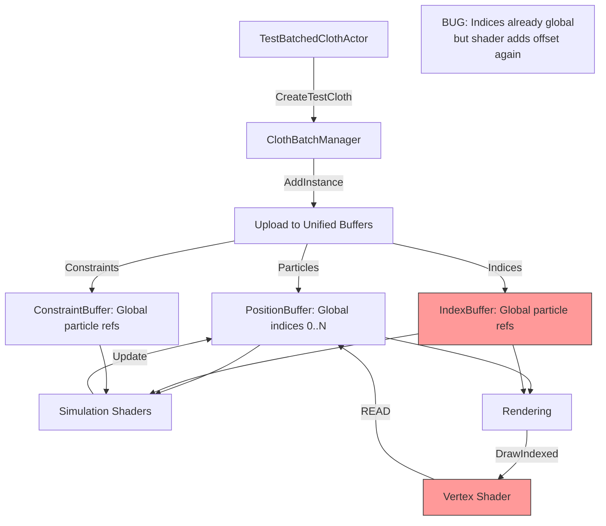

# Batched Cloth Mixed-Size Instance Fix

## Executive Summary

The batched cloth system has a **systemic index/particle offset coordination bug** that causes rendering and simulation failures when cloth instances have different particle/index/constraint counts. The root cause is **double offset application**: indices are converted to global coordinates during upload but then the global particle offset is added again during rendering/shader execution.

---

## Problem Analysis

### Observed Symptoms

**Uniform Size (Working Partially):**
- 5 instances, each 20x20 grid (400 particles, 2166 indices)
- DrawIndexed calls: (2166, 0, 0), (2166, 2166, 0), (2166, 4332, 0), ...
- Only first 2-3 instances render correctly
- Later instances (offset 6498, 8664) receive draw calls but don't render

**Mixed Size (Complete Failure):**
- Grid sizes: 20x20, 18x18, 16x16, 14x14, 12x12
- Particle counts: 400, 324, 256, 196, 144
- Not only rendering fails, but simulation and attachments behave incorrectly
- Different sized instances have mismatched offset calculations

### Root Cause: Double Offset Bug

The system applies particle offsets **twice**:

#### 1. During Index Upload ([`ClothBatchManager.cpp:272-300`](../EngineSIU/EngineSIU/Engine/Source/Runtime/Engine/Cloth/ClothBatchManager.cpp:272))

```cpp
// Convert LOCAL indices to GLOBAL indices
TArray<uint32> globalIndices;
for (uint32 localIdx : Params.Indices)
{
    globalIndices.Add(localIdx + metadata.ParticleOffset);  // ← FIRST OFFSET
}

uint32 indexOffset = metadata.TriangleOffset * 3;
BatchedSolver->UploadIndexData(globalIndices, indexOffset);
```

**Result**: Unified index buffer contains global particle indices (e.g., [400..723] for instance 1).

#### 2. During Rendering ([`ClothRenderPass.cpp:288`](../EngineSIU/EngineSIU/Engine/Source/Runtime/Renderer/ClothRenderPass.cpp:288))

```cpp
// ClothMeshConstants includes ClothParticleOffset
UpdateClothMeshConstantBuffer(renderData.WorldTransform, renderData.NumVertices,
                              renderData.ParticleOffset, renderData.IndexOffset);

// Vertex shader then does:
// position = PositionBuffer[vertexID + ClothParticleOffset];  ← SECOND OFFSET
```

**Result**: Shader reads `positions[globalIndex + ParticleOffset]`, effectively applying offset twice!

### Concrete Example

**Instance 1** (18x18 grid):
- ParticleOffset = 400
- Particles occupy buffer indices [400..723]
- Local indices: [0..323]
- **Uploaded global indices**: [400..723] (local + 400)
- DrawIndexed(1734, startIndex=2166, baseVertex=0)
- **Shader reads**: `positions[index + 400]`
- **Actual read**: `positions[(400-723) + 400]` = `positions[800-1123]` ❌
- **Expected read**: `positions[400-723]` ✓

This causes:
- Out-of-bounds reads
- Reading wrong particle data
- Attachments pointing to wrong particles
- Constraints referencing wrong particles

---

## Architecture Issues

### 1. Index Buffer Layout Ambiguity

The system is inconsistent about whether indices are local or global:

- **Upload**: Converts to global (`localIdx + ParticleOffset`)
- **Metadata**: Stores `TriangleOffset` (in triangles, not indices)
- **Rendering**: Passes `ParticleOffset` to shader
- **Shader**: Assumes indices are local, adds offset again

### 2. Constraint Index References

[`ClothBatchManager.cpp:223-243`](../EngineSIU/EngineSIU/Engine/Source/Runtime/Engine/Cloth/ClothBatchManager.cpp:223):

```cpp
FClothDistanceConstraintGPU gpu;
gpu.ParticleA = c.ParticleA + metadata.ParticleOffset;  // Global
gpu.ParticleB = c.ParticleB + metadata.ParticleOffset;  // Global
```

Constraints correctly use global indices. But do compute shaders assume this?

### 3. Shader Buffer Access Pattern

[`ClothConstraintSolver.hlsl:29-30`](../EngineSIU/EngineSIU/Shaders/Cloth/ClothConstraintSolver.hlsl:29):

```hlsl
FClothParticle pA = PositionRead[constraint.ParticleA];
FClothParticle pB = PositionRead[constraint.ParticleB];
```

Constraints **correctly** use global indices - no offset added in shader.

But rendering does:
```hlsl
// ClothVertexShader.hlsl (inferred)
position = PositionBuffer[vertexID + ClothParticleOffset];  // WRONG if index is already global
```

### 4. Metadata Triangle vs Index Units

- `TriangleOffset` stored in metadata (triangles)
- Converted to `IndexOffset = TriangleOffset * 3` for rendering
- Can cause alignment issues if not carefully tracked

---

## Solution Design

### Option A: Local Indices + D3D11 BaseVertex (Recommended)

**Store local (0-based) indices in unified buffer, use D3D11's baseVertexLocation.**

#### Changes Required:

1. **[`ClothBatchManager.cpp:272-280`](../EngineSIU/EngineSIU/Engine/Source/Runtime/Engine/Cloth/ClothBatchManager.cpp:272)** - Remove offset during upload:
   ```cpp
   // Upload LOCAL indices (no offset)
   TArray<uint32> localIndices = Params.Indices;  // Keep as-is
   BatchedSolver->UploadIndexData(localIndices, indexOffset);
   ```

2. **[`ClothRenderPass.cpp:288`](../EngineSIU/EngineSIU/Engine/Source/Runtime/Renderer/ClothRenderPass.cpp:288)** - Use baseVertexLocation:
   ```cpp
   int32 baseVertexLocation = renderData.ParticleOffset;  // Instead of 0
   Graphics->DeviceContext->DrawIndexed(indexCount, startIndexLocation, baseVertexLocation);
   ```

3. **Remove `ClothParticleOffset` from shader** - not needed, D3D11 handles it.

**Pros:**
- Standard D3D11 pattern
- Minimal shader changes
- Clear separation of concerns

**Cons:**
- Requires index buffer reorganization
- Need to verify all rendering paths

---

### Option B: Global Indices + Remove Shader Offset (Simpler)

**Keep global indices (current upload), remove double offset in shader.**

#### Changes Required:

1. **[`ClothMeshComponent.cpp:68`](../EngineSIU/EngineSIU/Engine/Source/Runtime/Engine/Classes/Components/ClothMeshComponent.cpp:68)** - Set ParticleOffset to 0 for rendering:
   ```cpp
   OutData.ParticleOffset = 0;  // Don't pass to shader
   OutData.IndexOffset = metadata.TriangleOffset * 3;
   ```

2. **[`ClothRenderPass.cpp:245-246`](../EngineSIU/EngineSIU/Engine/Source/Runtime/Renderer/ClothRenderPass.cpp:245)** - Don't pass offset:
   ```cpp
   UpdateClothMeshConstantBuffer(renderData.WorldTransform, renderData.NumVertices,
                                 0, renderData.IndexOffset);  // ParticleOffset = 0
   ```

3. **Vertex Shader** - Remove offset addition:
   ```hlsl
   position = PositionBuffer[vertexID];  // Index is already global
   ```

**Pros:**
- Minimal code changes
- Works with existing index upload
- Clear: indices are always global

**Cons:**
- Less idiomatic D3D11
- Loses per-instance vertex offset capability

---

### Recommended Approach: **Option B** (Short-term) → **Option A** (Long-term)

**Phase 1: Quick Fix (Option B)**
- Remove double offset to get system working
- Validate with mixed-size instances
- Low risk, minimal changes

**Phase 2: Proper Refactor (Option A)**
- Refactor to local indices + baseVertex
- More maintainable, standard pattern
- Better for future features (e.g., instanced rendering)

---

## Detailed Fix Plan

### Phase 1: Remove Double Offset (Option B)

#### Step 1: Update Render Data Provider
**File**: [`ClothMeshComponent.cpp:41-98`](../EngineSIU/EngineSIU/Engine/Source/Runtime/Engine/Classes/Components/ClothMeshComponent.cpp:41)

```cpp
void UClothMeshComponent::GetRenderData(FClothRenderData &OutData) const
{
    // ... existing code ...
    
    if (ClothInstanceHandle && ClothInstanceHandle->GetBatchManager())
    {
        const FClothInstanceMetadata &metadata = ClothInstanceHandle->GetMetadata();
        
        // CRITICAL FIX: Set ParticleOffset to 0
        // Indices in unified buffer are ALREADY global (have offset baked in)
        OutData.ParticleOffset = 0;  // ← Changed from metadata.ParticleOffset
        OutData.NumVertices = metadata.ParticleCount;
        OutData.IndexOffset = metadata.TriangleOffset * 3;
        OutData.NumTriangles = metadata.TriangleCount;
        
        // ... rest unchanged ...
    }
}
```

#### Step 2: Update Vertex Shader
**File**: [`ClothVertexShader.hlsl`](../EngineSIU/EngineSIU/Shaders/ClothVertexShader.hlsl)

```hlsl
// Remove ClothParticleOffset from constant buffer (or ignore it)

cbuffer ClothMeshConstants : register(b10)
{
    float4x4 ClothWorldMatrix;
    uint ClothNumVertices;
    // uint ClothParticleOffset;  // ← Remove or keep for legacy mode
    uint ClothIndexOffset;       // Not used by vertex shader
    uint ClothPadding;
};

// Main vertex shader
VSOutput main(VSInput input)
{
    // Indices in index buffer are GLOBAL particle indices
    uint particleIndex = input.VertexID;  // ← No offset addition
    
    float3 position = PositionBuffer[particleIndex];
    float3 normal = NormalBuffer[particleIndex];
    
    // ... rest of shader unchanged ...
}
```

#### Step 3: Validate Metadata
**File**: [`ClothBatchManager.cpp:146-158`](../EngineSIU/EngineSIU/Engine/Source/Runtime/Engine/Cloth/ClothBatchManager.cpp:146)

Add validation logging:

```cpp
FClothInstanceMetadata metadata;
metadata.ParticleOffset = TotalParticleCount;
metadata.ParticleCount = particleCount;
// ... existing setup ...

UE_LOG(ELogLevel::Display, TEXT("ClothBatchManager[LOD%d]: Instance %d Metadata:"),
       static_cast<int32>(LODLevel), Instances.Num());
UE_LOG(ELogLevel::Display, TEXT("  ParticleOffset=%u, Count=%u (Range: [%u-%u])"),
       metadata.ParticleOffset, metadata.ParticleCount,
       metadata.ParticleOffset, metadata.ParticleOffset + metadata.ParticleCount - 1);
UE_LOG(ELogLevel::Display, TEXT("  TriangleOffset=%u, Count=%u (IndexRange: [%u-%u])"),
       metadata.TriangleOffset, metadata.TriangleCount,
       metadata.TriangleOffset * 3, (metadata.TriangleOffset + metadata.TriangleCount) * 3 - 1);
```

#### Step 4: Validate Index Upload
**File**: [`ClothBatchManager.cpp:272-300`](../EngineSIU/EngineSIU/Engine/Source/Runtime/Engine/Cloth/ClothBatchManager.cpp:272)

Add bounds checking:

```cpp
// Convert local indices to global
TArray<uint32> globalIndices;
globalIndices.Reserve(Params.Indices.Num());

uint32 minGlobalIdx = UINT32_MAX;
uint32 maxGlobalIdx = 0;

for (uint32 localIdx : Params.Indices)
{
    uint32 globalIdx = localIdx + metadata.ParticleOffset;
    globalIndices.Add(globalIdx);
    
    minGlobalIdx = FMath::Min(minGlobalIdx, globalIdx);
    maxGlobalIdx = FMath::Max(maxGlobalIdx, globalIdx);
}

UE_LOG(ELogLevel::Display, TEXT("  Global index range: [%u-%u], Expected particle range: [%u-%u]"),
       minGlobalIdx, maxGlobalIdx,
       metadata.ParticleOffset, metadata.ParticleOffset + metadata.ParticleCount - 1);

// Validate that indices reference only this instance's particles
if (minGlobalIdx < metadata.ParticleOffset ||
    maxGlobalIdx >= metadata.ParticleOffset + metadata.ParticleCount)
{
    UE_LOG(ELogLevel::Error, TEXT("  INDEX OUT OF RANGE! Indices reference particles outside instance range!"));
}
```

---

### Phase 2: Additional Validation

#### Verify Constraint Indices
**File**: [`ClothBatchManager.cpp:223-243`](../EngineSIU/EngineSIU/Engine/Source/Runtime/Engine/Cloth/ClothBatchManager.cpp:223)

Constraints are already correctly using global indices. Verify:

```cpp
for (const FClothDistanceConstraint &c : Params.Constraints)
{
    FClothDistanceConstraintGPU gpu;
    gpu.ParticleA = c.ParticleA + metadata.ParticleOffset;
    gpu.ParticleB = c.ParticleB + metadata.ParticleOffset;
    
    // Validate indices are within instance range
    if (gpu.ParticleA < metadata.ParticleOffset ||
        gpu.ParticleA >= metadata.ParticleOffset + metadata.ParticleCount)
    {
        UE_LOG(ELogLevel::Error, TEXT("Constraint ParticleA out of range!"));
    }
    // Same for ParticleB
}
```

#### Verify Kinematic Targets
**File**: [`ClothBatchManager.cpp:569-600`](../EngineSIU/EngineSIU/Engine/Source/Runtime/Engine/Cloth/ClothBatchManager.cpp:569)

```cpp
for (const FClothAttachmentData &attachment : attachments)
{
    FClothKinematicTargetGPU target;
    
    // Convert local particle index to global
    target.ParticleIndex = attachment.ClothVertexIndex + metadata.ParticleOffset;
    
    // VALIDATION
    if (target.ParticleIndex < metadata.ParticleOffset ||
        target.ParticleIndex >= metadata.ParticleOffset + metadata.ParticleCount)
    {
        UE_LOG(ELogLevel::Error, TEXT("Kinematic target particle index out of range!"));
    }
    
    // ... rest unchanged ...
}
```

---

### Phase 3: Compute Shader Audit

All compute shaders need verification that they handle global indices correctly:

#### ✅ [`ClothIntegrate.hlsl`](../EngineSIU/EngineSIU/Shaders/Cloth/ClothIntegrate.hlsl:22)
```hlsl
uint idx = DTid.x;
if (idx >= NumParticles) return;
FClothParticle particle = PositionRead[idx];  // ✓ Uses raw index, correct
```

#### ✅ [`ClothConstraintSolver.hlsl`](../EngineSIU/EngineSIU/Shaders/Cloth/ClothConstraintSolver.hlsl:29)
```hlsl
FClothParticle pA = PositionRead[constraint.ParticleA];  // ✓ Uses global index from constraint
```

#### ❓ [`ClothApplyKinematicTargets.hlsl`](../EngineSIU/EngineSIU/Shaders/Cloth/ClothApplyKinematicTargets.hlsl)
Need to verify this reads kinematic targets correctly with global indices.

#### ❓ [`ClothUpdateNormals.hlsl`](../EngineSIU/EngineSIU/Shaders/Cloth/ClothUpdateNormals.hlsl)
Need to verify triangle index reads.

---

## Testing Strategy

### Test 1: Uniform Size Instances
**Setup**: 5 instances, all 20x20 grid (400 particles each)
- All instances should render correctly
- All attachments should work
- Verify DrawIndexed calls: (2166, 0, 0), (2166, 2166, 0), ...
- Check rendering up to last instance

### Test 2: Mixed Size Instances  
**Setup**: Grids 20x20, 18x18, 16x16, 14x14, 12x12
- Particle counts: 400, 324, 256, 196, 144 (total: 1320)
- Index counts: 2166, 1734, 1350, 1014, 726 (total: 6990)
- All instances should render at correct positions
- Each cloth should have correct shape and size
- Attachments should track correctly for all instances

### Test 3: Extreme Size Variation
**Setup**: Grids 30x30, 10x10, 25x25, 5x5, 20x20
- Verify handling of large size differences
- Check buffer capacity warnings
- Validate no out-of-bounds access

### Test 4: Attachment Verification
For each instance:
- Verify top row particles follow driver
- Check kinematic targets resolve correct world positions
- Validate no cross-instance attachment interference

---

## Rollout Plan

### Immediate Actions

1. **Apply Phase 1 Quick Fix**
   - Modify ClothMeshComponent::GetRenderData (ParticleOffset = 0)
   - Update ClothVertexShader.hlsl (remove offset addition)
   - Add validation logging

2. **Test with Mixed Sizes**
   - Run TestBatchedClothActor with `20 - i * 2` grid configuration
   - Verify all 5 instances render correctly
   - Check attachments work for all instances

3. **Validate Simulation**
   - Confirm constraint solving works correctly
   - Verify bend constraints
   - Check kinematic attachment updates

### Follow-up (Phase 2)

4. **Add Comprehensive Validation**
   - Index range checking in upload
   - Constraint index validation
   - Kinematic target validation
   - Buffer overflow detection

5. **Audit All Shaders**
   - ClothUpdateNormals.hlsl
   - ClothApplyKinematicTargets.hlsl
   - Any other cloth compute shaders

6. **Performance Testing**
   - Profile with many instances
   - Check GPU memory usage
   - Validate dispatch counts scale correctly

### Long-term (Phase 3)

7. **Refactor to Local Indices** (Optional)
   - Implement Option A approach
   - Use D3D11 baseVertexLocation
   - Cleaner architecture

8. **Documentation**
   - Document index buffer layout conventions
   - Add architecture diagrams
   - Update batching system docs

---

## Success Criteria

- ✅ All instances render correctly regardless of size
- ✅ DrawIndexed calls work for all index ranges
- ✅ Attachments follow drivers correctly for every instance
- ✅ Simulation (constraints, bending) works uniformly
- ✅ No out-of-bounds buffer access
- ✅ No D3D11 warnings or errors
- ✅ System handles dynamic instance addition/removal

---

## Risk Assessment

### Low Risk
- ParticleOffset = 0 change (isolated to one function)
- Shader offset removal (straightforward)
- Validation logging (non-functional changes)

### Medium Risk
- Vertex shader changes (affects all cloth rendering)
- Need thorough testing across all scenarios

### High Risk
- None if following Phase 1 quick fix approach

### Mitigation
- Keep legacy mode untouched
- Add feature flag to enable/disable fix
- Comprehensive logging for debugging
- Rollback plan: revert shader and GetRenderData changes

---

## Appendix: Data Flow Diagram



---

## Related Issues

- Original uniform-size rendering issue (half instances not rendering)
- Mixed-size attachment failures
- Potential constraint solving issues with wrong particle references
- Index buffer overflow warnings

All stem from the same root cause: **double offset application**.

---

## Conclusion

The batched cloth system has a fundamental coordination bug between index upload and shader consumption. Indices are converted to global coordinates during upload but then treated as local in the shader, causing a double offset. 

**The fix is straightforward**: Either keep indices global and don't add offset in shader (Option B - recommended for quick fix), or refactor to local indices and use D3D11's baseVertexLocation (Option A - better long-term).

Implementing Option B requires only 2-3 file changes with low risk and immediate results.
