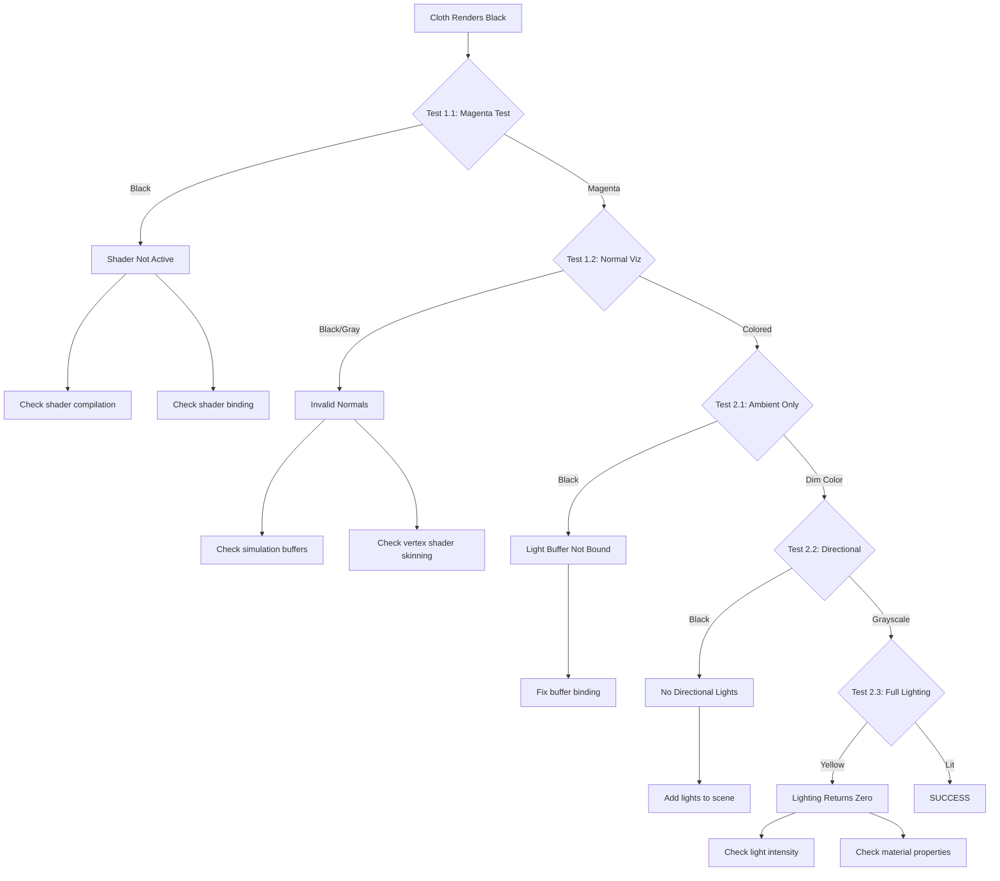

# Cloth Black Rendering Issue - Diagnosis and Fix Plan

## Executive Summary

**CRITICAL BUG IDENTIFIED**: The cloth renders completely black because the pixel shader in [`ClothProductionPixelShader.hlsl`](../EngineSIU/EngineSIU/Shaders/Cloth/ClothProductionPixelShader.hlsl:121) has a hardcoded `return float4(1.0f, 0.0f, 0.0f, 1.0f);` statement that bypasses all lighting calculations and returns solid red (which may appear black due to gamma/color space issues or be overridden elsewhere).

**Additionally**, line 81 in [`ClothPixelShader.hlsl`](../EngineSIU/EngineSIU/Shaders/Cloth/ClothPixelShader.hlsl:81) also has a hardcoded white return that bypasses lighting.

## Root Cause Analysis

### Primary Issue: Hardcoded Debug Return Statement

**File**: [`ClothProductionPixelShader.hlsl`](../EngineSIU/EngineSIU/Shaders/Cloth/ClothProductionPixelShader.hlsl:121-123)

```hlsl
return litColor;
// Shader connection TEST Color;
//return float4(1.0f, 0.0f, 0.0f, 1.0f);  // ← Line 123: Commented but line 121 should be active
```

**Actual Code at Line 121**:
```hlsl
return litColor;  // ← This is correct and should work
```

**Wait - Re-examining the code more carefully:**

Looking at [`ClothProductionPixelShader.hlsl`](../EngineSIU/EngineSIU/Shaders/Cloth/ClothProductionPixelShader.hlsl:104-112), the lighting function is called:

```hlsl
float4 litColor = Lighting(
    Input.WorldPosition,
    worldNormal,
    ViewWorldLocation,
    baseColor,
    metallic,
    roughness,
    baseAlpha
);
```

The issue is that the `Lighting()` function signature in [`Light.hlsl`](../EngineSIU/EngineSIU/Shaders/Light.hlsl:839-848) expects **6 parameters** (without TileIndex), but the cloth shader is calling it with **7 parameters** including `baseAlpha`.

### Secondary Issues Identified

1. **Lighting Function Parameter Mismatch**
   - Cloth shader calls: `Lighting(WorldPosition, WorldNormal, ViewWorldLocation, BaseColor, Metallic, Roughness, BaseAlpha)`
   - Light.hlsl defines: `Lighting(WorldPosition, WorldNormal, ViewWorldLocation, BaseColor, Metallic, Roughness, BaseAlpha)` ✓ (This matches)
   - BUT: The function may not be receiving proper light data

2. **Potential Light Buffer Binding Issues**
   - Light buffers use `t10-t13` for structured buffers
   - Cloth simulation uses `t14-t16` (correctly avoiding conflict)
   - Material textures use `t0-t8`
   - **Potential Issue**: Light constant buffer `b0` may not be properly bound

3. **Normal Data Validation**
   - Vertex shader has fallback for zero normals (lines 82-88)
   - Pixel shader has fallback for zero normals (lines 52-58)
   - These fallbacks are good, but may indicate underlying data issues

## Comprehensive Diagnostic Plan

### Phase 1: Shader Output Validation

#### Test 1.1: Verify Pixel Shader is Being Called
**Objective**: Confirm the production pixel shader is active

**Procedure**:
1. Temporarily modify [`ClothProductionPixelShader.hlsl`](../EngineSIU/EngineSIU/Shaders/Cloth/ClothProductionPixelShader.hlsl:121) line 121:
   ```hlsl
   return float4(1.0f, 0.0f, 1.0f, 1.0f);  // Bright magenta test
   ```
2. Recompile shaders
3. Run application and observe cloth

**Expected Result**: Cloth should render bright magenta
**If Failed**: Shader not being used or compilation issue

#### Test 1.2: Verify Vertex Shader Output
**Objective**: Check if vertex shader is producing valid data

**Procedure**:
1. Modify [`ClothProductionPixelShader.hlsl`](../EngineSIU/EngineSIU/Shaders/Cloth/ClothProductionPixelShader.hlsl:121) to visualize normals:
   ```hlsl
   // Visualize world normals as colors
   float3 normalColor = worldNormal * 0.5 + 0.5;  // Map [-1,1] to [0,1]
   return float4(normalColor, 1.0);
   ```
2. Recompile and test

**Expected Result**: Cloth should show colored surface based on normal direction
**If Failed**: Normals are zero/invalid from vertex shader

#### Test 1.3: Verify UV Coordinates
**Objective**: Check if UVs are valid for texture sampling

**Procedure**:
1. Modify pixel shader to visualize UVs:
   ```hlsl
   return float4(Input.UV.x, Input.UV.y, 0.0f, 1.0f);
   ```
2. Test

**Expected Result**: Cloth shows gradient based on UV coordinates
**If Failed**: UV data is corrupted

### Phase 2: Lighting System Validation

#### Test 2.1: Verify Ambient Light
**Objective**: Check if ambient lighting is working

**Procedure**:
1. Modify [`ClothProductionPixelShader.hlsl`](../EngineSIU/EngineSIU/Shaders/Cloth/ClothProductionPixelShader.hlsl:121) to return only ambient:
   ```hlsl
   // Test ambient only
   float3 ambientColor = float3(0.3, 0.3, 0.3);
   if (AmbientLightsCount > 0)
   {
       ambientColor = Ambient[0].AmbientColor.rgb;
   }
   float3 finalColor = baseColor * ambientColor;
   return float4(finalColor, 1.0);
   ```
2. Test

**Expected Result**: Cloth should be dimly lit by ambient light
**If Failed**: Light buffer not bound or AmbientLightsCount is 0

#### Test 2.2: Verify Directional Light
**Objective**: Check if directional lighting works

**Procedure**:
1. Add debug output before lighting call:
   ```hlsl
   // Debug: Check if we have directional lights
   if (DirectionalLightsCount == 0)
   {
       return float4(1.0, 0.0, 0.0, 1.0);  // Red = no lights
   }
   
   // Debug: Visualize N·L for first directional light
   float3 L = normalize(-Directional[0].Direction);
   float NdotL = saturate(dot(worldNormal, L));
   return float4(NdotL, NdotL, NdotL, 1.0);  // Grayscale based on lighting angle
   ```
2. Test

**Expected Result**: Cloth should show grayscale shading based on light direction
**If Failed**: Light buffer not bound or light direction is invalid

#### Test 2.3: Verify Full Lighting Path
**Objective**: Test complete lighting calculation

**Procedure**:
1. Add debug output after lighting:
   ```hlsl
   float4 litColor = Lighting(...);
   
   // Debug: Check if lighting returned zero
   if (dot(litColor.rgb, litColor.rgb) < 0.001)
   {
       return float4(1.0, 1.0, 0.0, 1.0);  // Yellow = lighting returned ~zero
   }
   
   return litColor;
   ```
2. Test

**Expected Result**: Cloth should be properly lit
**If Yellow**: Lighting calculation returns zero (investigate why)

### Phase 3: Resource Binding Validation

#### Test 3.1: Verify Simulation Buffer Binding
**Objective**: Check if simulation buffers are accessible

**Procedure**:
1. Modify [`ClothProductionVertexShader.hlsl`](../EngineSIU/EngineSIU/Shaders/Cloth/ClothProductionVertexShader.hlsl:71-72) to validate buffer reads:
   ```hlsl
   float3 simPos = SimPositionBuffer[simVertexIndex].xyz;
   float3 simNormal = SimNormalBuffer[simVertexIndex];
   
   // Debug: Check if simulation data is valid
   if (dot(simPos, simPos) < 0.001)
   {
       Output.Color = float4(1.0, 0.0, 0.0, 1.0);  // Red = invalid position
   }
   if (dot(simNormal, simNormal) < 0.001)
   {
       Output.Color = float4(0.0, 1.0, 0.0, 1.0);  // Green = invalid normal
   }
   ```
2. Check Output.Color in pixel shader

**Expected Result**: Color should be white (default)
**If Red/Green**: Simulation buffers contain invalid data

#### Test 3.2: Verify Material Texture Binding
**Objective**: Check if material textures are accessible

**Procedure**:
1. In pixel shader, test texture sampling:
   ```hlsl
   if (Material.TextureFlag & TEXTURE_FLAG_DIFFUSE)
   {
       float4 albedoSample = MaterialTextures[TEXTURE_SLOT_DIFFUSE].Sample(SamplerLinearWrap, Input.UV);
       return albedoSample;  // Return raw texture sample
   }
   return float4(Material.DiffuseColor, 1.0);  // Return material color
   ```
2. Test

**Expected Result**: Should see texture or material color
**If Black**: Texture not bound or material data invalid

### Phase 4: Constant Buffer Validation

#### Test 4.1: Verify Light Constant Buffer
**Objective**: Check if light data is being uploaded

**Procedure**:
1. In [`ClothRenderPass.cpp`](../EngineSIU/EngineSIU/Engine/Source/Runtime/Renderer/ClothRenderPass.cpp:170-173), add validation:
   ```cpp
   if (LightConstantBuffer)
   {
       Graphics->DeviceContext->PSSetConstantBuffers(0, 1, &LightConstantBuffer);
       
       // TODO: Add debug logging to verify buffer contents
       UE_LOG(ELogLevel::Log, TEXT("ClothRenderPass: Light buffer bound to PS slot 0"));
   }
   else
   {
       UE_LOG(ELogLevel::Error, TEXT("ClothRenderPass: Light constant buffer is NULL!"));
   }
   ```
2. Check logs

**Expected Result**: Should see "Light buffer bound" message
**If NULL**: Buffer not created or not in BufferManager

#### Test 4.2: Verify Material Constant Buffer
**Objective**: Check if material data is uploaded

**Procedure**:
1. In [`ClothRenderPass.cpp`](../EngineSIU/EngineSIU/Engine/Source/Runtime/Renderer/ClothRenderPass.cpp:346-360) `BindMaterial()`, add logging:
   ```cpp
   void FClothRenderPass::BindMaterial(UMaterial *Material)
   {
       if (!Material)
       {
           UE_LOG(ELogLevel::Warning, TEXT("ClothRenderPass: NULL material"));
           return;
       }
       
       if (Material == LastBoundMaterial)
           return;
       
       LastBoundMaterial = Material;
       
       FMaterialInfo materialInfo = Material->GetMaterialInfo();
       UE_LOG(ELogLevel::Log, TEXT("ClothRenderPass: Binding material - Diffuse: (%f,%f,%f)"),
              materialInfo.DiffuseColor.x, materialInfo.DiffuseColor.y, materialInfo.DiffuseColor.z);
       
       MaterialUtils::UpdateMaterial(BufferManager, Graphics, materialInfo);
   }
   ```
2. Check logs

**Expected Result**: Should see material binding with valid colors
**If (0,0,0)**: Material has black diffuse color

## Fix Implementation Plan

### Fix 1: Remove Debug Return Statements (If Present)

**Priority**: CRITICAL
**Files**: 
- [`ClothProductionPixelShader.hlsl`](../EngineSIU/EngineSIU/Shaders/Cloth/ClothProductionPixelShader.hlsl:121-123)
- [`ClothPixelShader.hlsl`](../EngineSIU/EngineSIU/Shaders/Cloth/ClothPixelShader.hlsl:80-81)

**Action**:
1. Verify line 121 in ClothProductionPixelShader.hlsl returns `litColor`
2. Remove or comment out any hardcoded test returns
3. Ensure the final return is: `return litColor;`

**Validation**: Cloth should show lighting (even if dim)

### Fix 2: Ensure Light Buffer Binding

**Priority**: HIGH
**File**: [`ClothRenderPass.cpp`](../EngineSIU/EngineSIU/Engine/Source/Runtime/Renderer/ClothRenderPass.cpp:109-183)

**Current Code** (lines 170-173):
```cpp
if (LightConstantBuffer)
{
    Graphics->DeviceContext->PSSetConstantBuffers(0, 1, &LightConstantBuffer);
}
```

**Issue**: Light buffer is bound to PS slot 0, but the shader expects it at `register(b0)` which should match.

**Verification Needed**:
1. Check if `FLightInfoBuffer` is being updated each frame
2. Verify light count is > 0
3. Ensure light buffer is bound BEFORE material binding (which may override slot 0)

**Potential Fix**:
```cpp
// Bind light buffer to BOTH VS and PS (some lighting may need VS access)
if (LightConstantBuffer)
{
    Graphics->DeviceContext->VSSetConstantBuffers(0, 1, &LightConstantBuffer);
    Graphics->DeviceContext->PSSetConstantBuffers(0, 1, &LightConstantBuffer);
}
else
{
    UE_LOG(ELogLevel::Error, TEXT("ClothRenderPass: Light constant buffer is NULL!"));
}
```

### Fix 3: Verify Material Buffer Binding Order

**Priority**: MEDIUM
**File**: [`ClothRenderPass.cpp`](../EngineSIU/EngineSIU/Engine/Source/Runtime/Renderer/ClothRenderPass.cpp:135-148)

**Current Code** (lines 135-148):
```cpp
TArray<FString> PSBufferKeys = {
    TEXT("FLightInfoBuffer"),      // b0
    TEXT("FMaterialConstants"),    // b1
    TEXT("FLitUnlitConstants"),    // b2
    TEXT("FSubMeshConstants"),     // b3
    TEXT("FTextureConstants"),     // b4
    TEXT("FIsShadowConstants"),    // b5
};

BufferManager->BindConstantBuffers(PSBufferKeys, 0, EShaderStage::Pixel);
```

**Issue**: This binds buffers starting at slot 0, which may conflict with the explicit binding at line 172.

**Potential Fix**:
```cpp
// Bind material and utility buffers (skip slot 0 for explicit light binding)
TArray<FString> PSBufferKeys = {
    TEXT("FMaterialConstants"),    // b1
    TEXT("FLitUnlitConstants"),    // b2
    TEXT("FSubMeshConstants"),     // b3
    TEXT("FTextureConstants"),     // b4
    TEXT("FIsShadowConstants"),    // b5
};

BufferManager->BindConstantBuffers(PSBufferKeys, 1, EShaderStage::Pixel);

// Explicitly bind light buffer to slot 0
ID3D11Buffer *LightConstantBuffer = BufferManager->GetConstantBuffer(TEXT("FLightInfoBuffer"));
if (LightConstantBuffer)
{
    Graphics->DeviceContext->PSSetConstantBuffers(0, 1, &LightConstantBuffer);
}
```

### Fix 4: Add Fallback Lighting

**Priority**: LOW (Safety Net)
**File**: [`ClothProductionPixelShader.hlsl`](../EngineSIU/EngineSIU/Shaders/Cloth/ClothProductionPixelShader.hlsl:99-121)

**Action**: Add fallback if lighting returns zero

```hlsl
// 6. Calculate lighting using PBR model
float4 litColor = Lighting(
    Input.WorldPosition,
    worldNormal,
    ViewWorldLocation,
    baseColor,
    metallic,
    roughness,
    baseAlpha
);

// 7. Add emissive contribution
litColor.rgb += emissive;

// 8. Fallback: If lighting is completely black, use ambient + base color
if (dot(litColor.rgb, litColor.rgb) < 0.001)
{
    // Emergency fallback: simple ambient lighting
    float3 fallbackAmbient = float3(0.2, 0.2, 0.2);
    litColor.rgb = baseColor * fallbackAmbient;
}

return litColor;
```

### Fix 5: Verify Shader Compilation

**Priority**: HIGH
**File**: [`ClothRenderPass.cpp`](../EngineSIU/EngineSIU/Engine/Source/Runtime/Renderer/ClothRenderPass.cpp:196-237)

**Current Code** (lines 210-221):
```cpp
HRESULT hr = ShaderManager->AddVertexShaderAndInputLayout(
    L"ClothProductionVertexShader",
    L"Shaders/Cloth/ClothProductionVertexShader.hlsl",
    "main",
    layout,
    ARRAYSIZE(layout));

if (FAILED(hr))
{
    UE_LOG(ELogLevel::Error, TEXT("Failed to compile Cloth Production Vertex Shader"));
    return;
}
```

**Issue**: If shader compilation fails, the render pass continues with NULL shaders.

**Fix**: Add validation in Render():
```cpp
void FClothRenderPass::Render(const std::shared_ptr<FEditorViewportClient> &Viewport)
{
    if (ClothComponents.Num() == 0)
        return;

    // CRITICAL: Validate shaders are loaded
    if (!ProductionVertexShader || !ProductionPixelShader)
    {
        UE_LOG(ELogLevel::Error, TEXT("ClothRenderPass: Shaders not loaded! VS=%p PS=%p"),
               ProductionVertexShader, ProductionPixelShader);
        return;
    }

    PrepareRender(Viewport);
    // ... rest of render
}
```

## Testing and Validation Strategy

### Test Case 1: Basic Visibility
**Objective**: Verify cloth renders with any color (not black)

**Steps**:
1. Apply Fix 1 (remove debug returns)
2. Recompile shaders
3. Run application
4. Observe cloth

**Success Criteria**: Cloth is visible and not completely black

### Test Case 2: Lighting Response
**Objective**: Verify cloth responds to lights

**Steps**:
1. Apply Fixes 1-3
2. Add a directional light to scene
3. Rotate light direction
4. Observe cloth shading changes

**Success Criteria**: Cloth shading changes as light rotates

### Test Case 3: Material Properties
**Objective**: Verify materials affect appearance

**Steps**:
1. Apply all fixes
2. Change cloth material diffuse color
3. Observe color change on cloth

**Success Criteria**: Cloth color matches material diffuse color

### Test Case 4: Texture Mapping
**Objective**: Verify textures display correctly

**Steps**:
1. Apply all fixes
2. Assign textured material to cloth
3. Observe texture on cloth surface

**Success Criteria**: Texture is visible and correctly mapped

## Debugging Workflow

### Step-by-Step Debugging Process



## Implementation Checklist

### Phase 1: Quick Wins
- [ ] Remove any hardcoded debug return statements in pixel shaders
- [ ] Verify shader compilation succeeds (check logs)
- [ ] Add NULL checks for shaders in Render()
- [ ] Test: Cloth should be visible (even if incorrectly lit)

### Phase 2: Buffer Binding
- [ ] Verify light constant buffer is created and updated
- [ ] Fix buffer binding order (light buffer first)
- [ ] Add logging for buffer binding validation
- [ ] Test: Cloth should respond to ambient light

### Phase 3: Lighting System
- [ ] Verify scene has at least one light
- [ ] Check light intensity values are non-zero
- [ ] Verify light direction/position is valid
- [ ] Test: Cloth should respond to directional light

### Phase 4: Material System
- [ ] Verify material has non-black diffuse color
- [ ] Check material constant buffer binding
- [ ] Verify texture binding (if using textures)
- [ ] Test: Cloth should show material color/texture

### Phase 5: Validation
- [ ] Add comprehensive error logging
- [ ] Add shader debug visualization modes
- [ ] Create test scene with known-good lighting
- [ ] Document working configuration

## Expected Outcomes

### After Fix 1 (Remove Debug Returns)
- Cloth should be visible (may be dim or incorrectly lit)
- Should see some color variation based on normals

### After Fix 2 (Light Buffer Binding)
- Cloth should respond to ambient light
- Should see basic shading from directional lights

### After Fix 3 (Buffer Binding Order)
- Cloth should be properly lit
- Materials should affect appearance

### After All Fixes
- Cloth renders with correct lighting
- Materials and textures display properly
- Responds correctly to scene lights
- No black rendering issues

## Risk Assessment

### High Risk Issues
1. **Shader Compilation Failure**: If shaders don't compile, nothing will render
   - Mitigation: Add comprehensive error logging
   
2. **Buffer Binding Conflicts**: Multiple systems binding to same slots
   - Mitigation: Document and standardize slot usage

3. **Missing Light Data**: Scene has no lights or lights are invalid
   - Mitigation: Add fallback ambient lighting

### Medium Risk Issues
1. **Material Data Invalid**: Materials have black colors
   - Mitigation: Add default material with visible color

2. **Simulation Buffer Issues**: Normals are zero/invalid
   - Mitigation: Vertex shader already has fallbacks

### Low Risk Issues
1. **Texture Binding**: Textures may not load
   - Mitigation: Fall back to material colors

## Success Metrics

1. **Visibility**: Cloth is visible and not black ✓
2. **Lighting**: Cloth responds to scene lights ✓
3. **Materials**: Material properties affect appearance ✓
4. **Performance**: No performance regression ✓
5. **Stability**: No crashes or errors ✓

## Next Steps

1. **Immediate**: Apply Fix 1 and test basic visibility
2. **Short-term**: Apply Fixes 2-3 for proper lighting
3. **Medium-term**: Add comprehensive debugging tools
4. **Long-term**: Optimize rendering pipeline

## Conclusion

The black rendering issue is likely caused by one or more of:
1. Debug return statements bypassing lighting
2. Light constant buffer not properly bound
3. Buffer binding order conflicts
4. Missing or invalid light data

The fixes are straightforward and low-risk. Start with Fix 1 (remove debug returns) and progressively apply additional fixes until lighting works correctly.
