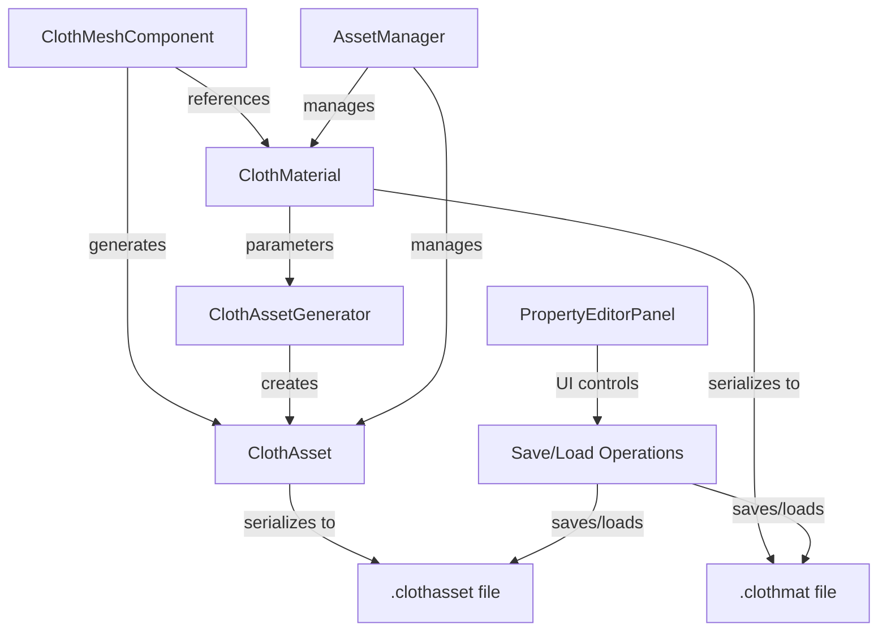

# ClothMaterial System with Asset Serialization - Implementation Plan

## Overview

This document outlines the implementation plan for creating a reusable ClothMaterial system that stores cloth simulation parameters and allows saving/loading ClothAssets as binary files.

## Goals

1. **ClothMaterial System**: Create a reusable material asset that stores per-instance cloth properties
2. **Binary Serialization**: Implement save/load for both ClothMaterial and ClothAsset as binary files
3. **Asset Integration**: Connect ClothMaterial to the asset generation workflow
4. **UI Integration**: Add save/load buttons in PropertyEditor for artist workflow

## Architecture Overview



## 1. ClothMaterial Class Design

### 1.1 File Structure

**New Files:**
- `EngineSIU/EngineSIU/Engine/Source/Runtime/Engine/Classes/Engine/ClothMaterial.h`
- `EngineSIU/EngineSIU/Engine/Source/Runtime/Engine/Classes/Engine/ClothMaterial.cpp`

### 1.2 Class Definition

```cpp
/**
 * ClothMaterial.h
 * Stores reusable cloth simulation parameters
 */

#pragma once

#include "UObject/Object.h"
#include "UObject/ObjectMacros.h"
#include "Core/Math/Vector.h"

class FArchive;

/**
 * ClothMaterial - Reusable cloth simulation parameters
 * Can be shared across multiple ClothMeshComponents
 */
class UClothMaterial : public UObject
{
    DECLARE_CLASS(UClothMaterial, UObject)

public:
    UClothMaterial();
    virtual ~UClothMaterial() override;

    // Serialization
    virtual void SerializeAsset(FArchive& Ar) override;

    // Save/Load to binary file
    bool SaveToFile(const FString& FilePath);
    bool LoadFromFile(const FString& FilePath);

    // Validation
    bool IsValid() const;

public:
    // === Core Simulation Parameters ===
    
    // Material name for identification
    UPROPERTY(EditAnywhere, FString, MaterialName, = "DefaultClothMaterial")
    
    // Constraint stiffness parameters
    UPROPERTY(EditAnywhere, float, StretchStiffness, = 0.9f)  // Range: 0.0 - 1.0
    UPROPERTY(EditAnywhere, float, BendStiffness, = 0.1f)     // Range: 0.0 - 1.0
    UPROPERTY(EditAnywhere, float, AreaStiffness, = 0.001f)   // Range: 0.0 - 1.0
    
    // Mass properties
    UPROPERTY(EditAnywhere, float, TotalMass, = 1.0f)         // Total mass in kg
    UPROPERTY(EditAnywhere, float, Density, = 0.2f)           // Density for area-based mass
    
    // Distance constraint properties
    UPROPERTY(EditAnywhere, float, RestLengthMultiplier, = 1.0f)  // Scale rest lengths
    
    // === Additional Physical Properties ===
    
    // Damping (energy dissipation)
    UPROPERTY(EditAnywhere, float, Damping, = 0.01f)          // Range: 0.0 - 1.0
    
    // Friction
    UPROPERTY(EditAnywhere, float, Friction, = 0.2f)          // Range: 0.0 - 1.0
    
    // Air resistance
    UPROPERTY(EditAnywhere, float, AirResistance, = 0.01f)    // Range: 0.0 - 1.0
    UPROPERTY(EditAnywhere, float, Drag, = 0.05f)             // Drag coefficient
    
    // Thickness for collision
    UPROPERTY(EditAnywhere, float, Thickness, = 0.01f)        // Cloth thickness in meters
    
    // === Solver Parameters ===
    
    // Iteration counts (per-material overrides)
    UPROPERTY(EditAnywhere, int32, SolverIterations, = 5)     // Constraint solver iterations
    
    // Self-collision
    UPROPERTY(EditAnywhere, bool, bEnableSelfCollision, = false)
    UPROPERTY(EditAnywhere, float, SelfCollisionThickness, = 0.02f)
    
    // === Metadata ===
    
    // Version for serialization compatibility
    uint32 Version = 1;
    
    // Creation timestamp
    FString CreationDate;
    
    // Description
    UPROPERTY(EditAnywhere, FString, Description, = "")
};
```

### 1.3 Binary File Format (.clothmat)

```
ClothMaterial Binary Format (.clothmat)
========================================

Header:
- Magic Number: "CLMT" (4 bytes)
- Version: uint32 (4 bytes)
- MaterialName Length: int32 (4 bytes)
- MaterialName: TCHAR[] (variable)

Core Parameters:
- StretchStiffness: float (4 bytes)
- BendStiffness: float (4 bytes)
- AreaStiffness: float (4 bytes)
- TotalMass: float (4 bytes)
- Density: float (4 bytes)
- RestLengthMultiplier: float (4 bytes)

Additional Parameters:
- Damping: float (4 bytes)
- Friction: float (4 bytes)
- AirResistance: float (4 bytes)
- Drag: float (4 bytes)
- Thickness: float (4 bytes)

Solver Parameters:
- SolverIterations: int32 (4 bytes)
- bEnableSelfCollision: bool (1 byte)
- SelfCollisionThickness: float (4 bytes)

Metadata:
- CreationDate Length: int32 (4 bytes)
- CreationDate: TCHAR[] (variable)
- Description Length: int32 (4 bytes)
- Description: TCHAR[] (variable)

Total Size: ~100-200 bytes (depending on string lengths)
```

## 2. ClothAsset Binary Serialization

### 2.1 Enhanced ClothAsset Serialization

Modify existing [`ClothAsset.h`](EngineSIU/EngineSIU/Engine/Source/Runtime/Engine/Classes/Engine/ClothAsset.h:57) to support binary save/load:

```cpp
// Add to ClothAsset class
public:
    // Save/Load to binary file
    bool SaveToFile(const FString& FilePath);
    bool LoadFromFile(const FString& FilePath);
    
    // Get file size estimate
    uint64 GetEstimatedFileSize() const;
```

### 2.2 Binary File Format (.clothasset)

```
ClothAsset Binary Format (.clothasset)
======================================

Header:
- Magic Number: "CAST" (4 bytes)
- Version: uint32 (4 bytes)
- Flags: uint32 (4 bytes)
  - Bit 0: bUseRenderMesh
  - Bit 1: HasBendConstraints
  - Bit 2: HasAreaConstraints
  - Bit 3: HasEdgeCollisions

Simulation Mesh Data:
- SimVertexCount: uint32 (4 bytes)
- SimTriangleCount: uint32 (4 bytes)
- RestPositions: FVector[] (SimVertexCount * 12 bytes)
- Indices: uint32[] (SimTriangleCount * 3 * 4 bytes)
- InvMasses: float[] (SimVertexCount * 4 bytes)

Render Mesh Data (if bUseRenderMesh):
- RenderVertexCount: uint32 (4 bytes)
- RenderTriangleCount: uint32 (4 bytes)
- RenderRestPositions: FVector[] (RenderVertexCount * 12 bytes)
- RenderNormals: FVector[] (RenderVertexCount * 12 bytes)
- RenderUVs: FVector2D[] (RenderVertexCount * 8 bytes)
- RenderIndices: uint32[] (RenderTriangleCount * 3 * 4 bytes)

Skinning Data (if bUseRenderMesh):
- SkinningWeights: FClothSkinningWeight[] (RenderVertexCount * sizeof(FClothSkinningWeight))

Constraints:
- DistanceConstraintCount: uint32 (4 bytes)
- DistanceConstraints: FClothDistanceConstraint[] (variable)
- BendConstraintCount: uint32 (4 bytes)
- BendConstraints: FClothBendConstraint[] (variable)
- AreaConstraintCount: uint32 (4 bytes)
- AreaConstraints: FClothAreaConstraint[] (variable)
- EdgeCollisionCount: uint32 (4 bytes)
- EdgeCollisions: FClothEdgeCollisionConstraint[] (variable)

Attachments:
- AttachmentCount: uint32 (4 bytes)
- Attachments: FClothAttachmentData[] (variable)

Metadata:
- QEMReductionRatio: float (4 bytes)
- OriginalVertexCount: uint32 (4 bytes)
- DecimatedVertexCount: uint32 (4 bytes)

Total Size: Varies (typically 100KB - 10MB depending on mesh complexity)
```

## 3. Integration with ClothAssetGenerator

### 3.1 Modify FClothAssetGenerationParams

Update [`ClothAssetGenerator.h`](EngineSIU/EngineSIU/Engine/Source/Runtime/Engine/Cloth/ClothAssetGenerator.h:56):

```cpp
struct FClothAssetGenerationParams
{
    // Decimation parameters
    FClothDecimationParams DecimationParams;
    
    // Skinning parameters
    FClothSkinningParams SkinningParams;
    
    // Constraint generation flags
    bool bGenerateDistanceConstraints = true;
    bool bGenerateBendConstraints = true;
    bool bGenerateAreaConstraints = true;
    bool bGenerateEdgeCollisions = true;
    
    // Mass distribution
    float UniformMass = 1.0f;
    bool bUseUniformMass = true;
    
    // NEW: ClothMaterial reference
    UClothMaterial* ClothMaterial = nullptr;  // Optional material override
    
    // Helper: Build from ClothMaterial
    static FClothAssetGenerationParams FromClothMaterial(
        UClothMaterial* Material,
        const FClothDecimationParams& DecimationParams,
        const FClothSkinningParams& SkinningParams
    );
};
```

### 3.2 Update ClothAssetGenerator

Modify [`ClothAssetGenerator.cpp`](EngineSIU/EngineSIU/Engine/Source/Runtime/Engine/Cloth/ClothAssetGenerator.cpp:18) to use ClothMaterial parameters when available:

```cpp
// In GenerateClothAssetFromStaticMesh
if (Params.ClothMaterial)
{
    // Apply material parameters to constraints
    for (auto& constraint : distanceConstraints)
    {
        constraint.Stiffness = Params.ClothMaterial->StretchStiffness;
        constraint.RestLength *= Params.ClothMaterial->RestLengthMultiplier;
    }
    
    for (auto& constraint : bendConstraints)
    {
        constraint.Stiffness = Params.ClothMaterial->BendStiffness;
    }
    
    for (auto& constraint : areaConstraints)
    {
        constraint.Stiffness = Params.ClothMaterial->AreaStiffness;
    }
    
    // Use material mass
    Params.UniformMass = Params.ClothMaterial->TotalMass;
}
```

## 4. ClothMeshComponent Integration

### 4.1 Add ClothMaterial Reference

Modify [`ClothMeshComponent.h`](EngineSIU/EngineSIU/Engine/Source/Runtime/Engine/Classes/Components/ClothMeshComponent.h:80):

```cpp
class UClothMeshComponent : public UClothComponent
{
    // ... existing code ...
    
public:
    // NEW: ClothMaterial reference
    UPROPERTY(EditAnywhere, UClothMaterial*, ClothMaterial, = nullptr)
    
    // Get effective parameters (from material or component)
    float GetEffectiveStretchStiffness() const;
    float GetEffectiveBendStiffness() const;
    float GetEffectiveAreaStiffness() const;
    float GetEffectiveTotalMass() const;
    float GetEffectiveRestLengthMultiplier() const;
    
    // Apply ClothMaterial to component
    void ApplyClothMaterial(UClothMaterial* Material);
    
    // Create ClothMaterial from current component settings
    UClothMaterial* CreateClothMaterialFromSettings();
};
```

### 4.2 Update BuildGenerationParams

Modify [`ClothMeshComponent.h`](EngineSIU/EngineSIU/Engine/Source/Runtime/Engine/Classes/Components/ClothMeshComponent.h:113):

```cpp
FClothAssetGenerationParams BuildGenerationParams() const
{
    FClothAssetGenerationParams params;
    
    // Decimation settings
    params.DecimationParams.TargetReductionRatio = SimulationMeshReductionRatio;
    params.DecimationParams.bPreserveBoundaryEdges = bPreserveBoundaryEdges;
    params.DecimationParams.bPreserveUVSeams = bPreserveUVSeams;
    params.DecimationParams.Method = DecimationMethod;
    
    // Constraint generation flags
    params.bGenerateDistanceConstraints = bGenerateDistanceConstraints;
    params.bGenerateBendConstraints = bGenerateBendConstraints;
    params.bGenerateAreaConstraints = bGenerateAreaConstraints;
    params.bGenerateEdgeCollisions = bGenerateEdgeCollisions;
    
    // NEW: Use ClothMaterial if available
    if (ClothMaterial)
    {
        params.ClothMaterial = ClothMaterial;
        params.UniformMass = ClothMaterial->TotalMass;
    }
    else
    {
        // Use component parameters
        params.UniformMass = TotalMass;
    }
    
    return params;
}
```

## 5. AssetManager Integration

### 5.1 Add ClothMaterial Asset Type

Modify [`AssetManager.h`](EngineSIU/EngineSIU/Engine/Source/Runtime/Engine/Classes/Engine/AssetManager.h:13):

```cpp
enum class EAssetType : uint8
{
    StaticMesh,
    SkeletalMesh,
    Skeleton,
    Animation,
    Texture2D,
    Material,
    ParticleSystem,
    PhysicsAsset,
    ClothMaterial,    // NEW
    ClothAsset,       // NEW
    MAX
};
```

### 5.2 Add Asset Management Methods

```cpp
class UAssetManager : public UObject
{
    // ... existing code ...
    
public:
    // ClothMaterial management
    UClothMaterial* GetClothMaterial(const FName& Name) const;
    void AddClothMaterial(const FName& Key, UClothMaterial* Material);
    bool SaveClothMaterial(const FString& FilePath, UClothMaterial* Material);
    UClothMaterial* LoadClothMaterial(const FString& FilePath);
    
    // ClothAsset management
    UClothAsset* GetClothAsset(const FName& Name) const;
    void AddClothAsset(const FName& Key, UClothAsset* Asset);
    bool SaveClothAsset(const FString& FilePath, UClothAsset* Asset);
    UClothAsset* LoadClothAsset(const FString& FilePath);
};
```

## 6. PropertyEditorPanel UI Integration

### 6.1 Add Save/Load Buttons

Modify [`PropertyEditorPanel.cpp`](EngineSIU/EngineSIU/Engine/Source/Editor/PropertyEditor/PropertyEditorPanel.cpp:421) in `RenderForClothMesh`:

```cpp
void PropertyEditorPanel::RenderForClothMesh(UClothMeshComponent* ClothMeshComp) const
{
    ImGui::PushStyleColor(ImGuiCol_Header, ImVec4(0.1f, 0.1f, 0.1f, 1.0f));
    
    // === Existing Static Mesh Selection ===
    if (ImGui::TreeNodeEx("Static Mesh", ImGuiTreeNodeFlags_Framed | ImGuiTreeNodeFlags_DefaultOpen))
    {
        // ... existing mesh selection code ...
        
        if (ImGui::Button("Create Cloth Asset"))
        {
            ClothMeshComp->GenerateClothAsset();
        }
        
        ImGui::TreePop();
    }
    
    // === NEW: ClothMaterial Section ===
    if (ImGui::TreeNodeEx("Cloth Material", ImGuiTreeNodeFlags_Framed | ImGuiTreeNodeFlags_DefaultOpen))
    {
        ImGui::Text("Current Material:");
        ImGui::SameLine();
        
        FString MaterialName = ClothMeshComp->ClothMaterial 
            ? ClothMeshComp->ClothMaterial->MaterialName 
            : FString("None");
        
        // Material selection dropdown
        const TMap<FName, FAssetInfo> Assets = UAssetManager::Get().GetAssetRegistry();
        if (ImGui::BeginCombo("##ClothMaterial", GetData(MaterialName), ImGuiComboFlags_None))
        {
            if (ImGui::Selectable("None", !ClothMeshComp->ClothMaterial))
            {
                ClothMeshComp->ClothMaterial = nullptr;
            }
            
            for (const auto& Asset : Assets)
            {
                if (Asset.Value.AssetType != EAssetType::ClothMaterial)
                    continue;
                
                if (ImGui::Selectable(GetData(Asset.Value.AssetName.ToString()), false))
                {
                    UClothMaterial* Material = UAssetManager::Get().GetClothMaterial(Asset.Key);
                    ClothMeshComp->ApplyClothMaterial(Material);
                }
            }
            ImGui::EndCombo();
        }
        
        // Save/Load buttons
        ImGui::Spacing();
        
        if (ImGui::Button("Save ClothMaterial", ImVec2(ImGui::GetContentRegionAvail().x * 0.48f, 0)))
        {
            // Open file dialog
            const char* filters[] = { "*.clothmat" };
            const char* filePath = tinyfd_saveFileDialog(
                "Save ClothMaterial",
                "ClothMaterial.clothmat",
                1,
                filters,
                "Cloth Material Files"
            );
            
            if (filePath)
            {
                UClothMaterial* Material = ClothMeshComp->CreateClothMaterialFromSettings();
                if (Material && UAssetManager::Get().SaveClothMaterial(FString(filePath), Material))
                {
                    UE_LOG(ELogLevel::Display, TEXT("ClothMaterial saved: %s"), filePath);
                }
            }
        }
        
        ImGui::SameLine();
        
        if (ImGui::Button("Load ClothMaterial", ImVec2(ImGui::GetContentRegionAvail().x, 0)))
        {
            // Open file dialog
            const char* filters[] = { "*.clothmat" };
            const char* filePath = tinyfd_openFileDialog(
                "Load ClothMaterial",
                "",
                1,
                filters,
                "Cloth Material Files",
                0
            );
            
            if (filePath)
            {
                UClothMaterial* Material = UAssetManager::Get().LoadClothMaterial(FString(filePath));
                if (Material)
                {
                    ClothMeshComp->ApplyClothMaterial(Material);
                    UE_LOG(ELogLevel::Display, TEXT("ClothMaterial loaded: %s"), filePath);
                }
            }
        }
        
        ImGui::TreePop();
    }
    
    // === NEW: ClothAsset Section ===
    if (ImGui::TreeNodeEx("Cloth Asset", ImGuiTreeNodeFlags_Framed | ImGuiTreeNodeFlags_DefaultOpen))
    {
        ImGui::Text("Generated Asset:");
        ImGui::SameLine();
        ImGui::Text(ClothMeshComp->GeneratedClothAsset ? "Yes" : "No");
        
        ImGui::Spacing();
        
        if (ImGui::Button("Save ClothAsset", ImVec2(ImGui::GetContentRegionAvail().x * 0.48f, 0)))
        {
            if (ClothMeshComp->GeneratedClothAsset)
            {
                const char* filters[] = { "*.clothasset" };
                const char* filePath = tinyfd_saveFileDialog(
                    "Save ClothAsset",
                    "ClothAsset.clothasset",
                    1,
                    filters,
                    "Cloth Asset Files"
                );
                
                if (filePath)
                {
                    if (UAssetManager::Get().SaveClothAsset(FString(filePath), ClothMeshComp->GeneratedClothAsset))
                    {
                        UE_LOG(ELogLevel::Display, TEXT("ClothAsset saved: %s"), filePath);
                    }
                }
            }
            else
            {
                UE_LOG(ELogLevel::Warning, TEXT("No ClothAsset to save. Generate one first."));
            }
        }
        
        ImGui::SameLine();
        
        if (ImGui::Button("Load ClothAsset", ImVec2(ImGui::GetContentRegionAvail().x, 0)))
        {
            const char* filters[] = { "*.clothasset" };
            const char* filePath = tinyfd_openFileDialog(
                "Load ClothAsset",
                "",
                1,
                filters,
                "Cloth Asset Files",
                0
            );
            
            if (filePath)
            {
                UClothAsset* Asset = UAssetManager::Get().LoadClothAsset(FString(filePath));
                if (Asset)
                {
                    ClothMeshComp->GeneratedClothAsset = Asset;
                    ClothMeshComp->SetClothAsset(Asset);
                    ClothMeshComp->RegisterWithClothWorld();
                    UE_LOG(ELogLevel::Display, TEXT("ClothAsset loaded: %s"), filePath);
                }
            }
        }
        
        ImGui::TreePop();
    }
    
    ImGui::PopStyleColor();
}
```

## 7. Implementation Details

### 7.1 ClothMaterial Serialization Implementation

```cpp
// ClothMaterial.cpp

void UClothMaterial::SerializeAsset(FArchive& Ar)
{
    Super::SerializeAsset(Ar);
    
    // Version
    Ar << Version;
    
    // Material name
    Ar << MaterialName;
    
    // Core parameters
    Ar << StretchStiffness;
    Ar << BendStiffness;
    Ar << AreaStiffness;
    Ar << TotalMass;
    Ar << Density;
    Ar << RestLengthMultiplier;
    
    // Additional parameters
    Ar << Damping;
    Ar << Friction;
    Ar << AirResistance;
    Ar << Drag;
    Ar << Thickness;
    
    // Solver parameters
    Ar << SolverIterations;
    Ar << bEnableSelfCollision;
    Ar << SelfCollisionThickness;
    
    // Metadata
    Ar << CreationDate;
    Ar << Description;
}

bool UClothMaterial::SaveToFile(const FString& FilePath)
{
    // Create file archive
    FArchiveFileWriter Ar(FilePath);
    if (!Ar.IsValid())
        return false;
    
    // Write magic number
    uint32 magic = 0x544D4C43; // "CLMT"
    Ar << magic;
    
    // Serialize
    SerializeAsset(Ar);
    
    return true;
}

bool UClothMaterial::LoadFromFile(const FString& FilePath)
{
    // Create file archive
    FArchiveFileReader Ar(FilePath);
    if (!Ar.IsValid())
        return false;
    
    // Read and verify magic number
    uint32 magic = 0;
    Ar << magic;
    if (magic != 0x544D4C43)
        return false;
    
    // Deserialize
    SerializeAsset(Ar);
    
    return true;
}
```

### 7.2 ClothAsset Serialization Implementation

```cpp
// ClothAsset.cpp

void UClothAsset::SerializeAsset(FArchive& Ar)
{
    Super::SerializeAsset(Ar);
    
    // Flags
    uint32 flags = 0;
    if (Ar.IsSaving())
    {
        flags |= (bUseRenderMesh ? 0x01 : 0);
        flags |= (BendConstraints.Num() > 0 ? 0x02 : 0);
        flags |= (AreaConstraints.Num() > 0 ? 0x04 : 0);
        flags |= (EdgeCollisions.Num() > 0 ? 0x08 : 0);
    }
    Ar << flags;
    
    if (Ar.IsLoading())
    {
        bUseRenderMesh = (flags & 0x01) != 0;
    }
    
    // Simulation mesh
    uint32 simVertCount = RestPositions.Num();
    uint32 simTriCount = Indices.Num() / 3;
    Ar << simVertCount;
    Ar << simTriCount;
    
    if (Ar.IsLoading())
    {
        RestPositions.SetNum(simVertCount);
        Indices.SetNum(simTriCount * 3);
        InvMasses.SetNum(simVertCount);
    }
    
    for (auto& pos : RestPositions)
        Ar << pos.X << pos.Y << pos.Z;
    
    for (auto& idx : Indices)
        Ar << idx;
    
    for (auto& mass : InvMasses)
        Ar << mass;
    
    // Render mesh (if enabled)
    if (bUseRenderMesh)
    {
        uint32 renderVertCount = RenderRestPositions.Num();
        uint32 renderTriCount = RenderIndices.Num() / 3;
        Ar << renderVertCount;
        Ar << renderTriCount;
        
        if (Ar.IsLoading())
        {
            RenderRestPositions.SetNum(renderVertCount);
            RenderNormals.SetNum(renderVertCount);
            RenderUVs.SetNum(renderVertCount);
            RenderIndices.SetNum(renderTriCount * 3);
            SkinningWeights.SetNum(renderVertCount);
        }
        
        for (auto& pos : RenderRestPositions)
            Ar << pos.X << pos.Y << pos.Z;
        
        for (auto& normal : RenderNormals)
            Ar << normal.X << normal.Y << normal.Z;
        
        for (auto& uv : RenderUVs)
            Ar << uv.X << uv.Y;
        
        for (auto& idx : RenderIndices)
            Ar << idx;
        
        for (auto& weight : SkinningWeights)
        {
            Ar << weight.SimVertexIndices[0];
            Ar << weight.SimVertexIndices[1];
            Ar << weight.SimVertexIndices[2];
            Ar << weight.Weights[0];
            Ar << weight.Weights[1];
            Ar << weight.Weights[2];
        }
    }
    
    // Constraints
    SerializeConstraints(Ar, DistanceConstraints);
    
    if (flags & 0x02)
        SerializeConstraints(Ar, BendConstraints);
    
    if (flags & 0x04)
        SerializeConstraints(Ar, AreaConstraints);
    
    if (flags & 0x08)
        SerializeConstraints(Ar, EdgeCollisions);
    
    // Attachments
    uint32 attachCount = AttachmentsData.Num();
    Ar << attachCount;
    if (Ar.IsLoading())
        AttachmentsData.SetNum(attachCount);
    
    for (auto& attach : AttachmentsData)
    {
        Ar << attach.ClothVertexIndex;
        Ar << attach.Type;
        Ar << attach.Stiffness;
        Ar << attach.bIsKinematic;
        Ar << attach.AttachDistance;
        Ar << attach.WorldPosition.X << attach.WorldPosition.Y << attach.WorldPosition.Z;
    }
    
    // Metadata
    Ar << QEMReductionRatio;
    Ar << OriginalVertexCount;
    Ar << DecimatedVertexCount;
}

bool UClothAsset::SaveToFile(const FString& FilePath)
{
    FArchiveFileWriter Ar(FilePath);
    if (!Ar.IsValid())
        return false;
    
    uint32 magic = 0x54534143; // "CAST"
    Ar << magic;
    
    uint32 version = 1;
    Ar << version;
    
    SerializeAsset(Ar);
    
    return true;
}

bool UClothAsset::LoadFromFile(const FString& FilePath)
{
    FArchiveFileReader Ar(FilePath);
    if (!Ar.IsValid())
        return false;
    
    uint32 magic = 0;
    Ar << magic;
    if (magic != 0x54534143)
        return false;
    
    uint32 version = 0;
    Ar << version;
    
    SerializeAsset(Ar);
    
    return true;
}
```

## 8. Workflow Examples

### 8.1 Artist Workflow: Create and Reuse ClothMaterial

```
1. Artist selects ClothMeshComponent in editor
2. Tweaks simulation parameters in PropertyEditor:
   - StretchStiffness = 0.95
   - BendStiffness = 0.15
   - TotalMass = 2.0
3. Clicks "Save ClothMaterial" button
4. Saves as "Silk.clothmat"
5. Creates new ClothMeshComponent
6. Clicks "Load ClothMaterial" button
7. Loads "Silk.clothmat"
8. All parameters automatically applied
```

### 8.2 Developer Workflow: Cache Generated Assets

```
1. Generate ClothAsset from high-poly mesh (expensive operation)
2. Click "Save ClothAsset" button
3. Save as "Flag_LOD0.clothasset"
4. On subsequent loads:
   - Click "Load ClothAsset" button
   - Load "Flag_LOD0.clothasset"
   - Skip expensive generation step
   - Instant cloth setup
```

## 9. File Organization

### 9.1 Recommended Directory Structure

```
EngineSIU/EngineSIU/Content/
├── ClothMaterials/
│   ├── Silk.clothmat
│   ├── Cotton.clothmat
│   ├── Leather.clothmat
│   └── Rubber.clothmat
├── ClothAssets/
│   ├── Flag_LOD0.clothasset
│   ├── Cape_LOD0.clothasset
│   └── Curtain_LOD0.clothasset
└── Meshes/
    ├── Flag.fbx
    ├── Cape.fbx
    └── Curtain.fbx
```

## 10. Testing Plan

### 10.1 Unit Tests

1. **ClothMaterial Serialization**
   - Save material with various parameters
   - Load and verify all parameters match
   - Test version compatibility

2. **ClothAsset Serialization**
   - Save asset with render mesh enabled
   - Save asset with render mesh disabled
   - Load and verify mesh data integrity
   - Verify constraint data preservation

3. **Parameter Application**
   - Apply ClothMaterial to component
   - Verify parameters override component defaults
   - Test material removal (revert to defaults)

### 10.2 Integration Tests

1. **Full Workflow Test**
   - Create cloth from mesh
   - Save ClothMaterial
   - Save ClothAsset
   - Create new component
   - Load ClothMaterial
   - Load ClothAsset
   - Verify simulation matches original

2. **AssetManager Integration**
   - Register ClothMaterial in AssetManager
   - Retrieve by name
   - Verify asset registry updates

3. **UI Integration**
   - Test all save/load buttons
   - Verify file dialogs work correctly
   - Test error handling (invalid files)

## 11. Performance Considerations

### 11.1 File Size Estimates

- **ClothMaterial**: ~100-200 bytes (negligible)
- **ClothAsset**: 
  - Simulation mesh (1000 verts): ~50 KB
  - Render mesh (10000 verts): ~500 KB
  - Constraints: ~10-100 KB
  - **Total**: 100 KB - 10 MB typical

### 11.2 Load Time Estimates

- **ClothMaterial**: < 1 ms (instant)
- **ClothAsset**: 10-100 ms (depending on size)
- **Generation Time Saved**: 100-1000 ms (significant improvement)

## 12. Future Enhancements

### 12.1 Short Term

1. **Material Presets**: Ship with common material presets (Silk, Cotton, Leather)
2. **Asset Browser**: Visual browser for ClothMaterials and ClothAssets
3. **Compression**: Add optional compression for ClothAsset files

### 12.2 Long Term

1. **Material Blending**: Blend between multiple ClothMaterials
2. **Per-Vertex Materials**: Paint different materials on cloth regions
3. **LOD Support**: Multiple ClothAssets per component for LOD system
4. **Streaming**: Stream ClothAssets on demand for large worlds

## 13. Implementation Checklist

- [ ] Create ClothMaterial class (header + implementation)
- [ ] Implement ClothMaterial serialization
- [ ] Add ClothMaterial save/load methods
- [ ] Enhance ClothAsset serialization
- [ ] Add ClothAsset save/load methods
- [ ] Update FClothAssetGenerationParams
- [ ] Modify ClothAssetGenerator to use ClothMaterial
- [ ] Add ClothMaterial field to ClothMeshComponent
- [ ] Implement ApplyClothMaterial method
- [ ] Implement CreateClothMaterialFromSettings method
- [ ] Add ClothMaterial/ClothAsset to EAssetType enum
- [ ] Implement AssetManager methods for ClothMaterial
- [ ] Implement AssetManager methods for ClothAsset
- [ ] Add UI buttons to PropertyEditorPanel
- [ ] Implement file dialog integration
- [ ] Test ClothMaterial save/load
- [ ] Test ClothAsset save/load
- [ ] Test full workflow integration
- [ ] Create documentation and examples

## 14. Risk Mitigation

### 14.1 Potential Issues

1. **File Format Changes**: Version field allows backward compatibility
2. **Large File Sizes**: Compression can be added later
3. **Corrupted Files**: Magic number and validation checks
4. **Memory Usage**: Lazy loading can be implemented if needed

### 14.2 Rollback Plan

- All changes are additive (no breaking changes to existing code)
- ClothMaterial is optional (components work without it)
- Binary serialization is separate from existing asset system
- Can be disabled via preprocessor defines if needed

## Summary

This implementation plan provides a complete ClothMaterial system with binary asset serialization. The design is:

- **Modular**: ClothMaterial is optional and doesn't break existing workflows
- **Efficient**: Binary format is compact and fast to load
- **Extensible**: Version field allows future enhancements
- **User-Friendly**: Simple save/load buttons in PropertyEditor
- **Production-Ready**: Supports caching expensive generation operations

The system enables artists to create reusable cloth material presets and developers to cache generated cloth assets, significantly improving iteration time and workflow efficiency.
