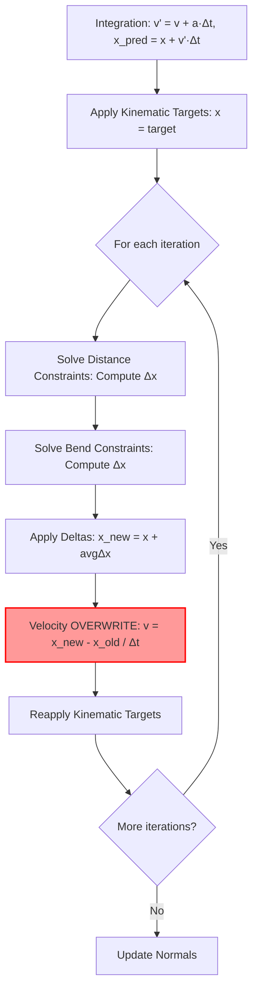
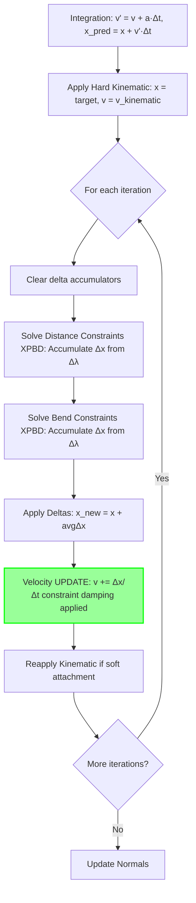

# PBD Cloth Simulation Improvement Architecture

**Author**: Architecture Mode  
**Date**: 2026-01-25  
**Purpose**: Comprehensive plan to improve visual and physical behavior of PBD cloth simulation

---

## Executive Summary

Your cloth simulation is functionally correct as a basic PBD implementation, but suffers from five critical visual artifacts:
1. Over-damped, underwater motion feel
2. Excessive stretching when damping is increased
3. Grid-size/resolution dependence
4. Poor kinematic attachment response
5. Unintuitive, soft bending behavior

These issues stem from fundamental limitations in classical PBD that are well-understood in the literature. This plan proposes **migrating to XPBD (Extended Position-Based Dynamics)** with additional improvements for damping, resolution independence, and kinematic handling.

**Expected Outcome**: Cloth that responds crisply to motion, maintains consistent stiffness across resolutions, snaps to kinematic drivers, and has intuitive bend control—all while remaining stable and GPU-friendly.

---

## Part 1: Root Cause Analysis

### 1.1 Over-Damped "Underwater" Feel

**Current Implementation** ([`ClothIntegrate.hlsl:69`](../EngineSIU/EngineSIU/Shaders/Cloth/ClothIntegrate.hlsl)):
```hlsl
velocity.Velocity *= (1.0f - params.Damping);  // Applied BEFORE position update
```

**Current Implementation** ([`ClothApplyDelta.hlsl:48`](../EngineSIU/EngineSIU/Shaders/Cloth/ClothApplyDelta.hlsl)):
```hlsl
velocity.Velocity = delta / DeltaTime;  // OVERWRITES velocity from constraint correction
```

**Root Causes**:
1. **Velocity Overwrite**: After integration computes `v' = v + a·Δt`, and constraints correct positions, [`ApplyDelta`](../EngineSIU/EngineSIU/Shaders/Cloth/ClothApplyDelta.hlsl) *replaces* velocity with `Δx/Δt` instead of adding to it. This destroys all momentum from external forces.
2. **Double Damping**: Damping is applied during integration, then velocity is recomputed from position deltas (which are already damped by stiffness < 1).
3. **Wrong Damping Type**: Velocity scaling damps **all motion equally** (global damping), not just oscillations. This makes even valid motion (like falling under gravity) feel slow.

**Why It Feels Like Underwater**:
- External forces (gravity, wind) add momentum
- Constraints correct positions but velocity rewrite loses that momentum
- Next frame starts with artificially low velocity
- Cloth can never build up speed, everything feels sluggish

### 1.2 Excessive Stretching vs. Damping Trade-off

**Current Implementation** ([`ClothConstraintSolver.hlsl:54-62`](../EngineSIU/EngineSIU/Shaders/Cloth/ClothConstraintSolver.hlsl)):
```hlsl
float stiffness = constraint.Stiffness * params.StretchStiffness;  // Simple multiplier
float lambda = -error / wSum;
correctionA = stiffness * lambda * w1 * (-dir);  // Stiffness scales correction
```

**Root Causes**:
1. **Iteration-Dependent Stiffness**: In classical PBD, effective stiffness = `k_eff ≈ 1 - (1-k)^n` where `k` is stiffness parameter and `n` is iteration count. With 5 iterations, k=0.9 → k_eff ≈ 0.41 (59% stretch remains!).
2. **No Compliance Model**: Stiffness is a unitless multiplier [0,1], not a physical spring constant. Cannot represent truly rigid constraints without k=1 and infinite iterations.
3. **Damping-Stiffness Coupling**: When you increase damping to reduce jitter, velocity drops → constraints have less "urgency" → more stretch. They're coupled through the velocity update.

**Why You See This**:
- Low damping → cloth oscillates (jittery) but maintains shape
- High damping → oscillations stop but cloth sags under gravity because constraint corrections are weaker

### 1.3 Grid-Size / Resolution Dependence

**Current Implementation**: No normalization by element size anywhere in constraint solving.

**Root Causes**:
1. **Mass Distribution**: In [`ClothSolver.cpp`](../EngineSIU/EngineSIU/Engine/Source/Runtime/Engine/Cloth/ClothSolver.cpp), particles likely have uniform mass. But in reality, mass should be proportional to the area each particle represents. Fine mesh → particles represent small area → should have small mass. Your system: same mass → finer mesh has same inertia but more constraints → different behavior.
   
2. **Constraint Density**: A 10x10 grid has ~180 distance constraints. A 20x20 grid has ~760 constraints. Same stiffness value, but 4x more constraints pulling → cumulative effect scales with resolution.

3. **Edge Length Variation**: Longer edges (in coarse mesh) have same rest-length-based correction as short edges (fine mesh), but longer edges represent more "stretchiness" in physical terms (F = k·Δx, same Δx but different k needed).

**Why Larger Grids Stretch More**:
- More constraints per particle → more corrections averaged (in delta accumulation)
- But each correction has same magnitude (not normalized by edge count)
- Net effect: larger grids are "softer" for same stiffness parameter

### 1.4 Poor Kinematic Attachment Response

**Current Implementation** ([`ClothApplyKinematicTargets.hlsl`](../EngineSIU/EngineSIU/Shaders/Cloth/ClothApplyKinematicTargets.hlsl)):
```hlsl
// Applied after each constraint iteration
float3 delta = (target.TargetPosition - particle.Position) * target.Stiffness;
particle.Position += delta;
```

**Root Causes**:
1. **No Velocity Update**: Position is snapped but velocity is not updated to match. Particle is suddenly at new location but "thinks" it's still moving with old velocity.
2. **Stiffness Damping**: With stiffness < 1, attachment is soft. But even stiffness=1 doesn't guarantee instant snap because it's applied per-iteration (5 iterations = 5 steps to reach target).
3. **No Momentum Transfer**: When kinematic driver moves fast, attached region should "catch up" with high velocity. Currently it just teleports without velocity change → neighboring particles don't get pulled along → laggy follow.

**Why It Looks Wrong**:
- Attachment point is constrained to target position
- But immediately adjacent particles pull it back (they have old velocities)
- Results in "lag" where attachment is constantly fighting neighboring constraints
- No "snap and rebound" because velocity doesn't spike when attachment moves

### 1.5 Soft, Unintuitive Bending

**Current Implementation** ([`ClothBendConstraintSolver.hlsl:71`](../EngineSIU/EngineSIU/Shaders/Cloth/ClothBendConstraintSolver.hlsl)):
```hlsl
float k = -stiffness * angleError / (edgeLen * (w1 + w2 + w3 + w4) + 1e-6f);
// Simplified gradients (not accurate derivatives)
```

**Root Causes**:
1. **Approximate Gradients**: The dihedral angle constraint gradient ∂θ/∂x is complex (see Bergou et al. 2006). Current implementation uses simplified cross-product approximations (lines 74-77) that are directionally correct but magnitude is wrong.
   
2. **Same Iteration Dependence**: Like stretch, bend stiffness is iteration-dependent. With 5 iterations, stiffness=0.9 is much softer than expected.

3. **Unclear Scaling**: Bend constraint magnitude is divided by `edgeLen * sumOfWeights`. This makes bending weaker for longer edges and heavier particles, but the physical justification is unclear.

4. **Stiffness Range**: Artists expect "stiffness=1.0" to mean "very stiff" (like sheet metal). But iteration dependence means even 1.0 is quite soft. No way to get truly rigid bending without infinite iterations.

**Why It Feels Wrong**:
- Even high stiffness values produce floppy cloth
- Tuning is non-intuitive (0.9 vs 0.95 huge difference, but both seem soft)
- No clear mapping to physical material properties

---

## Part 2: Theoretical Foundation - XPBD

### 2.1 What is XPBD?

**XPBD (Extended Position-Based Dynamics)** by Macklin & Müller (2016) solves classical PBD's limitations:

**Classical PBD**:
- Constraint: `C(x) = 0`
- Correction: `Δx = -k · ∇C / |∇C|² · C(x)` where k ∈ [0,1]
- **Problem**: Effective stiffness depends on iteration count and time step

**XPBD**:
- Adds compliance α (inverse stiffness): `α = 1/k_physical`
- Lagrange multiplier λ tracks constraint impulse
- Update: `Δλ = -(C + α̃·λ) / (∇C·M⁻¹·∇Cᵀ + α̃)` where `α̃ = α/(Δt²)`
- **Benefit**: Stiffness is iteration- and time-step-independent

### 2.2 XPBD Distance Constraint Formulation

For distance constraint `C = |x_b - x_a| - L_rest`:

**Gradient**:
```
∇C_a = -n
∇C_b = n
where n = (x_b - x_a) / |x_b - x_a|
```

**Constraint magnitude**:
```
C = currentLength - restLength
```

**Lagrange multiplier update** (Gauss-Seidel):
```
Δλ = -(C + α̃·λ) / (w_a + w_b + α̃)
λ_new = λ + Δλ
```

**Position corrections**:
```
Δx_a = -Δλ · w_a · n
Δx_b = +Δλ · w_b · n
```

**Key insight**: `α̃ = α/(Δt²)` makes correction scale with time step. If Δt doubles, correction automatically adjusts to maintain same physical stiffness.

### 2.3 Compliance Values for Cloth

From literature and practice:

| Constraint Type | Physical Meaning | Typical α (compliance) | Material Example |
|-----------------|------------------|------------------------|------------------|
| Stretch | Spring constant k=10⁴ N/m | α = 10⁻⁴ | Cotton shirt |
| Stretch | Spring constant k=10⁶ N/m | α = 10⁻⁶ | Kevlar, canvas |
| Bend | Bending stiffness EI | α = 10⁻² to 10⁻³ | Typical fabric |
| Bend | Rigid bending | α = 10⁻⁵ | Sheet metal, cardboard |

**Artist-Friendly Parameterization**:
Instead of exposing compliance directly, expose:
- **Material Stiffness** [0-1]: 0=very soft (α=0.1), 1=very stiff (α=10⁻⁶)
- **Bend Resistance** [0-1]: 0=cloth, 1=sheet metal
- Internal conversion: `α = lerp(0.1, 1e-6, stiffness^2)` (squared for better control curve)

### 2.4 Why XPBD Solves Iteration Dependence

**Example**: Stretch constraint with α=10⁻⁴, Δt=0.016s, 10% stretch error

**Classical PBD** (k=0.9, 5 iterations):
- Iteration 1: Correction = 0.9 × 10% = 9% (1% error remains)
- Iteration 2: Correction = 0.9 × 1% = 0.9% (0.1% remains)
- ...
- After 5 iterations: ~0.0001% error (good!)
- **But**: Double iterations to 10 → error becomes ~10⁻⁸ (overkill and different behavior)

**XPBD** (α=10⁻⁴, any iteration count):
- α̃ = 10⁻⁴ / (0.016²) = 390.6
- Δλ = -0.1 / (w_a + w_b + 390.6) ≈ -0.1 / 391 = -0.000256
- Correction scales with physical compliance, not iteration count
- 5 iterations vs 10 iterations: Similar final stiffness, just faster convergence with more iterations

---

## Part 3: Proposed Solutions

### 3.1 Solution for Over-Damped Feel: XPBD-Style Velocity Update

**Replace velocity overwrite with proper velocity update from constraint impulses.**

**Current** ([`ClothApplyDelta.hlsl`](../EngineSIU/EngineSIU/Shaders/Cloth/ClothApplyDelta.hlsl)):
```hlsl
velocity.Velocity = delta / DeltaTime;  // WRONG: Destroys momentum
```

**Proposed**:
```hlsl
// Option 1: Add constraint correction to existing velocity (preserves momentum)
float3 velocityCorrection = delta / DeltaTime;
velocity.Velocity += velocityCorrection;

// Option 2: XPBD-style velocity from lambda (more accurate)
// During constraint solving, accumulate Δλ per particle
// Then: Δv = (Σ Δλ_i · ∇C_i) / Δt
// This requires tracking lambda per constraint (already exists in XPBD)
```

**Why This Works**:
- Integration step: `v' = v + a·Δt` (momentum from forces preserved)
- Constraint step: `v'' = v' + Δv_constraint` (adds correction, doesn't replace)
- Cloth retains momentum from gravity/wind, constraints only add/remove energy to satisfy constraints

**Damping Strategy**:
Remove global velocity damping from integration. Instead, add:

1. **Constraint-level damping** (XPBD damping):
   ```hlsl
   // In constraint solver, modify Δλ calculation:
   float velocityConstraint = dot(v_b - v_a, n);  // Relative velocity along constraint
   float dampingForce = dampingCoeff * velocityConstraint;
   Δλ = -(C + α̃·λ + dampingForce) / (w_a + w_b + α̃);
   ```
   This damps only oscillations along constraint direction (physically correct).

2. **Position-level damping** (Müller 2007):
   ```hlsl
   // After all constraint iterations, damp position change:
   float3 positionChange = x_new - x_old;
   x_new = x_old + positionChange * (1 - positionDampingCoeff);
   // Then update velocity: v = (x_new - x_old) / Δt
   ```
   This damps overall motion without destroying momentum.

**Recommendation**: Use XPBD constraint damping for stretch (removes jitter), position damping for global settling. Remove velocity scaling entirely.

### 3.2 Solution for Stretching: Full XPBD Implementation

**Modify distance constraint solver to use compliance instead of stiffness multiplier.**

**Current** ([`ClothConstraintSolver.hlsl`](../EngineSIU/EngineSIU/Shaders/Cloth/ClothConstraintSolver.hlsl)):
```hlsl
float stiffness = constraint.Stiffness * params.StretchStiffness;
float lambda = -error / wSum;
correctionA = stiffness * lambda * w1 * (-dir);  // Stiffness as multiplier
```

**Proposed**:
```hlsl
// Use compliance-based XPBD
float compliance = constraint.Compliance;  // Pre-computed from stiffness parameter
float alphaTilde = compliance / (DeltaTime * DeltaTime);

// Gauss-Seidel: Δλ = -(C + α̃·λ) / (∇C·M⁻¹·∇Cᵀ + α̃)
float gradientContribution = w1 + w2;  // |∇C|² with unit masses
float deltaLambda = -(error + alphaTilde * lambda) / (gradientContribution + alphaTilde);

// Update lambda (warm start for next frame)
lambda += deltaLambda;

// Apply correction (no stiffness multiplier needed, compliance handles it)
correctionA = -deltaLambda * w1 * dir;
correctionB = +deltaLambda * w2 * dir;
```

**Data Structure Changes**:
- [`FClothDistanceConstraintGPU`](../EngineSIU/EngineSIU/Engine/Source/Runtime/Engine/Cloth/ClothGPUStructs.h) already has `Compliance` and `Lambda` fields (good!)
- Need to populate compliance from artist-friendly stiffness parameter
- In asset generation or config setup:
  ```cpp
  // Convert stiffness [0,1] to compliance
  float materialStiffness = artistStiffness;  // 0=soft, 1=stiff
  float physicalCompliance = FMath::Lerp(0.1f, 1e-6f, 
                                         materialStiffness * materialStiffness);
  constraint.Compliance = physicalCompliance;
  constraint.Lambda = 0.0f;  // Initialize
  ```

**Benefit**: Same stiffness value produces same visual behavior regardless of iteration count or time step.

### 3.3 Solution for Resolution Independence: Normalized Constraints

**Scale constraint corrections by element size and mass distribution.**

**Problem Identification**:
Your constraint solver already uses inverse mass (`w1`, `w2`), which is good. The issue is:
1. Uniform mass regardless of mesh density
2. No edge-length scaling in constraint force

**Proposed Changes**:

**A) Mass Normalization by Element Area**:

In mesh generation ([`ClothSolver.cpp:SetupFromAsset`](../EngineSIU/EngineSIU/Engine/Source/Runtime/Engine/Cloth/ClothSolver.cpp)):
```cpp
// Current: Uniform mass
for (int32 i = 0; i < NumParticles; ++i) {
    InvMasses[i] = (AttachedParticles.Contains(i)) ? 0.0f : 1.0f/Config.Mass;
}

// Proposed: Mass proportional to area
TArray<float> ParticleMasses;
ParticleMasses.SetNumZeroed(NumParticles);

// Accumulate area from triangles
for (int32 tri = 0; tri < NumTriangles; ++tri) {
    uint32 i0 = Indices[tri*3 + 0];
    uint32 i1 = Indices[tri*3 + 1];
    uint32 i2 = Indices[tri*3 + 2];
    
    FVector v0 = RestPositions[i0];
    FVector v1 = RestPositions[i1];
    FVector v2 = RestPositions[i2];
    
    float area = 0.5f * FVector::CrossProduct(v1-v0, v2-v0).Size();
    float areaMass = area * Config.Density;  // New param: kg/cm²
    
    // Distribute to vertices (1/3 each)
    ParticleMasses[i0] += areaMass / 3.0f;
    ParticleMasses[i1] += areaMass / 3.0f;
    ParticleMasses[i2] += areaMass / 3.0f;
}

// Convert to inverse mass
for (int32 i = 0; i < NumParticles; ++i) {
    InvMasses[i] = (ParticleMasses[i] > 0) ? 1.0f/ParticleMasses[i] : 0.0f;
}
```

**B) Optional: Compliance Scaling by Edge Length**:

Some papers suggest scaling compliance by rest length to achieve resolution independence:
```cpp
// When generating constraints:
float edgeCompliance = baseCompliance * (restLength / averageEdgeLength);
constraint.Compliance = edgeCompliance;
```

**Rationale**: Longer edges represent "springier" sections (more material to stretch). But this is debatable—test both approaches.

**C) Constraint Force Normalization** (Alternative to compliance scaling):

If not using edge-length compliance, normalize corrections:
```hlsl
// In constraint solver:
float correctionMagnitude = deltaLambda / constraint.RestLength;
// Now correction is in "strain" units (dimensionless stretch ratio)
```

**Recommendation**: Start with area-based mass (A), then test whether (B) or (C) improves consistency. Literature is mixed on this.

### 3.4 Solution for Kinematic Attachments: Hard Constraints + Velocity Sync

**Treat kinematic targets as infinite-mass constraints with velocity synchronization.**

**Current** ([`ClothApplyKinematicTargets.hlsl`](../EngineSIU/EngineSIU/Shaders/Cloth/ClothApplyKinematicTargets.hlsl)):
```hlsl
float3 delta = (target.TargetPosition - particle.Position) * target.Stiffness;
particle.Position += delta;
// No velocity update
```

**Proposed** (Two-part solution):

**A) Make Kinematic Particles Truly Kinematic**:
```hlsl
// In ApplyKinematicTargets shader:
[numthreads(64, 1, 1)]
void ApplyKinematicTargetsCS(uint3 DTid : SV_DispatchThreadID) {
    uint idx = DTid.x;
    if (idx >= NumKinematicTargets) return;
    
    FKinematicTarget target = KinematicTargetBuffer[idx];
    uint particleIdx = target.ParticleIndex;
    FClothParticle particle = ParticlesWrite[particleIdx];
    FClothVelocity velocity = VelocityBuffer[particleIdx];
    
    // HARD constraint: Set position exactly (if stiffness = 1.0)
    if (target.Stiffness >= 0.99f) {
        // Compute velocity from position change (kinematic motion)
        float3 kinematicVelocity = (target.TargetPosition - particle.Position) / DeltaTime;
        
        particle.Position = target.TargetPosition;
        velocity.Velocity = kinematicVelocity;  // Sync velocity to kinematic motion
    }
    else {
        // SOFT constraint: Spring-like attachment
        float3 delta = (target.TargetPosition - particle.Position);
        float3 force = delta * target.Stiffness / (DeltaTime * DeltaTime);  // Spring force
        
        velocity.Velocity += force * InvMassBuffer[particleIdx] * DeltaTime;
        particle.Position += delta * target.Stiffness;
    }
    
    ParticlesWrite[particleIdx] = particle;
    VelocityBuffer[particleIdx] = velocity;
}
```

**B) Apply Kinematic Constraints FIRST** (before distance constraints):

Modify [`ClothBatchedSolver::Simulate`](../EngineSIU/EngineSIU/Engine/Source/Runtime/Engine/Cloth/ClothBatchedSolver.cpp):
```cpp
// Current order:
// 1. Integration
// 2. Apply kinematic targets
// 3. Constraint iterations (with kinematic reapply inside)

// Proposed order:
// 1. Integration
// 2. For each iteration:
//    a. Apply kinematic targets FIRST (sets position + velocity)
//    b. Solve distance constraints (respects kinematic positions)
//    c. Solve bend constraints
//    d. Apply deltas
```

**C) Freeze Kinematic Particles During Constraint Solving**:

Set `InvMass = 0` for attached particles:
```cpp
// In UpdateKinematicTargets (C++ side):
for (const FClothAttachmentData& attach : Attachments) {
    if (attach.bIsKinematic && attach.Stiffness >= 0.99f) {
        // Temporarily set inverse mass to zero (infinite mass)
        InvMasses[attach.ClothVertexIndex] = 0.0f;
    }
}
// Upload modified InvMasses to GPU
```

Then constraints automatically treat them as immovable (w=0 → no correction).

**Why This Works**:
- Kinematic particles are locked in position (infinite mass)
- Neighboring particles pull against immovable anchor
- Velocity is synced to kinematic motion → neighboring particles "feel" the motion through constraints
- Creates natural "snap and tension" behavior

### 3.5 Solution for Bending: Accurate Gradients + XPBD Compliance

**Use proper dihedral angle constraint gradients and XPBD formulation.**

**Current** ([`ClothBendConstraintSolver.hlsl`](../EngineSIU/EngineSIU/Shaders/Cloth/ClothBendConstraintSolver.hlsl)): Approximate gradients

**Proposed**: Implement accurate gradients from Bergou et al. 2008 ("Discrete Elastic Rods"):

```hlsl
// Dihedral angle constraint C = θ - θ_rest
// where θ = signed angle between normals n1 and n2

// Accurate gradients:
float3 e = pB.Position - pA.Position;  // Shared edge
float eLen = length(e);
float3 eNorm = e / eLen;

// Triangle normals
float3 n1 = cross(pC.Position - pA.Position, e);
float3 n2 = cross(e, pD.Position - pA.Position);
float n1Len = length(n1);
float n2Len = length(n2);

if (n1Len < 1e-6 || n2Len < 1e-6) return;  // Degenerate

n1 /= n1Len;
n2 /= n2Len;

// Current angle
float cosAngle = clamp(dot(n1, n2), -1.0, 1.0);
float sinAngle = length(cross(n1, n2));  // Always positive
float currentAngle = atan2(sinAngle, cosAngle);  // Range [-π, π]

// Error
float C = currentAngle - constraint.RestAngle;

// Accurate gradients (from Bergou et al. 2008):
float3 gradA = (cross(eNorm, n2) / n1Len + cross(n1, eNorm) / n2Len) / eLen;
float3 gradB = -(cross(eNorm, n2) / n1Len + cross(n1, eNorm) / n2Len) / eLen;
float3 gradC = cross(eNorm, n1) / n1Len / eLen;
float3 gradD = -cross(eNorm, n2) / n2Len / eLen;

// XPBD formulation:
float alphaTilde = constraint.Compliance / (DeltaTime * DeltaTime);
float gradDotW = dot(gradA, gradA) * w1 + dot(gradB, gradB) * w2 
               + dot(gradC, gradC) * w3 + dot(gradD, gradD) * w4;

float deltaLambda = -(C + alphaTilde * constraint.Lambda) / (gradDotW + alphaTilde);
lambda = constraint.Lambda + deltaLambda;

// Corrections:
float3 corrA = deltaLambda * w1 * gradA;
float3 corrB = deltaLambda * w2 * gradB;
float3 corrC = deltaLambda * w3 * gradC;
float3 corrD = deltaLambda * w4 * gradD;

// Accumulate (atomic adds)
```

**Compliance for Bending**:
Bend constraints typically need much higher compliance than stretch:
```cpp
// Artist parameter: Bend Stiffness [0,1]
// 0 = floppy fabric (α=0.01), 1 = sheet metal (α=1e-5)
float bendCompliance = FMath::Lerp(0.01f, 1e-5f, bendStiffness * bendStiffness);
constraint.Compliance = bendCompliance;
```

**Why This Works**:
- Accurate gradients → correct force distribution
- XPBD compliance → iteration-independent stiffness
- Higher compliance range for bend → intuitive control (stiffness=1 actually feels stiff)

---

## Part 4: Phased Implementation Plan

### Phase 1: XPBD Foundation (Highest Priority)
**Goal**: Make stiffness iteration-independent and eliminate stretching issues

**Files to Modify**:
1. [`ClothConstraintSolver.hlsl`](../EngineSIU/EngineSIU/Shaders/Cloth/ClothConstraintSolver.hlsl)
2. [`ClothBendConstraintSolver.hlsl`](../EngineSIU/EngineSIU/Shaders/Cloth/ClothBendConstraintSolver.hlsl)
3. [`ClothGPUStructs.h`](../EngineSIU/EngineSIU/Engine/Source/Runtime/Engine/Cloth/ClothGPUStructs.h) (already has Compliance/Lambda)
4. [`ClothSimulationData.h`](../EngineSIU/EngineSIU/Engine/Source/Runtime/Engine/Cloth/ClothSimulationData.h) - Add compliance computation
5. [`ClothSolver.cpp`](../EngineSIU/EngineSIU/Engine/Source/Runtime/Engine/Cloth/ClothSolver.cpp) - Populate compliance values

**Steps**:
1. **Add compliance computation** to constraint generation:
   ```cpp
   // In ClothSolver::SetupFromAsset or ClothAsset generation:
   for (auto& constraint : Constraints) {
       float artistStiffness = constraint.Stiffness;  // [0,1] from asset
       constraint.Compliance = ComputeCompliance(artistStiffness, 
                                                  Config.StretchStiffness);
       constraint.Lambda = 0.0f;
   }
   
   float ComputeCompliance(float stiffness, float globalMultiplier) {
       float material = stiffness * globalMultiplier;
       // Map [0,1] to [0.1, 1e-6] (soft to stiff)
       return FMath::Lerp(0.1f, 1e-6f, material * material);
   }
   ```

2. **Update distance constraint shader**:
   - Replace stiffness-based correction with XPBD formulation (see Section 3.2)
   - Test with `Config.bUseXPBD = true` flag

3. **Update bend constraint shader**:
   - Add XPBD compliance (same formula as distance)
   - Keep current gradient approximation for now (improve in Phase 3)

4. **Lambda persistence** (optional warm-start optimization):
   - Lambda values need to persist across frames for better convergence
   - Option A: Readback lambda from GPU after simulation (expensive)
   - Option B: Keep lambda in GPU buffer, initialize to zero on mesh change only
   - **Recommendation**: Start with Option B (simpler)

**Validation**:
- Create test scene: 10x10 grid with stiffness=0.5
- Duplicate and create 20x20 grid with stiffness=0.5
- Drop both under gravity
- **Success criteria**: Both should stretch by same percentage (±5%)
- Test with 5, 10, 20 iterations → stretch should be same

**Backward Compatibility**:
- Keep `Config.bUseXPBD` flag
- If false, use old PBD path (for comparison)
- Once validated, deprecate old path

### Phase 2: Fix Damping and Velocity Update (Critical for Feel)
**Goal**: Eliminate "underwater" feel and preserve momentum

**Files to Modify**:
1. [`ClothApplyDelta.hlsl`](../EngineSIU/EngineSIU/Shaders/Cloth/ClothApplyDelta.hlsl)
2. [`ClothIntegrate.hlsl`](../EngineSIU/EngineSIU/Shaders/Cloth/ClothIntegrate.hlsl)
3. [`ClothConstraintSolver.hlsl`](../EngineSIU/EngineSIU/Shaders/Cloth/ClothConstraintSolver.hlsl) - add constraint damping
4. [`ClothSimulationData.h`](../EngineSIU/EngineSIU/Engine/Source/Runtime/Engine/Cloth/ClothSimulationData.h) - Add damping modes

**Steps**:

1. **Remove velocity overwrite** in [`ClothApplyDelta.hlsl`](../EngineSIU/EngineSIU/Shaders/Cloth/ClothApplyDelta.hlsl):
   ```hlsl
   // OLD:
   velocity.Velocity = delta / DeltaTime;  // REMOVE THIS
   
   // NEW:
   float3 velocityCorrection = delta / DeltaTime;
   velocity.Velocity += velocityCorrection;  // Add, don't replace
   ```

2. **Remove global damping** from [`ClothIntegrate.hlsl`](../EngineSIU/EngineSIU/Shaders/Cloth/ClothIntegrate.hlsl):
   ```hlsl
   // OLD:
   velocity.Velocity *= (1.0f - params.Damping);  // REMOVE
   
   // NEW: No damping here, handled in constraints or post-correction
   ```

3. **Add XPBD constraint damping** (optional, for stretch constraints):
   ```hlsl
   // In ClothConstraintSolver.hlsl, compute relative velocity:
   float3 vA = VelocityBuffer[constraint.ParticleA].Velocity;
   float3 vB = VelocityBuffer[constraint.ParticleB].Velocity;
   float3 relativeVel = vB - vA;
   float velAlongConstraint = dot(relativeVel, dir);
   
   // Add velocity damping to constraint error:
   float dampingTerm = params.Damping * velAlongConstraint * DeltaTime;
   float C = error + dampingTerm;  // Modified constraint error
   
   // Then proceed with XPBD as before:
   float deltaLambda = -(C + alphaTilde * lambda) / (gradDotW + alphaTilde);
   ```

4. **Add position-level damping** (alternative/additional):
   ```hlsl
   // In ClothApplyDelta.hlsl, after computing final position:
   float3 positionChange = p.Position - PositionRead[i].Position;
   p.Position = PositionRead[i].Position + positionChange * (1.0f - params.PositionDamping);
   ```

5. **Expose damping modes to artists**:
   ```cpp
   // In FClothConfig:
   enum class EDampingMode {
       None,
       Constraint,    // Damps along constraint directions (removes jitter)
       Position,      // Damps overall motion (global settling)
       Both
   };
   EDampingMode DampingMode = EDampingMode::Constraint;
   float ConstraintDamping = 0.01f;  // Low values (0.01-0.1)
   float PositionDamping = 0.0f;     // Usually not needed with constraint damping
   ```

**Validation**:
- Drop cloth from height
- **Success criteria**: Cloth should fall at expected speed (gravity acceleration visible)
- Add wind force → cloth should billow and maintain momentum
- Attached cloth should swing naturally, not drag slowly
- Compare with/without damping → jitter reduced without sluggishness

### Phase 3: Resolution Independence (Medium Priority)
**Goal**: Same visual behavior for different grid resolutions

**Files to Modify**:
1. [`ClothSolver.cpp`](../EngineSIU/EngineSIU/Engine/Source/Runtime/Engine/Cloth/ClothSolver.cpp) - Mass distribution
2. Cloth asset generation (wherever mesh is created)
3. [`ClothConfig`](../EngineSIU/EngineSIU/Engine/Source/Runtime/Engine/Cloth/ClothSimulationData.h) - Add density parameter

**Steps**:

1. **Implement area-based mass** (see Section 3.3A):
   - Compute particle masses proportional to Voronoi area
   - Add `Config.Density` parameter (kg/cm²)
   - Update in `SetupFromAsset()`

2. **Test compliance scaling options**:
   - Option A: Scale compliance by edge length
   - Option B: Leave compliance uniform
   - Create 5x5, 10x10, 20x20 test grids with same stiffness
   - Measure stretch % and choose method that gives most consistency

3. **Add validation test suite**:
   ```cpp
   // Test different resolutions:
   TArray<int> GridSizes = {5, 10, 20, 40};
   for (int size : GridSizes) {
       CreateTestCloth(size, size, stiffness=0.5);
       SimulateForSeconds(2.0f);
       MeasureMaxStretch();  // Should be within 10% across all sizes
   }
   ```

**Validation**:
- Same material parameters → same visual stretch across resolutions
- Finer meshes should look smoother, not softer/stiffer
- **Success criteria**: Max stretch variation < 15% across 2x resolution change

### Phase 4: Kinematic Attachment Improvements (High Impact)
**Goal**: Snappy attachment response with tension propagation

**Files to Modify**:
1. [`ClothApplyKinematicTargets.hlsl`](../EngineSIU/EngineSIU/Shaders/Cloth/ClothApplyKinematicTargets.hlsl)
2. [`ClothBatchedSolver.cpp`](../EngineSIU/EngineSIU/Engine/Source/Runtime/Engine/Cloth/ClothBatchedSolver.cpp) - Simulation order
3. [`ClothBatchManager.cpp`](../EngineSIU/EngineSIU/Engine/Source/Runtime/Engine/Cloth/ClothBatchManager.cpp) - UpdateKinematicTargets

**Steps**:

1. **Implement hard kinematic constraints** (see Section 3.4A):
   - Modify shader to compute kinematic velocity
   - Set `InvMass = 0` for attached particles

2. **Reorder simulation** (see Section 3.4B):
   - Move kinematic application to start of iteration
   - Ensure constraints respect kinematic positions

3. **Add kinematic velocity tracking**:
   ```cpp
   // In FClothKinematicTargetGPU, add:
   FVector PreviousPosition;  // Track last frame position
   FVector KinematicVelocity; // Computed: (current - previous) / dt
   ```

4. **Optional: Kinematic momentum transfer**:
   - When attachment point moves fast, impart velocity to neighbors
   - Spreads "pull" through connected particles
   - Requires multi-hop constraint graph (complex, phase 5)

**Validation**:
- Attach cloth corner to moving object
- Move object in sine wave pattern
- **Success criteria**: 
  - Attachment point follows exactly (no lag)
  - Cloth "snaps" to new position within 2-3 frames
  - Tension wave propagates visibly through mesh
  - No oscillation at attachment point

### Phase 5: Accurate Bending Gradients (Polish)
**Goal**: Intuitive, controllable bending behavior

**Files to Modify**:
1. [`ClothBendConstraintSolver.hlsl`](../EngineSIU/EngineSIU/Shaders/Cloth/ClothBendConstraintSolver.hlsl)

**Steps**:

1. **Implement Bergou gradients** (see Section 3.5):
   - Replace approximate gradients with accurate derivatives
   - Test gradient correctness with finite difference comparison

2. **Tune compliance range**:
   - Test materials: cotton (soft), denim (medium), leather (stiff)
   - Map artist "bend stiffness" to compliance values
   - Document good defaults

3. **Optional: Isometric bending** (alternative):
   - Grinspun et al. 2003 method
   - Based on angle between edges, not dihedral
   - Simpler gradients, different behavior (less "creasing")

**Validation**:
- Create vertical hanging cloth
- **Success criteria**:
  - Bend stiffness = 0: Hangs like fabric (smooth curves)
  - Bend stiffness = 0.5: Hangs like denim (moderate creases)
  - Bend stiffness = 1: Hangs like sheet metal (sharp creases, mostly flat)
- Visual comparison with real-world references

### Phase 6: Advanced Features (Future)
**Not critical for current issues, but logical next steps:**

1. **Strain Limiting** (Müller et al.):
   - Hard limit on max stretch (e.g., 10%)
   - Prevents cloth from over-extending in extreme cases

2. **Collision Response**:
   - Sphere, capsule, mesh collision
   - Self-collision (expensive but important for visual quality)

3. **Aerodynamic Forces**:
   - Proper lift/drag based on triangle normals
   - Wind turbulence

4. **Warm Starting**:
   - Persist lambda values across frames
   - Faster convergence for high stiffness

---

## Part 5: Validation Strategy

### 5.1 Test Scenes

Create standardized test scenes for each issue:

**Test 1: Damping Feel**
- Hanging cloth (attached at two corners)
- Pull one corner and release
- **Expected**: Swings like pendulum, settles in 3-5 swings
- **Current**: Barely swings, settles immediately (overdamped)

**Test 2: Stretch vs Stiffness**
- Horizontal cloth with gravity
- Measure sag in middle
- **Expected**: Stiffness=0.9 → ~5% sag, Stiffness=0.99 → <1% sag
- **Current**: Stiffness=0.9 → 20% sag, Stiffness=0.99 → 5% sag

**Test 3: Resolution Independence**
- 10x10 and 20x20 grids, same material
- **Expected**: Same sag percentage (±5%)
- **Current**: 20x20 sags ~2x more

**Test 4: Kinematic Response**
- Flag attached to pole
- Move pole in rapid horizontal motion
- **Expected**: Flag snaps to new position, tension visible
- **Current**: Flag lags, slow follow

**Test 5: Bending**
- Vertical hanging cloth, free bottom
- **Expected**: Stiffness=1 → nearly flat, Stiffness=0 → smooth drape
- **Current**: Even stiffness=1 is quite floppy

### 5.2 Quantitative Metrics

**Stretch Measurement**:
```cpp
float MeasureMaxStretch() {
    float maxStretch = 0.0f;
    for (const auto& constraint : Constraints) {
        FVector pA = CurrentPositions[constraint.ParticleA];
        FVector pB = CurrentPositions[constraint.ParticleB];
        float currentLength = (pB - pA).Size();
        float stretch = (currentLength - constraint.RestLength) / constraint.RestLength;
        maxStretch = FMath::Max(maxStretch, FMath::Abs(stretch));
    }
    return maxStretch * 100.0f;  // As percentage
}
```

**Settling Time**:
```cpp
// Measure frames until velocity < threshold
int MeasureSettlingTime(float threshold = 10.0f) {
    int frames = 0;
    while (MaxVelocity() > threshold && frames < 500) {
        Simulate(0.016f);
        frames++;
    }
    return frames;
}
```

**Target Values** (after all improvements):
- Max stretch (stiffness=0.9): < 5%
- Max stretch (stiffness=0.99): < 1%
- Settling time (damping=0.05): 60-120 frames (1-2 seconds)
- Resolution variation: < 10% across 2x resolution change

### 5.3 Regression Testing

After each phase, run full test suite:
```cpp
void RunClothTests() {
    TestDampingFeel();
    TestStretchStiffness();
    TestResolutionIndependence();
    TestKinematicAttachment();
    TestBendingBehavior();
    
    // Automated assertions:
    ASSERT_LT(MeasureMaxStretch(stiffness=0.9), 6.0f);  // < 6% stretch
    ASSERT_GT(MeasureSettlingTime(), 60);  // Not overdamped
    // ... etc
}
```

---

## Part 6: Parameter Guidelines for Artists

### 6.1 Exposed Parameters (After Implementation)

**Material Properties**:
- **Stretch Stiffness** [0-1]: How much cloth resists stretching
  - 0.0 = Very elastic (rubber band)
  - 0.5 = Normal fabric (cotton shirt)
  - 0.9 = Stiff fabric (canvas, denim)
  - 0.99 = Nearly rigid (leather, Kevlar)

- **Bend Resistance** [0-1]: How much cloth resists folding
  - 0.0 = Floppy (silk scarf)
  - 0.3 = Light fabric (cotton)
  - 0.7 = Heavy fabric (wool coat)
  - 0.95 = Cardboard/sheet metal

**Simulation Quality**:
- **Iterations** [3-20]: Higher = more accurate but slower
  - 5 = Fast, good for most cases
  - 10 = High quality
  - 20 = Near-perfect, for cinematics

**Damping**:
- **Constraint Damping** [0-0.2]: Reduces jitter without sluggishness
  - 0.01 = Minimal damping (crisp motion)
  - 0.05 = Moderate (smooth motion)
  - 0.1 = High (reduces all oscillation)

- **Position Damping** [0-0.1]: Global motion damping (rarely needed)
  - 0.0 = No global damping (recommended)
  - 0.05 = Slight damping for settling

**Attachment**:
- **Attachment Stiffness** [0-1]: For soft attachments
  - 1.0 = Hard kinematic (use for flags, capes)
  - 0.5 = Soft spring (use for decorative elements)

### 6.2 Material Presets

Provide presets for common materials:

```cpp
// Cotton Shirt
Stretch = 0.7, Bend = 0.2, Damping = 0.02

// Denim Jeans
Stretch = 0.85, Bend = 0.5, Damping = 0.03

// Silk Scarf
Stretch = 0.5, Bend = 0.05, Damping = 0.01

// Canvas Tarp
Stretch = 0.95, Bend = 0.7, Damping = 0.05

// Leather Jacket
Stretch = 0.98, Bend = 0.9, Damping = 0.04

// Flag
Stretch = 0.8, Bend = 0.15, Damping = 0.02
```

### 6.3 Tuning Workflow

**Step 1: Set Base Material**
- Choose preset or set stretch stiffness
- Run simulation, observe sag under gravity
- Adjust until visual stretch matches expectation

**Step 2: Tune Bending**
- Set bend resistance
- Create vertical hanging test
- Adjust until folds look natural

**Step 3: Fine-tune Damping**
- Pull and release cloth
- If jittery: increase constraint damping
- If sluggish: decrease damping
- Never use position damping unless needed for artistic effect

**Step 4: Performance Balance**
- Start with 5 iterations
- If stretching is visible, increase to 10
- Only use 15+ for hero cloth in cinematics

### 6.4 Common Issues and Solutions

| Symptom | Likely Cause | Solution |
|---------|--------------|----------|
| Cloth is too stretchy | Stiffness too low | Increase stretch stiffness |
| Cloth is too stiff | Stiffness too high or too many iterations | Decrease stiffness or iterations |
| Cloth is jittery | Not enough damping or iterations | Increase constraint damping to 0.05 |
| Cloth feels underwater | Damping too high | Decrease constraint damping to 0.01-0.02 |
| Cloth doesn't move at all | Attached particles or zero mass | Check attachments, check mass values |
| Different resolutions look different | Resolution dependence not fixed | Ensure Phase 3 is implemented |
| Bending looks wrong | Bend stiffness not tuned | Adjust bend resistance, check gradient implementation |

---

## Part 7: Implementation Risk Assessment

### High Risk Items

**1. Velocity Update Change (Phase 2)**
- **Risk**: May introduce instability if not done carefully
- **Mitigation**: 
  - Keep old path as fallback (flag-gated)
  - Test with very small time steps first
  - Add velocity clamping if needed

**2. Mass Redistribution (Phase 3)**
- **Risk**: Changes all existing cloth behavior
- **Mitigation**:
  - Add `bUseAreaMass` flag for gradual rollout
  - Test each asset individually
  - May need to retune existing materials

### Medium Risk Items

**3. Bending Gradient Change (Phase 5)**
- **Risk**: Complex math, easy to make mistakes
- **Mitigation**:
  - Validate with finite difference check
  - Compare with reference implementation
  - Start with simple test cases (90° fold)

**4. XPBD Lambda Persistence**
- **Risk**: GPU-CPU synchronization for lambda readback
- **Mitigation**:
  - Keep lambda in GPU-only buffers (no readback)
  - Accept cold start every frame (still better than PBD)

### Low Risk Items

**5. Kinematic Constraint Order Change (Phase 4)**
- **Risk**: Minimal, just reordering existing code
- **Mitigation**: None needed

**6. Compliance Parameter Addition**
- **Risk**: None (backward compatible via flag)
- **Mitigation**: None needed

---

## Part 8: Technical References

### Key Papers

1. **Macklin & Müller (2016)**: "XPBD: Position-Based Simulation of Compliant Constraints"
   - XPBD formulation, compliance, iteration independence
   - https://matthias-research.github.io/pages/publications/XPBD.pdf

2. **Müller et al. (2007)**: "Position Based Dynamics"
   - Original PBD paper, constraint solving fundamentals
   - https://matthias-research.github.io/pages/publications/posBasedDyn.pdf

3. **Bergou et al. (2008)**: "Discrete Elastic Rods"
   - Accurate dihedral angle gradients for bending
   - https://www.cs.columbia.edu/cg/rods/

4. **Müller & Chentanez (2011)**: "Wrinkles and Cloth Simulation"
   - Strain limiting, collision handling
   - https://matthias-research.github.io/pages/publications/strainLimiting.pdf

5. **Bender et al. (2014)**: "Position-Based Simulation Methods in Computer Graphics"
   - Comprehensive survey of PBD techniques
   - https://github.com/InteractiveComputerGraphics/PositionBasedDynamics

### Additional Resources

- **GDC Talks**: "Cloth Simulation in Unreal Engine" (multiple years)
- **Unity Blog**: "Cloth Simulation Deep Dive"
- **Matthias Müller Blog**: https://matthias-research.github.io/pages/

### Code References

- **PositionBasedDynamics Library** (C++, open source):
  - https://github.com/InteractiveComputerGraphics/PositionBasedDynamics
  - Reference implementation of XPBD

- **NVIDIA FleX** (GPU cloth simulation):
  - Closed source but documented in GDC talks
  - Similar approach to your batched GPU design

---

## Appendix A: XPBD Math Details

### Distance Constraint Derivation

**Constraint function**:
```
C(x_a, x_b) = |x_b - x_a| - L_rest
```

**Gradient**:
```
∇C_a = ∂C/∂x_a = -(x_b - x_a) / |x_b - x_a| = -n
∇C_b = ∂C/∂x_b = (x_b - x_a) / |x_b - x_a| = n
where n is unit vector from a to b
```

**Weighted gradient dot product** (with inverse mass matrix M^-1 = diag(w_a, w_b)):
```
∇C · M^-1 · ∇C^T = ∇C_a^T · w_a · ∇C_a + ∇C_b^T · w_b · ∇C_b
                  = (-n)^T · w_a · (-n) + n^T · w_b · n
                  = w_a · |n|² + w_b · |n|²
                  = w_a + w_b  (since |n| = 1)
```

**XPBD update** (Gauss-Seidel):
```
Δλ = -(C + α̃·λ) / (∇C·M^-1·∇C^T + α̃)
   = -(C + α̃·λ) / (w_a + w_b + α̃)

where α̃ = α / (Δt²)
```

**Position update**:
```
Δx_a = M^-1 · ∇C_a^T · Δλ = w_a · (-n) · Δλ = -w_a · Δλ · n
Δx_b = M^-1 · ∇C_b^T · Δλ = w_b · n · Δλ = w_b · Δλ · n
```

### Compliance vs Stiffness Relationship

**Physical spring**: F = -k · Δx (Hook's law)
- k is spring constant [N/m]
- High k = stiff spring

**PBD stiffness**: α_PBD ∈ [0, 1]
- Unitless multiplier
- High α = stiff constraint

**XPBD compliance**: α = 1/k [m/N]
- Inverse of spring constant
- Low α = stiff constraint

**Mapping**:
```
Artist "Stiffness" [0,1] → Physical compliance α
0.0 (very soft)   → α = 0.1 (weak spring, k=10 N/m)
0.5 (normal)      → α = 10^-3 (k=1000 N/m)
0.9 (stiff)       → α = 10^-5 (k=100,000 N/m)
1.0 (very stiff)  → α = 10^-6 (k=1,000,000 N/m)
```

Suggested formula:
```cpp
float compliance = FMath::Lerp(0.1f, 1e-6f, stiffness * stiffness);
```

Using squared stiffness gives better control curve (more range in low values where artists tune most).

---

## Appendix B: Mermaid Diagrams

### Current Simulation Flow



**Problem**: Step G destroys momentum from step A

### Proposed XPBD Simulation Flow



**Fix**: Step H preserves momentum, adds constraint correction

### XPBD Constraint Solver Detail


---

## Summary and Next Steps

This plan provides a comprehensive roadmap to transform your cloth simulation from "functionally correct but visually unsatisfying" to "production-quality with artist-friendly controls."

**Critical Path** (must do):
1. Phase 1: XPBD implementation → Fixes stretching and iteration dependence
2. Phase 2: Velocity update fix → Fixes underwater feel
3. Phase 4: Kinematic improvements → Fixes attachment response

**High Value** (should do):
4. Phase 3: Resolution independence → Enables consistent materials across LODs
5. Phase 5: Bending improvements → Makes bending intuitive

**Priority Recommendation**: Phases 1 and 2 first (they're deeply related and solve 3 of 5 problems). Then Phase 4 (kinematic). Then 3 and 5 as polish.

**Estimated Effort**:
- Phase 1: 3-5 days (shader changes, testing)
- Phase 2: 2-3 days (careful velocity handling)
- Phase 3: 2-3 days (mass redistribution, validation)
- Phase 4: 1-2 days (reordering, velocity sync)
- Phase 5: 2-3 days (gradient implementation)

**Total**: ~2 weeks for full implementation + validation

Would you like me to elaborate on any specific phase or provide example shader code for any of the proposed changes?
