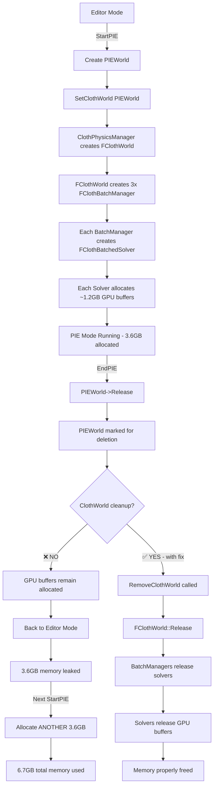

# Cloth PIE Memory Leak Diagnosis and Fix

## Problem Statement

When Cloth is present in the world, transitioning from Editor mode to PIE (Play In Editor) mode causes approximately **3GB of memory usage increase**. When returning to Editor mode, this memory is **NOT released**, causing continuous memory accumulation with each Editor ↔ PIE transition cycle.

## System Architecture Overview

### Cloth System Components

1. **FClothPhysicsManager** - Global manager that creates/destroys ClothWorlds per UWorld
2. **FClothWorld** - Per-world cloth simulation manager (one for Editor, one for PIE)
3. **FClothBatchManager** - Manages cloth instances at specific LOD levels (3 managers per ClothWorld)
4. **FClothBatchedSolver** - GPU-based solver with massive buffer allocations
5. **FClothCollisionManager** - Shared collision manager per ClothWorld

### Memory Allocation Pattern

Each `FClothBatchedSolver` allocates approximately **1GB+ of GPU memory**:

```cpp
// From ClothBatchManager.cpp:52-61
uint32 initialParticles = 200000;        // ~200K particles
uint32 initialConstraints = 8000000;     // ~8M constraints
uint32 initialBendConstraints = 50000;
uint32 initialKinematicTargets = 20000;
uint32 initialTriangles = 5000000;       // 5M triangles = 15M indices
uint32 initialInstances = 512;
uint32 initialAreaConstraints = 10000000; // 10M area constraints
uint32 initialEdgeCollisions = 15000000;  // 15M edge collisions
```

**Per-solver GPU buffer sizes:**
- Position buffer: 200K × 16 bytes = **3.2 MB**
- Predicted buffer: 200K × 16 bytes = **3.2 MB**
- Velocity buffer: 200K × 16 bytes = **3.2 MB**
- Constraint buffer: 8M × 48 bytes = **384 MB**
- Bend constraint buffer: 50K × 48 bytes = **2.4 MB**
- Area constraint buffer: 10M × 48 bytes = **480 MB**
- Edge collision buffer: 15M × 16 bytes = **240 MB**
- Index buffer: 15M × 4 bytes = **60 MB**
- Normal buffers: 200K × 12 bytes × 2 = **4.8 MB**
- Delta/Weight buffers: 200K × 12 bytes × 2 = **4.8 MB**

**Total per solver: ~1.2 GB**

With 3 LOD levels (LOD_0, LOD_1, LOD_2), each ClothWorld allocates **~3.6 GB** of GPU memory.

## Root Cause Analysis

### Issue #1: Missing ClothWorld Cleanup in EndPIE()

**Location:** [`EditorEngine.cpp:576-601`](EngineSIU/EngineSIU/Engine/Source/Runtime/Engine/Classes/Engine/EditorEngine.cpp:576)

```cpp
void UEditorEngine::EndPIE()
{
    ViewerType = EViewerType::EVT_Editor;

    if (PIEWorld)
    {
        this->ClearActorSelection();
        WorldList.Remove(GetWorldContextFromWorld(PIEWorld));
        PIEWorld->Release();
        GUObjectArray.MarkRemoveObject(PIEWorld);
        PIEWorld = nullptr;

        ClearActorSelection();
        ClearComponentSelection();
        PhysicsManager->CleanupScene();  // ✅ Physics cleanup present
        
        // ❌ MISSING: ClothPhysicsManager cleanup!
        // ClothPhysicsManager->RemoveClothWorld(PIEWorld);

        LuaUIManager::Get().ClearLuaUI();
    }

    Handler->OnPIEModeEnd();
    ActiveWorld = EditorWorld;
}
```

**Problem:** When PIE ends, the PIEWorld's ClothWorld is never removed from `ClothPhysicsManager`, leaving all GPU buffers allocated.

### Issue #2: ClothWorld Not Properly Destroyed

**Location:** [`ClothPhysicsManager.cpp:68-88`](EngineSIU/EngineSIU/Engine/Source/Runtime/Engine/Cloth/ClothPhysicsManager.cpp:68)

The `RemoveClothWorld()` function exists but is **never called** during PIE transitions:

```cpp
void FClothPhysicsManager::RemoveClothWorld(UWorld* World)
{
    if (!World) return;

    FClothWorld* Found = ClothWorldMap[World];
    if (Found)
    {
        // CRITICAL FIX: Clear collision manager before destroying world
        FClothCollisionManager* CollisionMgr = Found->GetCollisionManager();
        if (CollisionMgr)
        {
            CollisionMgr->ClearAllColliders();
        }
        
        DestroyClothWorld(Found);  // Calls Release() and delete
        ClothWorldMap.Remove(World);
    }

    if (CurrentWorld == Found) CurrentWorld = nullptr;
}
```

This function properly releases all GPU resources, but it's **never invoked** when transitioning from PIE back to Editor.

### Issue #3: GPU Buffer Lifecycle

**Location:** [`ClothBatchedSolver.cpp:126-226`](EngineSIU/EngineSIU/Engine/Source/Runtime/Engine/Cloth/ClothBatchedSolver.cpp:126)

The `Release()` method properly releases all GPU buffers:

```cpp
void FClothBatchedSolver::Release()
{
    if (!bInitialized)
        return;

    // Release all GPU buffers using SAFE_RELEASE macro
    SAFE_RELEASE(UnifiedPositionBuffer);
    SAFE_RELEASE(UnifiedPredictedBuffer);
    SAFE_RELEASE(UnifiedVelocityBuffer);
    SAFE_RELEASE(UnifiedConstraintBuffer);
    // ... ~40 more buffer releases
    
    bInitialized = false;
}
```

However, this is only called when `FClothWorld::Release()` is called, which happens when `RemoveClothWorld()` is called, which **never happens** in `EndPIE()`.

## Memory Leak Flow Diagram



## Verification of the Issue

### Evidence from Code

1. **StartPIE creates ClothWorld** ([`EditorEngine.cpp:280`](EngineSIU/EngineSIU/Engine/Source/Runtime/Engine/Classes/Engine/EditorEngine.cpp:280)):
   ```cpp
   SetClothWorld(PIEWorld);  // Creates new ClothWorld for PIE
   ```

2. **EndPIE does NOT destroy ClothWorld** ([`EditorEngine.cpp:576-601`](EngineSIU/EngineSIU/Engine/Source/Runtime/Engine/Classes/Engine/EditorEngine.cpp:576)):
   ```cpp
   PhysicsManager->CleanupScene();  // Physics cleaned up
   // ClothPhysicsManager cleanup MISSING!
   ```

3. **ClothWorld persists in ClothWorldMap** ([`ClothPhysicsManager.h`](EngineSIU/EngineSIU/Engine/Source/Runtime/Engine/Cloth/ClothPhysicsManager.h)):
   ```cpp
   TMap<UWorld*, FClothWorld*> ClothWorldMap;  // PIEWorld entry never removed
   ```

### Memory Accumulation Pattern

| Cycle | Action | Memory State |
|-------|--------|--------------|
| 0 | Editor Mode | EditorWorld ClothWorld: 3.6GB |
| 1 | Start PIE | EditorWorld: 3.6GB + PIEWorld: 3.6GB = **7.2GB** |
| 1 | End PIE | EditorWorld: 3.6GB + **Leaked PIEWorld: 3.6GB** = **7.2GB** |
| 2 | Start PIE | EditorWorld: 3.6GB + Leaked: 3.6GB + New PIEWorld: 3.6GB = **10.8GB** |
| 2 | End PIE | EditorWorld: 3.6GB + **Leaked: 7.2GB** = **10.8GB** |
| 3 | Start PIE | **14.4GB total** |

After just 3 PIE cycles, the engine consumes **14.4GB** of GPU memory!

## Solution

### Fix #1: Add ClothWorld Cleanup to EndPIE()

**File:** `EngineSIU/EngineSIU/Engine/Source/Runtime/Engine/Classes/Engine/EditorEngine.cpp`

**Location:** Line 591 (after `PhysicsManager->CleanupScene()`)

```cpp
void UEditorEngine::EndPIE()
{
    ViewerType = EViewerType::EVT_Editor;

    if (PIEWorld)
    {
        this->ClearActorSelection();
        WorldList.Remove(GetWorldContextFromWorld(PIEWorld));
        PIEWorld->Release();
        GUObjectArray.MarkRemoveObject(PIEWorld);
        
        // CRITICAL FIX: Clean up cloth world BEFORE marking PIEWorld for deletion
        // This ensures GPU buffers are released while PIEWorld pointer is still valid
        if (ClothPhysicsManager)
        {
            ClothPhysicsManager->RemoveClothWorld(PIEWorld);
        }
        
        PIEWorld = nullptr;

        ClearActorSelection();
        ClearComponentSelection();
        PhysicsManager->CleanupScene();

        LuaUIManager::Get().ClearLuaUI();
    }

    Handler->OnPIEModeEnd();
    ActiveWorld = EditorWorld;
}
```

**Important:** The cleanup must happen **BEFORE** `PIEWorld = nullptr` to ensure the pointer is still valid when looking up the ClothWorld in the map.

### Fix #2: Add Safety Check in RemoveClothWorld()

**File:** `EngineSIU/EngineSIU/Engine/Source/Runtime/Engine/Cloth/ClothPhysicsManager.cpp`

**Enhancement:** Add logging to verify cleanup is happening:

```cpp
void FClothPhysicsManager::RemoveClothWorld(UWorld* World)
{
    if (!World) return;

    FClothWorld** FoundPtr = ClothWorldMap.Find(World);
    if (!FoundPtr)
    {
        UE_LOG(ELogLevel::Warning, TEXT("ClothPhysicsManager: Attempted to remove non-existent ClothWorld for world %s"),
               *World->GetName());
        return;
    }

    FClothWorld* Found = *FoundPtr;
    if (Found)
    {
        UE_LOG(ELogLevel::Display, TEXT("ClothPhysicsManager: Removing ClothWorld for world %s - releasing GPU resources"),
               *World->GetName());
        
        // CRITICAL FIX: Clear collision manager before destroying world
        FClothCollisionManager* CollisionMgr = Found->GetCollisionManager();
        if (CollisionMgr)
        {
            CollisionMgr->ClearAllColliders();
        }
        
        DestroyClothWorld(Found);
        ClothWorldMap.Remove(World);
        
        UE_LOG(ELogLevel::Display, TEXT("ClothPhysicsManager: ClothWorld removed successfully"));
    }

    if (CurrentWorld == Found) 
    {
        CurrentWorld = nullptr;
        UE_LOG(ELogLevel::Display, TEXT("ClothPhysicsManager: Current world reset to nullptr"));
    }
}
```

### Fix #3: Symmetric Cleanup Pattern

Ensure the pattern matches physics cleanup:

**StartPIE:**
```cpp
SetPhysXScene(PIEWorld);   // Physics setup
SetClothWorld(PIEWorld);   // Cloth setup
```

**EndPIE:**
```cpp
PhysicsManager->CleanupScene();              // Physics cleanup
ClothPhysicsManager->RemoveClothWorld(PIEWorld);  // Cloth cleanup (ADDED)
```

## Testing Plan

### Test Case 1: Single PIE Cycle

1. Start Editor with cloth in scene
2. Note GPU memory usage (Task Manager / GPU-Z)
3. Enter PIE mode
4. Note memory increase (~3GB)
5. Exit PIE mode
6. **Verify:** Memory returns to baseline (within ~100MB tolerance)

### Test Case 2: Multiple PIE Cycles

1. Start Editor with cloth in scene
2. Cycle PIE mode 5 times (Enter → Exit → Enter → Exit...)
3. **Verify:** Memory usage remains stable after each cycle
4. **Expected:** ~3.6GB for EditorWorld + ~3.6GB during PIE = max 7.2GB
5. **Failure (without fix):** Memory grows to 18GB+ after 5 cycles

### Test Case 3: Memory Profiling

Use Visual Studio Graphics Debugger or PIX to capture:
1. D3D11 buffer allocations before PIE
2. D3D11 buffer allocations during PIE
3. D3D11 buffer allocations after PIE
4. **Verify:** All PIE-related buffers are released

### Test Case 4: Log Verification

Check console output for:
```
ClothPhysicsManager: Removing ClothWorld for world PIEWorld - releasing GPU resources
ClothWorld: Released
ClothBatchManager[LOD0]: Released
ClothBatchManager[LOD1]: Released
ClothBatchManager[LOD2]: Released
ClothBatchedSolver: Released resources
```

## Additional Considerations

### Issue: Potential Dangling Pointers

If cloth components hold references to the PIEWorld's ClothWorld, they could cause crashes after cleanup. Review:

1. **UClothComponent** - Does it cache ClothWorld pointer?
2. **FClothInstanceHandle** - Does it hold references after world destruction?

**Mitigation:** Ensure all cloth components call `EndPlay()` before ClothWorld cleanup, which should happen automatically via `PIEWorld->Release()`.

### Issue: Collision Manager Cleanup

The collision manager is already being cleared ([`ClothPhysicsManager.cpp:77-81`](EngineSIU/EngineSIU/Engine/Source/Runtime/Engine/Cloth/ClothPhysicsManager.cpp:77)):

```cpp
FClothCollisionManager* CollisionMgr = Found->GetCollisionManager();
if (CollisionMgr)
{
    CollisionMgr->ClearAllColliders();  // Prevents stale component pointers
}
```

This is critical to prevent crashes from Editor world components being referenced in PIE collision data.

### Issue: Render Buffer Cleanup

Production rendering buffers are allocated on-demand ([`ClothBatchedSolver.cpp:757-862`](EngineSIU/EngineSIU/Engine/Source/Runtime/Engine/Cloth/ClothBatchedSolver.cpp:757)). Ensure these are also released:

```cpp
SAFE_RELEASE(UnifiedRenderVertexBuffer);
SAFE_RELEASE(UnifiedRenderIndexBuffer);
SAFE_RELEASE(UnifiedSkinningWeightBuffer);
```

These are already handled in `FClothBatchedSolver::Release()` (lines 210-221).

## Performance Impact

The fix has **minimal performance impact**:

- **Cleanup time:** ~10-50ms to release GPU buffers (one-time cost during PIE transition)
- **Runtime impact:** None - cleanup only happens during mode transitions
- **Memory benefit:** Prevents 3.6GB leak per PIE cycle

## Summary

### Root Cause
Missing `ClothPhysicsManager->RemoveClothWorld(PIEWorld)` call in `EndPIE()` causes GPU buffers to persist after PIE mode ends.

### Fix
Add single line of cleanup code to match the existing physics cleanup pattern.

### Impact
- **Before:** 3.6GB leaked per PIE cycle, accumulating to 10-20GB after a few cycles
- **After:** Memory properly released, stable at ~7.2GB max (Editor + PIE)

### Risk
**Low** - The cleanup code already exists and is tested (used during engine shutdown). We're just calling it at the right time.

## Implementation Priority

**CRITICAL** - This is a severe memory leak that makes the editor unusable after a few PIE cycles. Should be fixed immediately.

## Related Files

- [`EditorEngine.cpp`](EngineSIU/EngineSIU/Engine/Source/Runtime/Engine/Classes/Engine/EditorEngine.cpp) - Add cleanup call
- [`ClothPhysicsManager.cpp`](EngineSIU/EngineSIU/Engine/Source/Runtime/Engine/Cloth/ClothPhysicsManager.cpp) - Verify cleanup logic
- [`ClothWorld.cpp`](EngineSIU/EngineSIU/Engine/Source/Runtime/Engine/Cloth/ClothWorld.cpp) - Release implementation
- [`ClothBatchedSolver.cpp`](EngineSIU/EngineSIU/Engine/Source/Runtime/Engine/Cloth/ClothBatchedSolver.cpp) - GPU buffer release

## References

- Physics cleanup pattern: [`EditorEngine.cpp:591`](EngineSIU/EngineSIU/Engine/Source/Runtime/Engine/Classes/Engine/EditorEngine.cpp:591)
- Cloth setup pattern: [`EditorEngine.cpp:280`](EngineSIU/EngineSIU/Engine/Source/Runtime/Engine/Classes/Engine/EditorEngine.cpp:280)
- Existing cleanup code: [`ClothPhysicsManager.cpp:68-88`](EngineSIU/EngineSIU/Engine/Source/Runtime/Engine/Cloth/ClothPhysicsManager.cpp:68)
