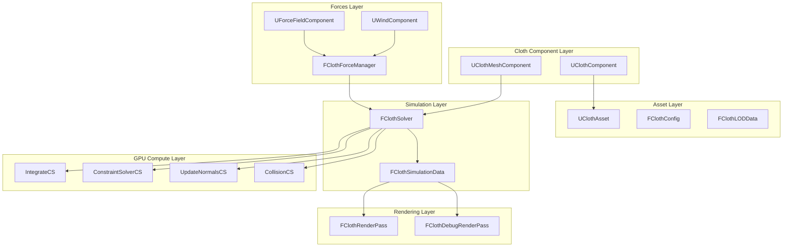
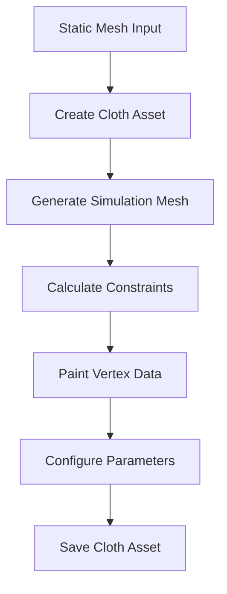
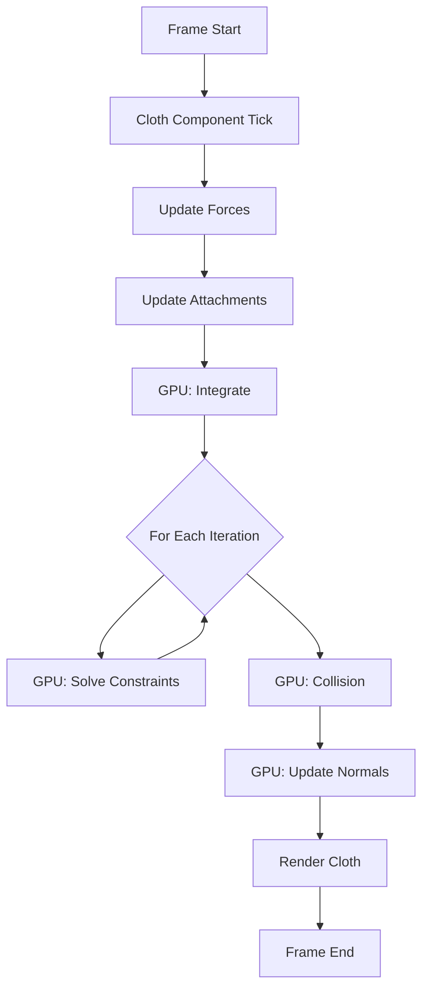

# Cloth Simulation System - Architecture Design

## Executive Summary

This document outlines the architecture for implementing a GPU-based cloth simulation system in the EngineSIU DirectX 11 engine. The system will use Position-Based Dynamics (PBD) or XPBD for physics simulation, running entirely on GPU compute shaders.

---

## 1. System Overview

### 1.1 Architecture Diagram



### 1.2 Key Design Principles

1. **GPU-First**: All simulation runs on GPU compute shaders
2. **Incremental Integration**: Follows existing engine patterns (RenderPass, Component hierarchy)
3. **Data-Oriented**: Structured buffers for efficient GPU access
4. **Modular**: Clear separation between simulation, rendering, and authoring
5. **Extensible**: Easy to add new constraint types and force fields

---

## 2. Core Components

### 2.1 Cloth Asset System

#### 2.1.1 UClothAsset (New Asset Type)

**Location**: `EngineSIU/Engine/Source/Runtime/Engine/Classes/Engine/ClothAsset.h`

**Purpose**: Stores cloth mesh data, simulation parameters, and LOD configurations

**Key Members**:
```cpp
class UClothAsset : public UObject
{
    DECLARE_CLASS(UClothAsset, UObject)
    
public:
    // Asset Data
    TArray<FClothLODData> LODData;
    FClothConfig ClothConfig;
    
    // Source mesh reference
    UStaticMesh* SourceMesh;
    
    // Physics data
    TArray<FVector> RestPositions;
    TArray<uint32> Indices;
    TArray<float> InvMasses;
    
    // Constraints
    TArray<FClothConstraint> DistanceConstraints;
    TArray<FClothConstraint> BendConstraints;
    TArray<uint32> AttachmentIndices;
    
    // Per-vertex painting data
    TArray<FClothVertexPaintData> VertexPaintData;
    
    // Serialization
    virtual void SerializeAsset(FArchive& Ar) override;
};
```

#### 2.1.2 FClothLODData

**Purpose**: Stores LOD-specific mesh data

```cpp
struct FClothLODData
{
    // Simulation mesh (coarse)
    TArray<FVector> SimPositions;
    TArray<uint32> SimIndices;
    
    // Render mesh (fine detail)
    TArray<FVector> RenderPositions;
    TArray<FVector> RenderNormals;
    TArray<FVector2D> RenderUVs;
    TArray<uint32> RenderIndices;
    
    // Mapping: render vertex -> sim vertices for skinning
    TArray<FClothVertexBinding> RenderToSimMapping;
    
    float ScreenSize;  // LOD switch distance
};
```

#### 2.1.3 FClothConfig

**Purpose**: Simulation parameters

```cpp
struct FClothConfig
{
    // Global simulation settings
    float Mass = 1.0f;
    float Damping = 0.05f;
    float Friction = 0.1f;
    
    // Constraint stiffness (0-1)
    float StretchStiffness = 0.9f;
    float BendStiffness = 0.1f;
    float AttachStiffness = 1.0f;
    
    // Solver settings
    int32 NumIterations = 5;
    float TimeStep = 0.016f;  // Fixed 60fps or variable
    bool bUseXPBD = false;    // Use XPBD instead of PBD
    
    // Wind and drag
    float AirDrag = 0.01f;
    float WindStrength = 1.0f;
    
    // Collision
    float CollisionThickness = 0.01f;
    bool bEnableSelfCollision = false;
};
```

#### 2.1.4 FClothConstraint

**Purpose**: Generic constraint structure

```cpp
struct FClothConstraint
{
    uint32 ParticleA;
    uint32 ParticleB;
    float RestLength;      // For distance constraints
    float Stiffness;       // Per-constraint stiffness
};
```

#### 2.1.5 FClothVertexPaintData

**Purpose**: Per-vertex authoring parameters

```cpp
struct FClothVertexPaintData
{
    float MaxDistance = 1.0f;     // How far vertex can move from rest
    float BackstopDistance = 0.0f; // Collision backstop
    float BackstopRadius = 0.0f;
    float Stiffness = 1.0f;        // Per-vertex stiffness multiplier
    bool bFixed = false;           // Is vertex pinned?
};
```

---

### 2.2 Component System

#### 2.2.1 UClothComponent (Base Component)

**Location**: `EngineSIU/Engine/Source/Runtime/Engine/Classes/Components/ClothComponent.h`

**Purpose**: Base component for cloth simulation, handles simulation updates

**Inheritance**: `UActorComponent`

```cpp
class UClothComponent : public UActorComponent
{
    DECLARE_CLASS(UClothComponent, UActorComponent)
    
public:
    virtual void InitializeComponent() override;
    virtual void TickComponent(float DeltaTime) override;
    virtual void BeginPlay() override;
    
    // Cloth asset
    void SetClothAsset(UClothAsset* InAsset);
    UClothAsset* GetClothAsset() const { return ClothAsset; }
    
    // Simulation control
    void StartSimulation();
    void StopSimulation();
    void ResetSimulation();
    bool IsSimulating() const { return bIsSimulating; }
    
    // External forces
    void AddForce(const FVector& Force);
    void AddImpulse(const FVector& Impulse);
    void SetWind(const FVector& WindVelocity);
    
    // Attachment
    void AttachToComponent(USceneComponent* Parent, FName SocketName);
    void AttachToSkeletalMesh(USkeletalMeshComponent* SkelMesh, const TArray<FName>& BoneNames);
    
protected:
    UClothAsset* ClothAsset;
    FClothSolver* Solver;
    bool bIsSimulating;
    
    // Cached attachment data
    TArray<FClothAttachmentData> Attachments;
};
```

#### 2.2.2 UClothMeshComponent (Renderable Cloth)

**Location**: `EngineSIU/Engine/Source/Runtime/Engine/Classes/Components/ClothMeshComponent.h`

**Purpose**: Renderable cloth component, extends UMeshComponent

**Inheritance**: `UClothComponent` + rendering interface

```cpp
class UClothMeshComponent : public UClothComponent, public IMeshRenderInterface
{
    DECLARE_CLASS(UClothMeshComponent, UClothComponent)
    
public:
    virtual void InitializeComponent() override;
    virtual void TickComponent(float DeltaTime) override;
    
    // Rendering interface
    virtual void GetRenderData(FClothRenderData& OutData) const;
    virtual uint32 GetNumMaterials() const override;
    virtual UMaterial* GetMaterial(uint32 Index) const override;
    
    // Debug visualization
    void SetDebugDrawMode(EClothDebugDrawMode Mode);
    
protected:
    TArray<UMaterial*> Materials;
    EClothDebugDrawMode DebugDrawMode;
};
```

---

### 2.3 Simulation Core

#### 2.3.1 FClothSolver (GPU Solver Manager)

**Location**: `EngineSIU/Engine/Source/Runtime/Engine/Cloth/ClothSolver.h`

**Purpose**: Manages GPU compute shader execution for cloth simulation

```cpp
class FClothSolver
{
public:
    FClothSolver(FGraphicsDevice* InGraphics, FDXDBufferManager* InBufferManager);
    ~FClothSolver();
    
    // Initialization
    void Initialize(UClothAsset* InAsset, const FClothConfig& InConfig);
    void Release();
    
    // Simulation step
    void Simulate(float DeltaTime);
    
    // Data access
    const FClothSimulationData& GetSimulationData() const { return SimData; }
    ID3D11ShaderResourceView* GetPositionBufferSRV() const;
    ID3D11ShaderResourceView* GetNormalBufferSRV() const;
    
    // External forces
    void SetGravity(const FVector& Gravity);
    void SetWind(const FVector& WindVelocity);
    void AddExternalForce(const FVector& Force);
    
    // Constraints
    void UpdateAttachmentConstraints(const TArray<FClothAttachmentData>& Attachments);
    void SetCollisionBodies(const TArray<FClothCollisionPrimitive>& Primitives);
    
private:
    void CreateGPUResources();
    void UpdateConstantBuffers();
    
    // Compute shader dispatch
    void DispatchIntegration(float DeltaTime);
    void DispatchConstraintSolver(int32 Iteration);
    void DispatchCollision();
    void DispatchNormalUpdate();
    
    FGraphicsDevice* Graphics;
    FDXDBufferManager* BufferManager;
    
    // GPU Resources
    ID3D11ComputeShader* IntegrateCS;
    ID3D11ComputeShader* ConstraintSolverCS;
    ID3D11ComputeShader* CollisionCS;
    ID3D11ComputeShader* UpdateNormalsCS;
    
    // Simulation buffers (ping-pong)
    ID3D11Buffer* PositionBuffer[2];
    ID3D11Buffer* VelocityBuffer;
    ID3D11Buffer* InvMassBuffer;
    ID3D11Buffer* ConstraintBuffer;
    ID3D11Buffer* NormalBuffer;
    
    // UAVs and SRVs
    ID3D11UnorderedAccessView* PositionUAV[2];
    ID3D11UnorderedAccessView* VelocityUAV;
    ID3D11UnorderedAccessView* NormalUAV;
    ID3D11ShaderResourceView* PositionSRV[2];
    ID3D11ShaderResourceView* VelocitySRV;
    ID3D11ShaderResourceView* ConstraintSRV;
    ID3D11ShaderResourceView* NormalSRV;
    
    // Constant buffers
    ID3D11Buffer* ClothSimConstantBuffer;
    
    // Simulation state
    FClothSimulationData SimData;
    FClothConfig Config;
    int32 CurrentBufferIndex;
    uint32 NumParticles;
    uint32 NumConstraints;
};
```

#### 2.3.2 FClothSimulationData

**Purpose**: Runtime simulation state

```cpp
struct FClothSimulationData
{
    uint32 NumParticles;
    uint32 NumConstraints;
    
    // CPU-side copies (for debugging)
    TArray<FVector> CurrentPositions;
    TArray<FVector> CurrentVelocities;
    
    // External forces
    FVector Gravity = FVector(0, 0, -980.0f);
    FVector Wind = FVector(0, 0, 0);
    FVector ExternalForce = FVector(0, 0, 0);
    
    // Timing
    float CurrentTime;
    float AccumulatedTime;
};
```

---

### 2.4 GPU Compute Shaders

#### 2.4.1 Shader File Organization

**Location**: `EngineSIU/Shaders/Cloth/`

Files to create:
- `ClothCommon.hlsli` - Shared structures and helper functions
- `ClothIntegrate.hlsl` - Integration compute shader
- `ClothConstraintSolver.hlsl` - Constraint solver compute shader
- `ClothCollision.hlsl` - Collision detection/response compute shader
- `ClothUpdateNormals.hlsl` - Normal recalculation compute shader

#### 2.4.2 Shared Data Structures (ClothCommon.hlsli)

```hlsl
// Constant buffer for cloth simulation
cbuffer ClothSimConstants : register(b0)
{
    uint NumParticles;
    uint NumConstraints;
    float DeltaTime;
    float Damping;
    
    float3 Gravity;
    float StretchStiffness;
    
    float3 Wind;
    float BendStiffness;
    
    float AirDrag;
    uint NumIterations;
    uint CurrentIteration;
    uint UseXPBD;
    
    float4x4 WorldMatrix;
};

// Particle data
struct FClothParticle
{
    float3 Position;
    float InvMass;
};

struct FClothVelocity
{
    float3 Velocity;
    float Padding;
};

// Constraint data
struct FDistanceConstraint
{
    uint ParticleA;
    uint ParticleB;
    float RestLength;
    float Stiffness;
};

struct FBendConstraint
{
    uint ParticleA;
    uint ParticleB;
    float RestAngle;
    float Stiffness;
};
```

#### 2.4.3 Integration Shader (ClothIntegrate.hlsl)

```hlsl
#include "ClothCommon.hlsli"

RWStructuredBuffer<FClothParticle> PositionBuffer : register(u0);
RWStructuredBuffer<FClothVelocity> VelocityBuffer : register(u1);

[numthreads(64, 1, 1)]
void IntegrateCS(uint3 DTid : SV_DispatchThreadID)
{
    uint idx = DTid.x;
    if (idx >= NumParticles) return;
    
    FClothParticle particle = PositionBuffer[idx];
    FClothVelocity velocity = VelocityBuffer[idx];
    
    // Skip fixed particles
    if (particle.InvMass == 0.0f) return;
    
    // Apply external forces
    float3 force = Gravity + Wind * AirDrag;
    float3 acceleration = force * particle.InvMass;
    
    // Semi-implicit Euler integration
    velocity.Velocity += acceleration * DeltaTime;
    velocity.Velocity *= (1.0f - Damping);
    
    // Predict position
    particle.Position += velocity.Velocity * DeltaTime;
    
    // Write back
    PositionBuffer[idx] = particle;
    VelocityBuffer[idx] = velocity;
}
```

#### 2.4.4 Constraint Solver Shader (ClothConstraintSolver.hlsl)

```hlsl
#include "ClothCommon.hlsli"

RWStructuredBuffer<FClothParticle> PositionBuffer : register(u0);
StructuredBuffer<FDistanceConstraint> ConstraintBuffer : register(t0);

[numthreads(64, 1, 1)]
void SolveDistanceConstraintsCS(uint3 DTid : SV_DispatchThreadID)
{
    uint idx = DTid.x;
    if (idx >= NumConstraints) return;
    
    FDistanceConstraint constraint = ConstraintBuffer[idx];
    
    // Read particle data
    FClothParticle pA = PositionBuffer[constraint.ParticleA];
    FClothParticle pB = PositionBuffer[constraint.ParticleB];
    
    // Calculate constraint violation
    float3 delta = pB.Position - pA.Position;
    float currentLength = length(delta);
    
    if (currentLength < 1e-6f) return;
    
    float3 dir = delta / currentLength;
    float error = currentLength - constraint.RestLength;
    
    // Calculate correction (PBD)
    float invMassSum = pA.InvMass + pB.InvMass;
    if (invMassSum < 1e-6f) return;
    
    float stiffness = constraint.Stiffness;
    if (UseXPBD)
    {
        // XPBD compliance adjustment
        float alpha = 1.0f / (stiffness * DeltaTime * DeltaTime);
        stiffness = 1.0f / (alpha + invMassSum);
    }
    
    float3 correction = dir * error * stiffness;
    
    // Apply corrections with atomic operations
    float3 correctionA = -correction * (pA.InvMass / invMassSum);
    float3 correctionB = correction * (pB.InvMass / invMassSum);
    
    // Note: In practice, need atomic operations or color-based parallel solving
    // Simplified here for clarity
    pA.Position += correctionA;
    pB.Position += correctionB;
    
    PositionBuffer[constraint.ParticleA] = pA;
    PositionBuffer[constraint.ParticleB] = pB;
}
```

#### 2.4.5 Normal Update Shader (ClothUpdateNormals.hlsl)

```hlsl
#include "ClothCommon.hlsli"

StructuredBuffer<FClothParticle> PositionBuffer : register(t0);
StructuredBuffer<uint> IndexBuffer : register(t1);
RWStructuredBuffer<float3> NormalBuffer : register(u0);

[numthreads(64, 1, 1)]
void UpdateNormalsCS(uint3 DTid : SV_DispatchThreadID)
{
    uint triIdx = DTid.x;
    uint numTriangles = NumParticles / 3; // Simplified
    
    if (triIdx >= numTriangles) return;
    
    // Get triangle indices
    uint i0 = IndexBuffer[triIdx * 3 + 0];
    uint i1 = IndexBuffer[triIdx * 3 + 1];
    uint i2 = IndexBuffer[triIdx * 3 + 2];
    
    // Get positions
    float3 p0 = PositionBuffer[i0].Position;
    float3 p1 = PositionBuffer[i1].Position;
    float3 p2 = PositionBuffer[i2].Position;
    
    // Calculate face normal
    float3 edge1 = p1 - p0;
    float3 edge2 = p2 - p0;
    float3 normal = normalize(cross(edge1, edge2));
    
    // Accumulate to vertices (atomic add needed)
    InterlockedAdd(NormalBuffer[i0], normal);
    InterlockedAdd(NormalBuffer[i1], normal);
    InterlockedAdd(NormalBuffer[i2], normal);
}
```

---

### 2.5 Force System

#### 2.5.1 FClothForceManager

**Location**: `EngineSIU/Engine/Source/Runtime/Engine/Cloth/ClothForceManager.h`

```cpp
class FClothForceManager
{
public:
    void RegisterCloth(UClothComponent* Cloth);
    void UnregisterCloth(UClothComponent* Cloth);
    
    void RegisterForceField(UForceFieldComponent* ForceField);
    void UnregisterForceField(UForceFieldComponent* ForceField);
    
    void TickForces(float DeltaTime);
    
    FVector CalculateForcesAtPosition(const FVector& Position) const;
    
private:
    TArray<UClothComponent*> ActiveCloths;
    TArray<UForceFieldComponent*> ForceFields;
};
```

#### 2.5.2 UWindComponent

**Location**: `EngineSIU/Engine/Source/Runtime/Engine/Classes/Components/WindComponent.h`

```cpp
class UWindComponent : public USceneComponent
{
    DECLARE_CLASS(UWindComponent, USceneComponent)
    
public:
    virtual void TickComponent(float DeltaTime) override;
    
    FVector GetWindVelocityAtPosition(const FVector& Position) const;
    
    // Wind parameters
    float WindStrength = 1.0f;
    FVector WindDirection = FVector(1, 0, 0);
    float Turbulence = 0.1f;
    float Speed = 1.0f;
};
```

---

### 2.6 Rendering System

#### 2.6.1 FClothRenderPass

**Location**: `EngineSIU/Engine/Source/Runtime/Renderer/ClothRenderPass.h`

```cpp
class FClothRenderPass : public FRenderPassBase
{
public:
    virtual void Initialize(FDXDBufferManager* InBufferManager, 
                          FGraphicsDevice* InGraphics, 
                          FDXDShaderManager* InShaderManager) override;
    
    virtual void PrepareRenderArr() override;
    virtual void ClearRenderArr() override;
    virtual void Render(const std::shared_ptr<FEditorViewportClient>& Viewport) override;
    
protected:
    virtual void PrepareRender(const std::shared_ptr<FEditorViewportClient>& Viewport) override;
    virtual void CleanUpRender(const std::shared_ptr<FEditorViewportClient>& Viewport) override;
    virtual void CreateResource() override;
    
private:
    TArray<UClothMeshComponent*> ClothComponents;
    
    ID3D11VertexShader* ClothVertexShader;
    ID3D11PixelShader* ClothPixelShader;
    ID3D11InputLayout* ClothInputLayout;
};
```

#### 2.6.2 FClothDebugRenderPass

**Purpose**: Debug visualization for constraints, forces, etc.

```cpp
class FClothDebugRenderPass : public FRenderPassBase
{
public:
    void SetDebugMode(EClothDebugDrawMode Mode);
    
    // Debug rendering modes
    enum class EClothDebugDrawMode
    {
        None,
        Particles,
        Constraints,
        Normals,
        Velocity,
        Forces
    };
    
private:
    void RenderParticles();
    void RenderConstraints();
    void RenderNormals();
    void RenderVelocity();
};
```

---

## 3. Attachment System

### 3.1 Skeletal Mesh Attachment

#### 3.1.1 FClothAttachmentData

```cpp
struct FClothAttachmentData
{
    uint32 ClothVertexIndex;
    
    // For skeletal mesh attachment
    FName BoneName;
    int32 BoneIndex;
    FTransform LocalOffset;
    
    // For static attachment
    FVector WorldPosition;
    
    // Constraint properties
    float Stiffness = 1.0f;
    bool bIsKinematic = true;
};
```

#### 3.1.2 Bone Attachment Process


---

## 4. Asset Pipeline

### 4.1 Cloth Asset Creation Workflow



### 4.2 FClothAssetFactory

**Location**: `EngineSIU/Engine/Source/Editor/ClothAssetEditor/ClothAssetFactory.h`

```cpp
class FClothAssetFactory
{
public:
    static UClothAsset* CreateFromStaticMesh(UStaticMesh* SourceMesh, 
                                             const FClothAssetCreationParams& Params);
    
    static void GenerateSimulationMesh(UClothAsset* Asset, int32 TargetTriangleCount);
    static void GenerateConstraints(UClothAsset* Asset);
    static void CalculateRenderToSimMapping(UClothAsset* Asset);
};

struct FClothAssetCreationParams
{
    int32 SimulationLOD = 0;
    int32 TargetSimTriangles = 500;
    bool bGenerateDistanceConstraints = true;
    bool bGenerateBendConstraints = true;
    float MaxDistance = 100.0f;
};
```

---

## 5. Implementation Phases

### Phase 1: Core GPU Solver
**Files to Create**:
- `Engine/Source/Runtime/Engine/Cloth/ClothSolver.h/.cpp`
- `Engine/Source/Runtime/Engine/Cloth/ClothSimulationData.h`
- `Shaders/Cloth/ClothCommon.hlsli`
- `Shaders/Cloth/ClothIntegrate.hlsl`
- `Shaders/Cloth/ClothConstraintSolver.hlsl`
- `Shaders/Cloth/ClothUpdateNormals.hlsl`

**Integration Points**:
- Add to [`FRenderer`](EngineSIU/Engine/Source/Runtime/Renderer/Renderer.h) initialization
- Create constant buffer structures in [`ShaderConstants.h`](EngineSIU/Engine/Source/Runtime/Renderer/ShaderConstants.h)

### Phase 2: Cloth Component & Asset
**Files to Create**:
- `Engine/Source/Runtime/Engine/Classes/Components/ClothComponent.h/.cpp`
- `Engine/Source/Runtime/Engine/Classes/Components/ClothMeshComponent.h/.cpp`
- `Engine/Source/Runtime/Engine/Classes/Engine/ClothAsset.h/.cpp`

**Integration Points**:
- Register with component system
- Add to actor serialization

### Phase 3: Rendering
**Files to Create**:
- `Engine/Source/Runtime/Renderer/ClothRenderPass.h/.cpp`
- `Engine/Source/Runtime/Renderer/ClothDebugRenderPass.h/.cpp`
- `Shaders/ClothVertexShader.hlsl`
- `Shaders/ClothPixelShader.hlsl`

**Integration Points**:
- Add to [`FRenderer::Render()`](EngineSIU/Engine/Source/Runtime/Renderer/Renderer.cpp) pipeline
- Follow pattern from [`FTileLightCullingPass`](EngineSIU/Engine/Source/Runtime/Renderer/TileLightCullingPass.h)

### Phase 4: Force System
**Files to Create**:
- `Engine/Source/Runtime/Engine/Cloth/ClothForceManager.h/.cpp`
- `Engine/Source/Runtime/Engine/Classes/Components/WindComponent.h/.cpp`
- `Engine/Source/Runtime/Engine/Classes/Components/ForceFieldComponent.h/.cpp`

### Phase 5: Asset Pipeline
**Files to Create**:
- `Engine/Source/Editor/ClothAssetEditor/ClothAssetFactory.h/.cpp`
- `Engine/Source/Editor/ClothAssetEditor/ClothPainter.h/.cpp`

### Phase 6: Skeletal Attachment
**Files to Modify**:
- `Engine/Source/Runtime/Engine/Classes/Components/SkeletalMeshComponent.h/.cpp`
- Add cloth attachment methods

**Files to Create**:
- `Engine/Source/Runtime/Engine/Cloth/ClothAttachment.h/.cpp`
- `Shaders/Cloth/ClothSkinnedAttachment.hlsl`

### Phase 7: Collision
**Files to Create**:
- `Shaders/Cloth/ClothCollision.hlsl`
- `Engine/Source/Runtime/Engine/Cloth/ClothCollision.h/.cpp`

**Integration Points**:
- Interface with [`FPhysicsManager`](EngineSIU/Engine/Source/Runtime/Physics/PhysicsManager.h)

---

## 6. Data Flow Architecture

### 6.1 Per-Frame Update Pipeline



### 6.2 GPU Buffer Layout

**Position Buffer** (ping-pong):
```
Buffer 0: Current positions (read/write)
Buffer 1: Previous positions (for velocity calculation)
```

**Structured Buffers**:
- `PositionBuffer`: `float4[NumParticles]` (xyz = position, w = invMass)
- `VelocityBuffer`: `float4[NumParticles]` (xyz = velocity, w = padding)
- `ConstraintBuffer`: `FDistanceConstraint[NumConstraints]`
- `NormalBuffer`: `float3[NumParticles]`
- `IndexBuffer`: `uint[NumIndices]`

---

## 7. Memory and Performance Considerations

### 7.1 Compute Shader Thread Groups
- Use `[numthreads(64, 1, 1)]` for most shaders
- Dispatch based on particle count: `(NumParticles + 63) / 64`

### 7.2 Constraint Solving Strategy
**Option A: Parallel Jacobi** (simpler, less accurate)
- All constraints solved in parallel
- May require more iterations

**Option B: Graph Coloring** (better quality)
- Pre-process constraints into independent sets (colors)
- Solve each color in parallel, sequentially across colors
- Better convergence

**Recommendation**: Start with Option A, upgrade to Option B if needed

### 7.3 Collision Detection
- Use spatial hashing on GPU for self-collision
- Interface with PhysX for world collision (copy collision primitives to GPU)

---

## 8. Debug Tools

### 8.1 Visualization Modes
1. **Particle View**: Show simulation particles as points
2. **Constraint View**: Draw lines for distance constraints
3. **Normal View**: Display vertex normals as lines
4. **Velocity View**: Color-code by velocity magnitude
5. **Force View**: Show external force vectors
6. **Attachment View**: Highlight attached vertices

### 8.2 Performance Profiling
- Use GPU timestamps (similar to [`FGPUTimingManager`](EngineSIU/Engine/Source/Runtime/Renderer/Renderer.h))
- Track timing for each compute shader dispatch

---

## 9. Configuration Files

### 9.1 Default Cloth Material
**Location**: `EngineSIU/Contents/ClothMaterials/DefaultCloth.material`

Properties:
- Two-sided rendering
- Normal mapping support
- Wind animation parameters

### 9.2 Example Cloth Asset
**Location**: `EngineSIU/Contents/ClothAssets/CapeLOD0.clothasset`

---

## 10. Testing Strategy

### 10.1 Unit Tests
1. Constraint generation correctness
2. GPU buffer allocation/deallocation
3. Attachment transformation calculations

### 10.2 Integration Tests
1. Simple cloth plane falling under gravity
2. Cloth attached to moving skeletal mesh
3. Wind affecting multiple cloth instances
4. LOD switching during runtime

### 10.3 Performance Benchmarks
- Target: 1000 particles at 60fps
- Measure GPU time for each shader pass

---

## 11. Future Extensions

### 11.1 Tearing System
- Dynamic constraint removal based on stress
- Vertex duplication at tear points
- Remeshing for clean topology

### 11.2 Two-Way Interaction
- Cloth forces affecting character motion
- Collision impulses back to physics bodies

### 11.3 Advanced Wind
- Turbulence noise (3D Perlin)
- Vortex confinement
- Wind zones with falloff

---

## 12. Risk Mitigation

### 12.1 Technical Risks
| Risk | Mitigation |
|------|------------|
| GPU memory limits | Implement aggressive LOD, streaming |
| Constraint instability | Add max correction clamping, XPBD option |
| Performance issues | Profiling, async compute, reduced particle counts |
| Integration complexity | Incremental phases, extensive testing |

### 12.2 Compatibility Concerns
- DirectX 11 compute shader model 5.0 required
- Minimum GPU: DirectX 11 capable with compute support
- Fallback: CPU simulation for low-end hardware (future)

---

## 13. References

### 13.1 Academic Papers
- "Position Based Dynamics" - Müller et al. 2007
- "XPBD: Position-Based Simulation of Compliant Constrained Dynamics" - Macklin et al. 2016
- "Unified Particle Physics for Real-Time Applications" - Macklin & Müller 2013

### 13.2 Engine References
- Unreal Engine Chaos Cloth Documentation
- Unity Cloth System
- NVIDIA FleX

---

## Appendix A: File Structure

```
EngineSIU/
├── Engine/Source/Runtime/
│   ├── Engine/
│   │   ├── Cloth/
│   │   │   ├── ClothSolver.h/.cpp
│   │   │   ├── ClothSimulationData.h
│   │   │   ├── ClothForceManager.h/.cpp
│   │   │   ├── ClothAttachment.h/.cpp
│   │   │   └── ClothCollision.h/.cpp
│   │   └── Classes/
│   │       ├── Components/
│   │       │   ├── ClothComponent.h/.cpp
│   │       │   ├── ClothMeshComponent.h/.cpp
│   │       │   ├── WindComponent.h/.cpp
│   │       │   └── ForceFieldComponent.h/.cpp
│   │       └── Engine/
│   │           └── ClothAsset.h/.cpp
│   ├── Renderer/
│   │   ├── ClothRenderPass.h/.cpp
│   │   └── ClothDebugRenderPass.h/.cpp
│   └── Editor/
│       └── ClothAssetEditor/
│           ├── ClothAssetFactory.h/.cpp
│           └── ClothPainter.h/.cpp
├── Shaders/
│   └── Cloth/
│       ├── ClothCommon.hlsli
│       ├── ClothIntegrate.hlsl
│       ├── ClothConstraintSolver.hlsl
│       ├── ClothCollision.hlsl
│       ├── ClothUpdateNormals.hlsl
│       ├── ClothVertexShader.hlsl
│       └── ClothPixelShader.hlsl
└── Contents/
    ├── ClothAssets/
    └── ClothMaterials/
```

---

## Appendix B: Constant Buffer Structures

```cpp
// Add to ShaderConstants.h

struct FClothSimConstants
{
    alignas(16) UINT NumParticles;
    UINT NumConstraints;
    float DeltaTime;
    float Damping;
    
    alignas(16) FVector Gravity;
    float StretchStiffness;
    
    alignas(16) FVector Wind;
    float BendStiffness;
    
    alignas(16) float AirDrag;
    UINT NumIterations;
    UINT CurrentIteration;
    UINT UseXPBD;
    
    alignas(16) FMatrix WorldMatrix;
};
```

---

**Document Version**: 1.0  
**Last Updated**: 2026-01-07  
**Status**: Architecture Design - Awaiting Approval
