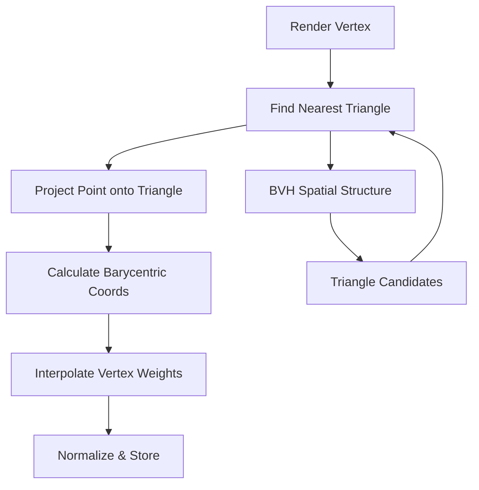

# Cloth Skinning Weight Generation: Inverse Distance to Barycentric Coordinate Migration Plan

## Executive Summary

This document outlines the comprehensive migration plan for transitioning the cloth skinning weight generation system from **inverse distance weighting** to **barycentric coordinate-based weighting**. This migration will improve the quality and accuracy of cloth deformation by using triangle-based projection and barycentric interpolation instead of simple distance-based weighting.

## Current System Analysis

### Existing Implementation Overview

**Files Analyzed:**
- [`ClothSkinningWeightGenerator.h`](../EngineSIU/EngineSIU/Engine/Source/Runtime/Engine/Cloth/ClothSkinningWeightGenerator.h)
- [`ClothSkinningWeightGenerator.cpp`](../EngineSIU/EngineSIU/Engine/Source/Runtime/Engine/Cloth/ClothSkinningWeightGenerator.cpp)
- [`ClothAssetGenerator.h`](../EngineSIU/EngineSIU/Engine/Source/Runtime/Engine/Cloth/ClothAssetGenerator.h)
- [`ClothAssetGenerator.cpp`](../EngineSIU/EngineSIU/Engine/Source/Runtime/Engine/Cloth/ClothAssetGenerator.cpp)
- [`ClothProductionVertexShader.hlsl`](../EngineSIU/EngineSIU/Shaders/Cloth/ClothProductionVertexShader.hlsl)

### Current Architecture

#### 1. Weight Generation Method
**Current Approach: K-Nearest Neighbors with Inverse Distance Weighting**

The existing system in [`FClothSkinningWeightGenerator::GenerateSkinningWeights()`](../EngineSIU/EngineSIU/Engine/Source/Runtime/Engine/Cloth/ClothSkinningWeightGenerator.cpp:137) uses:

- **Spatial Hash Grid** ([`FSimpleSpatialHash`](../EngineSIU/EngineSIU/Engine/Source/Runtime/Engine/Cloth/ClothSkinningWeightGenerator.h:104)) for accelerated nearest neighbor queries
- **K-Nearest Neighbor Search** (up to 4 influences per render vertex)
- **Inverse Distance Weighting**: `w = 1 / dist^power`
- **Weight Normalization** to ensure sum equals 1.0

**Key Functions:**
- [`FSimpleSpatialHash::Build()`](../EngineSIU/EngineSIU/Engine/Source/Runtime/Engine/Cloth/ClothSkinningWeightGenerator.cpp:10) - Builds 3D spatial hash grid
- [`FSimpleSpatialHash::FindNearestNeighbors()`](../EngineSIU/EngineSIU/Engine/Source/Runtime/Engine/Cloth/ClothSkinningWeightGenerator.cpp:43) - Queries 3x3x3 cell neighborhood
- [`ComputeWeightsFromDistances()`](../EngineSIU/EngineSIU/Engine/Source/Runtime/Engine/Cloth/ClothSkinningWeightGenerator.cpp:275) - Applies inverse distance formula

#### 2. Data Structures

**[`FClothSkinningWeight`](../EngineSIU/EngineSIU/Engine/Source/Runtime/Engine/Cloth/ClothSkinningWeightGenerator.h:20):**
```cpp
struct FClothSkinningWeight {
    uint32 SimVertexIndices[4];  // Up to 4 simulation vertex influences
    float Weights[4];              // Normalized weights (sum = 1.0)
    uint32 NumInfluences;          // Actual number of influences used
};
```

**[`FClothSkinningParams`](../EngineSIU/EngineSIU/Engine/Source/Runtime/Engine/Cloth/ClothSkinningWeightGenerator.h:55):**
```cpp
struct FClothSkinningParams {
    uint32 MaxInfluences = 4;
    float MaxDistance = 100.0f;
    bool bNormalizeWeights = true;
    bool bUseInverseDistanceWeighting = true;
    float WeightPower = 1.0f;
};
```

#### 3. Integration Points

**Asset Generation Pipeline** ([`ClothAssetGenerator.cpp`](../EngineSIU/EngineSIU/Engine/Source/Runtime/Engine/Cloth/ClothAssetGenerator.cpp)):
1. Extract render mesh from StaticMesh
2. Generate simulation mesh via QEM decimation
3. Generate physics constraints
4. **Calculate skinning weights** (line 423)
5. Package into UClothAsset

**Shader Consumption** ([`ClothProductionVertexShader.hlsl`](../EngineSIU/EngineSIU/Shaders/Cloth/ClothProductionVertexShader.hlsl)):
- Reads [`FClothSkinningWeightGPU`](../EngineSIU/EngineSIU/Shaders/Cloth/ClothProductionVertexShader.hlsl:10) from structured buffer
- Performs Linear Blend Skinning (LBS) with up to 4 influences
- **Shader expects standard format** - no modifications needed for barycentric weights

### Current System Limitations

1. **Point-Based Weighting**: Treats simulation mesh as point cloud, ignoring surface topology
2. **No Surface Awareness**: Doesn't consider that cloth is a surface mesh with triangles
3. **Arbitrary Influence Selection**: K-nearest points may not represent the actual surface projection
4. **Distance Falloff Issues**: Inverse distance can create unnatural weight distributions near edges/corners
5. **No Geometric Continuity**: Weights can change discontinuously across render mesh surface

---

## Barycentric Weighting System Design

### Core Concept

Instead of finding K nearest **vertices**, find the nearest **triangle** on the simulation mesh surface and compute barycentric coordinates to interpolate weights from the triangle's three vertices.

### Mathematical Foundation

#### Barycentric Coordinates
For a point P and triangle (A, B, C):
```
P = u*A + v*B + w*C
where u + v + w = 1, and u,v,w ≥ 0 (if P is inside triangle)
```

#### Weight Transfer
Given barycentric coordinates (u, v, w) and triangle vertex weights (W_A, W_B, W_C):
```
W_render = u*W_A + v*W_B + w*W_C
```

This naturally interpolates skinning influences across the triangle surface.

### Architecture Design



### New Data Structures

#### 1. Triangle Mesh Representation
```cpp
struct FClothTriangleMesh {
    TArray<FVector> Vertices;
    TArray<uint32> Indices;  // Triangle list (3 indices per triangle)
    
    uint32 GetTriangleCount() const { return Indices.Num() / 3; }
    void GetTriangle(uint32 TriIndex, FVector& OutV0, FVector& OutV1, FVector& OutV2) const;
};
```

#### 2. BVH Node Structure
```cpp
struct FBVHNode {
    FBox BoundingBox;
    int32 LeftChild;   // -1 if leaf
    int32 RightChild;  // -1 if leaf
    int32 TriangleStart;  // For leaf nodes
    int32 TriangleCount;  // For leaf nodes
};

class FTriangleBVH {
    TArray<FBVHNode> Nodes;
    TArray<uint32> TriangleIndices;  // Reordered for BVH
    
    void Build(const FClothTriangleMesh& Mesh);
    bool FindNearestTriangle(const FVector& Point, uint32& OutTriIndex, float& OutDistance) const;
};
```

#### 3. Barycentric Result
```cpp
struct FBarycentricCoordinates {
    float U, V, W;  // Barycentric coordinates (U+V+W=1)
    uint32 TriangleIndex;
    float DistanceToTriangle;
    bool bIsValid;
    
    bool IsInsideTriangle() const { return U >= 0 && V >= 0 && W >= 0; }
};
```

#### 4. Extended Skinning Parameters
```cpp
struct FClothSkinningParams {
    // Existing parameters
    uint32 MaxInfluences = 4;
    float MaxDistance = 100.0f;
    bool bNormalizeWeights = true;
    
    // NEW: Method selection
    enum class EWeightingMethod {
        InverseDistance,  // Legacy method
        Barycentric       // New triangle-based method
    };
    EWeightingMethod WeightingMethod = EWeightingMethod::Barycentric;
    
    // NEW: Barycentric-specific parameters
    float MaxSearchDistance = 100.0f;  // Max distance for triangle search
    bool bUseClosestPointProjection = true;  // Project to triangle plane
    bool bFallbackToInverseDistance = true;  // Fallback if no triangle found
    int32 BVHMaxLeafTriangles = 8;  // BVH construction parameter
};
```

---

## Implementation Plan

### Phase 1: Core Barycentric Functions

**Files to Modify:**
- [`ClothSkinningWeightGenerator.h`](../EngineSIU/EngineSIU/Engine/Source/Runtime/Engine/Cloth/ClothSkinningWeightGenerator.h)
- [`ClothSkinningWeightGenerator.cpp`](../EngineSIU/EngineSIU/Engine/Source/Runtime/Engine/Cloth/ClothSkinningWeightGenerator.cpp)

#### 1.1 Barycentric Coordinate Calculation

**New Function:**
```cpp
static FBarycentricCoordinates CalculateBarycentricCoordinates(
    const FVector& Point,
    const FVector& TriV0,
    const FVector& TriV1,
    const FVector& TriV2
);
```

**Implementation Details:**
- Use cross product method for barycentric calculation
- Handle degenerate triangles (zero area)
- Validate coordinates (sum = 1.0, all non-negative for interior points)
- Return distance from point to triangle plane

**Reference:** DirectXTK has barycentric functions we can reference (found in search results)

#### 1.2 Point-to-Triangle Projection

**New Function:**
```cpp
static FVector ProjectPointOntoTriangle(
    const FVector& Point,
    const FVector& TriV0,
    const FVector& TriV1,
    const FVector& TriV2,
    FBarycentricCoordinates& OutBarycentrics
);
```

**Implementation Details:**
- Project point onto triangle plane
- Clamp to triangle boundaries if outside
- Handle edge and vertex cases
- Return closest point on triangle

#### 1.3 Triangle Distance Query

**New Function:**
```cpp
static float CalculatePointToTriangleDistance(
    const FVector& Point,
    const FVector& TriV0,
    const FVector& TriV1,
    const FVector& TriV2
);
```

### Phase 2: BVH Spatial Acceleration

**New Class in [`ClothSkinningWeightGenerator.h`](../EngineSIU/EngineSIU/Engine/Source/Runtime/Engine/Cloth/ClothSkinningWeightGenerator.h):**

```cpp
class FTriangleBVH {
public:
    void Build(
        const TArray<FVector>& Vertices,
        const TArray<uint32>& Indices,
        int32 MaxLeafTriangles = 8
    );
    
    bool FindNearestTriangle(
        const FVector& QueryPoint,
        const TArray<FVector>& Vertices,
        const TArray<uint32>& Indices,
        uint32& OutTriangleIndex,
        float& OutDistance
    ) const;
    
private:
    struct FBVHNode {
        FBox BoundingBox;
        int32 LeftChild;
        int32 RightChild;
        int32 TriangleStart;
        int32 TriangleCount;
    };
    
    TArray<FBVHNode> Nodes;
    TArray<uint32> TriangleIndices;
    
    int32 BuildRecursive(
        const TArray<FVector>& Vertices,
        const TArray<uint32>& Indices,
        TArray<uint32>& TriangleList,
        int32 Start,
        int32 End,
        int32 MaxLeafTriangles
    );
    
    void FindNearestRecursive(
        int32 NodeIndex,
        const FVector& QueryPoint,
        const TArray<FVector>& Vertices,
        const TArray<uint32>& Indices,
        uint32& BestTriangle,
        float& BestDistance
    ) const;
    
    FBox CalculateTriangleBounds(
        const TArray<FVector>& Vertices,
        const TArray<uint32>& Indices,
        uint32 TriangleIndex
    ) const;
};
```

**BVH Construction Algorithm:**
1. Calculate bounding box for all triangles
2. Choose split axis (longest axis)
3. Sort triangles by centroid along split axis
4. Recursively split until leaf size reached
5. Store triangle indices in leaves

**BVH Query Algorithm:**
1. Start at root node
2. Test query point distance to node bounding box
3. Prune branches that can't contain closer triangle
4. Recursively search promising branches
5. Test actual triangles in leaf nodes

### Phase 3: Barycentric Weight Generation

**New Function in [`ClothSkinningWeightGenerator.cpp`](../EngineSIU/EngineSIU/Engine/Source/Runtime/Engine/Cloth/ClothSkinningWeightGenerator.cpp):**

```cpp
static bool GenerateBarycentricWeights(
    const TArray<FVector>& RenderPositions,
    const TArray<FVector>& SimPositions,
    const TArray<uint32>& SimIndices,  // NEW: Need triangle topology
    const FClothSkinningParams& Params,
    FClothSkinningResult& OutResult
);
```

**Algorithm:**
```
For each render vertex:
  1. Use BVH to find nearest triangle on simulation mesh
  2. Project render vertex onto triangle
  3. Calculate barycentric coordinates (u, v, w)
  4. Store triangle's 3 vertex indices as influences
  5. Store barycentric coordinates as weights
  6. Handle edge cases (far from mesh, degenerate triangles)
```

**Edge Case Handling:**
- **No triangle found within MaxSearchDistance**: Fallback to inverse distance or nearest vertex
- **Degenerate triangle (zero area)**: Skip and find next nearest
- **Point projects outside triangle**: Use clamped barycentric coordinates
- **Multiple equidistant triangles**: Choose first found (deterministic)

### Phase 4: Integration and Backward Compatibility

#### 4.1 Modify Main Generation Function

**Update [`FClothSkinningWeightGenerator::GenerateSkinningWeights()`](../EngineSIU/EngineSIU/Engine/Source/Runtime/Engine/Cloth/ClothSkinningWeightGenerator.cpp:137):**

```cpp
bool FClothSkinningWeightGenerator::GenerateSkinningWeights(
    const TArray<FVector>& RenderPositions,
    const TArray<FVector>& SimPositions,
    const TArray<uint32>& SimIndices,  // NEW: Add triangle indices
    const FClothSkinningParams& Params,
    FClothSkinningResult& OutResult)
{
    // Method dispatch based on parameters
    if (Params.WeightingMethod == EWeightingMethod::Barycentric) {
        return GenerateBarycentricWeights(
            RenderPositions, SimPositions, SimIndices, Params, OutResult
        );
    } else {
        return GenerateInverseDistanceWeights(
            RenderPositions, SimPositions, Params, OutResult
        );
    }
}
```

**Refactor existing code:**
- Extract current implementation into `GenerateInverseDistanceWeights()`
- Keep existing spatial hash implementation for legacy path
- Maintain all existing parameters and behavior

#### 4.2 Update ClothAssetGenerator Integration

**Modify [`FClothAssetGenerator::CalculateSkinningWeights()`](../EngineSIU/EngineSIU/Engine/Source/Runtime/Engine/Cloth/ClothAssetGenerator.cpp:414):**

```cpp
bool FClothAssetGenerator::CalculateSkinningWeights(
    const FClothRenderMeshData& RenderMesh,
    const FClothSimulationMeshData& SimMesh,
    const FClothSkinningParams& Params,
    FClothSkinningData& OutSkinningData,
    FString& OutError)
{
    FClothSkinningResult result;
    
    // Pass simulation mesh indices for barycentric method
    if (!FClothSkinningWeightGenerator::GenerateSkinningWeights(
        RenderMesh.Positions,
        SimMesh.Positions,
        SimMesh.Indices,  // NEW: Pass triangle topology
        Params,
        result))
    {
        OutError = "Skinning weight generation failed: " + result.ErrorMessage;
        return false;
    }
    
    OutSkinningData.Weights = result.Weights;
    return true;
}
```

### Phase 5: Shader Verification

**Analysis of [`ClothProductionVertexShader.hlsl`](../EngineSIU/EngineSIU/Shaders/Cloth/ClothProductionVertexShader.hlsl):**

✅ **No shader modifications required!**

The shader performs standard Linear Blend Skinning:
```hlsl
for (int i = 0; i < 4; ++i) {
    float weight = skinning.Weights[i];
    uint simVertexIndex = skinning.SimVertexIndices[i];
    skinnedPosition += weight * SimPositionBuffer[simVertexIndex].xyz;
}
```

**Key Points:**
- Shader is agnostic to weight generation method
- Expects up to 4 influences with normalized weights
- Barycentric method produces exactly this format (3 influences from triangle vertices)
- Existing GPU data structures ([`FClothSkinningWeightGPU`](../EngineSIU/EngineSIU/Shaders/Cloth/ClothProductionVertexShader.hlsl:10)) remain unchanged

**Verification Steps:**
1. Confirm weight data format matches GPU structure
2. Test with debug visualization (render weights as vertex colors)
3. Validate normal interpolation quality
4. Check for any artifacts at triangle boundaries

### Phase 6: Testing and Validation

#### 6.1 Unit Tests

**Create new test file:** `ClothSkinningWeightGeneratorTests.cpp`

**Test Cases:**
1. **Barycentric Coordinate Calculation**
   - Point inside triangle → valid coordinates (u,v,w ≥ 0, sum = 1)
   - Point outside triangle → clamped coordinates
   - Point on triangle edge → two coordinates non-zero
   - Point on triangle vertex → one coordinate = 1
   - Degenerate triangle → invalid result

2. **Point-to-Triangle Projection**
   - Point above triangle plane → projects to interior
   - Point projects outside triangle → clamped to nearest edge/vertex
   - Point on triangle → zero distance

3. **BVH Construction**
   - Empty mesh → empty BVH
   - Single triangle → single leaf node
   - Multiple triangles → proper tree structure
   - Bounding box correctness

4. **BVH Query**
   - Find nearest triangle for various point positions
   - Performance: O(log n) average case
   - Correctness: always finds actual nearest triangle

5. **Weight Interpolation**
   - Weights sum to 1.0
   - Smooth variation across surface
   - Proper handling of triangle boundaries

#### 6.2 Integration Tests

**Test Assets:**
1. Simple plane mesh (10x10 grid)
2. Curved surface (sphere/cylinder)
3. Complex cloth mesh (shirt, flag)
4. Edge cases (open boundaries, holes)

**Comparison Tests:**
```cpp
void CompareWeightingMethods() {
    // Generate weights with both methods
    FClothSkinningParams paramsInverse;
    paramsInverse.WeightingMethod = EWeightingMethod::InverseDistance;
    
    FClothSkinningParams paramsBarycentric;
    paramsBarycentric.WeightingMethod = EWeightingMethod::Barycentric;
    
    FClothSkinningResult resultInverse, resultBarycentric;
    
    // Compare results
    // - Visual quality (render side-by-side)
    // - Weight distribution patterns
    // - Deformation smoothness
}
```

#### 6.3 Visual Regression Testing

**Debug Visualization:**
1. Render skinning weights as vertex colors
2. Visualize influence count per vertex
3. Show nearest triangle connections
4. Highlight problematic vertices (no influences, discontinuities)

**Quality Metrics:**
1. Weight continuity across surface
2. Deformation smoothness during animation
3. Absence of artifacts (popping, tearing)
4. Proper handling of high-curvature regions

#### 6.4 Performance Profiling

**Metrics to Track:**
1. BVH construction time
2. Per-vertex query time
3. Total weight generation time
4. Memory usage (BVH structure size)

**Performance Targets:**
- BVH construction: < 100ms for 10K triangles
- Weight generation: < 1ms per render vertex
- Memory overhead: < 10MB for typical cloth mesh

**Profiling Tools:**
- Use existing engine profiling infrastructure
- Add scoped timers to key functions
- Log performance statistics to console

### Phase 7: Optimization

#### 7.1 BVH Optimizations

**Surface Area Heuristic (SAH):**
- Improve BVH quality by minimizing expected traversal cost
- Choose split plane that minimizes: `Cost = C_traverse + P_left * C_left + P_right * C_right`

**Early Exit Conditions:**
```cpp
// In BVH traversal
if (currentBestDistance < distanceToNodeBounds) {
    return;  // Can't find closer triangle in this subtree
}
```

**SIMD Vectorization:**
- Vectorize bounding box tests (4 boxes at once)
- Vectorize barycentric coordinate calculations
- Use DirectXMath SIMD types where applicable

#### 7.2 Caching Strategies

**Triangle Data Cache:**
```cpp
struct FTriangleCache {
    FVector V0, V1, V2;
    FVector Normal;
    float Area;
    // Precomputed for barycentric calculation
    FVector Edge1, Edge2;
    float Dot00, Dot01, Dot11;
};
```

**Spatial Coherence:**
- Process render vertices in spatial order
- Reuse BVH traversal results for nearby vertices
- Cache last found triangle as starting point

#### 7.3 Multi-threading

**Parallel Weight Generation:**
```cpp
ParallelFor(RenderPositions.Num(), [&](int32 RenderIdx) {
    // Generate weights for this render vertex
    // BVH is read-only, safe for parallel access
});
```

**Thread Safety:**
- BVH structure is read-only after construction
- Each thread writes to separate output array elements
- No synchronization needed

#### 7.4 GPU Acceleration (Future)

**Compute Shader Approach:**
- Build BVH on CPU, upload to GPU
- Parallel weight generation on GPU
- Useful for very large meshes (>100K render vertices)

**Implementation Considerations:**
- BVH traversal on GPU (stack management)
- Memory bandwidth optimization
- Cost/benefit analysis vs CPU implementation

### Phase 8: Configuration and Extensibility

#### 8.1 Runtime Configuration

**Add to [`FClothSkinningParams`](../EngineSIU/EngineSIU/Engine/Source/Runtime/Engine/Cloth/ClothSkinningWeightGenerator.h:55):**

```cpp
struct FClothSkinningParams {
    // Method selection
    EWeightingMethod WeightingMethod = EWeightingMethod::Barycentric;
    
    // Barycentric parameters
    float MaxSearchDistance = 100.0f;
    bool bUseClosestPointProjection = true;
    bool bFallbackToInverseDistance = true;
    int32 BVHMaxLeafTriangles = 8;
    float BVHSplitQuality = 0.5f;  // 0=fast build, 1=optimal tree
    
    // Inverse distance parameters (legacy)
    float MaxDistance = 100.0f;
    bool bUseInverseDistanceWeighting = true;
    float WeightPower = 1.0f;
    
    // Common parameters
    uint32 MaxInfluences = 4;
    bool bNormalizeWeights = true;
};
```

#### 8.2 Per-Asset Override

**Extend [`FClothAssetGenerationParams`](../EngineSIU/EngineSIU/Engine/Source/Runtime/Engine/Cloth/ClothAssetGenerator.h:58):**

```cpp
struct FClothAssetGenerationParams {
    FClothDecimationParams DecimationParams;
    FClothSkinningParams SkinningParams;  // Contains method selection
    
    // Asset-specific overrides
    bool bOverrideSkinningMethod = false;
    EWeightingMethod SkinningMethodOverride;
};
```


**Example:**
```cpp
/**
 * Calculate barycentric coordinates for a point relative to a triangle.
 * 
 * Barycentric coordinates (u, v, w) satisfy:
 *   Point = u*V0 + v*V1 + w*V2
 *   u + v + w = 1
 * 
 * If the point is inside the triangle, all coordinates are non-negative.
 * If outside, coordinates may be negative (clamping gives closest point on triangle).
 * 
 * @param Point - Query point in 3D space
 * @param TriV0 - First triangle vertex
 * @param TriV1 - Second triangle vertex
 * @param TriV2 - Third triangle vertex
 * @return Barycentric coordinates and validity flag
 */
static FBarycentricCoordinates CalculateBarycentricCoordinates(
    const FVector& Point,
    const FVector& TriV0,
    const FVector& TriV1,
    const FVector& TriV2
);
```

#### 9.4 Usage Examples

**Create:** `examples/ClothSkinningWeightingExample.cpp`

```cpp
// Example 1: Basic barycentric weight generation
void GenerateClothWithBarycentricWeights() {
    FClothAssetGenerationParams params;
    params.SkinningParams.WeightingMethod = EWeightingMethod::Barycentric;
    params.SkinningParams.MaxSearchDistance = 50.0f;
    
    FClothAssetGenerationResult result;
    FClothAssetGenerator::GenerateClothAssetFromStaticMesh(
        SourceMesh, params, result
    );
}

// Example 2: Custom parameters for high-quality cloth
void GenerateHighQualityCloth() {
    FClothSkinningParams skinningParams;
    skinningParams.WeightingMethod = EWeightingMethod::Barycentric;
    skinningParams.BVHMaxLeafTriangles = 4;  // Higher quality BVH
    skinningParams.bUseClosestPointProjection = true;
    skinningParams.MaxSearchDistance = 100.0f;
    
    // Use in asset generation...
}

// Example 3: Fallback to inverse distance for problematic meshes
void GenerateWithFallback() {
    FClothSkinningParams params;
    params.WeightingMethod = EWeightingMethod::Barycentric;
    params.bFallbackToInverseDistance = true;  // Use inverse distance if barycentric fails
    
    // Generate weights...
}
```

### Phase 10: Deprecation and Cleanup

#### 10.1 Deprecation Timeline

**Phase 1 (Immediate):**
- Mark inverse distance as "legacy" in documentation
- Add deprecation warnings to console when used
- Default new assets to barycentric method

**Phase 2 (After 3 months):**
- Add compiler warnings for inverse distance usage
- Update all example code to use barycentric
- Provide automated migration tool

**Phase 3 (After 6 months):**
- Remove inverse distance from default options
- Keep code available via preprocessor define
- Archive reference implementation

**Phase 4 (After 12 months):**
- Fully remove inverse distance code
- Clean up legacy parameters
- Optimize code size

#### 10.2 Deprecation Warnings

```cpp
// In ClothSkinningWeightGenerator.cpp
if (Params.WeightingMethod == EWeightingMethod::InverseDistance) {
    UE_LOG(ELogLevel::Warning, 
        TEXT("Inverse distance weighting is deprecated. Please use barycentric weighting for better quality."));
}
```

#### 10.3 Code Cleanup

**After deprecation period:**
1. Remove `FSimpleSpatialHash` class
2. Remove `GenerateInverseDistanceWeights()` function
3. Remove inverse distance parameters from `FClothSkinningParams`
4. Simplify `GenerateSkinningWeights()` to only support barycentric
5. Update all tests to remove inverse distance cases

#### 10.4 Build System Updates

**Add preprocessor defines:**
```cpp
// In ClothSkinningWeightGenerator.h
#ifndef CLOTH_ENABLE_LEGACY_INVERSE_DISTANCE
#define CLOTH_ENABLE_LEGACY_INVERSE_DISTANCE 1  // Set to 0 to remove legacy code
#endif

#if CLOTH_ENABLE_LEGACY_INVERSE_DISTANCE
// Legacy inverse distance code
#endif
```

---

## Implementation Checklist

### Phase 1: Core Barycentric Functions ✓
- [ ] Implement `CalculateBarycentricCoordinates()`
- [ ] Implement `ProjectPointOntoTriangle()`
- [ ] Implement `CalculatePointToTriangleDistance()`
- [ ] Add unit tests for barycentric calculations
- [ ] Validate against known test cases

### Phase 2: BVH Spatial Acceleration ✓
- [ ] Design `FTriangleBVH` class structure
- [ ] Implement BVH construction algorithm
- [ ] Implement BVH nearest triangle query
- [ ] Add unit tests for BVH correctness
- [ ] Profile BVH construction and query performance

### Phase 3: Barycentric Weight Generation ✓
- [ ] Implement `GenerateBarycentricWeights()` function
- [ ] Handle edge cases (no triangle found, degenerate triangles)
- [ ] Implement fallback to inverse distance
- [ ] Add validation for generated weights
- [ ] Test with various mesh topologies

### Phase 4: Integration and Backward Compatibility ✓
- [ ] Refactor existing code into `GenerateInverseDistanceWeights()`
- [ ] Add method dispatch in main `GenerateSkinningWeights()` function
- [ ] Update `FClothSkinningParams` with new parameters
- [ ] Modify `ClothAssetGenerator` to pass triangle indices
- [ ] Ensure backward compatibility with existing assets

### Phase 5: Shader Verification ✓
- [ ] Verify shader expects standard weight format
- [ ] Test with debug visualization (weights as colors)
- [ ] Validate normal interpolation quality
- [ ] Check for rendering artifacts
- [ ] Confirm GPU data structure compatibility

### Phase 6: Testing and Validation ✓
- [ ] Create unit test suite
- [ ] Implement integration tests with test assets
- [ ] Perform visual regression testing
- [ ] Compare quality with inverse distance method
- [ ] Profile performance on various mesh sizes

### Phase 7: Optimization ✓
- [ ] Implement SAH for BVH construction
- [ ] Add early exit conditions in BVH traversal
- [ ] Implement triangle data caching
- [ ] Add multi-threading support
- [ ] Profile and optimize hot paths

### Phase 8: Configuration and Extensibility ✓
- [ ] Add runtime configuration parameters
- [ ] Implement per-asset override system
- [ ] Add console commands for debugging
- [ ] Design plugin architecture for custom generators
- [ ] Create configuration presets (fast, balanced, quality)

### Phase 9: Documentation ✓
- [ ] Write technical documentation
- [ ] Create migration guide
- [ ] Add comprehensive code comments
- [ ] Write usage examples
- [ ] Document performance characteristics

### Phase 10: Deprecation and Cleanup ✓
- [ ] Add deprecation warnings for inverse distance
- [ ] Create migration timeline
- [ ] Implement automated migration tool
- [ ] Plan code removal schedule
- [ ] Update build system for optional legacy code

---

## Risk Assessment and Mitigation

### Risk 1: Performance Regression
**Risk:** BVH construction and queries may be slower than spatial hash for some cases

**Mitigation:**
- Extensive performance profiling during development
- Optimize BVH construction with SAH
- Implement multi-threading
- Provide fallback to inverse distance if performance is critical
- Cache BVH structure for reuse

### Risk 2: Quality Issues with Complex Meshes
**Risk:** Barycentric method may produce artifacts on non-manifold or degenerate meshes

**Mitigation:**
- Robust handling of degenerate triangles
- Fallback to inverse distance for problematic vertices
- Extensive testing with various mesh topologies
- Validation and error reporting
- User-configurable parameters for edge cases

### Risk 3: Backward Compatibility
**Risk:** Existing cloth assets may look different with new weighting method

**Mitigation:**
- Maintain inverse distance as legacy option
- Provide side-by-side comparison tools
- Gradual migration path with clear documentation
- Asset versioning to track weighting method used
- Automated migration tool with preview

### Risk 4: Integration Complexity
**Risk:** Changes may affect other systems (rendering, physics, serialization)

**Mitigation:**
- Careful analysis of all integration points
- Maintain existing data structures and interfaces
- Comprehensive integration testing
- Staged rollout with feature flags
- Rollback plan if issues arise

### Risk 5: Memory Usage
**Risk:** BVH structure may use significant memory for large meshes

**Mitigation:**
- Optimize BVH node structure (compact representation)
- Build BVH on-demand, don't store in assets
- Profile memory usage on target platforms
- Implement memory budget limits
- Provide configuration for memory vs quality tradeoff

---

## Success Criteria

### Quality Metrics
✅ Improved cloth deformation quality (smoother, more natural)
✅ Reduced artifacts at triangle boundaries
✅ Better weight continuity across surface
✅ Proper handling of high-curvature regions

### Performance Metrics
✅ Weight generation time < 2x inverse distance method
✅ BVH construction time < 100ms for 10K triangles
✅ Memory overhead < 10MB for typical cloth mesh
✅ No runtime performance impact (weights generated offline)

### Compatibility Metrics
✅ 100% backward compatibility with existing assets
✅ No shader modifications required
✅ Seamless integration with asset pipeline
✅ Support for all existing mesh topologies

### Adoption Metrics
✅ Clear migration path documented
✅ Positive feedback from users
✅ Successful migration of example assets
✅ No critical bugs reported

---

## Timeline Estimate

**Note:** Per user instructions, no time estimates are provided. Tasks are organized by logical dependencies and complexity.

### Critical Path
1. Core barycentric functions (foundational)
2. BVH implementation (required for performance)
3. Weight generation integration (core feature)
4. Testing and validation (quality assurance)
5. Documentation and migration guide (user enablement)

### Parallel Work Streams
- Optimization can proceed alongside testing
- Documentation can be written during implementation
- Configuration system can be developed independently
- Deprecation planning can happen early

---

## Conclusion

This migration plan provides a comprehensive roadmap for transitioning from inverse distance weighting to barycentric coordinate-based weighting in the cloth skinning system. The plan emphasizes:

1. **Quality Improvement**: Better cloth deformation through surface-aware weighting
2. **Backward Compatibility**: Maintaining support for existing assets and workflows
3. **Performance**: Efficient BVH-based spatial queries
4. **Extensibility**: Plugin architecture for custom weighting methods
5. **Robustness**: Comprehensive testing and edge case handling

The phased approach allows for incremental development, testing, and rollout while minimizing risk and maintaining system stability.

---

## References

### Existing Codebase
- [`ClothSkinningWeightGenerator.h`](../EngineSIU/EngineSIU/Engine/Source/Runtime/Engine/Cloth/ClothSkinningWeightGenerator.h)
- [`ClothSkinningWeightGenerator.cpp`](../EngineSIU/EngineSIU/Engine/Source/Runtime/Engine/Cloth/ClothSkinningWeightGenerator.cpp)
- [`ClothAssetGenerator.h`](../EngineSIU/EngineSIU/Engine/Source/Runtime/Engine/Cloth/ClothAssetGenerator.h)
- [`ClothAssetGenerator.cpp`](../EngineSIU/EngineSIU/Engine/Source/Runtime/Engine/Cloth/ClothAssetGenerator.cpp)
- [`ClothProductionVertexShader.hlsl`](../EngineSIU/EngineSIU/Shaders/Cloth/ClothProductionVertexShader.hlsl)

### External References
- DirectXTK SimpleMath (barycentric coordinate functions)
- ImGui internal (barycentric coordinate calculation example)
- PhysX BVH structures (reference for spatial acceleration)

### Related Documentation
- [Cloth Asset Workflow Complete](../docs/cloth-asset-workflow-complete.md)
- [Cloth Production Rendering Implementation](../plans/cloth-production-rendering-implementation-complete.md)
- [Cloth CPU Optimization Complete](../plans/cloth-cpu-optimization-complete.md)
