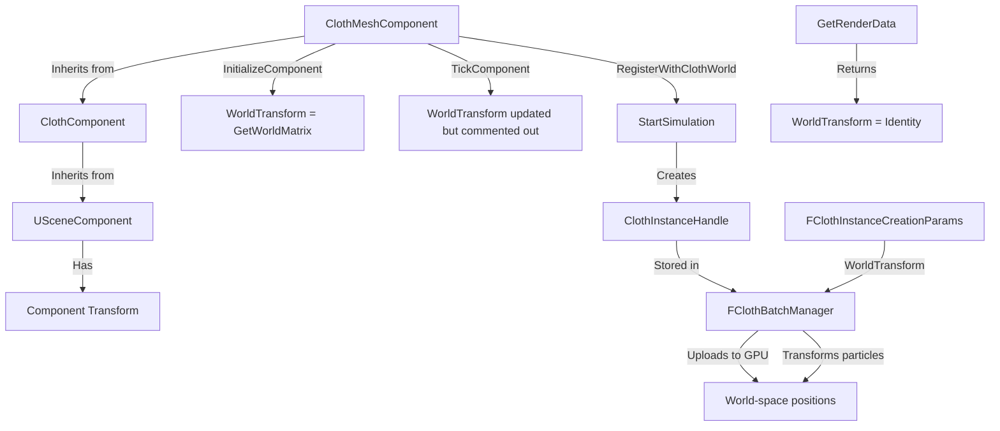
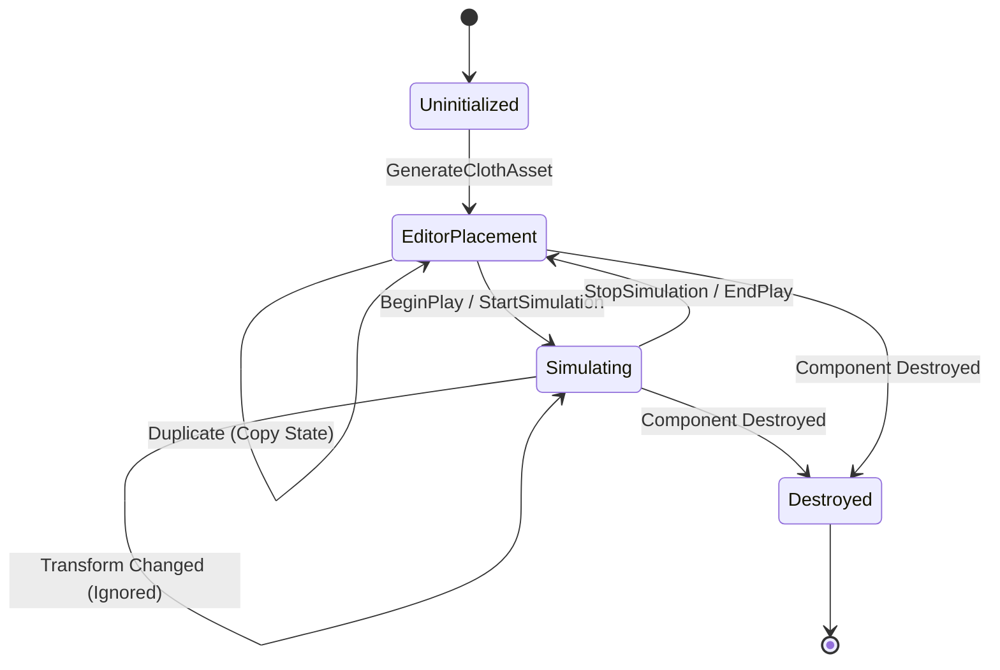

# Cloth Transform Application Plan

## Problem Statement

The ClothActor with ClothMeshComponent cannot be spawned or moved anywhere other than the origin. The Actor/Component transforms are not being applied to the cloth, preventing free placement and movement based on the parent Component/Actor hierarchy's transform.

## Requirements

1. **Initial Placement**: Cloth should spawn at the Actor/Component's world transform location
2. **Editor Movement**: Cloth should move when the Actor/Component is moved in the editor (before simulation starts)
3. **Simulation Independence**: During active simulation, cloth should move entirely by the solver and NOT be affected by Actor/Component transform changes
4. **PIE Mode Transitions**: Handle transitions between Editor and PIE (Play In Editor) modes correctly
5. **Duplication**: Handle actor/component duplication scenarios properly

## Current Architecture Analysis

### Transform Flow (Current State)



### Key Findings

1. **Initial Transform Applied**: In [`ClothBatchManager.cpp:258-267`](EngineSIU/EngineSIU/Engine/Source/Runtime/Engine/Cloth/ClothBatchManager.cpp:258), particles ARE transformed to world space during upload
2. **Rendering Uses Identity**: In [`ClothMeshComponent.cpp:101`](EngineSIU/EngineSIU/Engine/Source/Runtime/Engine/Classes/Components/ClothMeshComponent.cpp:101), `OutData.WorldTransform = FMatrix::Identity` because particles are already in world space
3. **Transform Update Disabled**: In [`ClothMeshComponent.cpp:37-39`](EngineSIU/EngineSIU/Engine/Source/Runtime/Engine/Classes/Components/ClothMeshComponent.cpp:37), the transform update code is commented out
4. **No Re-initialization on Transform Change**: When Actor/Component moves in editor, cloth particles remain at original location

## Root Cause

The cloth is initialized with the transform at registration time, but there's no mechanism to:
- Detect when the Actor/Component transform changes in the editor (before simulation)
- Re-initialize or update particle positions when transform changes
- Distinguish between "editor placement mode" and "active simulation mode"

## Solution Architecture

### State Machine Design



### Transform Application Strategy

#### Phase 1: Initial Placement (Asset Generation)
- Store initial spawn transform when asset is generated
- Transform particles to world space during registration

#### Phase 2: Editor Placement Mode (Pre-Simulation)
- Track component transform changes
- When transform changes, update stored spawn transform
- Re-upload particle positions with new transform
- Keep simulation paused/inactive

#### Phase 3: Simulation Mode (Active Simulation)
- Lock transform - ignore component transform changes
- Simulation drives all particle positions
- Component transform becomes read-only for cloth purposes

#### Phase 4: PIE Transitions
- Editor → PIE: Capture current transform, start simulation
- PIE → Editor: Stop simulation, restore to spawn transform

#### Phase 5: Duplication
- Copy spawn transform from source
- Copy simulation state flag
- Re-register with new transform

## Implementation Plan

### 1. Add State Tracking to ClothMeshComponent

**File**: [`ClothMeshComponent.h`](EngineSIU/EngineSIU/Engine/Source/Runtime/Engine/Classes/Components/ClothMeshComponent.h)

```cpp
// Add to class members:
private:
    // Transform tracking
    FMatrix SpawnTransform;           // Initial spawn transform (for reset)
    FMatrix LastEditorTransform;      // Last known editor transform
    bool bIsSimulationActive;         // True when simulation is running
    bool bTransformDirty;             // True when transform changed in editor
    
    // PIE state tracking
    bool bWasSimulatingBeforePIE;     // Track simulation state across PIE transitions
    FMatrix PrePIETransform;          // Transform before entering PIE
```

### 2. Implement Transform Change Detection

**File**: [`ClothMeshComponent.cpp`](EngineSIU/EngineSIU/Engine/Source/Runtime/Engine/Classes/Components/ClothMeshComponent.cpp)

```cpp
void UClothMeshComponent::TickComponent(float DeltaTime)
{
    Super::TickComponent(DeltaTime);
    
    // Only track transform changes when NOT simulating
    if (!bIsSimulationActive && GeneratedClothAsset)
    {
        FMatrix currentTransform = GetWorldMatrix();
        
        // Check if transform changed
        if (!currentTransform.Equals(LastEditorTransform, 0.001f))
        {
            LastEditorTransform = currentTransform;
            bTransformDirty = true;
            
            // Update cloth particles to new transform
            UpdateClothTransform(currentTransform);
        }
    }
}
```

### 3. Add Transform Update Method

**File**: [`ClothMeshComponent.cpp`](EngineSIU/EngineSIU/Engine/Source/Runtime/Engine/Classes/Components/ClothMeshComponent.cpp)

```cpp
void UClothMeshComponent::UpdateClothTransform(const FMatrix& NewTransform)
{
    if (!ClothInstanceHandle || !GeneratedClothAsset)
        return;
    
    UE_LOG(ELogLevel::Display, 
           TEXT("ClothMeshComponent: Updating transform - Translation: (%.2f, %.2f, %.2f)"),
           NewTransform.GetTranslation().X,
           NewTransform.GetTranslation().Y,
           NewTransform.GetTranslation().Z);
    
    // Get batch manager
    FClothBatchManager* batchMgr = ClothInstanceHandle->GetBatchManager();
    if (!batchMgr)
        return;
    
    // Compute transform delta
    FMatrix deltaTransform = NewTransform * LastEditorTransform.Inverse();
    
    // Update particles via batch manager
    batchMgr->UpdateInstanceTransform(ClothInstanceHandle, deltaTransform);
    
    bTransformDirty = false;
}
```

### 4. Add Batch Manager Transform Update Support

**File**: [`ClothBatchManager.h`](EngineSIU/EngineSIU/Engine/Source/Runtime/Engine/Cloth/ClothBatchManager.h)

```cpp
// Add to public methods:
void UpdateInstanceTransform(FClothInstanceHandle* Instance, const FMatrix& DeltaTransform);
```

**File**: [`ClothBatchManager.cpp`](EngineSIU/EngineSIU/Engine/Source/Runtime/Engine/Cloth/ClothBatchManager.cpp)

```cpp
void FClothBatchManager::UpdateInstanceTransform(FClothInstanceHandle* Instance, 
                                                  const FMatrix& DeltaTransform)
{
    if (!Instance || !BatchedSolver)
        return;
    
    const FClothInstanceMetadata& metadata = Instance->GetMetadata();
    
    // Read current particle positions from GPU
    TArray<FVector> positions;
    BatchedSolver->ReadParticlePositions(
        positions, 
        metadata.ParticleOffset, 
        metadata.ParticleCount);
    
    // Transform positions
    for (FVector& pos : positions)
    {
        pos = DeltaTransform.TransformPosition(pos);
    }
    
    // Write back to GPU (both current and previous positions for velocity preservation)
    BatchedSolver->UpdateParticlePositions(
        positions, 
        metadata.ParticleOffset);
    
    UE_LOG(ELogLevel::Display, 
           TEXT("ClothBatchManager[LOD%d]: Updated %d particles with transform"),
           static_cast<int32>(LODLevel), metadata.ParticleCount);
}
```

### 5. Modify Simulation Start/Stop

**File**: [`ClothMeshComponent.cpp`](EngineSIU/EngineSIU/Engine/Source/Runtime/Engine/Classes/Components/ClothMeshComponent.cpp)

```cpp
void UClothMeshComponent::BeginPlay()
{
    Super::BeginPlay();
    
    // Capture spawn transform
    SpawnTransform = GetWorldMatrix();
    LastEditorTransform = SpawnTransform;
    
    // Auto-start simulation
    if (GeneratedClothAsset)
    {
        RegisterWithClothWorld();
        bIsSimulationActive = true;  // Lock transform during simulation
    }
}

void UClothMeshComponent::RegisterWithClothWorld()
{
    if (!GeneratedClothAsset)
        return;
    
    // Set asset to component
    this->SetClothAsset(GeneratedClothAsset);
    
    // Start simulation
    this->StartSimulation();
    
    // Mark as actively simulating (transform changes ignored)
    bIsSimulationActive = true;
    
    // Get instance handle
    ClothInstanceHandle = this->GetClothInstanceHandle();
    
    if (ClothInstanceHandle)
    {
        bRegisteredWithWorld = true;
        UE_LOG(ELogLevel::Display, 
               TEXT("ClothActor: Registered with ClothWorld - Simulation ACTIVE"));
    }
}

void UClothMeshComponent::UnregisterFromClothWorld()
{
    if (!bRegisteredWithWorld)
        return;
    
    if (this)
    {
        this->StopSimulation();
    }
    
    // Return to editor placement mode
    bIsSimulationActive = false;
    
    ClothInstanceHandle = nullptr;
    bRegisteredWithWorld = false;
    
    UE_LOG(ELogLevel::Display, 
           TEXT("ClothActor: Unregistered - Returned to EDITOR PLACEMENT mode"));
}
```

### 6. Handle PIE Mode Transitions

**File**: [`ClothMeshComponent.h`](EngineSIU/EngineSIU/Engine/Source/Runtime/Engine/Classes/Components/ClothMeshComponent.h)

```cpp
// Add virtual overrides:
virtual void OnBeginPIE() override;
virtual void OnEndPIE() override;
```

**File**: [`ClothMeshComponent.cpp`](EngineSIU/EngineSIU/Engine/Source/Runtime/Engine/Classes/Components/ClothMeshComponent.cpp)

```cpp
void UClothMeshComponent::OnBeginPIE()
{
    // Capture pre-PIE state
    bWasSimulatingBeforePIE = bIsSimulationActive;
    PrePIETransform = GetWorldMatrix();
    
    // If not already simulating, start simulation for PIE
    if (!bIsSimulationActive && GeneratedClothAsset)
    {
        RegisterWithClothWorld();
    }
    
    UE_LOG(ELogLevel::Display, 
           TEXT("ClothMeshComponent: Entering PIE - Simulation started"));
}

void UClothMeshComponent::OnEndPIE()
{
    // Stop simulation
    if (bIsSimulationActive)
    {
        UnregisterFromClothWorld();
    }
    
    // Restore pre-PIE transform
    if (!PrePIETransform.Equals(FMatrix::Identity))
    {
        // Reset to pre-PIE transform
        LastEditorTransform = PrePIETransform;
        
        // If we need to re-register for editor visualization
        if (GeneratedClothAsset)
        {
            // Re-register at original transform
            RegisterWithClothWorld();
            UnregisterFromClothWorld(); // Immediately stop to return to editor mode
        }
    }
    
    UE_LOG(ELogLevel::Display, 
           TEXT("ClothMeshComponent: Exiting PIE - Returned to editor mode"));
}
```

### 7. Handle Duplication

**File**: [`ClothMeshComponent.cpp`](EngineSIU/EngineSIU/Engine/Source/Runtime/Engine/Classes/Components/ClothMeshComponent.cpp)

```cpp
UObject* UClothMeshComponent::Duplicate(UObject* InOuter)
{
    ThisClass* NewComponent = Cast<ThisClass>(Super::Duplicate(InOuter));
    
    // Copy cloth asset and materials
    NewComponent->GeneratedClothAsset = GeneratedClothAsset;
    NewComponent->Materials = Materials;
    
    // Copy transform state
    NewComponent->SpawnTransform = GetWorldMatrix(); // Use CURRENT transform as spawn
    NewComponent->LastEditorTransform = NewComponent->SpawnTransform;
    
    // Reset simulation state (duplicates start in editor mode)
    NewComponent->bIsSimulationActive = false;
    NewComponent->bTransformDirty = false;
    
    // Don't auto-register - let the new component register itself
    // This allows the duplicate to be placed at a different location
    
    UE_LOG(ELogLevel::Display, 
           TEXT("ClothMeshComponent: Duplicated - New instance at (%.2f, %.2f, %.2f)"),
           NewComponent->SpawnTransform.GetTranslation().X,
           NewComponent->SpawnTransform.GetTranslation().Y,
           NewComponent->SpawnTransform.GetTranslation().Z);
    
    return NewComponent;
}
```

### 8. Add GPU Particle Position Read/Write Support

**File**: [`ClothBatchedSolver.h`](EngineSIU/EngineSIU/Engine/Source/Runtime/Engine/Cloth/ClothBatchedSolver.h)

```cpp
// Add to public methods:
void ReadParticlePositions(TArray<FVector>& OutPositions, 
                          uint32 Offset, 
                          uint32 Count);
void UpdateParticlePositions(const TArray<FVector>& Positions, 
                            uint32 Offset);
```

**File**: [`ClothBatchedSolver.cpp`](EngineSIU/EngineSIU/Engine/Source/Runtime/Engine/Cloth/ClothBatchedSolver.cpp)

```cpp
void FClothBatchedSolver::ReadParticlePositions(TArray<FVector>& OutPositions,
                                                uint32 Offset,
                                                uint32 Count)
{
    if (!Graphics || !Graphics->DeviceContext || !PositionBuffer)
        return;
    
    OutPositions.SetNum(Count);
    
    // Create staging buffer for readback
    D3D11_BUFFER_DESC stagingDesc = {};
    stagingDesc.ByteWidth = Count * sizeof(FVector);
    stagingDesc.Usage = D3D11_USAGE_STAGING;
    stagingDesc.CPUAccessFlags = D3D11_CPU_ACCESS_READ;
    
    ID3D11Buffer* stagingBuffer = nullptr;
    HRESULT hr = Graphics->Device->CreateBuffer(&stagingDesc, nullptr, &stagingBuffer);
    if (FAILED(hr))
        return;
    
    // Copy from GPU to staging
    D3D11_BOX srcBox;
    srcBox.left = Offset * sizeof(FVector);
    srcBox.right = (Offset + Count) * sizeof(FVector);
    srcBox.top = 0;
    srcBox.bottom = 1;
    srcBox.front = 0;
    srcBox.back = 1;
    
    Graphics->DeviceContext->CopySubresourceRegion(
        stagingBuffer, 0, 0, 0, 0,
        PositionBuffer, 0, &srcBox);
    
    // Map and read
    D3D11_MAPPED_SUBRESOURCE mapped;
    hr = Graphics->DeviceContext->Map(stagingBuffer, 0, D3D11_MAP_READ, 0, &mapped);
    if (SUCCEEDED(hr))
    {
        memcpy(OutPositions.GetData(), mapped.pData, Count * sizeof(FVector));
        Graphics->DeviceContext->Unmap(stagingBuffer, 0);
    }
    
    stagingBuffer->Release();
}

void FClothBatchedSolver::UpdateParticlePositions(const TArray<FVector>& Positions,
                                                  uint32 Offset)
{
    if (!Graphics || !Graphics->DeviceContext || !PositionBuffer)
        return;
    
    uint32 count = Positions.Num();
    
    // Update current positions
    D3D11_BOX destBox;
    destBox.left = Offset * sizeof(FVector);
    destBox.right = (Offset + count) * sizeof(FVector);
    destBox.top = 0;
    destBox.bottom = 1;
    destBox.front = 0;
    destBox.back = 1;
    
    Graphics->DeviceContext->UpdateSubresource(
        PositionBuffer, 0, &destBox,
        Positions.GetData(), 0, 0);
    
    // Also update previous positions to maintain velocity = 0
    // (prevents sudden velocity spike from transform change)
    if (PrevPositionBuffer)
    {
        Graphics->DeviceContext->UpdateSubresource(
            PrevPositionBuffer, 0, &destBox,
            Positions.GetData(), 0, 0);
    }
}
```

### 9. Initialize Transform State in Constructor

**File**: [`ClothMeshComponent.cpp`](EngineSIU/EngineSIU/Engine/Source/Runtime/Engine/Classes/Components/ClothMeshComponent.cpp)

```cpp
UClothMeshComponent::UClothMeshComponent()
    : WorldTransform(FMatrix::Identity), 
      DebugDrawMode(EClothDebugDrawMode::None), 
      bIsVisible(true), 
      bSimulate(true),
      SpawnTransform(FMatrix::Identity),
      LastEditorTransform(FMatrix::Identity),
      bIsSimulationActive(false),
      bTransformDirty(false),
      bWasSimulatingBeforePIE(false),
      PrePIETransform(FMatrix::Identity)
{
}
```

## Testing Strategy

### Test Case 1: Initial Placement
1. Create ClothActor in editor
2. Generate cloth asset
3. Move actor to position (100, 200, 300)
4. Verify cloth particles move with actor
5. Start PIE - verify cloth simulates at correct location

### Test Case 2: Editor Movement
1. Create ClothActor at origin
2. Generate cloth asset
3. Move actor to (500, 0, 0)
4. Move actor to (0, 500, 0)
5. Verify cloth follows each movement
6. Start PIE - verify simulation starts at final position

### Test Case 3: Simulation Lock
1. Create ClothActor and generate asset
2. Start PIE (simulation active)
3. Attempt to move actor in PIE
4. Verify cloth does NOT follow actor transform
5. Verify cloth continues simulating independently

### Test Case 4: PIE Transitions
1. Create ClothActor at (100, 100, 100)
2. Generate cloth asset
3. Start PIE - cloth simulates and falls
4. Stop PIE
5. Verify cloth returns to (100, 100, 100) in editor
6. Verify cloth can be moved again in editor

### Test Case 5: Duplication
1. Create ClothActor at (0, 0, 0)
2. Generate cloth asset
3. Duplicate actor
4. Move duplicate to (500, 0, 0)
5. Verify original stays at (0, 0, 0)
6. Verify duplicate is at (500, 0, 0)
7. Start PIE - verify both simulate at correct locations

### Test Case 6: Rotation and Scale
1. Create ClothActor
2. Generate cloth asset
3. Rotate actor 45 degrees
4. Scale actor to 2x
5. Verify cloth transforms correctly
6. Start PIE - verify simulation respects transformed state

## Performance Considerations

### GPU Readback Cost
- Reading particle positions from GPU is expensive (~0.5-2ms for 10k particles)
- Only perform readback when transform actually changes
- Use dirty flag to minimize readback operations
- Consider async readback for large cloth meshes

### Optimization: Transform-Only Mode
For editor-only transform updates without readback:
```cpp
// Alternative: Store transform offset and apply in shader
// Avoids GPU readback but requires shader modification
struct FClothInstanceTransformOffset
{
    FMatrix TransformOffset;  // Delta from spawn transform
    bool bApplyOffset;        // Only true in editor mode
};
```

## Edge Cases and Considerations

### 1. Attached Cloth
- If cloth has kinematic attachments, transform update must preserve attachment relationships
- Solution: Update both cloth particles AND attachment target positions

### 2. Collision Objects
- Collision objects (spheres, capsules, boxes) should move with actor
- Already handled by existing collision system

### 3. Multi-Instance Batching
- Transform updates affect single instance in batch
- Batch manager must support per-instance transform updates
- No impact on other instances in same batch

### 4. Undo/Redo
- Editor undo/redo must properly restore transform state
- Store transform in undo buffer
- Re-apply transform on redo

### 5. Serialization
- Save spawn transform with component
- Restore on load
- Handle version migration for existing assets

## Migration Path

### Phase 1: Core Implementation
1. Add state tracking members
2. Implement transform detection
3. Add GPU readback/write support
4. Basic editor movement support

### Phase 2: Simulation Control
1. Implement simulation lock
2. Add BeginPlay/EndPlay handling
3. Test simulation independence

### Phase 3: PIE Support
1. Add PIE transition handlers
2. Implement state preservation
3. Test PIE workflows

### Phase 4: Duplication
1. Implement Duplicate override
2. Test duplication scenarios
3. Verify multi-instance behavior

### Phase 5: Polish
1. Add console commands for debugging
2. Optimize GPU readback
3. Add visual feedback in editor
4. Documentation and examples

## Console Commands for Debugging

```cpp
// Add to ClothMeshComponent or ClothWorld
CONSOLE_COMMAND(ClothShowTransforms)
{
    // Display current transform state for all cloth instances
}

CONSOLE_COMMAND(ClothResetTransform)
{
    // Reset cloth to spawn transform
}

CONSOLE_COMMAND(ClothToggleTransformLock)
{
    // Manually toggle simulation lock for testing
}
```

## Summary

This plan provides a complete solution for applying Actor/Component transforms to cloth while maintaining simulation independence. The key innovations are:

1. **State Machine**: Clear separation between editor placement and simulation modes
2. **Transform Tracking**: Detect and respond to transform changes only when appropriate
3. **Simulation Lock**: Prevent transform interference during active simulation
4. **PIE Handling**: Proper state transitions between editor and play modes
5. **Duplication Support**: Correct handling of duplicated cloth instances

The implementation maintains the existing batched architecture while adding transform awareness at the component level.
