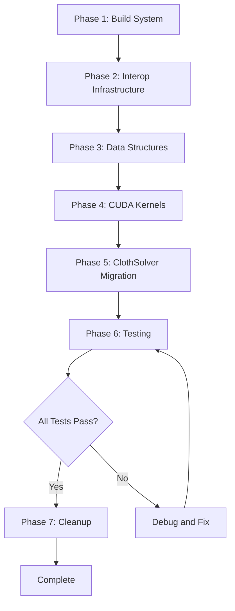

# CUDA Cloth Simulation Migration Plan

## Executive Summary

This document outlines the complete migration strategy for transitioning the EngineSIU cloth simulation from DirectX 11 Compute Shaders to CUDA. The migration addresses the fundamental limitation of DX11's lack of native float atomic operations, which currently necessitates a complex ping-pong buffer and Jacobi accumulation scheme.

### Current System Overview

**DX11 Implementation:**
- Location: [`EngineSIU/EngineSIU/Engine/Source/Runtime/Engine/Cloth/`](EngineSIU/EngineSIU/Engine/Source/Runtime/Engine/Cloth/)
- Compute Shaders: [`EngineSIU/EngineSIU/Shaders/Cloth/`](EngineSIU/EngineSIU/Shaders/Cloth/)
- Rendering: [`ClothRenderPass.h`](EngineSIU/EngineSIU/Engine/Source/Runtime/Renderer/ClothRenderPass.h) / [`ClothRenderPass.cpp`](EngineSIU/EngineSIU/Engine/Source/Runtime/Renderer/ClothRenderPass.cpp)

**Key Problem:**
Lines 64-72 in [`ClothConstraintSolver.hlsl`](EngineSIU/EngineSIU/Shaders/Cloth/ClothConstraintSolver.hlsl) attempt to use `InterlockedAdd` on float components, which is unsupported in DX11 Shader Model 5.0. This forces a workaround using intermediate delta buffers and weight accumulation.

**Target Architecture:**
- CUDA kernels for simulation compute
- DirectX 11 for rendering (unchanged)
- CUDA-DX11 interop for zero-copy buffer sharing

---

## Phase 1: CUDA Build System Integration

### 1.1 Prerequisites Verification

**Required Software:**
- NVIDIA CUDA Toolkit 11.0+ (12.x recommended)
- Visual Studio 2019/2022 with CUDA build customizations
- Compatible NVIDIA GPU (Compute Capability 5.0+)

**Action Items:**
1. Verify CUDA Toolkit installation at standard path: `C:\Program Files\NVIDIA GPU Computing Toolkit\CUDA\`
2. Confirm CUDA integration in Visual Studio (CUDA project templates available)
3. Check system PATH includes CUDA bin and lib directories

### 1.2 Project Configuration (.vcxproj Modifications)

**File:** [`EngineSIU/EngineSIU/EngineSIU.vcxproj`](EngineSIU/EngineSIU/EngineSIU.vcxproj)

**Step 1: Import CUDA Build Customizations**

Add after line 56 (`<ImportGroup Label="ExtensionSettings">`):

```xml
<ImportGroup Label="ExtensionSettings">
  <Import Project="$(VCTargetsPath)\BuildCustomizations\CUDA 12.x.props" />
</ImportGroup>
```

And before line 1056 (`<Import Project="$(VCTargetsPath)\Microsoft.Cpp.targets" />`):

```xml
<Import Project="$(VCTargetsPath)\BuildCustomizations\CUDA 12.x.targets" />
```

**Step 2: Add CUDA Include and Library Paths**

For x64 Debug and Release configurations (lines 149, 179), add to `<AdditionalIncludeDirectories>`:
```
$(CUDA_PATH)\include;
```

For x64 configurations (lines 160, 192), add to `<AdditionalLibraryDirectories>`:
```
$(CUDA_PATH)\lib\x64;
```

For x64 configurations (lines 161, 193), add to `<AdditionalDependencies>`:
```
cudart.lib;cuda.lib;
```

**Step 3: Configure CUDA Compilation Settings**

Add new `<ItemDefinitionGroup>` for CUDA compilation:

```xml
<ItemDefinitionGroup>
  <CudaCompile>
    <TargetMachinePlatform>64</TargetMachinePlatform>
    <GenerateRelocatableDeviceCode>true</GenerateRelocatableDeviceCode>
    <CodeGeneration>compute_52,sm_52;compute_60,sm_60;compute_75,sm_75;compute_86,sm_86</CodeGeneration>
    <FastMath>true</FastMath>
    <AdditionalOptions>-Xcompiler "/wd4819" %(AdditionalOptions)</AdditionalOptions>
    <Include>$(ProjectDir);$(ProjectDir)Engine\Source\Runtime\Core;$(ProjectDir)Engine\Source\Runtime\Engine;$(CUDA_PATH)\include</Include>
    <Defines>CUDA_ENABLED=1</Defines>
  </CudaCompile>
</ItemDefinitionGroup>
```

**Step 4: Add CUDA Runtime DLL to Post-Build**

Update post-build events (lines 164-168, 199-203) to copy CUDA runtime:

```batch
xcopy /y /d "$(CUDA_PATH)\bin\cudart64_*.dll" "$(OutDir)"
```

### 1.3 Directory Structure Creation

Create new directories:
```
EngineSIU/EngineSIU/Engine/Source/Runtime/Engine/Cloth/CUDA/
└── Kernels/
```

**Purpose:**
- `CUDA/` - Main CUDA integration code
- `Kernels/` - Individual CUDA kernel implementations

### 1.4 Test Build Configuration

Create minimal test file: `Engine/Source/Runtime/Engine/Cloth/CUDA/CUDATest.cu`

```cuda
#include <cuda_runtime.h>

__global__ void TestKernel()
{
    // Minimal test
}

extern "C" bool TestCUDASetup()
{
    int deviceCount = 0;
    cudaError_t error = cudaGetDeviceCount(&deviceCount);
    return error == cudaSuccess && deviceCount > 0;
}
```

Add to project file:
```xml
<CudaCompile Include="Engine\Source\Runtime\Engine\Cloth\CUDA\CUDATest.cu" />
```

**Validation:**
- Build project successfully
- Verify .cu files compile to .obj
- Confirm linking succeeds

---

## Phase 2: CUDA-DX11 Interop Infrastructure

### 2.1 Interop Manager Class Design

**File:** `Engine/Source/Runtime/Engine/Cloth/CUDA/CUDADXInterop.h`

```cpp
#pragma once

#include <d3d11.h>
#include <cuda_runtime.h>
#include <cuda_d3d11_interop.h>

class FCUDADXInterop
{
public:
    FCUDADXInterop();
    ~FCUDADXInterop();

    // Initialization
    bool Initialize(ID3D11Device* InD3DDevice);
    void Release();

    // Buffer registration
    bool RegisterD3DBuffer(ID3D11Buffer* D3DBuffer, cudaGraphicsResource** OutCudaResource);
    void UnregisterResource(cudaGraphicsResource* Resource);

    // Resource mapping for CUDA access
    bool MapResources(cudaGraphicsResource** Resources, int Count, cudaStream_t Stream = 0);
    void UnmapResources(cudaGraphicsResource** Resources, int Count, cudaStream_t Stream = 0);

    // Get CUDA device pointer from mapped resource
    bool GetMappedPointer(cudaGraphicsResource* Resource, void** OutDevPtr, size_t* OutSize);

    // Stream management
    cudaStream_t GetStream() const { return CudaStream; }
    void SynchronizeStream();

    // Device info
    bool IsInitialized() const { return bInitialized; }
    int GetDeviceID() const { return DeviceID; }

private:
    bool bInitialized;
    int DeviceID;
    cudaStream_t CudaStream;
    ID3D11Device* D3DDevice;
};
```

**Key Features:**
- Manages CUDA-DirectX device synchronization
- Handles buffer registration and mapping
- Provides CUDA stream for async operations

### 2.2 Interop Manager Implementation

**File:** `Engine/Source/Runtime/Engine/Cloth/CUDA/CUDADXInterop.cpp`

**Critical Functions:**

```cpp
bool FCUDADXInterop::Initialize(ID3D11Device* InD3DDevice)
{
    // 1. Get D3D adapter from device
    IDXGIDevice* dxgiDevice = nullptr;
    InD3DDevice->QueryInterface(__uuidof(IDXGIDevice), (void**)&dxgiDevice);
    
    IDXGIAdapter* adapter = nullptr;
    dxgiDevice->GetAdapter(&adapter);
    
    // 2. Get CUDA device for this D3D adapter
    unsigned int cudaDeviceCount = 0;
    int cudaDevices[16];
    cudaD3D11GetDevices(&cudaDeviceCount, cudaDevices, 16, adapter, cudaD3D11DeviceListAll);
    
    // 3. Set CUDA device
    cudaSetDevice(cudaDevices[0]);
    DeviceID = cudaDevices[0];
    
    // 4. Create CUDA stream
    cudaStreamCreate(&CudaStream);
    
    D3DDevice = InD3DDevice;
    bInitialized = true;
    return true;
}

bool FCUDADXInterop::RegisterD3DBuffer(ID3D11Buffer* D3DBuffer, cudaGraphicsResource** OutCudaResource)
{
    cudaError_t result = cudaGraphicsD3D11RegisterResource(
        OutCudaResource, 
        D3DBuffer, 
        cudaGraphicsRegisterFlagsNone
    );
    return result == cudaSuccess;
}

bool FCUDADXInterop::MapResources(cudaGraphicsResource** Resources, int Count, cudaStream_t Stream)
{
    cudaError_t result = cudaGraphicsMapResources(Count, Resources, Stream);
    return result == cudaSuccess;
}

bool FCUDADXInterop::GetMappedPointer(cudaGraphicsResource* Resource, void** OutDevPtr, size_t* OutSize)
{
    cudaError_t result = cudaGraphicsResourceGetMappedPointer(OutDevPtr, OutSize, Resource);
    return result == cudaSuccess;
}
```

### 2.3 Buffer Management Strategy

**Shared Buffers (DX11 ↔ CUDA):**
- Position buffers (ping-pong)
- Velocity buffer
- Normal buffer

**CUDA-Only Buffers:**
- Constraint delta accumulation (now using float atomics!)
- Temporary working buffers

**Key Requirement:** DX11 buffers must use `D3D11_RESOURCE_MISC_SHARED` flag.

### 2.4 Synchronization Protocol

**Simulation Frame Flow:**
```
1. DX11 finishes rendering previous frame
2. Unmap resources from CUDA
3. CUDA maps resources
4. CUDA runs simulation kernels (async)
5. CUDA synchronizes stream
6. CUDA unmaps resources
7. DX11 maps for rendering
```

**Implementation Pattern:**
```cpp
// Before simulation
Interop->MapResources(ResourceArray, ResourceCount, Stream);

// Run kernels
LaunchIntegrationKernel<<<...>>>(mappedPositions, mappedVelocities, ...);
LaunchConstraintKernel<<<...>>>(...);

// After simulation
cudaStreamSynchronize(Stream);
Interop->UnmapResources(ResourceArray, ResourceCount, Stream);
```

---

## Phase 3: Data Structure Preparation

### 3.1 Create Shared Header for GPU Structures

**File:** `Engine/Source/Runtime/Engine/Cloth/ClothGPUStructs.h`

```cpp
#pragma once

#ifndef __CUDACC__
    // C++ mode
    #include "Math/Vector.h"
    #define CUDA_CALLABLE
    #define CUDA_DEVICE
#else
    // CUDA mode
    #define CUDA_CALLABLE __host__ __device__
    #define CUDA_DEVICE __device__
    
    // CUDA vector types
    struct FVector
    {
        float X, Y, Z;
        CUDA_CALLABLE FVector() : X(0), Y(0), Z(0) {}
        CUDA_CALLABLE FVector(float x, float y, float z) : X(x), Y(y), Z(z) {}
    };
#endif

// GPU particle structure (16 bytes, aligned)
struct FClothParticleGPU
{
    FVector Position;
    float InvMass;
};

// GPU velocity structure (16 bytes, aligned)
struct FClothVelocityGPU
{
    FVector Velocity;
    float Padding;
};

// GPU constraint structure (32 bytes, aligned)
struct FClothConstraintGPU
{
    uint32_t ParticleA;
    uint32_t ParticleB;
    float RestLength;
    float Stiffness;
    
    float Compliance;  // XPBD
    float Lambda;      // XPBD state
    float Padding0;
    float Padding1;
};

// Simulation constants
struct FClothSimConstants
{
    uint32_t NumParticles;
    uint32_t NumConstraints;
    float DeltaTime;
    float Damping;
    
    FVector Gravity;
    float StretchStiffness;
    
    FVector Wind;
    float BendStiffness;
    
    float AirDrag;
    uint32_t NumIterations;
    uint32_t CurrentIteration;
    uint32_t UseXPBD;
};
```

**Key Design Decisions:**
- Structures match existing HLSL definitions
- Conditional compilation for CUDA vs C++
- Explicit padding for alignment
- Compatible with both host and device code

### 3.2 Modify ClothSolver.h

**Changes to [`ClothSolver.h`](EngineSIU/EngineSIU/Engine/Source/Runtime/Engine/Cloth/ClothSolver.h):**

Add includes:
```cpp
#include "CUDA/CUDADXInterop.h"
#include "ClothGPUStructs.h"

#ifdef CUDA_ENABLED
    #include <cuda_runtime.h>
#endif
```

Add new private members:
```cpp
private:
    // CUDA interop
    FCUDADXInterop* CudaInterop;
    
    // CUDA resource handles
    cudaGraphicsResource* PositionCudaResource[2];
    cudaGraphicsResource* VelocityCudaResource;
    cudaGraphicsResource* NormalCudaResource;
    
    // CUDA device pointers (when mapped)
    void* PositionDevicePtr[2];
    void* VelocityDevicePtr;
    void* NormalDevicePtr;
    
    // CUDA-only buffers (no D3D equivalent)
    void* ConstraintDevicePtr;  // Stored on GPU permanently
    
    // Constants in device memory
    FClothSimConstants* ConstantsDevicePtr;
    
    bool bUseCUDA;  // Runtime switch for testing
```

### 3.3 Buffer Creation Modifications

**In [`ClothSolver.cpp`](EngineSIU/EngineSIU/Engine/Source/Runtime/Engine/Cloth/ClothSolver.cpp) `CreateBuffers()`:**

Add `D3D11_RESOURCE_MISC_SHARED` to shared buffers:

```cpp
// Position buffers - NOW WITH SHARED FLAG
bufferDesc.MiscFlags = D3D11_RESOURCE_MISC_BUFFER_STRUCTURED | D3D11_RESOURCE_MISC_SHARED;
```

This applies to:
- `PositionBuffer[0]` and `PositionBuffer[1]`
- `VelocityBuffer`
- `NormalBuffer`

**DO NOT** add to:
- `ConstraintBuffer` (will be CUDA-only)
- Constant buffers

---

## Phase 4: CUDA Kernel Implementation

### 4.1 Integration Kernel

**File:** `Engine/Source/Runtime/Engine/Cloth/CUDA/Kernels/ClothIntegrate.cu`

Port from [`ClothIntegrate.hlsl`](EngineSIU/EngineSIU/Shaders/Cloth/ClothIntegrate.hlsl):

```cuda
#include "../ClothGPUStructs.h"

__global__ void IntegrateKernel(
    FClothParticleGPU* PositionRead,
    FClothParticleGPU* PositionWrite,
    FClothVelocityGPU* Velocities,
    FClothSimConstants Constants)
{
    uint32_t idx = blockIdx.x * blockDim.x + threadIdx.x;
    
    if (idx >= Constants.NumParticles)
        return;
    
    FClothParticleGPU particle = PositionRead[idx];
    FClothVelocityGPU velocity = Velocities[idx];
    
    // Skip fixed particles
    if (particle.InvMass == 0.0f)
    {
        PositionWrite[idx] = particle;
        Velocities[idx] = velocity;
        return;
    }
    
    // Calculate forces
    FVector force = Constants.Gravity;
    force.X += Constants.Wind.X * Constants.AirDrag;
    force.Y += Constants.Wind.Y * Constants.AirDrag;
    force.Z += Constants.Wind.Z * Constants.AirDrag;
    
    // Semi-implicit Euler integration
    FVector accel;
    accel.X = force.X * particle.InvMass;
    accel.Y = force.Y * particle.InvMass;
    accel.Z = force.Z * particle.InvMass;
    
    velocity.Velocity.X += accel.X * Constants.DeltaTime;
    velocity.Velocity.Y += accel.Y * Constants.DeltaTime;
    velocity.Velocity.Z += accel.Z * Constants.DeltaTime;
    
    // Damping
    velocity.Velocity.X *= (1.0f - Constants.Damping);
    velocity.Velocity.Y *= (1.0f - Constants.Damping);
    velocity.Velocity.Z *= (1.0f - Constants.Damping);
    
    // Velocity clamping
    float velMag = sqrtf(velocity.Velocity.X * velocity.Velocity.X +
                         velocity.Velocity.Y * velocity.Velocity.Y +
                         velocity.Velocity.Z * velocity.Velocity.Z);
    if (velMag > 10000.0f)
    {
        float scale = 10000.0f / velMag;
        velocity.Velocity.X *= scale;
        velocity.Velocity.Y *= scale;
        velocity.Velocity.Z *= scale;
    }
    
    // Update position
    particle.Position.X += velocity.Velocity.X * Constants.DeltaTime;
    particle.Position.Y += velocity.Velocity.Y * Constants.DeltaTime;
    particle.Position.Z += velocity.Velocity.Z * Constants.DeltaTime;
    
    // Write back
    PositionWrite[idx] = particle;
    Velocities[idx] = velocity;
}

// Host launcher
extern "C" void LaunchIntegrateKernel(
    void* posRead, void* posWrite, void* velocities,
    const FClothSimConstants& constants,
    cudaStream_t stream)
{
    const int threadsPerBlock = 256;
    const int blocks = (constants.NumParticles + threadsPerBlock - 1) / threadsPerBlock;
    
    IntegrateKernel<<<blocks, threadsPerBlock, 0, stream>>>(
        (FClothParticleGPU*)posRead,
        (FClothParticleGPU*)posWrite,
        (FClothVelocityGPU*)velocities,
        constants);
}
```

### 4.2 Constraint Solver Kernel (THE MAIN IMPROVEMENT!)

**File:** `Engine/Source/Runtime/Engine/Cloth/CUDA/Kernels/ClothConstraintSolver.cu`

**This is where CUDA shines - native float atomics!**

```cuda
#include "../ClothGPUStructs.h"

__device__ void atomicAddFloat3(FVector* addr, FVector delta)
{
    atomicAdd(&addr->X, delta.X);
    atomicAdd(&addr->Y, delta.Y);
    atomicAdd(&addr->Z, delta.Z);
}

__global__ void SolveDistanceConstraintsKernel(
    const FClothParticleGPU* __restrict__ Positions,
    const FClothConstraintGPU* __restrict__ Constraints,
    FVector* __restrict__ PositionDeltas,    // Accumulated corrections
    float* __restrict__ PositionWeights,      // Accumulated weights
    FClothSimConstants Constants)
{
    uint32_t idx = blockIdx.x * blockDim.x + threadIdx.x;
    
    if (idx >= Constants.NumConstraints)
        return;
    
    FClothConstraintGPU constraint = Constraints[idx];
    
    FClothParticleGPU pA = Positions[constraint.ParticleA];
    FClothParticleGPU pB = Positions[constraint.ParticleB];
    
    // Calculate constraint violation
    FVector delta;
    delta.X = pB.Position.X - pA.Position.X;
    delta.Y = pB.Position.Y - pA.Position.Y;
    delta.Z = pB.Position.Z - pA.Position.Z;
    
    float currentLength = sqrtf(delta.X * delta.X + delta.Y * delta.Y + delta.Z * delta.Z);
    
    if (currentLength < 1e-6f)
        return;
    
    float error = currentLength - constraint.RestLength;
    
    FVector dir;
    dir.X = delta.X / currentLength;
    dir.Y = delta.Y / currentLength;
    dir.Z = delta.Z / currentLength;
    
    float w1 = pA.InvMass;
    float w2 = pB.InvMass;
    float wSum = w1 + w2;
    
    if (wSum < 1e-6f)
        return;
    
    float stiffness = constraint.Stiffness * Constants.StretchStiffness;
    float lambda = -error / wSum;
    
    // Calculate corrections
    FVector correctionA, correctionB;
    correctionA.X = stiffness * lambda * w1 * (-dir.X);
    correctionA.Y = stiffness * lambda * w1 * (-dir.Y);
    correctionA.Z = stiffness * lambda * w1 * (-dir.Z);
    
    correctionB.X = stiffness * lambda * w2 * dir.X;
    correctionB.Y = stiffness * lambda * w2 * dir.Y;
    correctionB.Z = stiffness * lambda * w2 * dir.Z;
    
    // ATOMIC ACCUMULATION - THIS IS WHY WE'RE USING CUDA!
    atomicAddFloat3(&PositionDeltas[constraint.ParticleA], correctionA);
    atomicAdd(&PositionWeights[constraint.ParticleA], 1.0f);
    
    atomicAddFloat3(&PositionDeltas[constraint.ParticleB], correctionB);
    atomicAdd(&PositionWeights[constraint.ParticleB], 1.0f);
}

extern "C" void LaunchConstraintSolverKernel(
    const void* positions,
    const void* constraints,
    void* deltas,
    void* weights,
    const FClothSimConstants& constants,
    cudaStream_t stream)
{
    const int threadsPerBlock = 256;
    const int blocks = (constants.NumConstraints + threadsPerBlock - 1) / threadsPerBlock;
    
    SolveDistanceConstraintsKernel<<<blocks, threadsPerBlock, 0, stream>>>(
        (const FClothParticleGPU*)positions,
        (const FClothConstraintGPU*)constraints,
        (FVector*)deltas,
        (float*)weights,
        constants);
}
```

### 4.3 Apply Deltas Kernel

**File:** `Engine/Source/Runtime/Engine/Cloth/CUDA/Kernels/ClothApplyDelta.cu`

```cuda
__global__ void ApplyConstraintDeltasKernel(
    const FClothParticleGPU* __restrict__ PositionRead,
    FClothParticleGPU* __restrict__ PositionWrite,
    FVector* __restrict__ PositionDeltas,
    float* __restrict__ PositionWeights,
    FClothSimConstants Constants)
{
    uint32_t idx = blockIdx.x * blockDim.x + threadIdx.x;
    
    if (idx >= Constants.NumParticles)
        return;
    
    FClothParticleGPU particle = PositionRead[idx];
    
    // Skip fixed particles
    if (particle.InvMass == 0.0f)
    {
        PositionWrite[idx] = particle;
        return;
    }
    
    float weight = PositionWeights[idx];
    
    if (weight > 0.0f)
    {
        // Apply averaged correction
        float invWeight = 1.0f / weight;
        particle.Position.X += PositionDeltas[idx].X * invWeight;
        particle.Position.Y += PositionDeltas[idx].Y * invWeight;
        particle.Position.Z += PositionDeltas[idx].Z * invWeight;
        
        // Clear for next iteration
        PositionDeltas[idx] = FVector(0, 0, 0);
        PositionWeights[idx] = 0.0f;
    }
    
    PositionWrite[idx] = particle;
}

extern "C" void LaunchApplyDeltasKernel(
    const void* posRead,
    void* posWrite,
    void* deltas,
    void* weights,
    const FClothSimConstants& constants,
    cudaStream_t stream)
{
    const int threadsPerBlock = 256;
    const int blocks = (constants.NumParticles + threadsPerBlock - 1) / threadsPerBlock;
    
    ApplyConstraintDeltasKernel<<<blocks, threadsPerBlock, 0, stream>>>(
        (const FClothParticleGPU*)posRead,
        (FClothParticleGPU*)posWrite,
        (FVector*)deltas,
        (float*)weights,
        constants);
}
```

### 4.4 Normal Update Kernel

**File:** `Engine/Source/Runtime/Engine/Cloth/CUDA/Kernels/ClothUpdateNormals.cu`

```cuda
__global__ void ClearNormalsKernel(FVector* Normals, uint32_t NumParticles)
{
    uint32_t idx = blockIdx.x * blockDim.x + threadIdx.x;
    if (idx < NumParticles)
    {
        Normals[idx] = FVector(0, 0, 0);
    }
}

__global__ void AccumulateFaceNormalsKernel(
    const FClothParticleGPU* __restrict__ Positions,
    const uint32_t* __restrict__ Indices,
    FVector* __restrict__ Normals,
    uint32_t NumTriangles)
{
    uint32_t triangleIdx = blockIdx.x * blockDim.x + threadIdx.x;
    
    if (triangleIdx >= NumTriangles)
        return;
    
    uint32_t i0 = Indices[triangleIdx * 3 + 0];
    uint32_t i1 = Indices[triangleIdx * 3 + 1];
    uint32_t i2 = Indices[triangleIdx * 3 + 2];
    
    FVector p0 = Positions[i0].Position;
    FVector p1 = Positions[i1].Position;
    FVector p2 = Positions[i2].Position;
    
    // Calculate face normal
    FVector edge1, edge2, normal;
    edge1.X = p1.X - p0.X;
    edge1.Y = p1.Y - p0.Y;
    edge1.Z = p1.Z - p0.Z;
    
    edge2.X = p2.X - p0.X;
    edge2.Y = p2.Y - p0.Y;
    edge2.Z = p2.Z - p0.Z;
    
    // Cross product
    normal.X = edge1.Y * edge2.Z - edge1.Z * edge2.Y;
    normal.Y = edge1.Z * edge2.X - edge1.X * edge2.Z;
    normal.Z = edge1.X * edge2.Y - edge1.Y * edge2.X;
    
    // Accumulate to all three vertices
    atomicAddFloat3(&Normals[i0], normal);
    atomicAddFloat3(&Normals[i1], normal);
    atomicAddFloat3(&Normals[i2], normal);
}

__global__ void NormalizeNormalsKernel(FVector* Normals, uint32_t NumParticles)
{
    uint32_t idx = blockIdx.x * blockDim.x + threadIdx.x;
    
    if (idx >= NumParticles)
        return;
    
    FVector normal = Normals[idx];
    float length = sqrtf(normal.X * normal.X + normal.Y * normal.Y + normal.Z * normal.Z);
    
    if (length > 1e-6f)
    {
        float invLength = 1.0f / length;
        Normals[idx].X = normal.X * invLength;
        Normals[idx].Y = normal.Y * invLength;
        Normals[idx].Z = normal.Z * invLength;
    }
    else
    {
        Normals[idx] = FVector(0, 0, 1);
    }
}

extern "C" void LaunchUpdateNormalsKernel(
    const void* positions,
    const void* indices,
    void* normals,
    uint32_t numParticles,
    uint32_t numTriangles,
    cudaStream_t stream)
{
    const int threadsPerBlock = 256;
    
    // Clear
    int blocks = (numParticles + threadsPerBlock - 1) / threadsPerBlock;
    ClearNormalsKernel<<<blocks, threadsPerBlock, 0, stream>>>(
        (FVector*)normals, numParticles);
    
    // Accumulate
    blocks = (numTriangles + threadsPerBlock - 1) / threadsPerBlock;
    AccumulateFaceNormalsKernel<<<blocks, threadsPerBlock, 0, stream>>>(
        (const FClothParticleGPU*)positions,
        (const uint32_t*)indices,
        (FVector*)normals,
        numTriangles);
    
    // Normalize
    blocks = (numParticles + threadsPerBlock - 1) / threadsPerBlock;
    NormalizeNormalsKernel<<<blocks, threadsPerBlock, 0, stream>>>(
        (FVector*)normals, numParticles);
}
```

### 4.5 Kernel Launcher Header

**File:** `Engine/Source/Runtime/Engine/Cloth/CUDA/ClothCUDAKernels.h`

```cpp
#pragma once

#include "ClothGPUStructs.h"
#include <cuda_runtime.h>

extern "C" 
{
    void LaunchIntegrateKernel(
        void* posRead, void* posWrite, void* velocities,
        const FClothSimConstants& constants,
        cudaStream_t stream);
    
    void LaunchConstraintSolverKernel(
        const void* positions,
        const void* constraints,
        void* deltas,
        void* weights,
        const FClothSimConstants& constants,
        cudaStream_t stream);
    
    void LaunchApplyDeltasKernel(
        const void* posRead,
        void* posWrite,
        void* deltas,
        void* weights,
        const FClothSimConstants& constants,
        cudaStream_t stream);
    
    void LaunchUpdateNormalsKernel(
        const void* positions,
        const void* indices,
        void* normals,
        uint32_t numParticles,
        uint32_t numTriangles,
        cudaStream_t stream);
}
```

---

## Phase 5: ClothSolver Migration to CUDA

### 5.1 Initialize CUDA Subsystem

**Modify [`ClothSolver::Initialize()`](EngineSIU/EngineSIU/Engine/Source/Runtime/Engine/Cloth/ClothSolver.cpp:54-74):**

```cpp
void FClothSolver::Initialize(FGraphicsDevice* InGraphics, FDXDBufferManager* InBufferManager, FDXDShaderManager* InShaderManager)
{
    Graphics = InGraphics;
    BufferManager = InBufferManager;
    ShaderManager = InShaderManager;
    
    // Initialize CUDA interop
    CudaInterop = new FCUDADXInterop();
    if (!CudaInterop->Initialize(Graphics->Device))
    {
        UE_LOG(ELogLevel::Error, TEXT("ClothSolver: Failed to initialize CUDA-DX11 interop"));
        delete CudaInterop;
        CudaInterop = nullptr;
        bUseCUDA = false;
        return;
    }
    
    bUseCUDA = true;
    UE_LOG(ELogLevel::Display, TEXT("ClothSolver: CUDA interop initialized successfully"));
    
    // Keep DX11 shaders as fallback (optional)
    // LoadComputeShaders();
}
```

### 5.2 Setup CUDA Resources

**Modify [`ClothSolver::SetupFromAsset()`](EngineSIU/EngineSIU/Engine/Source/Runtime/Engine/Cloth/ClothSolver.cpp:76-164):**

After `CreateGPUResources()` and `UploadInitialData()`, add:

```cpp
if (bUseCUDA)
{
    // Register D3D buffers with CUDA
    CudaInterop->RegisterD3DBuffer(PositionBuffer[0], &PositionCudaResource[0]);
    CudaInterop->RegisterD3DBuffer(PositionBuffer[1], &PositionCudaResource[1]);
    CudaInterop->RegisterD3DBuffer(VelocityBuffer, &VelocityCudaResource);
    CudaInterop->RegisterD3DBuffer(NormalBuffer, &NormalCudaResource);
    
    // Allocate CUDA-only buffers
    cudaMalloc(&PositionDeltasDevice, sizeof(FVector) * NumParticles);
    cudaMalloc(&PositionWeightsDevice, sizeof(float) * NumParticles);
    cudaMalloc(&ConstraintDevicePtr, sizeof(FClothConstraintGPU) * NumConstraints);
    cudaMalloc(&IndicesDevicePtr, sizeof(uint32) * NumTriangles * 3);
    cudaMalloc(&ConstantsDevicePtr, sizeof(FClothSimConstants));
    
    // Initialize delta buffers to zero
    cudaMemset(PositionDeltasDevice, 0, sizeof(FVector) * NumParticles);
    cudaMemset(PositionWeightsDevice, 0, sizeof(float) * NumParticles);
    
    // Upload constraints to GPU
    TArray<FClothConstraintGPU> constraintsGPU;
    constraintsGPU.SetNum(Constraints.Num());
    for (int32 i = 0; i < Constraints.Num(); ++i)
    {
        constraintsGPU[i].ParticleA = Constraints[i].ParticleA;
        constraintsGPU[i].ParticleB = Constraints[i].ParticleB;
        constraintsGPU[i].RestLength = Constraints[i].RestLength;
        constraintsGPU[i].Stiffness = Constraints[i].Stiffness;
    }
    cudaMemcpy(ConstraintDevicePtr, constraintsGPU.GetData(), 
               sizeof(FClothConstraintGPU) * NumConstraints, cudaMemcpyHostToDevice);
    
    // Upload indices
    cudaMemcpy(IndicesDevicePtr, Indices.GetData(),
               sizeof(uint32) * NumTriangles * 3, cudaMemcpyHostToDevice);
    
    UE_LOG(ELogLevel::Display, TEXT("ClothSolver: CUDA resources initialized"));
}
```

### 5.3 CUDA Simulation Loop

**Replace [`ClothSolver::Simulate()`](EngineSIU/EngineSIU/Engine/Source/Runtime/Engine/Cloth/ClothSolver.cpp:216-250):**

```cpp
void FClothSolver::Simulate(float InDeltaTime)
{
    if (!bInitialized)
        return;
    
    float DeltaTime = FMath::Clamp(InDeltaTime, 0.0001f, 0.033f);
    
    if (bUseCUDA && CudaInterop)
    {
        SimulateCUDA(DeltaTime);
    }
    else
    {
        // Fallback to DX11 compute (if shaders loaded)
        SimulateDX11(DeltaTime);
    }
    
    SimData.CurrentTime += DeltaTime;
    ExternalForceAccum = FVector::ZeroVector;
}

void FClothSolver::SimulateCUDA(float DeltaTime)
{
    cudaStream_t stream = CudaInterop->GetStream();
    
    // Swap ping-pong index
    CurrentBufferIndex = 1 - CurrentBufferIndex;
    int readIdx = 1 - CurrentBufferIndex;
    int writeIdx = CurrentBufferIndex;
    
    // Update constants
    FClothSimConstants constants;
    constants.NumParticles = NumParticles;
    constants.NumConstraints = NumConstraints;
    constants.DeltaTime = DeltaTime;
    constants.Damping = Config.Damping;
    constants.Gravity = SimData.Gravity + ExternalForceAccum;
    constants.StretchStiffness = Config.StretchStiffness;
    constants.Wind = SimData.Wind;
    constants.BendStiffness = Config.BendStiffness;
    constants.AirDrag = Config.AirDrag;
    constants.NumIterations = Config.NumIterations;
    constants.UseXPBD = Config.bUseXPBD ? 1 : 0;
    
    cudaMemcpyAsync(ConstantsDevicePtr, &constants, sizeof(FClothSimConstants),
                    cudaMemcpyHostToDevice, stream);
    
    // Map D3D resources for CUDA access
    cudaGraphicsResource* resources[] = {
        PositionCudaResource[0],
        PositionCudaResource[1],
        VelocityCudaResource,
        NormalCudaResource
    };
    CudaInterop->MapResources(resources, 4, stream);
    
    // Get device pointers
    size_t size;
    CudaInterop->GetMappedPointer(PositionCudaResource[readIdx], &PositionDevicePtr[readIdx], &size);
    CudaInterop->GetMappedPointer(PositionCudaResource[writeIdx], &PositionDevicePtr[writeIdx], &size);
    CudaInterop->GetMappedPointer(VelocityCudaResource, &VelocityDevicePtr, &size);
    CudaInterop->GetMappedPointer(NormalCudaResource, &NormalDevicePtr, &size);
    
    // 1. Integration
    LaunchIntegrateKernel(
        PositionDevicePtr[readIdx],
        PositionDevicePtr[writeIdx],
        VelocityDevicePtr,
        constants,
        stream);
    
    // Swap for constraint solving
    readIdx = writeIdx;
    writeIdx = 1 - writeIdx;
    
    // 2. Constraint iterations
    for (int32 iter = 0; iter < Config.NumIterations; ++iter)
    {
        // Clear delta buffers at start of iteration
        cudaMemsetAsync(PositionDeltasDevice, 0, sizeof(FVector) * NumParticles, stream);
        cudaMemsetAsync(PositionWeightsDevice, 0, sizeof(float) * NumParticles, stream);
        
        // Solve constraints (accumulate into deltas)
        LaunchConstraintSolverKernel(
            PositionDevicePtr[readIdx],
            ConstraintDevicePtr,
            PositionDeltasDevice,
            PositionWeightsDevice,
            constants,
            stream);
        
        // Apply deltas
        LaunchApplyDeltasKernel(
            PositionDevicePtr[readIdx],
            PositionDevicePtr[writeIdx],
            PositionDeltasDevice,
            PositionWeightsDevice,
            constants,
            stream);
        
        // Swap buffers
        int temp = readIdx;
        readIdx = writeIdx;
        writeIdx = temp;
    }
    
    // 3. Update normals
    LaunchUpdateNormalsKernel(
        PositionDevicePtr[readIdx],
        IndicesDevicePtr,
        NormalDevicePtr,
        NumParticles,
        NumTriangles,
        stream);
    
    // Synchronize and unmap
    cudaStreamSynchronize(stream);
    CudaInterop->UnmapResources(resources, 4, stream);
    
    // Update current buffer index for rendering
    CurrentBufferIndex = readIdx;
}
```

### 5.4 Cleanup

**Modify [`ClothSolver::Release()`](EngineSIU/EngineSIU/Engine/Source/Runtime/Engine/Cloth/ClothSolver.cpp:166-214):**

```cpp
void FClothSolver::Release()
{
    if (!bInitialized)
        return;
    
    if (bUseCUDA && CudaInterop)
    {
        // Unregister CUDA resources
        if (PositionCudaResource[0]) CudaInterop->UnregisterResource(PositionCudaResource[0]);
        if (PositionCudaResource[1]) CudaInterop->UnregisterResource(PositionCudaResource[1]);
        if (VelocityCudaResource) CudaInterop->UnregisterResource(VelocityCudaResource);
        if (NormalCudaResource) CudaInterop->UnregisterResource(NormalCudaResource);
        
        // Free CUDA-only buffers
        if (PositionDeltasDevice) cudaFree(PositionDeltasDevice);
        if (PositionWeightsDevice) cudaFree(PositionWeightsDevice);
        if (ConstraintDevicePtr) cudaFree(ConstraintDevicePtr);
        if (IndicesDevicePtr) cudaFree(IndicesDevicePtr);
        if (ConstantsDevicePtr) cudaFree(ConstantsDevicePtr);
        
        // Release interop
        delete CudaInterop;
        CudaInterop = nullptr;
    }
    
    // Release D3D resources as before...
    // [existing D3D cleanup code]
    
    bInitialized = false;
}
```

---

## Phase 6: Testing and Validation

### 6.1 Unit Tests

**Create:** `Engine/Source/Runtime/Engine/Cloth/CUDA/Tests/CUDAClothTests.cpp`

```cpp
namespace ClothCUDATests
{
    bool TestInteropInitialization(FGraphicsDevice* Graphics)
    {
        FCUDADXInterop interop;
        bool result = interop.Initialize(Graphics->Device);
        interop.Release();
        return result;
    }
    
    bool TestBufferRegistration(ID3D11Device* Device)
    {
        // Create test buffer
        D3D11_BUFFER_DESC desc = {};
        desc.ByteWidth = 1024;
        desc.Usage = D3D11_USAGE_DEFAULT;
        desc.BindFlags = D3D11_BIND_UNORDERED_ACCESS;
        desc.MiscFlags = D3D11_RESOURCE_MISC_BUFFER_STRUCTURED | D3D11_RESOURCE_MISC_SHARED;
        desc.StructureByteStride = 16;
        
        ID3D11Buffer* buffer = nullptr;
        Device->CreateBuffer(&desc, nullptr, &buffer);
        
        FCUDADXInterop interop;
        interop.Initialize(Device);
        
        cudaGraphicsResource* resource;
        bool result = interop.RegisterD3DBuffer(buffer, &resource);
        
        if (result)
            interop.UnregisterResource(resource);
        
        buffer->Release();
        return result;
    }
    
    bool TestKernelExecution()
    {
        const int N = 64;
        
        // Allocate test data
        FClothParticleGPU* particles;
        cudaMalloc(&particles, sizeof(FClothParticleGPU) * N);
        
        // Initialize
        FClothParticleGPU* hostParticles = new FClothParticleGPU[N];
        for (int i = 0; i < N; ++i)
        {
            hostParticles[i].Position = FVector(0, 0, 0);
            hostParticles[i].InvMass = 1.0f;
        }
        cudaMemcpy(particles, hostParticles, sizeof(FClothParticleGPU) * N, cudaMemcpyHostToDevice);
        
        // Run test kernel
        // [Invoke integration kernel with test parameters]
        
        // Verify results
        cudaMemcpy(hostParticles, particles, sizeof(FClothParticleGPU) * N, cudaMemcpyDeviceToHost);
        
        bool success = true;
        // [Verify particle positions changed as expected]
        
        delete[] hostParticles;
        cudaFree(particles);
        return success;
    }
}
```

### 6.2 Integration Test Checklist

**Test Scenario 1: Simple Falling Cloth**
- Create 10x10 grid cloth
- Apply gravity only
- Verify particles fall at expected rate
- Check rendering shows smooth motion

**Test Scenario 2: Constrained Cloth**
- Fix top row of particles
- Apply gravity
- Verify top row stays fixed
- Check constraints maintain cloth structure

**Test Scenario 3: Performance Comparison**
- Run identical simulation in DX11 and CUDA
- Measure frame times
- Verify CUDA is faster or comparable
- Check visual parity

**Test Scenario 4: Multiple Cloth Instances**
- Spawn 3-5 cloth objects
- Verify no resource conflicts
- Check all instances simulate correctly

**Test Scenario 5: Stress Test**
- Large cloth (50x50 or 100x100)
- High iteration count (20+)
- Verify stability over time
- Monitor for memory leaks

### 6.3 Validation Metrics

**Correctness:**
- Position drift from rest state (should be bounded)
- Constraint satisfaction error (< 1%)
- Energy conservation (approximate)

**Performance:**
- Frame time per simulation step
- GPU memory usage
- CPU-GPU sync overhead

**Stability:**
- Numerical stability over 10,000+ frames
- No NaN/Inf in particle positions
- No visual artifacts

### 6.4 Debug Tools

**Add to ClothSolver:**

```cpp
void FClothSolver::DebugPrintParticle(int32 ParticleIndex)
{
    if (!bUseCUDA || !bInitialized)
        return;
    
    FClothParticleGPU particle;
    cudaMemcpy(&particle, 
               (char*)PositionDevicePtr[CurrentBufferIndex] + ParticleIndex * sizeof(FClothParticleGPU),
               sizeof(FClothParticleGPU),
               cudaMemcpyDeviceToHost);
    
    UE_LOG(ELogLevel::Display, TEXT("Particle %d: Pos=(%.2f, %.2f, %.2f), InvMass=%.4f"),
           ParticleIndex, particle.Position.X, particle.Position.Y, particle.Position.Z,
           particle.InvMass);
}

void FClothSolver::ValidateGPUState()
{
    // Read back first 10 particles
    const int NumCheck = FMath::Min(10, (int)NumParticles);
    TArray<FClothParticleGPU> particles;
    particles.SetNum(NumCheck);
    
    cudaMemcpy(particles.GetData(),
               PositionDevicePtr[CurrentBufferIndex],
               sizeof(FClothParticleGPU) * NumCheck,
               cudaMemcpyDeviceToHost);
    
    for (int i = 0; i < NumCheck; ++i)
    {
        if (isnan(particles[i].Position.X) || 
            isnan(particles[i].Position.Y) || 
            isnan(particles[i].Position.Z))
        {
            UE_LOG(ELogLevel::Error, TEXT("NaN detected in particle %d!"), i);
        }
    }
}
```

---

## Phase 7: Legacy Code Removal

### 7.1 Files to Remove (After Validation)

**HLSL Shaders:**
- `Shaders/Cloth/ClothIntegrate.hlsl`
- `Shaders/Cloth/ClothConstraintSolver.hlsl`
- `Shaders/Cloth/ClothApplyDelta.hlsl`
- `Shaders/Cloth/ClothUpdateNormals.hlsl`
- Keep: `Shaders/Cloth/ClothCommon.hlsli` (for reference)

**From ClothSolver.h:**
```cpp
// Remove DX11 compute shader pointers
ID3D11ComputeShader* IntegrateCS;
ID3D11ComputeShader* ConstraintSolverCS;
ID3D11ComputeShader* UpdateNormalsCS;
ID3D11ComputeShader* ClearNormalsCS;
ID3D11ComputeShader* NormalizeNormalsCS;
ID3D11ComputeShader* ApplyConstraintDeltasCS;

// Remove DX11-specific UAVs for delta accumulation
ID3D11UnorderedAccessView* PositionDeltaUAV;
ID3D11UnorderedAccessView* PositionWeightUAV;
ID3D11Buffer* PositionDeltaBuffer;
ID3D11Buffer* PositionWeightBuffer;
```

**From ClothSolver.cpp:**
```cpp
// Remove functions:
- LoadComputeShaders()
- DispatchIntegration()
- DispatchConstraintSolver()
- DispatchApplyConstraintDeltas()
- DispatchNormalUpdate()
- SimulateDX11() (if kept as fallback, can remain)
```

### 7.2 Update .vcxproj

Remove HLSL shader entries:
```xml
<None Include="Shaders\Cloth\ClothIntegrate.hlsl" />
<None Include="Shaders\Cloth\ClothConstraintSolver.hlsl" />
<None Include="Shaders\Cloth\ClothApplyDelta.hlsl" />
<None Include="Shaders\Cloth\ClothUpdateNormals.hlsl" />
```

### 7.3 Documentation Updates

Create: `Engine/Source/Runtime/Engine/Cloth/README.md`

```markdown
# Cloth Simulation System

## Architecture

The cloth simulation uses CUDA for physics computation and DirectX 11 for rendering.

### Key Components

- **ClothSolver**: Main simulation orchestrator
- **CUDADXInterop**: Manages CUDA-DirectX buffer sharing
- **CUDA Kernels**: Located in `CUDA/Kernels/`
  - Integration: Semi-implicit Euler time stepping
  - Constraint Solver: PBD distance constraints with native float atomics
  - Normal Update: Per-vertex normal computation

### Why CUDA?

The original DX11 implementation suffered from lack of native float atomic operations,
requiring complex workarounds. CUDA provides:
- Native float atomics (atomicAdd)
- Better debugging tools
- More flexible memory management
- Comparable or better performance

### Rendering Flow

1. CUDA simulation updates particle positions
2. Results remain in GPU memory (shared D3D11 buffers)
3. ClothRenderPass reads from same buffers for rendering
4. Zero CPU-GPU transfers per frame

### Requirements

- NVIDIA GPU with Compute Capability 5.0+
- CUDA Toolkit 11.0+
- DirectX 11 compatible GPU
```

---

## Implementation Timeline and Dependencies



**Estimated Duration:** 3-5 days of focused development

**Breakdown:**
- Phase 1: 0.5 days (build configuration)
- Phase 2: 1 day (interop infrastructure)
- Phase 3: 0.5 days (data structure alignment)
- Phase 4: 1.5 days (kernel porting)
- Phase 5: 1 day (solver integration)
- Phase 6: 1 day (testing and validation)
- Phase 7: 0.5 days (cleanup)

---

## Risk Mitigation

### Risk 1: CUDA-DX11 Interop Failures

**Mitigation:**
- Keep DX11 compute path as fallback
- Implement runtime detection and graceful degradation
- Test on multiple GPU configurations

### Risk 2: Performance Regression

**Mitigation:**
- Profile both implementations
- Optimize CUDA kernel launch configurations
- Use CUDA profiler (nvprof/Nsight) to identify bottlenecks

### Risk 3: Rendering Pipeline Disruption

**Mitigation:**
- ClothRenderPass requires no changes (reads same SRVs)
- Test rendering separately from simulation
- Maintain existing buffer formats

### Risk 4: Platform Compatibility

**Mitigation:**
- CUDA requirement may exclude AMD GPUs
- Keep DX11 path for non-NVIDIA hardware
- Document hardware requirements clearly

---

## Success Criteria

✅ **Functional:**
- Cloth simulates correctly with CUDA backend
- Rendering works without modification
- All existing test scenes function properly

✅ **Performance:**
- Equal or better frame times vs DX11
- No CPU-GPU sync stalls
- Memory usage stable over time

✅ **Code Quality:**
- Clean separation of CUDA and engine code
- Proper error handling and logging
- Documented interfaces and structures

✅ **Maintainability:**
- Easy to add new constraint types
- Debug tools available
- Clear documentation

---

## Next Steps

Once you approve this plan, we will proceed with:

1. **Phase 1 Execution**: Modify the .vcxproj file to integrate CUDA build system
2. **Create Branch**: Create a feature branch for this migration
3. **Incremental Implementation**: Implement each phase sequentially with testing
4. **Review Points**: Pause after Phase 2, 4, and 6 for validation

**Ready to begin implementation?** The first concrete action would be to modify the Visual Studio project file to add CUDA build customizations.
