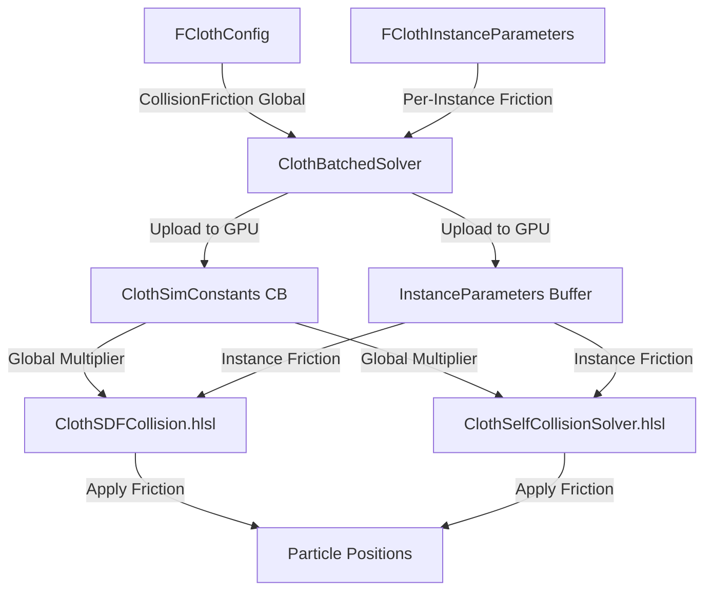

# Displacement-Based Friction Implementation Plan

## Overview

This plan details the implementation of displacement-based friction for SDF-collision and Self-collision in the cloth simulation system. The friction system will use a two-tier approach:
- **Per-Instance Friction Value**: Each cloth instance holds its own friction coefficient
- **Global Friction Multiplier**: [`FClothConfig::CollisionFriction`](EngineSIU/EngineSIU/Engine/Source/Runtime/Engine/Cloth/ClothSimulationData.h:53) serves as a global multiplier

**Final Friction = InstanceFriction × GlobalMultiplier**

## Reference Implementation

The provided GLSL reference code demonstrates the key friction algorithm:

```glsl
vec3 friction_clamp(vec3 rel_disp, vec3 n, float dn, float mu)
{
    if (mu <= 0.0 || dn <= 0.0) return vec3(0.0);
    
    // Calculate tangential vector (displacement perpendicular to normal)
    vec3 t = rel_disp - n * dot(rel_disp, n);
    float tl = length(t);
    
    if (tl < 1e-9) return vec3(0.0);
    
    // Coulomb Friction Limit: mu * NormalForce
    float max_t = mu * dn;
    
    // Static/Dynamic friction: clamp tangential movement
    float s = min(1.0, max_t / tl);
    
    return -t * s;  // Resist tangential motion
}
```

**Key Concepts:**
- **Displacement-Based**: Uses relative displacement between frames, not velocity
- **Coulomb Friction**: Friction force proportional to normal force (penetration depth)
- **Tangential Resistance**: Opposes motion perpendicular to collision normal
- **Static/Dynamic Transition**: Full stop if movement < limit, otherwise resist by limit

## Architecture



## Current State Analysis

### Existing Friction Infrastructure

1. **Global Friction Parameter** (Already Exists)
   - Location: [`FClothConfig::CollisionFriction`](EngineSIU/EngineSIU/Engine/Source/Runtime/Engine/Cloth/ClothSimulationData.h:53)
   - Default: `0.1f`
   - Uploaded to GPU: [`ClothSimConstants::CollisionFriction`](EngineSIU/EngineSIU/Shaders/Cloth/ClothCommon.hlsli:36)

2. **Current Collision Implementation**
   - **SDF Collision**: [`ClothSDFCollision.hlsl`](EngineSIU/EngineSIU/Shaders/Cloth/ClothSDFCollision.hlsl:1) - Position correction only, no friction
   - **Self Collision**: [`ClothSelfCollisionSolver.hlsl`](EngineSIU/EngineSIU/Shaders/Cloth/ClothSelfCollisionSolver.hlsl:1) - Mass-weighted separation, no friction

3. **Available Data for Friction**
   - Previous positions: [`UnifiedPositionBuffer`](EngineSIU/EngineSIU/Engine/Source/Runtime/Engine/Cloth/ClothBatchedSolver.h:207) (final positions from last frame)
   - Predicted positions: [`UnifiedPredictedBuffer`](EngineSIU/EngineSIU/Engine/Source/Runtime/Engine/Cloth/ClothBatchedSolver.h:208) (working buffer during solve)
   - Displacement = `Predicted - Previous`

### Missing Components

1. **Per-Instance Friction Parameter**
   - Not present in [`FClothInstanceParameters`](EngineSIU/EngineSIU/Engine/Source/Runtime/Engine/Cloth/ClothBatchTypes.h:47)
   - Needs to be added to support per-instance variation

2. **Friction Logic in Shaders**
   - SDF collision has TODO comment for friction (line 147-149)
   - Self-collision has no friction implementation

## Implementation Plan

### Phase 1: Data Structure Updates

#### 1.1 Add Per-Instance Friction to FClothInstanceParameters

**File**: [`ClothBatchTypes.h`](EngineSIU/EngineSIU/Engine/Source/Runtime/Engine/Cloth/ClothBatchTypes.h:47)

```cpp
struct FClothInstanceParameters
{
    // ... existing fields ...
    
    float BendStiffness;    // 4 bytes - Bend constraint multiplier
    
    // NEW: Per-instance friction coefficient
    float Friction;         // 4 bytes - Instance friction (0-1, default 1.0)
    
    // Instance identification
    uint32 ParticleOffset;   // 4 bytes - First particle index
    // ... rest of fields ...
};
```

**Update Size Assertion**: Change from 112 to 116 bytes
```cpp
static_assert(sizeof(FClothInstanceParameters) == 116, "FClothInstanceParameters must be 116 bytes");
```

**Update Constructor**:
```cpp
FClothInstanceParameters()
    : /* ... existing initializers ... */
      Friction(1.0f),  // NEW: Default to 1.0 (no attenuation)
      /* ... rest of initializers ... */
{
}
```

#### 1.2 Add Friction to HLSL FClothInstanceParameters

**File**: [`ClothCommon.hlsli`](EngineSIU/EngineSIU/Shaders/Cloth/ClothCommon.hlsli:186)

```hlsl
struct FClothInstanceParameters
{
    // ... existing fields ...
    
    float BendStiffness;    // 4 bytes
    float Friction;         // 4 bytes - NEW: Per-instance friction
    
    // Instance identification
    uint ParticleOffset;
    // ... rest of fields ...
};
```

#### 1.3 Update FClothConfig (Optional Enhancement)

**File**: [`ClothSimulationData.h`](EngineSIU/EngineSIU/Engine/Source/Runtime/Engine/Cloth/ClothSimulationData.h:20)

Add documentation and potentially a separate self-collision friction parameter:

```cpp
struct FClothConfig
{
    // ... existing fields ...
    
    // Collision
    float CollisionThickness = 1.3f;
    float CollisionFriction = 0.1f;      // Global SDF collision friction multiplier
    float SelfCollisionFriction = 0.1f;  // NEW: Global self-collision friction multiplier (optional)
    bool bEnableSelfCollision = true;
    
    // ... rest of fields ...
};
```

**Note**: If you want separate control for SDF vs Self-collision friction, add `SelfCollisionFriction`. Otherwise, reuse `CollisionFriction` for both.

### Phase 2: Shader Implementation

#### 2.1 SDF Collision Friction

**File**: [`ClothSDFCollision.hlsl`](EngineSIU/EngineSIU/Shaders/Cloth/ClothSDFCollision.hlsl:1)

**Add Previous Position Buffer**:
```hlsl
// Input buffers
StructuredBuffer<FClothCollider> Colliders : register(t0);
StructuredBuffer<float> InvMass : register(t1);
StructuredBuffer<FClothParticle> PreviousPositions : register(t2);  // NEW: For displacement calculation
StructuredBuffer<FClothInstanceParameters> InstanceParams : register(t3);  // NEW: Per-instance parameters
```

**Add Friction Helper Function**:
```hlsl
/**
 * Displacement-based friction calculation
 * Based on Coulomb friction model with tangential displacement clamping
 * 
 * @param relDisp - Relative displacement vector (current - previous)
 * @param normal - Collision normal (points away from collider)
 * @param normalForce - Normal impulse magnitude (penetration depth)
 * @param mu - Friction coefficient (0-1)
 * @return Friction correction to apply to position
 */
float3 CalculateFriction(float3 relDisp, float3 normal, float normalForce, float mu)
{
    // No friction if coefficient is zero or no normal force
    if (mu <= 0.0f || normalForce <= 0.0f)
        return float3(0, 0, 0);
    
    // Calculate tangential displacement (perpendicular to normal)
    float3 tangent = relDisp - normal * dot(relDisp, normal);
    float tangentLength = length(tangent);
    
    // Ignore negligible tangential movement
    if (tangentLength < 1e-9f)
        return float3(0, 0, 0);
    
    // Coulomb friction limit: mu * NormalForce
    float maxTangentialForce = mu * normalForce;
    
    // Calculate friction scaling factor
    // If tangent movement < limit: full static friction (stop completely)
    // If tangent movement > limit: dynamic friction (resist by limit amount)
    float scale = min(1.0f, maxTangentialForce / tangentLength);
    
    // Return friction correction (opposes tangential motion)
    return -tangent * scale;
}
```

**Update Main Kernel**:
```hlsl
[numthreads(256, 1, 1)]
void SolveCollisionsCS(uint3 DTid : SV_DispatchThreadID)
{
    uint idx = DTid.x;
    if (idx >= NumParticles)
        return;

    float invMass = InvMass[idx];
    if (invMass < EPSILON)
        return;

    // Read current and previous positions
    FClothParticle particle = PredictedRW[idx];
    float3 position = particle.Position;
    float3 previousPosition = PreviousPositions[idx].Position;
    
    // Get instance parameters for friction
    uint instanceID = particle.InstanceID;
    FClothInstanceParameters instanceParams = InstanceParams[instanceID];
    
    // Calculate displacement since last frame
    float3 displacement = position - previousPosition;
    
    // Calculate final friction coefficient (instance × global)
    float finalFriction = instanceParams.Friction * CollisionFriction;

    float3 originalPosition = position;
    bool hadCollision = false;
    float3 totalCorrection = float3(0, 0, 0);
    float3 totalFriction = float3(0, 0, 0);

    // Test against all colliders
    for (uint i = 0; i < NumColliders; i++)
    {
        FClothCollider collider = Colliders[i];
        
        float3 normal;
        float dist = QueryColliderSDF(collider, position, normal);
        
        float penetration = CollisionThickness - dist;
        
        if (penetration > 0.0f)
        {
            // Clamp correction
            float maxSingleCorrection = max(collider.Radius * 2.0f, 50.0f);
            penetration = min(penetration, maxSingleCorrection);
            
            // Position correction (normal force)
            float3 correction = normal * penetration;
            totalCorrection += correction;
            
            // Friction correction (tangential resistance)
            float3 frictionCorrection = CalculateFriction(
                displacement, 
                normal, 
                penetration,  // Use penetration as normal force proxy
                finalFriction
            );
            totalFriction += frictionCorrection;
            
            hadCollision = true;
        }
    }

    // Apply accumulated corrections
    if (hadCollision)
    {
        position += totalCorrection + totalFriction;
        
        // NaN/Inf validation
        if (any(isnan(position)) || any(isinf(position)))
        {
            position = originalPosition;
        }
        
        particle.Position = position;
        PredictedRW[idx] = particle;
    }
}
```

#### 2.2 Self-Collision Friction

**File**: [`ClothSelfCollisionSolver.hlsl`](EngineSIU/EngineSIU/Shaders/Cloth/ClothSelfCollisionSolver.hlsl:1)

**Add Previous Position Buffer and Instance Parameters**:
```hlsl
// Input buffers
StructuredBuffer<FClothParticle> PredictedRead : register(t0);
StructuredBuffer<float> InvMass : register(t1);
StructuredBuffer<uint> CellCounters : register(t2);
StructuredBuffer<uint> CellData : register(t3);
Buffer<uint> Indices : register(t4);
StructuredBuffer<FClothParticle> PreviousPositions : register(t5);  // NEW
StructuredBuffer<FClothInstanceParameters> InstanceParams : register(t6);  // NEW
```

**Add Friction Helper** (same as SDF version):
```hlsl
float3 CalculateFriction(float3 relDisp, float3 normal, float normalForce, float mu)
{
    if (mu <= 0.0f || normalForce <= 0.0f)
        return float3(0, 0, 0);
    
    float3 tangent = relDisp - normal * dot(relDisp, normal);
    float tangentLength = length(tangent);
    
    if (tangentLength < 1e-9f)
        return float3(0, 0, 0);
    
    float maxTangentialForce = mu * normalForce;
    float scale = min(1.0f, maxTangentialForce / tangentLength);
    
    return -tangent * scale;
}
```

**Update Main Kernel**:
```hlsl
[numthreads(256, 1, 1)]
void SolveSelfCollisionsCS(uint3 DTid : SV_DispatchThreadID)
{
    uint particleIdx = DTid.x;
    if (particleIdx >= NumParticles)
        return;
    
    float invMassA = InvMass[particleIdx];
    if (invMassA == 0.0f)
        return;
    
    float3 posA = PredictedRead[particleIdx].Position;
    float3 prevPosA = PreviousPositions[particleIdx].Position;
    uint instanceIDA = PredictedRead[particleIdx].InstanceID;
    
    // Get instance friction parameters
    FClothInstanceParameters paramsA = InstanceParams[instanceIDA];
    float finalFriction = paramsA.Friction * CollisionFriction;  // Or SelfCollisionFriction if separate
    
    // Calculate displacement for particle A
    float3 dispA = posA - prevPosA;
    
    uint3 cellA = GetGridCell(posA);
    
    float3 sumCorr = float3(0.0, 0.0, 0.0);
    uint sumCount = 0u;
    
    // Query 3×3×3 neighborhood
    for (int dz = -1; dz <= 1; dz++)
    {
        for (int dy = -1; dy <= 1; dy++)
        {
            for (int dx = -1; dx <= 1; dx++)
            {
                int3 neighborCell = int3(cellA) + int3(dx, dy, dz);
                
                if (any(neighborCell < int3(0, 0, 0)) || 
                    any(neighborCell >= int3(GridDimensions)))
                    continue;
                
                uint cellHash = GetCellHash(uint3(neighborCell));
                uint cellCount = min(CellCounters[cellHash], MaxParticlesPerCell);
                
                for (uint i = 0; i < cellCount; i++)
                {
                    uint particleIdxB = CellData[cellHash * MaxParticlesPerCell + i];
                    
                    if (particleIdxB == particleIdx)
                        continue;
                    
                    if (AreTopologicallyAdjacent(particleIdx, particleIdxB))
                        continue;
                    
                    // Prevent double counting: only process if i > j
                    if (particleIdx > particleIdxB)
                        continue;
                    
                    float invMassB = InvMass[particleIdxB];
                    float3 posB = PredictedRead[particleIdxB].Position;
                    float3 prevPosB = PreviousPositions[particleIdxB].Position;
                    
                    // Calculate displacement for particle B
                    float3 dispB = posB - prevPosB;
                    
                    // Collision detection
                    float3 diff = posB - posA;
                    float dist = length(diff);
                    float minDist = 2.0f * CollisionRadius;
                    
                    if (dist < minDist && dist > EPSILON)
                    {
                        float3 normal = diff / dist;
                        float penetration = minDist - dist;
                        
                        float wSum = invMassA + invMassB;
                        if (wSum < EPSILON)
                            continue;
                        
                        // Position correction (normal separation)
                        float3 correction = normal * penetration * CollisionStiffness;
                        float3 corrA = -correction * (invMassA / wSum);
                        float3 corrB = +correction * (invMassB / wSum);
                        
                        // Friction correction (tangential resistance)
                        // Calculate relative displacement
                        float3 relDisp = dispA - dispB;
                        
                        // Calculate friction in relative space
                        float3 frictionRel = CalculateFriction(
                            relDisp,
                            normal,
                            penetration,  // Use penetration as normal force proxy
                            finalFriction
                        );
                        
                        // Distribute friction based on mass ratios
                        float3 fricA = (invMassA / wSum) * frictionRel;
                        float3 fricB = -(invMassB / wSum) * frictionRel;
                        
                        // Combine position and friction corrections
                        float3 outA = corrA + fricA;
                        float3 outB = corrB + fricB;
                        
                        // Atomic accumulation (scaled to int)
                        int3 deltaA = int3(outA * kScale);
                        int3 deltaB = int3(outB * kScale);
                        
                        // Accumulate for particle A (local)
                        sumCorr += outA;
                        sumCount += 1u;
                        
                        // Accumulate for particle B (atomic)
                        InterlockedAdd(PositionDelta[particleIdxB].x, deltaB.x);
                        InterlockedAdd(PositionDelta[particleIdxB].y, deltaB.y);
                        InterlockedAdd(PositionDelta[particleIdxB].z, deltaB.z);
                        InterlockedAdd(PositionWeight[particleIdxB], 1);
                    }
                }
            }
        }
    }
    
    // Apply accumulated results for particle A
    if (sumCount > 0)
    {
        int3 deltaA = int3(sumCorr * kScale);
        InterlockedAdd(PositionDelta[particleIdx].x, deltaA.x);
        InterlockedAdd(PositionDelta[particleIdx].y, deltaA.y);
        InterlockedAdd(PositionDelta[particleIdx].z, deltaA.z);
        InterlockedAdd(PositionWeight[particleIdx], sumCount);
    }
}
```

### Phase 3: CPU-Side Integration

#### 3.1 Update ClothBatchedSolver Buffer Bindings

**File**: [`ClothBatchedSolver.cpp`](EngineSIU/EngineSIU/Engine/Source/Runtime/Engine/Cloth/ClothBatchedSolver.cpp:1)

**In `DispatchCollisionSDF` method**:
```cpp
void FClothBatchedSolver::DispatchCollisionSDF(uint32 ParticleCount)
{
    if (ParticleCount == 0 || !CollisionManager)
        return;

    ID3D11DeviceContext* context = Graphics->GetDeviceContext();
    
    // Set shader
    context->CSSetShader(CollisionSolverCS, nullptr, 0);
    
    // Bind constant buffer
    context->CSSetConstantBuffers(0, 1, &BatchSimConstantBuffer);
    
    // Bind SRVs
    ID3D11ShaderResourceView* srvs[] = {
        CollisionManager->GetColliderBufferSRV(),  // t0: Colliders
        UnifiedInvMassSRV,                         // t1: InvMass
        UnifiedPositionSRV,                        // t2: Previous positions (NEW)
        InstanceParameterSRV                       // t3: Instance parameters (NEW)
    };
    context->CSSetShaderResources(0, 4, srvs);  // Changed from 2 to 4
    
    // Bind UAV
    context->CSSetUnorderedAccessViews(0, 1, &UnifiedPredictedUAV, nullptr);
    
    // Dispatch
    uint32 dispatchCount = GetDispatchCount(ParticleCount, 256);
    context->Dispatch(dispatchCount, 1, 1);
    
    // Unbind
    ID3D11ShaderResourceView* nullSRVs[4] = { nullptr };
    context->CSSetShaderResources(0, 4, nullSRVs);
    ID3D11UnorderedAccessView* nullUAVs[1] = { nullptr };
    context->CSSetUnorderedAccessViews(0, 1, nullUAVs, nullptr);
}
```

**In `DispatchSelfCollision` method**:
```cpp
void FClothBatchedSolver::DispatchSelfCollision(uint32 ParticleCount)
{
    if (!Config.bEnableSelfCollision || ParticleCount == 0)
        return;

    ID3D11DeviceContext* context = Graphics->GetDeviceContext();
    
    // Pass 2: Solve self-collisions
    context->CSSetShader(SelfCollisionSolverCS, nullptr, 0);
    
    // Bind constant buffers
    ID3D11Buffer* constantBuffers[] = {
        BatchSimConstantBuffer,
        SelfCollisionParamsBuffer
    };
    context->CSSetConstantBuffers(0, 2, constantBuffers);
    
    // Bind SRVs
    ID3D11ShaderResourceView* srvs[] = {
        UnifiedPredictedSRV,                // t0: Predicted positions
        UnifiedInvMassSRV,                  // t1: InvMass
        SelfCollisionCellCountersSRV,      // t2: Cell counters
        SelfCollisionCellDataSRV,           // t3: Cell data
        UnifiedIndexSRV,                    // t4: Indices
        UnifiedPositionSRV,                 // t5: Previous positions (NEW)
        InstanceParameterSRV                // t6: Instance parameters (NEW)
    };
    context->CSSetShaderResources(0, 7, srvs);  // Changed from 5 to 7
    
    // Bind UAVs
    ID3D11UnorderedAccessView* uavs[] = {
        UnifiedPositionDeltaUAV,
        UnifiedPositionWeightUAV
    };
    context->CSSetUnorderedAccessViews(0, 2, uavs, nullptr);
    
    // Dispatch
    uint32 dispatchCount = GetDispatchCount(ParticleCount, 256);
    context->Dispatch(dispatchCount, 1, 1);
    
    // Unbind
    ID3D11ShaderResourceView* nullSRVs[7] = { nullptr };
    context->CSSetShaderResources(0, 7, nullSRVs);
    ID3D11UnorderedAccessView* nullUAVs[2] = { nullptr };
    context->CSSetUnorderedAccessViews(0, 2, nullUAVs, nullptr);
}
```

#### 3.2 Initialize Per-Instance Friction Values

**File**: [`ClothBatchManager.cpp`](EngineSIU/EngineSIU/Engine/Source/Runtime/Engine/Cloth/ClothBatchManager.cpp:1)

When creating instance parameters from creation params:

```cpp
FClothInstanceParameters params;
params.Gravity = creationParams.Config.Gravity;
params.GravityMultiplier = 1.0f;
params.Wind = FVector::ZeroVector;
params.WindStrength = creationParams.Config.WindStrength;
params.AirDrag = creationParams.Config.AirDrag;
params.Damping = creationParams.Config.Damping;
params.StretchStiffness = creationParams.Config.StretchStiffness;
params.BendStiffness = creationParams.Config.BendStiffness;
params.Friction = 1.0f;  // NEW: Default to 1.0 (no attenuation of global friction)
// ... rest of initialization ...
```

#### 3.3 Add API for Runtime Friction Updates

**File**: [`ClothInstanceHandle.h`](EngineSIU/EngineSIU/Engine/Source/Runtime/Engine/Cloth/ClothInstanceHandle.h:1)

```cpp
class FClothInstanceHandle
{
public:
    // ... existing methods ...
    
    // NEW: Friction control
    void SetFriction(float InFriction);
    float GetFriction() const { return Parameters.Friction; }
    
    // ... rest of class ...
};
```

**File**: [`ClothInstanceHandle.cpp`](EngineSIU/EngineSIU/Engine/Source/Runtime/Engine/Cloth/ClothInstanceHandle.cpp:1)

```cpp
void FClothInstanceHandle::SetFriction(float InFriction)
{
    Parameters.Friction = FMath::Clamp(InFriction, 0.0f, 10.0f);  // Allow values > 1.0 for extra friction
    
    // Mark parameters as dirty for next upload
    if (BatchManager)
    {
        BatchManager->MarkInstanceParametersDirty(MetadataIndex);
    }
}
```

### Phase 4: Testing and Validation

#### 4.1 Test Scenarios

1. **SDF Collision Friction Test**
   - Create cloth falling onto a tilted box collider
   - Without friction: cloth should slide down
   - With friction: cloth should stick/slow down
   - Test varying instance friction (0.0, 0.5, 1.0, 2.0)

2. **Self-Collision Friction Test**
   - Create cloth with self-collision enabled
   - Drop cloth onto itself (folding scenario)
   - Without friction: layers slide freely
   - With friction: layers resist sliding

3. **Multi-Instance Test**
   - Create multiple cloth instances with different friction values
   - Instance A: Friction = 0.0 (frictionless)
   - Instance B: Friction = 1.0 (normal)
   - Instance C: Friction = 2.0 (high friction)
   - Verify each behaves independently

4. **Global Multiplier Test**
   - Set all instances to Friction = 1.0
   - Vary [`FClothConfig::CollisionFriction`](EngineSIU/EngineSIU/Engine/Source/Runtime/Engine/Cloth/ClothSimulationData.h:53) (0.0, 0.1, 0.5, 1.0)
   - Verify global control affects all instances proportionally

#### 4.2 Performance Validation

- **Measure GPU time** for collision passes before/after friction
- Expected overhead: ~5-10% (additional vector math per collision)
- Profile with PIX or RenderDoc to identify bottlenecks

#### 4.3 Visual Validation

- Enable collision visualization (PIE mode)
- Verify friction corrections are applied in correct direction
- Check for NaN/Inf issues with extreme friction values
- Validate tangential vs normal force separation

## Implementation Checklist

### Data Structures
- [ ] Add `Friction` field to [`FClothInstanceParameters`](EngineSIU/EngineSIU/Engine/Source/Runtime/Engine/Cloth/ClothBatchTypes.h:47) (C++)
- [ ] Update size assertion (112 → 116 bytes)
- [ ] Add `Friction` field to HLSL [`FClothInstanceParameters`](EngineSIU/EngineSIU/Shaders/Cloth/ClothCommon.hlsli:186)
- [ ] (Optional) Add `SelfCollisionFriction` to [`FClothConfig`](EngineSIU/EngineSIU/Engine/Source/Runtime/Engine/Cloth/ClothSimulationData.h:20)
- [ ] Update serialization operators if needed

### Shader Implementation
- [ ] Add `CalculateFriction()` helper to [`ClothSDFCollision.hlsl`](EngineSIU/EngineSIU/Shaders/Cloth/ClothSDFCollision.hlsl:1)
- [ ] Update SDF collision kernel to bind previous positions and instance params
- [ ] Integrate friction calculation in SDF collision response
- [ ] Add `CalculateFriction()` helper to [`ClothSelfCollisionSolver.hlsl`](EngineSIU/EngineSIU/Shaders/Cloth/ClothSelfCollisionSolver.hlsl:1)
- [ ] Update self-collision kernel to bind previous positions and instance params
- [ ] Integrate friction calculation in self-collision response

### CPU Integration
- [ ] Update [`DispatchCollisionSDF()`](EngineSIU/EngineSIU/Engine/Source/Runtime/Engine/Cloth/ClothBatchedSolver.cpp:1) buffer bindings
- [ ] Update [`DispatchSelfCollision()`](EngineSIU/EngineSIU/Engine/Source/Runtime/Engine/Cloth/ClothBatchedSolver.cpp:1) buffer bindings
- [ ] Initialize default friction value in instance creation
- [ ] Add `SetFriction()` / `GetFriction()` to [`FClothInstanceHandle`](EngineSIU/EngineSIU/Engine/Source/Runtime/Engine/Cloth/ClothInstanceHandle.h:1)
- [ ] Implement parameter dirty marking for runtime updates

### Testing
- [ ] Test SDF collision friction (tilted surface test)
- [ ] Test self-collision friction (folding test)
- [ ] Test multi-instance with varying friction
- [ ] Test global multiplier control
- [ ] Performance profiling (GPU timing)
- [ ] Visual validation (PIE collision visualization)
- [ ] Edge case testing (friction = 0, friction > 1, NaN handling)

## Technical Notes

### Displacement vs Velocity

**Why Displacement-Based?**
- Your solver uses position-based dynamics (PBD/XPBD)
- Velocities are derived from position changes, not primary state
- Displacement = `PredictedPosition - PreviousPosition` is readily available
- More stable for position-based solvers

**Alternative (Velocity-Based)**:
- Would require reading velocity buffer
- Less accurate for PBD (velocities are post-correction)
- Reference code uses displacement, proven approach

### Normal Force Approximation

The reference code uses penetration depth as a proxy for normal force:
```glsl
float dn = abs(dLam);  // Normal impulse magnitude
```

In your implementation:
- **SDF Collision**: Use `penetration` directly (distance pushed out)
- **Self-Collision**: Use `penetration` (separation distance)

This is physically reasonable because:
- Deeper penetration → stronger normal correction → more friction resistance
- Matches Coulomb friction model (F_friction ∝ F_normal)

### Friction Coefficient Ranges

- **0.0**: Frictionless (ice-like)
- **0.1-0.3**: Low friction (silk, satin)
- **0.5-0.8**: Medium friction (cotton, linen)
- **1.0+**: High friction (rubber, velcro)

Allow values > 1.0 for artistic control (super-sticky cloth).

### Performance Considerations

**Optimization Opportunities**:
1. **Early Exit**: Skip friction if `mu <= 0` or `penetration <= 0`
2. **Tangent Length Check**: Skip if tangential movement is negligible
3. **Shared Memory**: Cache previous positions in shared memory for self-collision
4. **Precision**: Use `float` precision (not `double`) for GPU efficiency

**Expected Cost**:
- ~3-5 additional vector operations per collision
- Negligible compared to SDF queries and atomic operations
- Should be < 10% overhead on collision passes

## Future Enhancements

### Anisotropic Friction
Support different friction along cloth warp/weft directions:
```cpp
struct FClothInstanceParameters
{
    float FrictionU;  // Friction along U direction
    float FrictionV;  // Friction along V direction
};
```

### Velocity-Dependent Friction
Transition between static and dynamic friction based on velocity:
```hlsl
float mu_dynamic = mu_static * 0.7f;  // Dynamic friction typically lower
float speed = length(velocity);
float mu = lerp(mu_static, mu_dynamic, saturate(speed / threshold));
```

### Material-Specific Friction
Store friction in cloth material asset:
```cpp
struct FClothMaterialAsset
{
    float Friction;
    float Roughness;
    // ... other material properties ...
};
```

## References

- **Reference Implementation**: Provided GLSL friction code (neighbor collision solver)
- **Coulomb Friction Model**: Classical friction model (F_friction = μ × F_normal)
- **PBD/XPBD**: Position-based dynamics framework (Müller et al.)
- **Displacement-Based Friction**: Common in position-based solvers (Velvet, Flex)

## Summary

This implementation adds displacement-based friction to both SDF and self-collision systems using a two-tier approach:

1. **Per-Instance Control**: Each cloth instance has its own friction coefficient
2. **Global Multiplier**: [`FClothConfig::CollisionFriction`](EngineSIU/EngineSIU/Engine/Source/Runtime/Engine/Cloth/ClothSimulationData.h:53) scales all instances

The friction algorithm:
- Calculates tangential displacement (perpendicular to collision normal)
- Applies Coulomb friction limit (μ × normal force)
- Resists tangential motion proportionally to normal force
- Handles static/dynamic friction transition naturally

This approach is physically plausible, computationally efficient, and provides intuitive artistic control over cloth behavior.
