# Self-Collision System Refactor: Adaptive Spatial Hashing Implementation Plan

## Executive Summary

This plan details the refactoring of the spatial hash-based self-collision system to automatically compute adaptive grid parameters per cloth instance with **GPU-based dynamic bounds tracking**, eliminating hardcoded values and enabling natural collision behavior across cloths with different resolutions and motion scenarios.

### Core Features (Mandatory)
1. **Adaptive Parameter Computation** - Per-cloth mesh analysis at initialization
2. **GPU-Based AABB Computation** - Parallel reduction shader for real-time bounds
3. **Dynamic Bounds Tracking** - Frame-to-frame motion detection and grid updates
4. **Multiplier-Based Configuration** - Artist-friendly tuning controls
5. **Comprehensive Validation** - Automatic diagnostics and warnings

---

## Current State Analysis

### Identified Hardcoded Parameters

**Location**: [`ClothBatchedSolver.cpp:2296-2308`](EngineSIU/EngineSIU/Engine/Source/Runtime/Engine/Cloth/ClothBatchedSolver.cpp:2296)

```cpp
void FClothBatchedSolver::UpdateSelfCollisionParams()
{
    // HARDCODED: Fixed grid bounds (5m × 5m × 5m)
    FVector gridMin = FVector(-5.0f, -5.0f, 0.0f);
    
    // HARDCODED: Assumed average edge length (10cm)
    float avgEdgeLength = 0.5f;
    
    // HARDCODED: Static cell size calculation
    float cellSize = avgEdgeLength * 2.0f;
    
    // Uses global config values (not per-cloth adaptive)
    SelfCollisionParams.GridDimX = Config.SelfCollisionGridDim;
    SelfCollisionParams.CollisionRadius = Config.SelfCollisionRadius;
    SelfCollisionParams.CollisionStiffness = Config.SelfCollisionStiffness;
}
```

**Location**: [`ClothSimulationData.h:56-59`](EngineSIU/EngineSIU/Engine/Source/Runtime/Engine/Cloth/ClothSimulationData.h:56)

```cpp
// Absolute values (not adaptive)
float SelfCollisionRadius = 0.01f;      // 0.01 world units (1cm)
float SelfCollisionStiffness = 0.01f;   // Absolute stiffness value
uint32 SelfCollisionGridDim = 32;       // Fixed grid dimension
uint32 SelfCollisionMaxPerCell = 16;    // Fixed max particles per cell
```

### Existing Infrastructure to Reuse

#### ✅ Existing Structures (DO NOT DUPLICATE)

1. **[`FClothInstanceMetadata`](EngineSIU/EngineSIU/Engine/Source/Runtime/Engine/Cloth/ClothBatchTypes.h:95)** - Already stores per-instance buffer ranges
   - Has: ParticleOffset, ParticleCount, ConstraintOffset, etc.
   - **EXTEND THIS** with adaptive parameters

2. **[`FClothConfig`](EngineSIU/EngineSIU/Engine/Source/Runtime/Engine/Cloth/ClothSimulationData.h:20)** - Global configuration
   - Has: SelfCollisionRadius, SelfCollisionStiffness, SelfCollisionGridDim
   - **CONVERT TO MULTIPLIERS** instead of absolute values

3. **[`FClothSelfCollisionParams`](EngineSIU/EngineSIU/Engine/Source/Runtime/Engine/Cloth/ClothGPUStructs.h:227)** - GPU constant buffer
   - Already has: GridMin, CellSize, GridDimensions, CollisionRadius
   - **KEEP AS-IS** (receives computed values)

4. **[`FClothInstanceParameters`](EngineSIU/EngineSIU/Engine/Source/Runtime/Engine/Cloth/ClothBatchTypes.h:47)** - Per-instance GPU parameters
   - Already has per-instance offsets and counts
   - **COULD EXTEND** if per-instance self-collision params needed on GPU

#### ✅ Existing Functions (CHECK BEFORE CREATING)

1. **Constraint Generation** - [`ClothAssetGenerator.cpp`](EngineSIU/EngineSIU/Engine/Source/Runtime/Engine/Cloth/ClothAssetGenerator.h:155)
   - `GeneratePhysicsConstraints()` - Already computes edge lengths for constraints
   - **REUSE** this logic for average edge length computation

2. **Mesh Analysis** - Check if exists in `ClothAssetGenerator` or `ClothMeshDecimator`
   - May already have AABB computation
   - May already have edge length analysis

#### ❌ Missing Components (NEED TO CREATE)

1. **Per-Cloth Adaptive Parameters Storage** - Extend `FClothInstanceMetadata`
2. **Mesh Analysis Functions** - If not in existing code
3. **Adaptive Parameter Computation** - New logic in `UpdateSelfCollisionParams()`
4. **Validation Functions** - New diagnostic checks

---

## Implementation Plan

### Phase 0: Codebase Analysis ✅ COMPLETED

**Findings**:
- ✅ `FClothInstanceMetadata` exists and should be extended
- ✅ `FClothConfig` exists and needs multiplier conversion
- ✅ `FClothSelfCollisionParams` exists and is correct
- ✅ Constraint generation exists in `ClothAssetGenerator`
- ❌ No existing average edge length computation function found
- ❌ No existing dynamic AABB computation for runtime

---

### Phase 1: Implement Mesh Analysis Functions

**Goal**: Create utility functions to compute adaptive parameters from mesh topology.

#### 1.1 Add to `FClothInstanceMetadata` (Extend Existing)

**File**: [`ClothBatchTypes.h:95`](EngineSIU/EngineSIU/Engine/Source/Runtime/Engine/Cloth/ClothBatchTypes.h:95)

```cpp
struct FClothInstanceMetadata
{
    // ... existing fields ...
    
    // NEW: Adaptive self-collision parameters (computed at initialization)
    float AvgEdgeLength;        // Average edge length in world units
    FVector MeshBoundsMin;      // Dynamic AABB min (updated per frame)
    FVector MeshBoundsMax;      // Dynamic AABB max (updated per frame)
    FVector PrevBoundsMin;      // Previous frame bounds (for motion tracking)
    FVector PrevBoundsMax;      // Previous frame bounds (for motion tracking)
    float AdaptiveCellSize;     // Computed: AvgEdgeLength × 1.5
    float AdaptiveCollisionRadius; // Computed: AvgEdgeLength × 0.5
    uint32 AdaptiveGridDimX;    // Computed from bounds and cell size
    uint32 AdaptiveGridDimY;
    uint32 AdaptiveGridDimZ;
    uint32 AdaptiveMaxPerCell;  // Computed from particle density
    
    // NEW: Dynamic bounds tracking state
    float AccumulatedMotion;    // Accumulated displacement since last bounds update
    uint32 FramesSinceLastBoundsUpdate; // Frame counter for periodic updates
    bool bNeedsBoundsUpdate;    // Flag to trigger bounds recomputation
    
    FClothInstanceMetadata()
        : /* existing initializers */
        , AvgEdgeLength(0.0f)
        , MeshBoundsMin(FVector::ZeroVector)
        , MeshBoundsMax(FVector::ZeroVector)
        , PrevBoundsMin(FVector::ZeroVector)
        , PrevBoundsMax(FVector::ZeroVector)
        , AdaptiveCellSize(0.0f)
        , AdaptiveCollisionRadius(0.0f)
        , AdaptiveGridDimX(0)
        , AdaptiveGridDimY(0)
        , AdaptiveGridDimZ(0)
        , AdaptiveMaxPerCell(0)
        , AccumulatedMotion(0.0f)
        , FramesSinceLastBoundsUpdate(0)
        , bNeedsBoundsUpdate(false)
    {
    }
};
```

#### 1.2 Create Mesh Analysis Utility Class

**New File**: `EngineSIU/EngineSIU/Engine/Source/Runtime/Engine/Cloth/ClothMeshAnalysis.h`

```cpp
#pragma once

#include "Core/HAL/PlatformType.h"
#include "Core/Container/Array.h"
#include "Core/Math/Vector.h"

/**
 * Cloth Mesh Analysis Utilities
 * Provides functions to analyze mesh topology and compute adaptive parameters
 */
class FClothMeshAnalysis
{
public:
    /**
     * Compute average edge length from mesh topology
     * @param Positions - Vertex positions (world space)
     * @param Indices - Triangle indices
     * @return Average edge length in world units
     */
    static float ComputeAverageEdgeLength(
        const TArray<FVector>& Positions,
        const TArray<uint32>& Indices
    );
    
    /**
     * Compute axis-aligned bounding box from positions
     * @param Positions - Vertex positions (world space)
     * @param OutMin - Output AABB min
     * @param OutMax - Output AABB max
     */
    static void ComputeAABB(
        const TArray<FVector>& Positions,
        FVector& OutMin,
        FVector& OutMax
    );
    
    /**
     * Compute adaptive spatial hash parameters for self-collision
     * Based on Müller et al. recommendations
     * 
     * @param AvgEdgeLength - Average edge length
     * @param BoundsMin - Mesh AABB min
     * @param BoundsMax - Mesh AABB max
     * @param ParticleCount - Number of particles
     * @param OutCellSize - Output cell size (AvgEdgeLength × 1.0~1.5)
     * @param OutCollisionRadius - Output collision radius (AvgEdgeLength × 0.5)
     * @param OutGridMin - Output grid min (BoundsMin - margin)
     * @param OutGridMax - Output grid max (BoundsMax + margin)
     * @param OutGridDimX/Y/Z - Output grid dimensions
     * @param OutMaxPerCell - Output max particles per cell
     */
    static void ComputeAdaptiveSpatialHashParams(
        float AvgEdgeLength,
        const FVector& BoundsMin,
        const FVector& BoundsMax,
        uint32 ParticleCount,
        float& OutCellSize,
        float& OutCollisionRadius,
        FVector& OutGridMin,
        FVector& OutGridMax,
        uint32& OutGridDimX,
        uint32& OutGridDimY,
        uint32& OutGridDimZ,
        uint32& OutMaxPerCell
    );
    
    /**
     * Estimate average particles per cell for capacity planning
     */
    static uint32 EstimateAverageParticlesPerCell(
        uint32 ParticleCount,
        uint32 GridDimX,
        uint32 GridDimY,
        uint32 GridDimZ
    );
};
```

**New File**: `EngineSIU/EngineSIU/Engine/Source/Runtime/Engine/Cloth/ClothMeshAnalysis.cpp`

```cpp
#include "ClothMeshAnalysis.h"
#include "Core/Math/MathUtility.h"
#include "Engine/UserInterface/Console.h"
#include <unordered_set>

float FClothMeshAnalysis::ComputeAverageEdgeLength(
    const TArray<FVector>& Positions,
    const TArray<uint32>& Indices)
{
    if (Positions.Num() == 0 || Indices.Num() < 3)
        return 0.0f;
    
    // Use hash set to avoid counting edges twice
    std::unordered_set<uint64> uniqueEdges;
    float totalLength = 0.0f;
    uint32 edgeCount = 0;
    
    // Iterate through triangles
    for (int32 i = 0; i < Indices.Num(); i += 3)
    {
        uint32 idx0 = Indices[i];
        uint32 idx1 = Indices[i + 1];
        uint32 idx2 = Indices[i + 2];
        
        // Process three edges of triangle
        uint32 edges[3][2] = {
            {idx0, idx1},
            {idx1, idx2},
            {idx2, idx0}
        };
        
        for (int32 e = 0; e < 3; ++e)
        {
            uint32 a = edges[e][0];
            uint32 b = edges[e][1];
            
            // Ensure consistent ordering (a < b)
            if (a > b) std::swap(a, b);
            
            // Create unique edge key
            uint64 edgeKey = (static_cast<uint64>(a) << 32) | b;
            
            // Skip if already processed
            if (uniqueEdges.find(edgeKey) != uniqueEdges.end())
                continue;
            
            uniqueEdges.insert(edgeKey);
            
            // Compute edge length
            if (a < static_cast<uint32>(Positions.Num()) && 
                b < static_cast<uint32>(Positions.Num()))
            {
                float length = (Positions[b] - Positions[a]).Size();
                totalLength += length;
                edgeCount++;
            }
        }
    }
    
    if (edgeCount == 0)
        return 0.0f;
    
    return totalLength / edgeCount;
}

void FClothMeshAnalysis::ComputeAABB(
    const TArray<FVector>& Positions,
    FVector& OutMin,
    FVector& OutMax)
{
    if (Positions.Num() == 0)
    {
        OutMin = FVector::ZeroVector;
        OutMax = FVector::ZeroVector;
        return;
    }
    
    OutMin = Positions[0];
    OutMax = Positions[0];
    
    for (int32 i = 1; i < Positions.Num(); ++i)
    {
        OutMin.X = FMath::Min(OutMin.X, Positions[i].X);
        OutMin.Y = FMath::Min(OutMin.Y, Positions[i].Y);
        OutMin.Z = FMath::Min(OutMin.Z, Positions[i].Z);
        
        OutMax.X = FMath::Max(OutMax.X, Positions[i].X);
        OutMax.Y = FMath::Max(OutMax.Y, Positions[i].Y);
        OutMax.Z = FMath::Max(OutMax.Z, Positions[i].Z);
    }
}

void FClothMeshAnalysis::ComputeAdaptiveSpatialHashParams(
    float AvgEdgeLength,
    const FVector& BoundsMin,
    const FVector& BoundsMax,
    uint32 ParticleCount,
    float& OutCellSize,
    float& OutCollisionRadius,
    FVector& OutGridMin,
    FVector& OutGridMax,
    uint32& OutGridDimX,
    uint32& OutGridDimY,
    uint32& OutGridDimZ,
    uint32& OutMaxPerCell)
{
    // Müller et al. recommendations:
    // - Cell size: 1.0~1.5 × average edge length
    // - Collision radius: 0.5 × average edge length
    
    OutCellSize = AvgEdgeLength * 1.5f;
    OutCollisionRadius = AvgEdgeLength * 0.5f;
    
    // Add margin to bounds (2× cell size for safety)
    float margin = OutCellSize * 2.0f;
    OutGridMin = BoundsMin - FVector(margin, margin, margin);
    OutGridMax = BoundsMax + FVector(margin, margin, margin);
    
    // Compute grid dimensions
    FVector extent = OutGridMax - OutGridMin;
    OutGridDimX = FMath::Max(1u, static_cast<uint32>(FMath::CeilToInt(extent.X / OutCellSize)));
    OutGridDimY = FMath::Max(1u, static_cast<uint32>(FMath::CeilToInt(extent.Y / OutCellSize)));
    OutGridDimZ = FMath::Max(1u, static_cast<uint32>(FMath::CeilToInt(extent.Z / OutCellSize)));
    
    // Clamp grid dimensions to reasonable limits (prevent excessive memory)
    const uint32 MaxGridDim = 128;
    OutGridDimX = FMath::Min(OutGridDimX, MaxGridDim);
    OutGridDimY = FMath::Min(OutGridDimY, MaxGridDim);
    OutGridDimZ = FMath::Min(OutGridDimZ, MaxGridDim);
    
    // Compute max particles per cell
    uint32 avgPerCell = EstimateAverageParticlesPerCell(
        ParticleCount, OutGridDimX, OutGridDimY, OutGridDimZ);
    
    // Use 3× average as max (with minimum of 32)
    OutMaxPerCell = FMath::Max(32u, avgPerCell * 3);
}

uint32 FClothMeshAnalysis::EstimateAverageParticlesPerCell(
    uint32 ParticleCount,
    uint32 GridDimX,
    uint32 GridDimY,
    uint32 GridDimZ)
{
    uint32 totalCells = GridDimX * GridDimY * GridDimZ;
    if (totalCells == 0)
        return 0;
    
    // Assume uniform distribution (conservative estimate)
    return (ParticleCount + totalCells - 1) / totalCells;
}
```

---

### Phase 2: Extend Metadata Structures

**Goal**: Store computed adaptive parameters per cloth instance.

#### 2.1 Update `FClothInstanceMetadata` (Already shown in Phase 1.1)

#### 2.2 Add Computation Call During Instance Creation

**File**: `ClothBatchManager.cpp` (or wherever instances are created)

```cpp
// After uploading particle data, compute adaptive parameters
FClothInstanceMetadata& metadata = InstanceMetadata[handle.Index];

// Compute average edge length
metadata.AvgEdgeLength = FClothMeshAnalysis::ComputeAverageEdgeLength(
    params.RestPositions, params.Indices);

// Compute AABB (from current positions, not rest positions)
FClothMeshAnalysis::ComputeAABB(
    params.RestPositions, 
    metadata.MeshBoundsMin, 
    metadata.MeshBoundsMax);

// Compute adaptive spatial hash parameters
FClothMeshAnalysis::ComputeAdaptiveSpatialHashParams(
    metadata.AvgEdgeLength,
    metadata.MeshBoundsMin,
    metadata.MeshBoundsMax,
    metadata.ParticleCount,
    metadata.AdaptiveCellSize,
    metadata.AdaptiveCollisionRadius,
    /* OutGridMin/Max computed internally */,
    metadata.AdaptiveGridDimX,
    metadata.AdaptiveGridDimY,
    metadata.AdaptiveGridDimZ,
    metadata.AdaptiveMaxPerCell);

// Log computed parameters
UE_LOG(ELogLevel::Display, 
    TEXT("Cloth Instance %d: AvgEdgeLength=%.3f, CellSize=%.3f, CollisionRadius=%.3f, Grid=%ux%ux%u"),
    handle.Index, metadata.AvgEdgeLength, metadata.AdaptiveCellSize, 
    metadata.AdaptiveCollisionRadius,
    metadata.AdaptiveGridDimX, metadata.AdaptiveGridDimY, metadata.AdaptiveGridDimZ);
```

---

### Phase 3: Refactor `UpdateSelfCollisionParams()`

**Goal**: Remove hardcoded values and use computed adaptive parameters.

**File**: [`ClothBatchedSolver.cpp:2296`](EngineSIU/EngineSIU/Engine/Source/Runtime/Engine/Cloth/ClothBatchedSolver.cpp:2296)

#### 3.1 Add Access to Instance Metadata

The solver needs access to instance metadata. Options:

**Option A**: Pass metadata array to solver during initialization
**Option B**: Compute unified parameters from all active instances (recommended for batched solver)

#### 3.2 Refactored `UpdateSelfCollisionParams()`

```cpp
void FClothBatchedSolver::UpdateSelfCollisionParams(
    const TArray<FClothInstanceMetadata>& InstanceMetadata)
{
    if (!Graphics || !Graphics->DeviceContext || !SelfCollisionParamsBuffer)
        return;
    
    if (InstanceMetadata.Num() == 0)
        return;
    
    // STRATEGY: Use median or weighted average of all active instances
    // This ensures the spatial hash works reasonably well for all cloths
    
    TArray<float> avgEdgeLengths;
    TArray<float> cellSizes;
    TArray<float> collisionRadii;
    FVector globalMin = FVector(FLT_MAX, FLT_MAX, FLT_MAX);
    FVector globalMax = FVector(-FLT_MAX, -FLT_MAX, -FLT_MAX);
    
    // Collect parameters from all active instances
    for (const FClothInstanceMetadata& meta : InstanceMetadata)
    {
        if (!meta.bIsActive || meta.AvgEdgeLength == 0.0f)
            continue;
        
        avgEdgeLengths.Add(meta.AvgEdgeLength);
        cellSizes.Add(meta.AdaptiveCellSize);
        collisionRadii.Add(meta.AdaptiveCollisionRadius);
        
        // Expand global bounds
        globalMin.X = FMath::Min(globalMin.X, meta.MeshBoundsMin.X);
        globalMin.Y = FMath::Min(globalMin.Y, meta.MeshBoundsMin.Y);
        globalMin.Z = FMath::Min(globalMin.Z, meta.MeshBoundsMin.Z);
        
        globalMax.X = FMath::Max(globalMax.X, meta.MeshBoundsMax.X);
        globalMax.Y = FMath::Max(globalMax.Y, meta.MeshBoundsMax.Y);
        globalMax.Z = FMath::Max(globalMax.Z, meta.MeshBoundsMax.Z);
    }
    
    if (avgEdgeLengths.Num() == 0)
    {
        UE_LOG(ELogLevel::Warning, TEXT("No active cloth instances for self-collision"));
        return;
    }
    
    // Use MEDIAN for robustness (not affected by outliers)
    avgEdgeLengths.Sort();
    cellSizes.Sort();
    collisionRadii.Sort();
    
    int32 medianIdx = avgEdgeLengths.Num() / 2;
    float medianCellSize = cellSizes[medianIdx];
    float medianCollisionRadius = collisionRadii[medianIdx];
    
    // Apply multipliers from config (artist control)
    float finalCellSize = medianCellSize * Config.SelfCollisionCellSizeMultiplier;
    float finalCollisionRadius = medianCollisionRadius * Config.SelfCollisionRadiusMultiplier;
    
    // Add margin to global bounds
    float margin = finalCellSize * 2.0f;
    FVector gridMin = globalMin - FVector(margin, margin, margin);
    FVector gridMax = globalMax + FVector(margin, margin, margin);
    
    // Compute grid dimensions
    FVector extent = gridMax - gridMin;
    uint32 gridDimX = FMath::Max(1u, static_cast<uint32>(FMath::CeilToInt(extent.X / finalCellSize)));
    uint32 gridDimY = FMath::Max(1u, static_cast<uint32>(FMath::CeilToInt(extent.Y / finalCellSize)));
    uint32 gridDimZ = FMath::Max(1u, static_cast<uint32>(FMath::CeilToInt(extent.Z / finalCellSize)));
    
    // Clamp to reasonable limits
    const uint32 MaxGridDim = 128;
    gridDimX = FMath::Min(gridDimX, MaxGridDim);
    gridDimY = FMath::Min(gridDimY, MaxGridDim);
    gridDimZ = FMath::Min(gridDimZ, MaxGridDim);
    
    // Fill params
    SelfCollisionParams.GridMin = gridMin;
    SelfCollisionParams.CellSize = finalCellSize;
    SelfCollisionParams.GridDimX = gridDimX;
    SelfCollisionParams.GridDimY = gridDimY;
    SelfCollisionParams.GridDimZ = gridDimZ;
    SelfCollisionParams.MaxParticlesPerCell = Config.SelfCollisionMaxPerCell;
    SelfCollisionParams.CollisionRadius = finalCollisionRadius;
    SelfCollisionParams.CollisionStiffness = Config.SelfCollisionStiffness * Config.SelfCollisionStiffnessMultiplier;
    SelfCollisionParams.bEnableSelfCollision = Config.bEnableSelfCollision ? 1 : 0;
    SelfCollisionParams.Padding = 0;
    
    // Upload to GPU
    D3D11_MAPPED_SUBRESOURCE msr;
    HRESULT hr = Graphics->DeviceContext->Map(SelfCollisionParamsBuffer, 0, D3D11_MAP_WRITE_DISCARD, 0, &msr);
    if (SUCCEEDED(hr))
    {
        memcpy(msr.pData, &SelfCollisionParams, sizeof(FClothSelfCollisionParams));
        Graphics->DeviceContext->Unmap(SelfCollisionParamsBuffer, 0);
    }
    
    // Log computed parameters
    UE_LOG(ELogLevel::Display, 
        TEXT("Self-Collision: GridMin=(%.1f,%.1f,%.1f), CellSize=%.3f, Grid=%ux%ux%u, Radius=%.3f"),
        gridMin.X, gridMin.Y, gridMin.Z, finalCellSize,
        gridDimX, gridDimY, gridDimZ, finalCollisionRadius);
}
```

---

### Phase 4: GPU-Based AABB Computation (MANDATORY)

**Goal**: Implement parallel reduction compute shader for real-time bounds computation on GPU.

#### 4.1 Update `FClothSelfCollisionParams` Structure

**File**: [`ClothGPUStructs.h:227`](EngineSIU/EngineSIU/Engine/Source/Runtime/Engine/Cloth/ClothGPUStructs.h:227)

```cpp
struct FClothSelfCollisionParams
{
    FVector GridMin;           // 12 bytes - AABB min (updated from GPU bounds)
    float CellSize;            // 4 bytes
    
    uint32 GridDimX;           // 4 bytes
    uint32 GridDimY;           // 4 bytes
    uint32 GridDimZ;           // 4 bytes
    uint32 MaxParticlesPerCell; // 4 bytes
    
    float CollisionRadius;     // 4 bytes - Particle radius
    float CollisionStiffness;  // 4 bytes - Separation strength
    uint32 bEnableSelfCollision; // 4 bytes
    uint32 bBoundsNeedUpdate;  // 4 bytes - NEW: Flag for bounds update
    // Total: 48 bytes (aligned)
};
```

#### 4.2 Create GPU Bounds Buffer Structure

**File**: `ClothGPUStructs.h` (add new structure)

```cpp
/**
 * GPU bounds buffer for parallel reduction
 * Stores min/max bounds computed from particle positions
 */
struct FClothBoundsGPU
{
    FVector BoundsMin;  // 12 bytes
    float Padding0;     // 4 bytes
    FVector BoundsMax;  // 12 bytes
    float Padding1;     // 4 bytes
    // Total: 32 bytes
};
```

#### 4.3 Create Parallel Reduction Compute Shader

**New File**: `EngineSIU/EngineSIU/Shaders/Cloth/ClothComputeBounds.hlsl`

```hlsl
/**
 * Cloth Compute Bounds Shader
 * GPU parallel reduction to compute AABB from particle positions
 *
 * Two-pass approach:
 * Pass 1: Thread-local reduction (256 threads → 256 local bounds)
 * Pass 2: Final reduction (256 local bounds → 1 global bound)
 */

#include "ClothCommon.hlsli"

// Input
StructuredBuffer<FClothParticle> Particles : register(t0);
StructuredBuffer<float> InvMass : register(t1);

// Output
RWStructuredBuffer<FClothBoundsGPU> BoundsBuffer : register(u0);

// Shared memory for reduction
groupshared float3 SharedMin[256];
groupshared float3 SharedMax[256];

/**
 * Pass 1: Compute per-thread-group bounds
 * Each thread group processes a chunk of particles
 */
[numthreads(256, 1, 1)]
void ComputeBoundsPass1CS(
    uint3 GroupID : SV_GroupID,
    uint3 GroupThreadID : SV_GroupThreadID,
    uint3 DispatchThreadID : SV_DispatchThreadID)
{
    uint threadIdx = GroupThreadID.x;
    uint globalIdx = DispatchThreadID.x;
    
    // Initialize thread-local bounds
    float3 localMin = float3(1e10, 1e10, 1e10);
    float3 localMax = float3(-1e10, -1e10, -1e10);
    
    // Process particles (each thread handles multiple particles if needed)
    uint particlesPerThread = (NumParticles + 255) / 256;
    for (uint i = 0; i < particlesPerThread; ++i)
    {
        uint particleIdx = globalIdx + i * 256;
        if (particleIdx >= NumParticles)
            break;
        
        // Skip kinematic particles (they don't move)
        if (InvMass[particleIdx] == 0.0f)
            continue;
        
        float3 pos = Particles[particleIdx].Position;
        localMin = min(localMin, pos);
        localMax = max(localMax, pos);
    }
    
    // Store in shared memory
    SharedMin[threadIdx] = localMin;
    SharedMax[threadIdx] = localMax;
    GroupMemoryBarrierWithGroupSync();
    
    // Parallel reduction within thread group
    [unroll]
    for (uint stride = 128; stride > 0; stride >>= 1)
    {
        if (threadIdx < stride)
        {
            SharedMin[threadIdx] = min(SharedMin[threadIdx], SharedMin[threadIdx + stride]);
            SharedMax[threadIdx] = max(SharedMax[threadIdx], SharedMax[threadIdx + stride]);
        }
        GroupMemoryBarrierWithGroupSync();
    }
    
    // Thread 0 writes group result
    if (threadIdx == 0)
    {
        BoundsBuffer[GroupID.x].BoundsMin = SharedMin[0];
        BoundsBuffer[GroupID.x].BoundsMax = SharedMax[0];
    }
}

/**
 * Pass 2: Final reduction across thread groups
 * Single thread group reduces all group results to final bounds
 */
[numthreads(256, 1, 1)]
void ComputeBoundsPass2CS(
    uint3 GroupThreadID : SV_GroupThreadID,
    uint3 DispatchThreadID : SV_DispatchThreadID)
{
    uint threadIdx = GroupThreadID.x;
    uint numGroups = (NumParticles + 255) / 256;
    
    // Load group bounds into shared memory
    float3 localMin = float3(1e10, 1e10, 1e10);
    float3 localMax = float3(-1e10, -1e10, -1e10);
    
    if (threadIdx < numGroups)
    {
        localMin = BoundsBuffer[threadIdx].BoundsMin;
        localMax = BoundsBuffer[threadIdx].BoundsMax;
    }
    
    SharedMin[threadIdx] = localMin;
    SharedMax[threadIdx] = localMax;
    GroupMemoryBarrierWithGroupSync();
    
    // Parallel reduction
    [unroll]
    for (uint stride = 128; stride > 0; stride >>= 1)
    {
        if (threadIdx < stride)
        {
            SharedMin[threadIdx] = min(SharedMin[threadIdx], SharedMin[threadIdx + stride]);
            SharedMax[threadIdx] = max(SharedMax[threadIdx], SharedMax[threadIdx + stride]);
        }
        GroupMemoryBarrierWithGroupSync();
    }
    
    // Thread 0 writes final result to slot 0
    if (threadIdx == 0)
    {
        BoundsBuffer[0].BoundsMin = SharedMin[0];
        BoundsBuffer[0].BoundsMax = SharedMax[0];
    }
}
```

#### 4.4 Add GPU Bounds Buffers to Solver

**File**: [`ClothBatchedSolver.h`](EngineSIU/EngineSIU/Engine/Source/Runtime/Engine/Cloth/ClothBatchedSolver.h)

```cpp
class FClothBatchedSolver
{
private:
    // ... existing buffers ...
    
    // NEW: GPU bounds computation buffers
    ID3D11Buffer* BoundsComputeBuffer;              // Intermediate bounds (one per thread group)
    ID3D11Buffer* FinalBoundsBuffer;                // Final computed bounds
    ID3D11UnorderedAccessView* BoundsComputeUAV;
    ID3D11UnorderedAccessView* FinalBoundsUAV;
    ID3D11ShaderResourceView* FinalBoundsSRV;
    
    // NEW: GPU bounds compute shaders
    ID3D11ComputeShader* ComputeBoundsPass1CS;
    ID3D11ComputeShader* ComputeBoundsPass2CS;
    
    // NEW: Bounds computation methods
    void DispatchComputeBounds(uint32 ParticleCount);
    void ReadbackBounds(FVector& OutMin, FVector& OutMax);
};
```

#### 4.5 Implement GPU Bounds Computation

**File**: [`ClothBatchedSolver.cpp`](EngineSIU/EngineSIU/Engine/Source/Runtime/Engine/Cloth/ClothBatchedSolver.cpp)

```cpp
void FClothBatchedSolver::DispatchComputeBounds(uint32 ParticleCount)
{
    if (!Graphics || !Graphics->DeviceContext || ParticleCount == 0)
        return;
    
    if (!ComputeBoundsPass1CS || !ComputeBoundsPass2CS)
        return;
    
    // Pass 1: Per-thread-group reduction
    {
        Graphics->DeviceContext->CSSetShader(ComputeBoundsPass1CS, nullptr, 0);
        Graphics->DeviceContext->CSSetConstantBuffers(0, 1, &BatchSimConstantBuffer);
        
        ID3D11ShaderResourceView* srvs[] = {UnifiedPositionSRV, UnifiedInvMassSRV};
        Graphics->DeviceContext->CSSetShaderResources(0, 2, srvs);
        
        Graphics->DeviceContext->CSSetUnorderedAccessViews(0, 1, &BoundsComputeUAV, nullptr);
        
        uint32 numGroups = (ParticleCount + 255) / 256;
        Graphics->DeviceContext->Dispatch(numGroups, 1, 1);
        
        // Unbind
        ID3D11UnorderedAccessView* nullUAV = nullptr;
        Graphics->DeviceContext->CSSetUnorderedAccessViews(0, 1, &nullUAV, nullptr);
        ID3D11ShaderResourceView* nullSRVs[] = {nullptr, nullptr};
        Graphics->DeviceContext->CSSetShaderResources(0, 2, nullSRVs);
    }
    
    // Pass 2: Final reduction
    {
        Graphics->DeviceContext->CSSetShader(ComputeBoundsPass2CS, nullptr, 0);
        Graphics->DeviceContext->CSSetConstantBuffers(0, 1, &BatchSimConstantBuffer);
        
        Graphics->DeviceContext->CSSetUnorderedAccessViews(0, 1, &BoundsComputeUAV, nullptr);
        
        Graphics->DeviceContext->Dispatch(1, 1, 1);
        
        // Unbind
        ID3D11UnorderedAccessView* nullUAV = nullptr;
        Graphics->DeviceContext->CSSetUnorderedAccessViews(0, 1, &nullUAV, nullptr);
    }
}

void FClothBatchedSolver::ReadbackBounds(FVector& OutMin, FVector& OutMax)
{
    if (!Graphics || !Graphics->DeviceContext || !FinalBoundsBuffer)
        return;
    
    // Create staging buffer for readback (one-time creation)
    static ID3D11Buffer* stagingBuffer = nullptr;
    if (!stagingBuffer)
    {
        D3D11_BUFFER_DESC stagingDesc = {};
        stagingDesc.Usage = D3D11_USAGE_STAGING;
        stagingDesc.ByteWidth = sizeof(FClothBoundsGPU);
        stagingDesc.CPUAccessFlags = D3D11_CPU_ACCESS_READ;
        
        HRESULT hr = Graphics->Device->CreateBuffer(&stagingDesc, nullptr, &stagingBuffer);
        if (FAILED(hr))
        {
            UE_LOG(ELogLevel::Error, TEXT("Failed to create bounds staging buffer"));
            return;
        }
    }
    
    // Copy GPU bounds to staging
    Graphics->DeviceContext->CopyResource(stagingBuffer, FinalBoundsBuffer);
    
    // Map and read
    D3D11_MAPPED_SUBRESOURCE msr;
    HRESULT hr = Graphics->DeviceContext->Map(stagingBuffer, 0, D3D11_MAP_READ, 0, &msr);
    if (SUCCEEDED(hr))
    {
        FClothBoundsGPU* bounds = static_cast<FClothBoundsGPU*>(msr.pData);
        OutMin = bounds->BoundsMin;
        OutMax = bounds->BoundsMax;
        Graphics->DeviceContext->Unmap(stagingBuffer, 0);
    }
}
```

---

### Phase 5: Dynamic Bounds Tracking (MANDATORY)

**Goal**: Implement frame-to-frame motion detection and automatic bounds updates.

#### 5.1 Add Motion Tracking to Config

**File**: [`ClothSimulationData.h:56`](EngineSIU/EngineSIU/Engine/Source/Runtime/Engine/Cloth/ClothSimulationData.h:56)

```cpp
struct FClothConfig
{
    // ... existing fields ...
    
    // Self-collision parameters (REFACTORED: Now use multipliers)
    bool bEnableSelfCollision = false;
    
    // MULTIPLIERS (applied to adaptive base values)
    float SelfCollisionRadiusMultiplier = 1.0f;      // × (AvgEdgeLength × 0.5)
    float SelfCollisionStiffnessMultiplier = 0.3f;   // × adaptive base stiffness
    float SelfCollisionCellSizeMultiplier = 1.0f;    // × (AvgEdgeLength × 1.5)
    
    // Grid capacity (still absolute, but computed adaptively per instance)
    uint32 SelfCollisionMaxPerCell = 32;   // Max particles per cell (safety limit)
    
    // NEW: Dynamic bounds tracking parameters
    float BoundsUpdateMotionThreshold = 0.15f;  // Trigger update when motion exceeds 15% of bounds size
    uint32 BoundsUpdateMaxFrames = 60;          // Force update every N frames regardless of motion
    bool bEnableDynamicBoundsUpdate = true;     // Enable/disable dynamic bounds tracking
    
    // DEPRECATED (kept for backwards compatibility, but ignored)
    float SelfCollisionRadius = 0.01f;      // DEPRECATED: Use multiplier instead
    float SelfCollisionStiffness = 0.01f;   // DEPRECATED: Use multiplier instead
    uint32 SelfCollisionGridDim = 32;       // DEPRECATED: Computed adaptively
};
```

#### 5.2 Implement Motion Tracking in Solver

**File**: [`ClothBatchedSolver.cpp`](EngineSIU/EngineSIU/Engine/Source/Runtime/Engine/Cloth/ClothBatchedSolver.cpp)

```cpp
void FClothBatchedSolver::UpdateDynamicBounds(
    TArray<FClothInstanceMetadata>& InstanceMetadata)
{
    if (!Config.bEnableDynamicBoundsUpdate)
        return;
    
    for (FClothInstanceMetadata& meta : InstanceMetadata)
    {
        if (!meta.bIsActive)
            continue;
        
        meta.FramesSinceLastBoundsUpdate++;
        
        // Check if forced update needed (periodic)
        bool bForceUpdate = meta.FramesSinceLastBoundsUpdate >= Config.BoundsUpdateMaxFrames;
        
        // Check if motion threshold exceeded
        bool bMotionExceeded = false;
        if (!bForceUpdate)
        {
            // Compute GPU bounds for this instance
            FVector newMin, newMax;
            DispatchComputeBounds(meta.ParticleCount);
            ReadbackBounds(newMin, newMax);
            
            // Calculate motion as percentage of current bounds size
            FVector currentExtent = meta.MeshBoundsMax - meta.MeshBoundsMin;
            FVector displacement = (newMin - meta.MeshBoundsMin).GetAbs() +
                                   (newMax - meta.MeshBoundsMax).GetAbs();
            
            float maxDisplacement = FMath::Max3(
                displacement.X / FMath::Max(currentExtent.X, 0.01f),
                displacement.Y / FMath::Max(currentExtent.Y, 0.01f),
                displacement.Z / FMath::Max(currentExtent.Z, 0.01f));
            
            meta.AccumulatedMotion = maxDisplacement;
            bMotionExceeded = maxDisplacement > Config.BoundsUpdateMotionThreshold;
            
            if (bMotionExceeded || bForceUpdate)
            {
                // Update bounds
                meta.PrevBoundsMin = meta.MeshBoundsMin;
                meta.PrevBoundsMax = meta.MeshBoundsMax;
                meta.MeshBoundsMin = newMin;
                meta.MeshBoundsMax = newMax;
                
                // Recompute grid parameters
                FClothMeshAnalysis::ComputeAdaptiveSpatialHashParams(
                    meta.AvgEdgeLength,
                    meta.MeshBoundsMin,
                    meta.MeshBoundsMax,
                    meta.ParticleCount,
                    meta.AdaptiveCellSize,
                    meta.AdaptiveCollisionRadius,
                    /* OutGridMin/Max computed internally */,
                    meta.AdaptiveGridDimX,
                    meta.AdaptiveGridDimY,
                    meta.AdaptiveGridDimZ,
                    meta.AdaptiveMaxPerCell);
                
                meta.FramesSinceLastBoundsUpdate = 0;
                meta.AccumulatedMotion = 0.0f;
                meta.bNeedsBoundsUpdate = true;
                
                UE_LOG(ELogLevel::Display,
                    TEXT("Cloth Instance %d: Bounds updated (Motion=%.2f%%, Forced=%d)"),
                    /* instance id */, maxDisplacement * 100.0f, bForceUpdate ? 1 : 0);
            }
        }
    }
}
```

#### 5.3 Integrate into Simulation Loop

**File**: [`ClothBatchedSolver.cpp`](EngineSIU/EngineSIU/Engine/Source/Runtime/Engine/Cloth/ClothBatchedSolver.cpp)

```cpp
void FClothBatchedSolver::Simulate(float DeltaTime)
{
    // ... existing simulation code ...
    
    // NEW: Update dynamic bounds BEFORE self-collision (once per frame)
    if (Config.bEnableSelfCollision && bSelfCollisionInitialized)
    {
        UpdateDynamicBounds(InstanceMetadata);
    }
    
    // Update collision ONCE per frame (not per substep)
    if (CollisionManager && CollisionManager->GetColliderCount() > 0)
    {
        CollisionManager->UpdateTransforms();
        CollisionManager->UploadToGPU(Graphics->Device, Graphics->DeviceContext);
    }
    
    // Update self-collision params with potentially updated bounds
    if (Config.bEnableSelfCollision && bSelfCollisionInitialized)
    {
        UpdateSelfCollisionParams(InstanceMetadata);
    }
    
    // ... rest of simulation ...
}
```

---

### Phase 6: Convert `FClothConfig` to Multipliers

**Goal**: Change from absolute values to multipliers for artist control (already shown in Phase 5.1).

---

### Phase 7: Add Validation and Diagnostics

#### 4.2 Update Serialization

```cpp
inline FArchive& operator<<(FArchive& Ar, FClothConfig& Cfg)
{
    // ... existing serialization ...
    
    // Self-collision parameters
    Ar << Cfg.bEnableSelfCollision;
    Ar << Cfg.SelfCollisionRadiusMultiplier;
    Ar << Cfg.SelfCollisionStiffnessMultiplier;
    Ar << Cfg.SelfCollisionCellSizeMultiplier;
    Ar << Cfg.SelfCollisionMaxPerCell;
    
    // Deprecated (for backwards compatibility)
    Ar << Cfg.SelfCollisionRadius;
    Ar << Cfg.SelfCollisionStiffness;
    Ar << Cfg.SelfCollisionGridDim;
    
    return Ar;
}
```

#### 4.3 Add Migration Logic

```cpp
// In ClothConfig initialization or loading
void FClothConfig::MigrateDeprecatedParams()
{
    // If multipliers are at default (1.0) but old absolute values are set,
    // attempt to convert (best effort)
    if (SelfCollisionRadiusMultiplier == 1.0f && SelfCollisionRadius != 0.01f)
    {
        // Assume old value was for 10cm average edge length
        // New: Radius = AvgEdgeLength × 0.5 × Multiplier
        // Old: Radius = 0.01 (absolute)
        // Solve: Multiplier = OldRadius / (0.1 × 0.5) = OldRadius / 0.05
        SelfCollisionRadiusMultiplier = SelfCollisionRadius / 0.05f;
        
        UE_LOG(ELogLevel::Warning, 
            TEXT("Migrated deprecated SelfCollisionRadius %.3f to multiplier %.2f"),
            SelfCollisionRadius, SelfCollisionRadiusMultiplier);
    }
}
```

---

### Phase 8: Add Validation and Diagnostics

**Goal**: Automatic sanity checks and comprehensive logging.

#### 5.1 Create Validation Function

**File**: `ClothMeshAnalysis.h` (add to class)

```cpp
/**
 * Validate self-collision setup and log warnings
 * @return true if valid, false if critical issues detected
 */
static bool ValidateSelfCollisionSetup(
    float CellSize,
    float CollisionRadius,
    const FVector& GridMin,
    const FVector& GridMax,
    uint32 GridDimX,
    uint32 GridDimY,
    uint32 GridDimZ,
    uint32 MaxParticlesPerCell,
    uint32 ParticleCount
);
```

**File**: `ClothMeshAnalysis.cpp` (implementation)

```cpp
bool FClothMeshAnalysis::ValidateSelfCollisionSetup(
    float CellSize,
    float CollisionRadius,
    const FVector& GridMin,
    const FVector& GridMax,
    uint32 GridDimX,
    uint32 GridDimY,
    uint32 GridDimZ,
    uint32 MaxParticlesPerCell,
    uint32 ParticleCount)
{
    bool bValid = true;
    
    // Check 1: Cell size should be >= 1.5× collision radius
    float minCellSize = CollisionRadius * 1.5f;
    if (CellSize < minCellSize)
    {
        UE_LOG(ELogLevel::Warning, 
            TEXT("Self-Collision: CellSize (%.3f) < 1.5×CollisionRadius (%.3f). May miss collisions!"),
            CellSize, minCellSize);
        bValid = false;
    }
    
    // Check 2: Grid should cover mesh bounds
    FVector extent = GridMax - GridMin;
    FVector computedExtent = FVector(
        GridDimX * CellSize,
        GridDimY * CellSize,
        GridDimZ * CellSize);
    
    if (computedExtent.X < extent.X || 
        computedExtent.Y < extent.Y || 
        computedExtent.Z < extent.Z)
    {
        UE_LOG(ELogLevel::Error, 
            TEXT("Self-Collision: Grid doesn't cover mesh bounds! Extent=(%.1f,%.1f,%.1f), Grid=(%.1f,%.1f,%.1f)"),
            extent.X, extent.Y, extent.Z,
            computedExtent.X, computedExtent.Y, computedExtent.Z);
        bValid = false;
    }
    
    // Check 3: Estimate if MaxParticlesPerCell is sufficient
    uint32 totalCells = GridDimX * GridDimY * GridDimZ;
    uint32 avgPerCell = EstimateAverageParticlesPerCell(
        ParticleCount, GridDimX, GridDimY, GridDimZ);
    
    if (MaxParticlesPerCell < avgPerCell * 2)
    {
        UE_LOG(ELogLevel::Warning, 
            TEXT("Self-Collision: MaxParticlesPerCell (%u) may be insufficient. Avg=%u, recommend %u"),
            MaxParticlesPerCell, avgPerCell, avgPerCell * 3);
    }
    
    // Check 4: Grid dimensions reasonable
    if (GridDimX > 128 || GridDimY > 128 || GridDimZ > 128)
    {
        UE_LOG(ELogLevel::Warning, 
            TEXT("Self-Collision: Very large grid (%ux%ux%u). Memory usage: ~%.2f MB"),
            GridDimX, GridDimY, GridDimZ,
            (totalCells * sizeof(uint32) + totalCells * MaxParticlesPerCell * sizeof(uint32)) / (1024.0f * 1024.0f));
    }
    
    return bValid;
}
```

#### 5.2 Call Validation in `UpdateSelfCollisionParams()`

```cpp
// At end of UpdateSelfCollisionParams()
bool bValid = FClothMeshAnalysis::ValidateSelfCollisionSetup(
    SelfCollisionParams.CellSize,
    SelfCollisionParams.CollisionRadius,
    SelfCollisionParams.GridMin,
    gridMax,  // Computed earlier
    SelfCollisionParams.GridDimX,
    SelfCollisionParams.GridDimY,
    SelfCollisionParams.GridDimZ,
    SelfCollisionParams.MaxParticlesPerCell,
    UsedParticleCount);

if (!bValid)
{
    UE_LOG(ELogLevel::Warning, 
        TEXT("Self-collision setup has issues. Consider adjusting multipliers."));
}
```

---

### Phase 9: Testing Strategy

#### 6.1 Test Cases

1. **Single Cloth - Fine Resolution** (0.05m avg edge length)
   - Verify: CellSize ≈ 0.075m, CollisionRadius ≈ 0.025m
   
2. **Single Cloth - Coarse Resolution** (1.0m avg edge length)
   - Verify: CellSize ≈ 1.5m, CollisionRadius ≈ 0.5m
   
3. **Multiple Cloths - Mixed Resolutions**
   - Fine cloth (0.1m) + Coarse cloth (1.0m)
   - Verify: Median parameters used, both cloths collide naturally
   
4. **Dynamic Bounds Update** (MANDATORY TEST)
   - Move cloth significantly (>15% of bounds size)
   - Verify: Bounds update triggered, grid recomputed
   - Verify: GPU bounds computation matches CPU readback
   - Test periodic forced update (60 frames)
   
5. **GPU Bounds Performance**
   - Measure GPU bounds computation time
   - Target: <0.1ms for 10k particles
   - Verify: No GPU stalls or synchronization issues

#### 6.2 Console Commands for Testing

Add debug commands to test adaptive parameters:

```cpp
// In Console.cpp or ClothWorld.cpp
CONSOLE_COMMAND(cloth.selfcollision.debug)
{
    // Log all computed adaptive parameters for all instances
    for (const FClothInstanceMetadata& meta : InstanceMetadata)
    {
        UE_LOG(ELogLevel::Display, 
            TEXT("Instance %d: AvgEdge=%.3f, CellSize=%.3f, Radius=%.3f, Grid=%ux%ux%u"),
            /* instance id */, meta.AvgEdgeLength, meta.AdaptiveCellSize,
            meta.AdaptiveCollisionRadius,
            meta.AdaptiveGridDimX, meta.AdaptiveGridDimY, meta.AdaptiveGridDimZ);
    }
}

CONSOLE_COMMAND(cloth.selfcollision.multiplier <radius|stiffness|cellsize> <value>)
{
    // Dynamically adjust multipliers for testing
    if (param == "radius")
        Config.SelfCollisionRadiusMultiplier = value;
    else if (param == "stiffness")
        Config.SelfCollisionStiffnessMultiplier = value;
    else if (param == "cellsize")
        Config.SelfCollisionCellSizeMultiplier = value;
    
    UE_LOG(ELogLevel::Display, TEXT("Updated %s multiplier to %.2f"), param, value);
}
```

---

## File Modification Summary

### Files to Modify

1. **[`ClothBatchTypes.h`](EngineSIU/EngineSIU/Engine/Source/Runtime/Engine/Cloth/ClothBatchTypes.h)**
   - Extend `FClothInstanceMetadata` with adaptive parameters and motion tracking state

2. **[`ClothSimulationData.h`](EngineSIU/EngineSIU/Engine/Source/Runtime/Engine/Cloth/ClothSimulationData.h)**
   - Convert `FClothConfig` self-collision params to multipliers
   - Add dynamic bounds tracking parameters
   - Add migration logic

3. **[`ClothGPUStructs.h`](EngineSIU/EngineSIU/Engine/Source/Runtime/Engine/Cloth/ClothGPUStructs.h)**
   - Update `FClothSelfCollisionParams` with bounds update flag
   - Add `FClothBoundsGPU` structure

4. **[`ClothBatchedSolver.h`](EngineSIU/EngineSIU/Engine/Source/Runtime/Engine/Cloth/ClothBatchedSolver.h)**
   - Add GPU bounds computation buffers and shaders
   - Add `DispatchComputeBounds()` and `ReadbackBounds()` methods
   - Add `UpdateDynamicBounds()` method
   - Update `UpdateSelfCollisionParams()` signature to accept metadata

5. **[`ClothBatchedSolver.cpp`](EngineSIU/EngineSIU/Engine/Source/Runtime/Engine/Cloth/ClothBatchedSolver.cpp)**
   - Implement GPU bounds computation dispatch
   - Implement dynamic bounds tracking logic
   - Refactor `UpdateSelfCollisionParams()` to compute adaptive values
   - Integrate bounds updates into simulation loop
   - Remove hardcoded values (lines 2303-2308)

6. **`ClothBatchManager.cpp`** (or instance creation location)
   - Call mesh analysis functions during instance creation
   - Store computed parameters in metadata
   - Initialize motion tracking state

### Files to Create

1. **`ClothMeshAnalysis.h`** - New utility class for mesh analysis
2. **`ClothMeshAnalysis.cpp`** - Implementation of analysis functions
3. **`Shaders/Cloth/ClothComputeBounds.hlsl`** - GPU parallel reduction shader for AABB computation

---

## Architecture Overview

### System Data Flow

```mermaid
graph TB
    subgraph Initialization
        A[Cloth Instance Creation] --> B[CPU: Compute Average Edge Length]
        B --> C[CPU: Initial AABB from Rest Positions]
        C --> D[Store in FClothInstanceMetadata]
    end
    
    subgraph Runtime Per Frame
        E[Frame Start] --> F{Motion Check Enabled?}
        F -->|Yes| G[Increment Frame Counter]
        G --> H{Periodic Update OR Motion Threshold?}
        H -->|Yes| I[GPU: Compute AABB Pass 1]
        I --> J[GPU: Compute AABB Pass 2]
        J --> K[CPU: Readback GPU Bounds]
        K --> L[Calculate Motion Percentage]
        L --> M{Motion > Threshold?}
        M -->|Yes| N[Update Metadata Bounds]
        M -->|No| O[Use Cached Bounds]
        H -->|No| O
        F -->|No| O
        
        N --> P[Aggregate All Instance Bounds]
        O --> P
        P --> Q[Compute Median Parameters]
        Q --> R[Apply Config Multipliers]
        R --> S[Upload to FClothSelfCollisionParams]
        S --> T[GPU: Build Spatial Hash Grid]
        T --> U[GPU: Solve Self-Collisions]
    end
```



### Integration Points

#### Batched Solver Architecture

The refactored system maintains the batched architecture:

1. **Per-Instance Computation** (at creation time)
   - Each cloth computes its own optimal parameters
   - Stored in `FClothInstanceMetadata`
   - Average edge length computed once (static)

2. **Dynamic Bounds Tracking** (per frame, adaptive)
   - GPU computes AABB from current particle positions
   - Motion detection triggers grid parameter updates
   - Periodic forced updates (every 60 frames)

3. **Unified Grid** (at runtime)
   - Solver uses median/weighted average of all active instances
   - Single spatial hash grid covers all cloths
   - Updated when any instance bounds change significantly

4. **Artist Control**
   - Multipliers in `FClothConfig` allow global tuning
   - Motion threshold configurable
   - Per-instance parameters provide automatic baseline

### Memory Considerations

- **Per-Instance Overhead**: +80 bytes per instance (adaptive params + motion tracking)
- **GPU Bounds Buffers**: 32 bytes × (NumThreadGroups + 1) ≈ 8 KB for 10k particles
- **Computation Cost**:
  - Initial: O(E) edge iteration at instance creation (one-time)
  - Runtime: O(N) GPU parallel reduction per bounds update (~0.1ms)

---

## Success Criteria

### Core Functionality
✅ **No hardcoded spatial hash parameters remain**
- All values computed from mesh topology

✅ **Each cloth automatically computes optimal collision parameters**
- Based on actual average edge length

✅ **GPU-based AABB computation works correctly**
- Parallel reduction produces accurate bounds
- Performance target: <0.1ms for 10k particles

✅ **Dynamic bounds tracking responds to motion**
- Bounds update when motion exceeds threshold (15%)
- Periodic forced updates work (every 60 frames)
- No false positives or missed updates

✅ **Artists can tune collision behavior via intuitive multipliers**
- Multipliers scale adaptive base values
- Motion threshold configurable

✅ **Self-collision works naturally across different resolutions**
- Fine cloth (0.1m edges) and coarse cloth (1.0m edges) both work
- Bounds adapt to cloth movement

✅ **System logs clear diagnostic information**
- Validation warnings for potential issues
- Bounds update events logged
- Debug commands for testing

✅ **Minimal code duplication**
- Reuses existing `FClothInstanceMetadata`
- Extends existing `FClothConfig`
- No duplicate structures

### Performance Benchmarks
- **GPU Bounds Computation**: <0.1ms per frame (10k particles)
- **Motion Detection**: <0.05ms per frame (CPU-side)
- **Bounds Update Frequency**: Adaptive (15% threshold) or 60 frames max
- **Memory Overhead**: +64 bytes per instance (motion tracking state)

---

## Backwards Compatibility

1. **Config Migration**: Old absolute values converted to multipliers (best effort)
2. **Default Multipliers**: 1.0 maintains existing behavior if no migration needed
3. **Deprecated Fields**: Kept in `FClothConfig` but marked deprecated

---

## Detailed Implementation Guide

### Step-by-Step Implementation Sequence

#### Step 1: Create Mesh Analysis Utilities (Phase 1)

1. Create `ClothMeshAnalysis.h` and `ClothMeshAnalysis.cpp`
2. Implement `ComputeAverageEdgeLength()` using hash set for unique edges
3. Implement `ComputeAABB()` for CPU-side bounds
4. Implement `ComputeAdaptiveSpatialHashParams()` with Müller et al. formulas
5. Implement `EstimateAverageParticlesPerCell()`
6. Implement `ValidateSelfCollisionSetup()`
7. Add to build system (CMakeLists or project files)

#### Step 2: Extend Metadata Structures (Phase 2)

1. Add adaptive parameters to `FClothInstanceMetadata`
2. Add motion tracking state variables (AccumulatedMotion, FramesSinceLastBoundsUpdate, etc.)
3. Update constructor with proper initialization
4. Verify struct size and alignment

#### Step 3: Refactor UpdateSelfCollisionParams (Phase 3)

1. Add `InstanceMetadata` parameter to function signature in header
2. Implement median aggregation logic for multi-cloth scenarios
3. Remove all hardcoded values (gridMin, avgEdgeLength, cellSize)
4. Apply config multipliers to computed values
5. Add parameter logging
6. Call validation function

#### Step 4: Implement GPU Bounds Computation (Phase 4)

**4.1 Create GPU Structures**:
1. Add `FClothBoundsGPU` struct to `ClothGPUStructs.h`
2. Update `FClothSelfCollisionParams` with `bBoundsNeedUpdate` flag
3. Add static assertions for struct sizes

**4.2 Create Compute Shader**:
1. Create `Shaders/Cloth/ClothComputeBounds.hlsl`
2. Implement `ComputeBoundsPass1CS` with shared memory reduction
3. Implement `ComputeBoundsPass2CS` for final reduction
4. Add proper synchronization barriers
5. Test shader compilation

**4.3 Add GPU Buffers to Solver**:
1. Add buffer declarations to `ClothBatchedSolver.h`:
   - `BoundsComputeBuffer` (intermediate results)
   - `FinalBoundsBuffer` (final result)
   - UAVs and SRVs
2. Initialize buffers in constructor
3. Create buffers in `AllocateBuffers()` or separate method
4. Release buffers in destructor

**4.4 Implement Dispatch Methods**:
1. Implement `DispatchComputeBounds()`:
   - Bind position and invmass buffers
   - Dispatch Pass 1 (N thread groups)
   - Dispatch Pass 2 (1 thread group)
   - Proper resource binding/unbinding
2. Implement `ReadbackBounds()`:
   - Create staging buffer (static, one-time)
   - Copy GPU buffer to staging
   - Map and read bounds
   - Handle errors gracefully

**4.5 Load Shaders**:
1. Add shader loading in `LoadComputeShaders()`:
   ```cpp
   ShaderManager->AddComputeShader(L"ClothComputeBoundsPass1CS",
       L"Shaders/Cloth/ClothComputeBounds.hlsl", "ComputeBoundsPass1CS");
   ShaderManager->AddComputeShader(L"ClothComputeBoundsPass2CS",
       L"Shaders/Cloth/ClothComputeBounds.hlsl", "ComputeBoundsPass2CS");
   ```
2. Get shader pointers
3. Handle compilation errors

#### Step 5: Implement Dynamic Bounds Tracking (Phase 5)

**5.1 Add Motion Tracking Parameters**:
1. Add to `FClothConfig`:
   - `BoundsUpdateMotionThreshold` (default 0.15)
   - `BoundsUpdateMaxFrames` (default 60)
   - `bEnableDynamicBoundsUpdate` (default true)
2. Update serialization operator

**5.2 Implement UpdateDynamicBounds()**:
1. Create method in `ClothBatchedSolver.cpp`
2. Iterate through all active instances
3. Increment frame counter
4. Check periodic forced update condition
5. If not forced, compute GPU bounds and check motion threshold
6. Calculate displacement as percentage of current bounds
7. If threshold exceeded or forced:
   - Update metadata bounds
   - Recompute grid parameters
   - Reset counters
   - Log update event

**5.3 Integrate into Simulation Loop**:
1. Add `UpdateDynamicBounds()` call in `Simulate()` before self-collision
2. Ensure proper call ordering:
   - UpdateDynamicBounds → UpdateSelfCollisionParams → DispatchSelfCollision
3. Add profiling markers for performance tracking

#### Step 6: Config Multipliers (Phase 6)

1. Add multiplier fields to `FClothConfig` (already shown in Phase 5.1)
2. Mark old fields as deprecated with comments
3. Update serialization operator to include new fields
4. Implement `MigrateDeprecatedParams()` method
5. Call migration after loading configs
6. Update all config references throughout codebase

#### Step 7: Simulation Loop Integration (Phase 7)

**7.1 In ClothBatchManager (or instance creation)**:
```cpp
// During AddInstance() or similar
metadata.AvgEdgeLength = FClothMeshAnalysis::ComputeAverageEdgeLength(
    params.RestPositions, params.Indices);
FClothMeshAnalysis::ComputeAABB(
    params.RestPositions, metadata.MeshBoundsMin, metadata.MeshBoundsMax);
// Initialize prev bounds
metadata.PrevBoundsMin = metadata.MeshBoundsMin;
metadata.PrevBoundsMax = metadata.MeshBoundsMax;
```

**7.2 In ClothBatchedSolver::Simulate()**:
```cpp
// Before substep loop
if (Config.bEnableSelfCollision && bSelfCollisionInitialized)
{
    UpdateDynamicBounds(InstanceMetadata);  // NEW
    UpdateSelfCollisionParams(InstanceMetadata);  // REFACTORED
}
```

#### Step 8: Validation and Diagnostics (Phase 8)

1. Implement `ValidateSelfCollisionSetup()` in `ClothMeshAnalysis.cpp`
2. Add validation calls after parameter computation
3. Add console commands:
   - `cloth.selfcollision.debug` - Log all parameters
   - `cloth.selfcollision.multiplier` - Adjust multipliers
   - `cloth.selfcollision.forceboundsupdate` - Force immediate update
   - `cloth.selfcollision.dynamicbounds` - Toggle dynamic tracking
4. Add diagnostic logging throughout

#### Step 9: Testing (Phase 9)

**9.1 Unit Tests**:
- Test `ComputeAverageEdgeLength()` with various meshes
- Test `ComputeAABB()` with edge cases
- Test GPU bounds vs CPU bounds accuracy

**9.2 Integration Tests**:
- Single fine resolution cloth
- Single coarse resolution cloth
- Mixed resolution multi-cloth
- Dynamic bounds with moving cloth
- Bounds stability across frames

**9.3 Performance Tests**:
- Measure GPU bounds computation time
- Measure motion detection overhead
- Verify no frame rate impact

---

## Implementation Checklist

### Phase 1: Mesh Analysis Functions
- [ ] Create `ClothMeshAnalysis.h` with class declaration
- [ ] Create `ClothMeshAnalysis.cpp` with implementations
- [ ] Implement `ComputeAverageEdgeLength()` with edge deduplication
- [ ] Implement `ComputeAABB()` with min/max tracking
- [ ] Implement `ComputeAdaptiveSpatialHashParams()` with Müller formulas
- [ ] Implement `EstimateAverageParticlesPerCell()`
- [ ] Implement `ValidateSelfCollisionSetup()`
- [ ] Add to build system (CMakeLists or project files)

### Phase 2: Metadata Extension
- [ ] Add adaptive parameters to `FClothInstanceMetadata`
- [ ] Add motion tracking state variables
- [ ] Update constructor initialization
- [ ] Verify struct size doesn't break GPU alignment

### Phase 3: UpdateSelfCollisionParams Refactor
- [ ] Update function signature to accept metadata array
- [ ] Implement median aggregation for multi-cloth
- [ ] Remove hardcoded gridMin, avgEdgeLength, cellSize
- [ ] Apply config multipliers
- [ ] Add parameter logging
- [ ] Call validation function

### Phase 4: GPU Bounds Computation
- [ ] Add `FClothBoundsGPU` struct to `ClothGPUStructs.h`
- [ ] Update `FClothSelfCollisionParams` with bounds update flag
- [ ] Create `ClothComputeBounds.hlsl` shader file
- [ ] Implement `ComputeBoundsPass1CS` (thread-group reduction)
- [ ] Implement `ComputeBoundsPass2CS` (final reduction)
- [ ] Add bounds buffers to `ClothBatchedSolver.h`
- [ ] Allocate bounds buffers in solver initialization
- [ ] Implement `DispatchComputeBounds()` in solver
- [ ] Implement `ReadbackBounds()` with staging buffer
- [ ] Load shaders in `LoadComputeShaders()`
- [ ] Test GPU vs CPU bounds accuracy
- [ ] Profile GPU bounds computation performance

### Phase 5: Dynamic Bounds Tracking
- [ ] Add motion tracking params to `FClothConfig`
- [ ] Update `FClothConfig` serialization
- [ ] Implement `UpdateDynamicBounds()` method
- [ ] Add motion threshold detection logic
- [ ] Add periodic forced update logic
- [ ] Integrate into `Simulate()` loop before self-collision
- [ ] Test motion detection sensitivity
- [ ] Verify bounds update triggers correctly

### Phase 6: Config Multipliers
- [ ] Add multiplier fields to `FClothConfig`
- [ ] Mark old fields as deprecated
- [ ] Update serialization operator
- [ ] Implement `MigrateDeprecatedParams()`
- [ ] Call migration after config loading
- [ ] Update all config references in codebase

### Phase 7: Simulation Loop Integration
- [ ] Add mesh analysis calls in instance creation
- [ ] Initialize motion tracking state
- [ ] Add `UpdateDynamicBounds()` call in `Simulate()`
- [ ] Pass metadata to `UpdateSelfCollisionParams()`
- [ ] Ensure proper call ordering
- [ ] Add profiling markers

### Phase 8: Validation and Diagnostics
- [ ] Implement `ValidateSelfCollisionSetup()`
- [ ] Add validation calls after parameter computation
- [ ] Add console command: `cloth.selfcollision.debug`
- [ ] Add console command: `cloth.selfcollision.multiplier`
- [ ] Add console command: `cloth.selfcollision.forceboundsupdate`
- [ ] Add console command: `cloth.selfcollision.dynamicbounds`
- [ ] Add diagnostic logging throughout

### Phase 9: Testing
- [ ] Test fine resolution cloth (0.05m edges)
- [ ] Test coarse resolution cloth (1.0m edges)
- [ ] Test mixed resolution multi-cloth
- [ ] Test dynamic bounds with moving cloth (>15% motion)
- [ ] Test periodic forced updates (60 frames)
- [ ] Measure GPU bounds performance (<0.1ms target)
- [ ] Verify bounds stability across frames
- [ ] Test backwards compatibility with old configs
- [ ] Verify no GPU stalls or synchronization issues

---

## Performance Optimization Notes

### GPU Bounds Computation Optimization

**Two-Pass Reduction Strategy**:
- **Pass 1**: Each thread group (256 threads) processes chunk of particles
  - Shared memory reduction: 256 → 1 bound per group
  - Output: N group bounds (where N = ceil(ParticleCount / 256))
  
- **Pass 2**: Single thread group reduces all group bounds
  - Input: N group bounds
  - Output: 1 final global bound
  - Efficient for N < 256 (typical case)

**Performance Targets**:
- 1,000 particles: ~0.02ms
- 10,000 particles: ~0.08ms
- 50,000 particles: ~0.3ms

**Optimization Techniques**:
- Skip kinematic particles (InvMass == 0)
- Use shared memory for reduction
- Minimize GPU-CPU synchronization (readback only when needed)
- Consider async readback with frame delay for better pipelining

### Motion Detection Optimization

**Threshold-Based Updates**:
- Only recompute when motion exceeds 15% of bounds size
- Prevents unnecessary updates for small oscillations
- Periodic forced updates (60 frames) catch drift

**Adaptive Thresholds**:
- Higher threshold for stable cloths (hanging flags)
- Lower threshold for dynamic cloths (capes in wind)
- Configurable per-instance if needed

**Optimization Strategies**:
- Batch bounds computation for all instances in single GPU dispatch
- Cache previous bounds to avoid redundant comparisons
- Use early-out when no instances need updates

---

## Testing Requirements

### Acceptance Criteria

#### Functional Tests

1. **Adaptive Parameter Computation**
   - ✅ Average edge length computed correctly for various mesh topologies
   - ✅ AABB covers all particles with appropriate margin
   - ✅ Grid dimensions scale with mesh size
   - ✅ Cell size follows Müller et al. recommendations (1.0-1.5× edge length)

2. **GPU Bounds Computation**
   - ✅ Parallel reduction produces identical results to CPU computation (within epsilon)
   - ✅ Handles edge cases (0 particles, all kinematic, single particle)
   - ✅ No GPU errors or validation layer warnings
   - ✅ Staging buffer readback works correctly
   - ✅ Shared memory reduction is race-condition free

3. **Dynamic Bounds Tracking**
   - ✅ Motion threshold detection works (15% default)
   - ✅ Periodic forced updates trigger (60 frames)
   - ✅ Bounds expand when cloth moves outside current grid
   - ✅ No false positives from numerical precision issues
   - ✅ Accumulated motion resets after update

4. **Multi-Cloth Scenarios**
   - ✅ Median aggregation works with 2+ cloths
   - ✅ Mixed resolutions (0.1m + 1.0m) both collide correctly
   - ✅ Adding/removing instances updates parameters correctly
   - ✅ Global bounds cover all active instances

5. **Configuration Multipliers**
   - ✅ Radius multiplier scales collision thickness
   - ✅ Cell size multiplier affects grid resolution
   - ✅ Stiffness multiplier controls separation strength
   - ✅ Backwards compatibility with old configs
   - ✅ Migration logic converts old values correctly

#### Performance Tests

1. **GPU Bounds Computation**
   - 1k particles: <0.02ms
   - 10k particles: <0.1ms
   - 50k particles: <0.5ms
   - No GPU stalls or pipeline bubbles

2. **Motion Detection**
   - CPU overhead: <0.05ms per frame
   - No frame rate impact when bounds stable
   - Minimal overhead when disabled

3. **Memory Usage**
   - Per-instance overhead: <100 bytes
   - GPU bounds buffers: <10 KB total
   - No memory leaks over extended runtime

#### Stability Tests

1. **Bounds Stability**
   - No jitter or oscillation in grid parameters
   - Smooth transitions when bounds update
   - No collision artifacts during grid changes
   - Bounds don't shrink incorrectly

2. **Numerical Precision**
   - Works with very small cloths (1cm scale)
   - Works with very large cloths (100m scale)
   - No overflow in grid dimension calculations
   - Epsilon handling in motion detection

3. **Edge Cases**
   - Single particle cloth
   - All kinematic particles
   - Zero-area triangles
   - Degenerate meshes

---

## Migration Guide for Existing Projects

### For Artists/Designers

**Old Configuration** (absolute values):
```cpp
Config.SelfCollisionRadius = 0.02f;      // 2cm collision radius
Config.SelfCollisionStiffness = 0.5f;    // 50% stiffness
Config.SelfCollisionGridDim = 32;        // 32×32×32 grid
```

**New Configuration** (multipliers):
```cpp
Config.SelfCollisionRadiusMultiplier = 1.0f;    // Default (auto-computed)
Config.SelfCollisionStiffnessMultiplier = 0.5f; // 50% of base stiffness
Config.SelfCollisionCellSizeMultiplier = 1.0f;  // Default (auto-computed)
Config.BoundsUpdateMotionThreshold = 0.15f;     // 15% motion triggers update
Config.BoundsUpdateMaxFrames = 60;              // Force update every 60 frames
// Grid dimensions now computed automatically
```

**Tuning Guide**:
- **Thicker collision**: Increase `SelfCollisionRadiusMultiplier` (1.5× = 50% thicker)
- **Stiffer separation**: Increase `SelfCollisionStiffnessMultiplier`
- **Finer grid**: Decrease `SelfCollisionCellSizeMultiplier` (0.8× = 20% smaller cells)
- **More motion sensitivity**: Decrease `BoundsUpdateMotionThreshold` (0.1 = 10%)
- **More frequent updates**: Decrease `BoundsUpdateMaxFrames` (30 = every 30 frames)

### For Programmers

**Required Code Changes**:

1. **Instance Creation** (in ClothBatchManager or similar):
```cpp
// Add after uploading particle data
metadata.AvgEdgeLength = FClothMeshAnalysis::ComputeAverageEdgeLength(
    params.RestPositions, params.Indices);
FClothMeshAnalysis::ComputeAABB(
    params.RestPositions, metadata.MeshBoundsMin, metadata.MeshBoundsMax);
metadata.PrevBoundsMin = metadata.MeshBoundsMin;
metadata.PrevBoundsMax = metadata.MeshBoundsMax;
metadata.FramesSinceLastBoundsUpdate = 0;
```

2. **Simulation Loop** (in ClothBatchedSolver::Simulate):
```cpp
// Add before self-collision
if (Config.bEnableSelfCollision && bSelfCollisionInitialized)
{
    UpdateDynamicBounds(InstanceMetadata);
    UpdateSelfCollisionParams(InstanceMetadata);
}
```

3. **Config Loading**:
```cpp
// Add after loading config
Config.MigrateDeprecatedParams();
```

---

## Debugging and Diagnostics

### Console Commands

```cpp
// Log all adaptive parameters
cloth.selfcollision.debug

// Adjust multipliers at runtime
cloth.selfcollision.multiplier radius 1.5
cloth.selfcollision.multiplier stiffness 0.8
cloth.selfcollision.multiplier cellsize 1.2

// Force bounds update immediately
cloth.selfcollision.forceboundsupdate

// Toggle dynamic bounds tracking
cloth.selfcollision.dynamicbounds 0/1

// Adjust motion threshold
cloth.selfcollision.motionthreshold 0.2

// Visualize spatial hash grid (debug rendering)
cloth.selfcollision.visualizegrid 1
```

### Diagnostic Logging

**Initialization**:
```
Cloth Instance 0: AvgEdgeLength=0.085, CellSize=0.128, CollisionRadius=0.043, Grid=24x18x32
Cloth Instance 1: AvgEdgeLength=0.950, CellSize=1.425, CollisionRadius=0.475, Grid=8x6x12
```

**Runtime Updates**:
```
Cloth Instance 0: Bounds updated (Motion=18.5%, Forced=0)
Self-Collision: GridMin=(-2.5,-1.8,0.0), CellSize=0.650, Grid=16x12x20, Radius=0.260
GPU Bounds Computation: 0.08ms (10240 particles)
```

**Validation Warnings**:
```
[Warning] Self-Collision: CellSize (0.050) < 1.5×CollisionRadius (0.075). May miss collisions!
[Warning] Self-Collision: MaxParticlesPerCell (16) may be insufficient. Avg=12, recommend 36
[Error] Self-Collision: Grid doesn't cover mesh bounds! Extent=(5.2,3.8,4.1), Grid=(4.8,3.6,3.9)
```

---

## Future Enhancements

1. **Per-Instance Grids**: Separate spatial hash per cloth (more memory, better accuracy)
2. **Topology-Aware Adjacency**: Replace heuristic with proper adjacency buffer
3. **Asynchronous Bounds Readback**: Use GPU queries to avoid stalls
4. **Hierarchical Spatial Hash**: Multi-level grid for very large cloths
5. **Predictive Bounds**: Extrapolate future bounds from velocity for better coverage
6. **Adaptive Motion Thresholds**: Per-instance thresholds based on cloth behavior

---

## References

- **Müller et al.**: "Position Based Dynamics" (spatial hash recommendations)
- **Velvet**: Cloth simulation system (adaptive parameter inspiration)
- **GPU Gems 3**: "Parallel Prefix Sum (Scan) with CUDA" (reduction patterns)
- **DirectX 11 Programming Guide**: Compute shader optimization techniques
- **Existing Implementation**: [`ClothBatchedSolver.cpp:2296`](EngineSIU/EngineSIU/Engine/Source/Runtime/Engine/Cloth/ClothBatchedSolver.cpp:2296)
