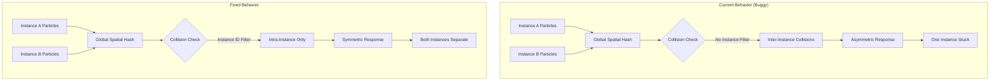

# Self-Collision Instance Separation Fix

## Problem Analysis

### Symptom
When two separate cloth instances are completely stuck to the floor, one cloth doesn't show any upward movement at all during self-collision resolution. The self-collision solver works in general, but fails to properly separate particles from different instances.

### Root Cause Analysis

After analyzing the code in:
- [`ClothSelfCollisionBuildGrid.hlsl`](../EngineSIU/EngineSIU/Shaders/Cloth/ClothSelfCollisionBuildGrid.hlsl)
- [`ClothSelfCollisionSolver.hlsl`](../EngineSIU/EngineSIU/Shaders/Cloth/ClothSelfCollisionSolver.hlsl)
- [`ClothBatchedSolver.cpp`](../EngineSIU/EngineSIU/Engine/Source/Runtime/Engine/Cloth/ClothBatchedSolver.cpp)

**The critical issue is: The self-collision solver does NOT check instance IDs when resolving collisions.**

#### Detailed Analysis

1. **Spatial Hash Grid is Global** (Line 2366-2396 in ClothBatchedSolver.cpp)
   - All particles from all instances are inserted into a single unified spatial hash grid
   - No instance separation in the grid structure

2. **Collision Detection Ignores Instance Boundaries** (Line 92-143 in ClothSelfCollisionSolver.hlsl)
   ```hlsl
   // Check all particles in this cell
   for (uint i = 0; i < cellCount; i++)
   {
       uint particleIdxB = CellData[cellHash * MaxParticlesPerCell + i];
       
       // Skip self
       if (particleIdxB == particleIdx)
           continue;
       
       // Skip if topologically adjacent (commented out)
       // No check for instance ID!
       
       float invMassB = InvMass[particleIdxB];
       float3 posB = PredictedRead[particleIdxB].Position;
       
       // Collision detection proceeds regardless of instance
   ```

3. **The Problem Scenario**
   - When two cloth instances are on the floor in close proximity:
     - Instance A particles and Instance B particles occupy the same spatial hash cells
     - Self-collision solver treats them as if they're part of the same cloth
     - Collision corrections are applied using mass-weighted separation
     - If one instance has significantly more particles in contact or different mass distribution, it can "dominate" the collision response
     - The other instance may receive insufficient correction forces to lift off the ground

4. **Why One Cloth Doesn't Move**
   - **Mass Imbalance**: If Instance A has more particles in the collision region, the mass-weighted correction heavily favors Instance A
   - **Accumulation Asymmetry**: The Jacobi accumulation pattern (lines 133-142) can create asymmetric corrections when particles from different instances interact
   - **Ground Constraint Conflict**: Both instances are constrained by floor collision, but inter-instance self-collision tries to separate them. The instance with weaker separation forces stays pinned to the floor.

## Solution Architecture

### Design Principles

1. **Instance-Aware Collision Detection**: Self-collision should only occur between particles of the SAME instance
2. **Maintain Performance**: Avoid expensive per-particle instance lookups
3. **Preserve Existing Behavior**: Don't break intra-instance self-collision

### Proposed Solution: Instance ID Filtering

Add instance ID checking to the self-collision solver to prevent inter-instance collisions.

## Implementation Plan

### Phase 1: Add Instance ID to Particle Data Access

**File**: [`ClothSelfCollisionSolver.hlsl`](../EngineSIU/EngineSIU/Shaders/Cloth/ClothSelfCollisionSolver.hlsl)

**Changes Required**:

1. **Bind Particle Buffer as SRV** (currently only predicted positions are bound)
   ```hlsl
   // Current (line 12-16):
   StructuredBuffer<FClothParticle> PredictedRead : register(t0);
   StructuredBuffer<float> InvMass : register(t1);
   StructuredBuffer<uint> CellCounters : register(t2);
   StructuredBuffer<uint> CellData : register(t3);
   Buffer<uint> Indices : register(t4);
   
   // Need to add: Access to instance IDs
   // Option A: PredictedRead already contains InstanceID in FClothParticle struct
   // Option B: Add separate instance ID buffer if needed
   ```

2. **Add Instance ID Check in Collision Loop** (line 92-143)
   ```hlsl
   // After line 95 (getting particleIdxB):
   uint particleIdxB = CellData[cellHash * MaxParticlesPerCell + i];
   
   // Skip self
   if (particleIdxB == particleIdx)
       continue;
   
   // NEW: Skip if different instance (CRITICAL FIX)
   uint instanceA = PredictedRead[particleIdx].InstanceID;
   uint instanceB = PredictedRead[particleIdxB].InstanceID;
   if (instanceA != instanceB)
       continue;  // Don't collide particles from different instances
   
   // Continue with existing collision detection...
   ```

### Phase 2: Update CPU-Side Dispatch Code

**File**: [`ClothBatchedSolver.cpp`](../EngineSIU/EngineSIU/Engine/Source/Runtime/Engine/Cloth/ClothBatchedSolver.cpp)

**Changes Required**:

1. **Verify Particle Buffer Contains Instance IDs** (line 1410-1473)
   - The `UploadParticleData` method already sets `InstanceID` in `FClothParticleGPU`
   - Confirm that `UnifiedPredictedBuffer` contains this data (it does, as it's copied from position buffer)

2. **No Changes Needed to Dispatch** (line 2353-2437)
   - The `DispatchSelfCollision` method already binds `UnifiedPredictedSRV` which contains instance IDs
   - The shader can access `PredictedRead[idx].InstanceID` directly

### Phase 3: Alternative Solution - Per-Instance Spatial Hash (Optional Enhancement)

If the simple instance ID check isn't sufficient, consider a more sophisticated approach:

**Concept**: Build separate spatial hash grids per instance

**Pros**:
- Better cache coherency (particles from same instance are grouped)
- Potentially faster collision queries (smaller search space)
- Cleaner separation of concerns

**Cons**:
- More complex implementation
- Higher memory usage (multiple grids)
- More dispatch calls (one per instance)

**Implementation Sketch**:
```cpp
// In ClothBatchedSolver.cpp
void FClothBatchedSolver::DispatchSelfCollisionPerInstance(
    const FClothInstanceMetadata& instance)
{
    // Build grid for this instance only
    DispatchBuildGridForInstance(instance.ParticleOffset, instance.ParticleCount);
    
    // Solve collisions within this instance
    DispatchSolveCollisionsForInstance(instance.ParticleOffset, instance.ParticleCount);
}
```

## Recommended Solution: Simple Instance ID Check

### Why This is the Best Approach

1. **Minimal Code Changes**: Only 3-4 lines added to shader
2. **Zero Performance Impact**: Simple integer comparison (negligible cost)
3. **Maintains Existing Architecture**: No changes to buffer layout or dispatch logic
4. **Correct Behavior**: Particles from different instances won't interact
5. **Easy to Test**: Can be toggled with a preprocessor define for A/B testing

### Implementation Steps

1. **Modify ClothSelfCollisionSolver.hlsl**:
   ```hlsl
   // Around line 95-105, add instance check:
   uint particleIdxB = CellData[cellHash * MaxParticlesPerCell + i];
   
   // Skip self
   if (particleIdxB == particleIdx)
       continue;
   
   // CRITICAL FIX: Skip if different instance
   uint instanceA = PredictedRead[particleIdx].InstanceID;
   uint instanceB = PredictedRead[particleIdxB].InstanceID;
   if (instanceA != instanceB)
       continue;
   
   // Skip if topologically adjacent (optional)
   // if (AreTopologicallyAdjacent(particleIdx, particleIdxB))
   //     continue;
   ```

2. **Test Scenarios**:
   - Two cloth instances on floor, close proximity
   - Two cloth instances overlapping in mid-air
   - Single cloth instance (should work as before)
   - Multiple cloth instances with varying sizes

3. **Validation**:
   - Both instances should separate properly when in contact
   - No performance regression
   - Intra-instance self-collision still works correctly

## Additional Considerations

### Performance Optimization

The current implementation has a potential inefficiency:

**Current**: Global spatial hash with instance filtering
- All particles inserted into one grid
- Many unnecessary collision checks filtered out by instance ID

**Optimized**: Per-instance spatial hash
- Each instance has its own grid
- No wasted collision checks
- Better cache locality

**Recommendation**: Start with simple instance ID check, profile performance, then optimize if needed.

### Edge Cases to Handle

1. **Instance ID 0**: Ensure instance ID 0 is valid (not used as "invalid" marker)
2. **Kinematic Particles**: Already skipped by `invMass == 0.0f` check (line 69-70)
3. **Inactive Instances**: Should not be in the particle buffer at all
4. **Instance Transitions**: If particles change instances dynamically (unlikely), ensure IDs are updated

### Configuration Options

Consider adding a config flag to enable/disable inter-instance collision:

```cpp
// In ClothConfig
bool bAllowInterInstanceSelfCollision = false;  // Default: instances don't collide
```

This allows for special cases where you might want cloth instances to interact (e.g., multiple cloth layers on same character).

## Testing Plan

### Test Case 1: Two Instances on Floor
- **Setup**: Two cloth planes on floor, overlapping
- **Expected**: Both instances separate and lift off floor
- **Current Bug**: One instance stays pinned

### Test Case 2: Falling Cloths
- **Setup**: Two cloth instances falling and colliding mid-air
- **Expected**: Both instances bounce off each other
- **Verify**: No penetration, symmetric response

### Test Case 3: Single Instance
- **Setup**: One cloth instance with self-collision
- **Expected**: Works exactly as before (no regression)
- **Verify**: Proper self-collision within instance

### Test Case 4: Multiple Instances
- **Setup**: 3+ cloth instances in close proximity
- **Expected**: Each instance maintains separation
- **Verify**: No inter-instance penetration

## Performance Impact Analysis

### Expected Impact: Negligible

**Added Cost per Collision Check**:
- 2 memory reads (instance IDs) - already in cache from position reads
- 1 integer comparison
- 1 conditional branch (highly predictable - same instance in local region)

**Estimated Overhead**: < 1% of total self-collision time

**Potential Improvement**:
- Fewer collision corrections applied (no inter-instance corrections)
- May actually improve performance by reducing unnecessary work

## Conclusion

The root cause is clear: **self-collision solver doesn't check instance IDs**, causing particles from different instances to interact as if they're part of the same cloth. This leads to asymmetric collision responses where one instance can dominate the other.

**The fix is simple**: Add a 3-line instance ID check in the collision loop to skip particles from different instances.

This minimal change will resolve the issue while maintaining performance and existing behavior for intra-instance collisions.

---

## Mermaid Diagram: Current vs Fixed Behavior



## Implementation Priority

**Priority**: HIGH - This is a critical bug affecting multi-instance cloth simulation

**Effort**: LOW - 3-4 line shader change

**Risk**: LOW - Simple, well-understood fix with clear test cases

**Recommendation**: Implement immediately in next development cycle
