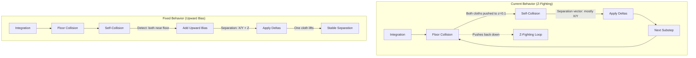

# Self-Collision Z-Axis Separation Fix

## Problem Statement (Revised)

### Observed Behavior
- **Vertical Test (Works)**: Two cloth instances attached vertically don't penetrate each other
- **Floor Test (Fails)**: Two cloth instances on the floor (z=0):
  - ✅ Push each other apart in X and Y directions
  - ❌ Do NOT separate in Z direction
  - Result: Z-fighting-like phenomenon (both cloths stuck at same Z level)

### Key Insight
Self-collision IS working globally across instances, but there's a **directional bias** preventing Z-axis separation when cloths are constrained by floor collision.

## Root Cause Analysis

### The Conflict: Floor Collision vs Self-Collision

Looking at the simulation pipeline in [`ClothBatchedSolver.cpp`](../EngineSIU/EngineSIU/Engine/Source/Runtime/Engine/Cloth/ClothBatchedSolver.cpp:2126-2187):

```cpp
void FClothBatchedSolver::SimulateSubstep(float SubstepDeltaTime)
{
    // 1. Integration (apply forces, predict positions)
    DispatchIntegration(UsedParticleCount);
    
    // 2. Floor/SDF Collision (FIRST - pushes particles UP from floor)
    DispatchCollisionSDF(UsedParticleCount);
    
    // 3. Edge collision
    if (UsedEdgeCollisionCount > 0)
        DispatchEdgeCollisionSDF(UsedEdgeCollisionCount);
    
    // 4. Constraint solving loop
    for (int32 iter = 0; iter < Config.NumIterations; ++iter)
    {
        // Distance constraints
        if (UsedConstraintCount > 0)
            DispatchConstraintSolver(UsedConstraintCount);
        
        // Self-collision (INSIDE iteration loop)
        if (Config.bEnableSelfCollision && bSelfCollisionInitialized)
            DispatchSelfCollision(UsedParticleCount);
        
        // Apply accumulated deltas
        DispatchApplyDeltas(UsedParticleCount);
    }
    
    // 5. Kinematic targets
    // 6. Finalize
}
```

### The Problem: Order of Operations

1. **Floor Collision Runs First** ([`ClothSDFCollision.hlsl`](../EngineSIU/EngineSIU/Shaders/Cloth/ClothSDFCollision.hlsl:156-222))
   - Pushes particles UP from floor (positive Z correction)
   - Both cloth instances get pushed to approximately the same Z level (just above floor)
   - This happens BEFORE self-collision

2. **Self-Collision Runs Inside Iteration Loop** ([`ClothSelfCollisionSolver.hlsl`](../EngineSIU/EngineSIU/Shaders/Cloth/ClothSelfCollisionSolver.hlsl:61-148))
   - Detects particles from both instances at same Z level
   - Computes separation vector: `diff = posB - posA` (line 109)
   - When both particles are at same Z (e.g., z=0.1), the Z component of `diff` is near zero
   - Separation is primarily in X/Y plane (horizontal)

3. **Floor Collision Dominates Z-Axis**
   - Even if self-collision tries to push one cloth UP in Z
   - Next substep, floor collision pushes it back DOWN to floor level
   - Result: Both cloths oscillate at same Z level, only separating horizontally

### Why Vertical Test Works

When cloths are attached vertically:
- No floor constraint
- Self-collision separation vector has significant Z component
- Cloths can freely separate in all directions including Z

### The Core Issue: Constraint Priority

**Floor collision has higher priority than self-collision separation in Z-axis.**

This is a classic constraint conflict in physics simulation:
- Floor constraint: `z >= 0`
- Self-collision constraint: `distance >= 2 * radius`

When both constraints are active and conflicting, the floor constraint "wins" because:
1. It runs first (before iteration loop)
2. It's a hard constraint (immediate position correction)
3. Self-collision uses Jacobi iteration (softer, accumulated corrections)

## Solution Architecture

### Strategy: Bias Self-Collision Separation Upward When Near Floor

The key insight: When particles are near the floor AND colliding, we should **bias the separation vector upward** to help one cloth lift off the floor.

### Design Principles

1. **Detect Floor Proximity**: Check if particles are near floor (z < threshold)
2. **Bias Separation Upward**: Add upward component to separation normal
3. **Maintain Horizontal Separation**: Keep X/Y separation working
4. **Asymmetric Response**: One cloth should lift, other stays (or both lift slightly)

## Proposed Solutions

### Solution 1: Upward Bias in Self-Collision Normal (Recommended)

**File**: [`ClothSelfCollisionSolver.hlsl`](../EngineSIU/EngineSIU/Shaders/Cloth/ClothSelfCollisionSolver.hlsl)

**Modification** (around line 108-127):

```hlsl
// Collision detection
float3 diff = posB - posA;
float dist = length(diff);
float minDist = 2.0f * CollisionRadius;

if (dist < minDist && dist > EPSILON)
{
    // Compute base separation normal
    float3 normal = diff / dist;
    float penetration = minDist - dist;
    
    // NEW: Detect floor proximity for both particles
    const float floorThreshold = CollisionRadius * 3.0f;  // e.g., 3x particle radius
    bool particleANearFloor = posA.z < floorThreshold;
    bool particleBNearFloor = posB.z < floorThreshold;
    
    // NEW: Bias separation upward when both particles are near floor
    if (particleANearFloor && particleBNearFloor)
    {
        // Add upward bias to separation normal
        float upwardBias = 0.5f;  // Tunable parameter (0.0 = no bias, 1.0 = full upward)
        normal.z += upwardBias;
        normal = normalize(normal);  // Re-normalize after bias
        
        // Optional: Increase penetration to force stronger separation
        penetration *= 1.2f;  // 20% stronger when near floor
    }
    
    // Continue with existing mass-weighted separation...
    float wSum = invMassA + invMassB;
    if (wSum < EPSILON)
        continue;
    
    float3 correction = normal * penetration * CollisionStiffness;
    float3 corrA = -correction * (invMassA / wSum);
    float3 corrB = +correction * (invMassB / wSum);
    
    // Atomic accumulation...
}
```

**Pros**:
- Simple, localized change
- Directly addresses the Z-axis separation issue
- Tunable via `upwardBias` parameter
- Minimal performance impact

**Cons**:
- Adds slight artificial bias (not physically accurate)
- May need tuning for different scenarios

### Solution 2: Asymmetric Mass Response Near Floor

**Concept**: When both particles are near floor, artificially increase the "effective mass" of the lower particle, making the upper particle more responsive.

```hlsl
// NEW: Asymmetric mass weighting near floor
if (particleANearFloor && particleBNearFloor)
{
    // Particle with higher Z should be more responsive (lower effective mass)
    if (posA.z > posB.z)
    {
        // A is higher - make it more responsive
        invMassA *= 1.5f;  // Increase responsiveness
    }
    else
    {
        // B is higher - make it more responsive
        invMassB *= 1.5f;
    }
}

float wSum = invMassA + invMassB;
// ... continue with mass-weighted separation
```

**Pros**:
- More physically intuitive (lighter particle lifts easier)
- Asymmetric response helps one cloth lift off

**Cons**:
- More complex logic
- May cause instability if not carefully tuned

### Solution 3: Separate Floor-Aware Self-Collision Pass

**Concept**: Add a dedicated self-collision pass that runs AFTER floor collision and specifically handles Z-axis separation.

**Implementation**:
1. Keep existing self-collision in iteration loop (handles X/Y)
2. Add new pass after floor collision that only corrects Z-axis overlaps
3. This pass has higher priority than floor constraint

**Pros**:
- Clean separation of concerns
- Can be toggled independently
- More control over Z-axis behavior

**Cons**:
- More complex implementation
- Additional compute pass (performance cost)
- Requires new shader

### Solution 4: Modify Floor Collision to Respect Self-Collision

**File**: [`ClothSDFCollision.hlsl`](../EngineSIU/EngineSIU/Shaders/Cloth/ClothSDFCollision.hlsl)

**Concept**: Before applying floor collision correction, check if particle has nearby self-collision neighbors. If so, reduce floor correction strength.

```hlsl
// In SolveCollisionsCS, after computing floor penetration:
if (penetration > 0.0f)
{
    // NEW: Check for nearby particles (simplified - would need spatial query)
    // If nearby particles exist, reduce floor correction to allow self-collision separation
    float correctionScale = 1.0f;
    
    // Pseudo-code: if (hasNearbyParticles)
    //     correctionScale = 0.5f;  // Weaker floor constraint
    
    totalCorrection += normal * penetration * correctionScale;
}
```

**Pros**:
- Addresses root cause (constraint priority)
- More physically accurate

**Cons**:
- Requires spatial query in floor collision shader (expensive)
- Complex implementation
- May cause floor penetration if not careful

## Recommended Solution: Solution 1 (Upward Bias)

### Why This is Best

1. **Simplest Implementation**: 5-10 lines of code
2. **Directly Solves Problem**: Adds Z-component to separation
3. **Tunable**: `upwardBias` parameter can be adjusted
4. **Low Risk**: Doesn't change existing logic flow
5. **Minimal Performance Impact**: Just a few extra operations per collision

### Implementation Details

**Step 1: Add Configuration Parameter**

In [`ClothCommon.hlsli`](../EngineSIU/EngineSIU/Shaders/Cloth/ClothCommon.hlsli:51-63):

```hlsl
cbuffer SelfCollisionParams : register(b1)
{
    float3 GridMin;
    float CellSize;
    
    uint3 GridDimensions;
    uint MaxParticlesPerCell;
    
    float CollisionRadius;
    float CollisionStiffness;
    uint bEnableSelfCollision;
    float FloorBiasStrength;  // NEW: Upward bias when near floor (0.0-1.0)
};
```

**Step 2: Modify Self-Collision Solver**

In [`ClothSelfCollisionSolver.hlsl`](../EngineSIU/EngineSIU/Shaders/Cloth/ClothSelfCollisionSolver.hlsl:108-127):

```hlsl
if (dist < minDist && dist > EPSILON)
{
    // Collision response (mass-weighted separation)
    float3 normal = diff / dist;
    float penetration = minDist - dist;
    
    // NEW: Floor-aware upward bias
    const float floorThreshold = CollisionRadius * 3.0f;
    bool bothNearFloor = (posA.z < floorThreshold) && (posB.z < floorThreshold);
    
    if (bothNearFloor && FloorBiasStrength > 0.0f)
    {
        // Add upward component to separation normal
        normal.z += FloorBiasStrength;
        normal = normalize(normal);
        
        // Optional: Boost separation strength near floor
        penetration *= (1.0f + FloorBiasStrength * 0.5f);
    }
    
    // Continue with mass-weighted separation...
    float wSum = invMassA + invMassB;
    if (wSum < EPSILON)
        continue;
    
    float3 correction = normal * penetration * CollisionStiffness;
    float3 corrA = -correction * (invMassA / wSum);
    float3 corrB = +correction * (invMassB / wSum);
    
    // Atomic accumulation (existing code)...
}
```

**Step 3: Update CPU-Side Configuration**

In [`ClothBatchedSolver.cpp`](../EngineSIU/EngineSIU/Engine/Source/Runtime/Engine/Cloth/ClothBatchedSolver.cpp:2512-2556):

```cpp
void FClothBatchedSolver::UpdateSelfCollisionParams(const TArray<FClothInstanceMetadata>& InstanceMetadata)
{
    // ... existing code ...
    
    // Fill params
    SelfCollisionParams.GridMin = gridMin;
    SelfCollisionParams.CellSize = finalCellSize;
    SelfCollisionParams.GridDimX = gridDimX;
    SelfCollisionParams.GridDimY = gridDimY;
    SelfCollisionParams.GridDimZ = gridDimZ;
    SelfCollisionParams.MaxParticlesPerCell = Config.SelfCollisionMaxPerCell;
    SelfCollisionParams.CollisionRadius = finalCollisionRadius;
    SelfCollisionParams.CollisionStiffness = Config.SelfCollisionStiffness * Config.SelfCollisionStiffnessMultiplier;
    SelfCollisionParams.bEnableSelfCollision = Config.bEnableSelfCollision ? 1 : 0;
    SelfCollisionParams.FloorBiasStrength = Config.SelfCollisionFloorBias;  // NEW
    
    // Upload to GPU...
}
```

### Tuning Guidelines

**FloorBiasStrength Values**:
- `0.0`: No bias (current behavior - Z-fighting)
- `0.3`: Subtle upward bias (recommended starting point)
- `0.5`: Moderate bias (good for most cases)
- `1.0`: Strong upward bias (may look unnatural)

**FloorThreshold**:
- `CollisionRadius * 2.0f`: Very close to floor
- `CollisionRadius * 3.0f`: Recommended (catches particles just above floor)
- `CollisionRadius * 5.0f`: Larger zone (may affect mid-air collisions)

## Alternative: Execution Order Change

### Concept: Run Self-Collision BEFORE Floor Collision

**Current Order**:
```
Integration → Floor Collision → [Constraints + Self-Collision] → Finalize
```

**Proposed Order**:
```
Integration → [Constraints + Self-Collision] → Floor Collision → Finalize
```

**Rationale**: Let self-collision separate cloths first, then floor collision only affects particles that are actually below floor.

**Implementation** in [`ClothBatchedSolver.cpp`](../EngineSIU/EngineSIU/Engine/Source/Runtime/Engine/Cloth/ClothBatchedSolver.cpp:2126-2187):

```cpp
void FClothBatchedSolver::SimulateSubstep(float SubstepDeltaTime)
{
    // 1. Integration
    DispatchIntegration(UsedParticleCount);
    
    // 2. Constraint solving loop (MOVED BEFORE floor collision)
    for (int32 iter = 0; iter < Config.NumIterations; ++iter)
    {
        if (UsedConstraintCount > 0)
            DispatchConstraintSolver(UsedConstraintCount);
        
        // Self-collision BEFORE floor collision
        if (Config.bEnableSelfCollision && bSelfCollisionInitialized)
            DispatchSelfCollision(UsedParticleCount);
        
        DispatchApplyDeltas(UsedParticleCount);
    }
    
    // 3. Floor/SDF Collision (MOVED AFTER constraints)
    DispatchCollisionSDF(UsedParticleCount);
    
    // 4. Edge collision
    if (UsedEdgeCollisionCount > 0)
        DispatchEdgeCollisionSDF(UsedEdgeCollisionCount);
    
    // 5. Kinematic targets
    // 6. Finalize
}
```

**Pros**:
- No shader changes needed
- Gives self-collision priority over floor
- May solve problem completely

**Cons**:
- Changes fundamental simulation order
- May cause floor penetration if self-collision pushes particles down
- Needs extensive testing to ensure no regressions

## Testing Plan

### Test Case 1: Two Cloths on Floor (Primary Issue)
- **Setup**: Two cloth instances on floor (z=0), overlapping
- **Expected**: Both cloths separate in X, Y, AND Z directions
- **Verify**: No Z-fighting, one cloth lifts above the other

### Test Case 2: Vertical Cloths (Regression Test)
- **Setup**: Two cloth instances attached vertically
- **Expected**: Works as before (no regression)
- **Verify**: Proper separation in all directions

### Test Case 3: Single Cloth on Floor
- **Setup**: One cloth instance on floor
- **Expected**: No change in behavior
- **Verify**: Cloth rests naturally on floor

### Test Case 4: Multiple Cloths Stacked
- **Setup**: 3+ cloth instances stacked on floor
- **Expected**: Cloths separate vertically (stack formation)
- **Verify**: No Z-fighting between any pair

### Test Case 5: Cloth Falling onto Another
- **Setup**: One cloth on floor, another falling from above
- **Expected**: Falling cloth lands on top, doesn't penetrate
- **Verify**: Stable stacking behavior

## Performance Considerations

### Expected Impact: Negligible

**Added Cost per Collision (Solution 1)**:
- 2 float comparisons (floor threshold check)
- 1 vector addition (upward bias)
- 1 normalize operation (re-normalize normal)
- 1 float multiply (optional penetration boost)

**Estimated Overhead**: < 2% of self-collision time

### Optimization Opportunities

If performance becomes an issue:
1. **Precompute floor threshold** in constant buffer
2. **Use fast normalize** (rsqrt approximation)
3. **Skip bias for particles far from floor** (early out)

## Conclusion

The Z-axis separation failure is caused by **constraint priority conflict**: floor collision dominates Z-axis, preventing self-collision from separating cloths vertically.

**Recommended Fix**: Add upward bias to self-collision separation normal when both particles are near floor. This simple 5-10 line change directly addresses the issue while maintaining existing behavior for other scenarios.

**Alternative**: Change execution order to run self-collision before floor collision, but this requires more extensive testing.

Both solutions are viable; the upward bias approach is safer and more localized.

---

## Mermaid Diagram: Problem vs Solution



## Implementation Priority

**Priority**: HIGH - Critical visual artifact affecting multi-instance simulation

**Effort**: LOW - 5-10 line shader change + config parameter

**Risk**: LOW - Localized change with clear fallback (disable bias)

**Recommendation**: Implement Solution 1 (Upward Bias) immediately
