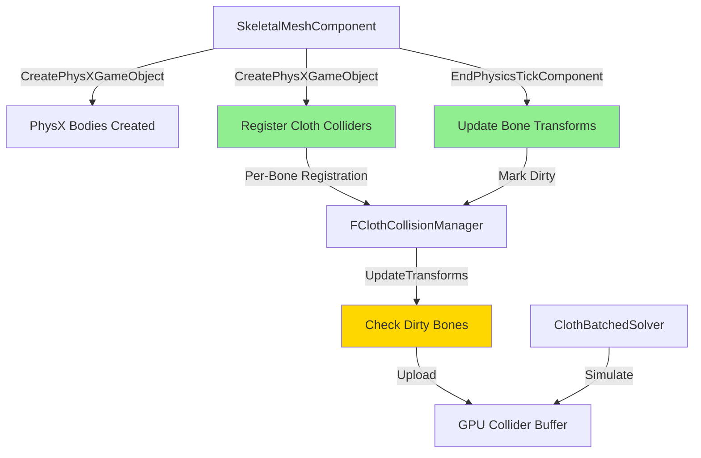

# SkeletalMesh Cloth Collider Implementation Plan

## Overview

This plan outlines the implementation of proper cloth collider handling for SkeletalMeshComponent, enabling PhysicsAsset-based colliders to interact with the cloth simulation system. The goal is to allow cloth components attached to skeletal mesh bones to properly collide with the animated colliders from the skeletal mesh's PhysicsAsset.

## Current State Analysis

### Existing PhysX Collider Creation

**Location**: [`SkeletalMeshComponent.cpp:579`](EngineSIU/EngineSIU/Engine/Source/Runtime/Engine/Classes/Components/SkeletalMeshComponent.cpp:579)

```cpp
void USkeletalMeshComponent::CreatePhysXGameObject()
{
    // Creates PhysX rigid bodies for each bone in PhysicsAsset
    // - Iterates through BodySetups from PhysicsAsset
    // - Creates PxShapes (Sphere, Box, Capsule) for each geometry
    // - Creates GameObject with PhysX rigid body
    // - Stores in Bodies array (FBodyInstance*)
}
```

**Key Points**:
- ✅ Already creates PhysX shapes from PhysicsAsset
- ✅ Stores per-bone FBodyInstance with BoneIndex
- ✅ Updates bone transforms from physics in EndPhysicsTickComponent
- ❌ Does NOT register colliders with FClothCollisionManager
- ❌ Cloth system cannot see these colliders

### Existing Cloth Collider System

**Location**: [`ClothCollisionManager.h`](EngineSIU/EngineSIU/Engine/Source/Runtime/Engine/Cloth/ClothCollisionManager.h)

```cpp
class FClothCollisionManager
{
    // Registration API
    int32 RegisterCollider(UPrimitiveComponent* Component, bool bIncludeChildren);
    void UpdateTransforms();  // Updates component-based colliders
    void UploadToGPU();       // Uploads to GPU for cloth simulation
    
    // Tracking
    TArray<FClothColliderSource> ColliderSources;  // Per-collider tracking
    TMap<UPrimitiveComponent*, TArray<int32>> ComponentToColliderMap;
};
```

**Key Points**:
- ✅ Supports Sphere, Capsule, Box colliders
- ✅ Tracks component transforms and marks dirty
- ✅ Extracts colliders from UBodySetup via GetBodySetup()
- ❌ Assumes single transform per component (not per-bone)
- ❌ Cannot track individual bone transforms

### Current PIE Initialization

**Location**: [`EditorEngine.cpp:545`](EngineSIU/EngineSIU/Engine/Source/Runtime/Engine/Classes/Engine/EditorEngine.cpp:545)

```cpp
void UEditorEngine::SetPhysXScene(UWorld *World)
{
    for (const auto &Actor : World->GetActiveLevel()->Actors)
    {
        UPrimitiveComponent *Prim = Actor->GetComponentByClass<UPrimitiveComponent>();
        if (Prim && Prim->bSimulate)
        {
            Prim->CreatePhysXGameObject();  // Only creates PhysX, not cloth colliders
        }
    }
}
```

**Issue**: SkeletalMeshComponent is a UPrimitiveComponent, but its colliders are NOT registered with cloth system.

## Problem Statement

**Goal**: Enable cloth attached to a SkeletalMesh bone to collide with PhysicsAsset colliders that animate with the skeleton.

**Current Gap**:
1. SkeletalMeshComponent creates PhysX colliders but doesn't register them with FClothCollisionManager
2. FClothCollisionManager assumes one transform per component, but SkeletalMesh has per-bone transforms
3. No mechanism to update cloth colliders when bones animate

## Architecture Design

### Design Principles

1. **Reuse Existing Infrastructure**: Leverage FClothCollisionManager's registration system
2. **Per-Bone Tracking**: Extend collider tracking to support per-bone transforms
3. **Minimal Overhead**: Only update dirty bone transforms
4. **Separation of Concerns**: PhysX and Cloth systems remain independent

### Component Interaction Flow



### Data Structure Extensions

#### FClothColliderSource Enhancement

**Current**:
```cpp
struct FClothColliderSource
{
    TWeakObjectPtr<UPrimitiveComponent> Component;
    FTransform CachedTransform;  // Single transform
    // ...
};
```

**Proposed Addition**:
```cpp
struct FClothColliderSource
{
    TWeakObjectPtr<UPrimitiveComponent> Component;
    FTransform CachedTransform;
    
    // NEW: Per-bone tracking for SkeletalMesh
    int32 BoneIndex;              // -1 for non-skeletal, >= 0 for bone-based
    FTransform CachedLocalOffset; // Local offset from bone (for geometry offset)
    // ...
};
```

**Rationale**: 
- Minimal change to existing structure
- BoneIndex = -1 for regular components (backward compatible)
- BoneIndex >= 0 for skeletal mesh bones
- CachedLocalOffset stores geometry's local offset from bone origin

## Implementation Plan

### Step 1: Analyze Current Flow ✓

**Status**: Completed during planning phase

**Findings**:
- SkeletalMeshComponent::CreatePhysXGameObject() creates PhysX bodies at lines 579-652
- Each FBodyInstance has BoneIndex and BodyInstanceName
- EndPhysicsTickComponent() updates bone transforms from physics (lines 184-277)
- FClothCollisionManager::RegisterCollider() extracts from BodySetup
- UpdateTransforms() only checks component transform, not per-bone

### Step 2: Design Architecture ✓

**Status**: Completed above

**Key Decisions**:
1. Extend FClothColliderSource with BoneIndex field
2. Register colliders per-bone during CreatePhysXGameObject()
3. Update per-bone transforms in EndPhysicsTickComponent()
4. Modify UpdateTransforms() to handle bone-based colliders

### Step 3: Implement Cloth Collider Registration

**File**: [`SkeletalMeshComponent.cpp`](EngineSIU/EngineSIU/Engine/Source/Runtime/Engine/Classes/Components/SkeletalMeshComponent.cpp:579)

**Location**: End of `CreatePhysXGameObject()` function (after line 652)

**Pseudocode**:
```cpp
void USkeletalMeshComponent::CreatePhysXGameObject()
{
    // ... existing PhysX body creation code ...
    
    // NEW: Register colliders with cloth system
    if (GEngine && GEngine->ClothPhysicsManager)
    {
        FClothWorld* ClothWorld = GEngine->ClothPhysicsManager->GetCurrentClothWorld();
        if (ClothWorld)
        {
            FClothCollisionManager* CollisionMgr = ClothWorld->GetCollisionManager();
            if (CollisionMgr)
            {
                // Register each bone's colliders
                for (FBodyInstance* BodyInst : Bodies)
                {
                    int32 NumRegistered = CollisionMgr->RegisterSkeletalCollider(
                        this,                    // Component
                        BodyInst->BoneIndex,     // Bone index
                        BodyInst->BodySetup      // Geometry data
                    );
                    
                    UE_LOG(ELogLevel::Display, 
                        TEXT("Registered %d cloth colliders for bone %s (index %d)"),
                        NumRegistered, 
                        *BodyInst->BodyInstanceName.ToString(),
                        BodyInst->BoneIndex);
                }
            }
        }
    }
}
```

**Dependencies**:
- Requires new `RegisterSkeletalCollider()` method in FClothCollisionManager
- Requires access to ClothPhysicsManager from GEngine

### Step 4: Implement Per-Bone Transform Updates

**File**: [`SkeletalMeshComponent.cpp`](EngineSIU/EngineSIU/Engine/Source/Runtime/Engine/Classes/Components/SkeletalMeshComponent.cpp:184)

**Location**: End of `EndPhysicsTickComponent()` function (after line 277)

**Pseudocode**:
```cpp
void USkeletalMeshComponent::EndPhysicsTickComponent(float DeltaTime)
{
    // ... existing bone transform update code ...
    
    // NEW: Update cloth collider transforms for animated bones
    if (GEngine && GEngine->ClothPhysicsManager)
    {
        FClothWorld* ClothWorld = GEngine->ClothPhysicsManager->GetCurrentClothWorld();
        if (ClothWorld)
        {
            FClothCollisionManager* CollisionMgr = ClothWorld->GetCollisionManager();
            if (CollisionMgr)
            {
                // Get current bone transforms
                TArray<FMatrix> CurrentGlobalBoneMatrices;
                GetCurrentGlobalBoneMatrices(CurrentGlobalBoneMatrices);
                FMatrix CompToWorld = GetComponentTransform().ToMatrixWithScale();
                
                // Convert to world space
                for (int32 i = 0; i < CurrentGlobalBoneMatrices.Num(); ++i)
                {
                    CurrentGlobalBoneMatrices[i] = CurrentGlobalBoneMatrices[i] * CompToWorld;
                }
                
                // Update collider manager with new bone transforms
                CollisionMgr->UpdateSkeletalColliderTransforms(
                    this,
                    CurrentGlobalBoneMatrices
                );
            }
        }
    }
}
```

**Rationale**:
- Reuses existing bone matrix calculation
- Called every frame after physics/animation update
- Only updates if cloth world exists

### Step 5: Extend FClothCollisionManager

**File**: [`ClothCollisionManager.h`](EngineSIU/EngineSIU/Engine/Source/Runtime/Engine/Cloth/ClothCollisionManager.h)

**Changes Required**:

#### 5.1 Update FClothColliderSource Structure

```cpp
struct FClothColliderSource
{
    // ... existing fields ...
    
    // NEW: Skeletal mesh support
    int32 BoneIndex;                    // -1 for regular component, >= 0 for bone-based
    FTransform CachedLocalOffset;       // Local offset from bone (for geometry offset)
    TWeakObjectPtr<USkeletalMeshComponent> SkeletalMeshComponent;  // For bone lookup
    
    FClothColliderSource()
        : /* ... existing initializers ... */
        , BoneIndex(-1)
        , CachedLocalOffset(FTransform::Identity)
        , SkeletalMeshComponent(nullptr)
    {}
};
```

#### 5.2 Add New Registration Method

```cpp
class FClothCollisionManager
{
public:
    // ... existing methods ...
    
    /**
     * Register colliders from a skeletal mesh bone
     * @param SkeletalMesh - The skeletal mesh component
     * @param BoneIndex - Index of the bone
     * @param BodySetup - Physics geometry for this bone
     * @return Number of colliders registered
     */
    int32 RegisterSkeletalCollider(
        USkeletalMeshComponent* SkeletalMesh,
        int32 BoneIndex,
        UBodySetup* BodySetup
    );
    
    /**
     * Update transforms for all colliders belonging to a skeletal mesh
     * @param SkeletalMesh - The skeletal mesh component
     * @param BoneWorldTransforms - World-space transforms for each bone
     */
    void UpdateSkeletalColliderTransforms(
        USkeletalMeshComponent* SkeletalMesh,
        const TArray<FMatrix>& BoneWorldTransforms
    );
};
```

#### 5.3 Modify UpdateTransforms() Logic

**File**: [`ClothCollisionManager.cpp`](EngineSIU/EngineSIU/Engine/Source/Runtime/Engine/Cloth/ClothCollisionManager.cpp:172)

**Current Logic**:
```cpp
void FClothCollisionManager::UpdateTransforms()
{
    for (int32 i = ColliderSources.Num() - 1; i >= 0; --i)
    {
        FClothColliderSource& Source = ColliderSources[i];
        
        if (Source.Component.IsValid())
        {
            FTransform CurrentTransform = Source.Component->GetComponentTransform();
            if (!CurrentTransform.Equals(Source.CachedTransform))
            {
                Source.CachedTransform = CurrentTransform;
                Source.bIsDirty = true;
            }
        }
    }
}
```

**Modified Logic**:
```cpp
void FClothCollisionManager::UpdateTransforms()
{
    for (int32 i = ColliderSources.Num() - 1; i >= 0; --i)
    {
        FClothColliderSource& Source = ColliderSources[i];
        
        // NEW: Skip skeletal mesh colliders (updated via UpdateSkeletalColliderTransforms)
        if (Source.BoneIndex >= 0 && Source.SkeletalMeshComponent.IsValid())
        {
            continue;  // Handled separately
        }
        
        // Regular component-based colliders
        if (Source.Component.IsValid())
        {
            FTransform CurrentTransform = Source.Component->GetComponentTransform();
            if (!CurrentTransform.Equals(Source.CachedTransform))
            {
                Source.CachedTransform = CurrentTransform;
                Source.bIsDirty = true;
            }
        }
    }
}
```

### Step 6: Update EditorEngine Initialization

**File**: [`EditorEngine.cpp`](EngineSIU/EngineSIU/Engine/Source/Runtime/Engine/Classes/Engine/EditorEngine.cpp:545)

**Current Code**:
```cpp
void UEditorEngine::SetPhysXScene(UWorld *World)
{
    PhysicsManager->CreateScene(PIEWorld);
    PhysicsManager->SetCurrentScene(PIEWorld);

    for (const auto &Actor : World->GetActiveLevel()->Actors)
    {
        UPrimitiveComponent *Prim = Actor->GetComponentByClass<UPrimitiveComponent>();
        if (Prim && Prim->bSimulate)
        {
            Prim->CreatePhysXGameObject();
        }
    }
}
```

**Modified Code**:
```cpp
void UEditorEngine::SetPhysXScene(UWorld *World)
{
    PhysicsManager->CreateScene(PIEWorld);
    PhysicsManager->SetCurrentScene(PIEWorld);

    for (const auto &Actor : World->GetActiveLevel()->Actors)
    {
        UPrimitiveComponent *Prim = Actor->GetComponentByClass<UPrimitiveComponent>();
        if (Prim && Prim->bSimulate)
        {
            Prim->CreatePhysXGameObject();
            
            // NEW: Also register with cloth collision system if it's a SkeletalMesh
            USkeletalMeshComponent* SkelMesh = Cast<USkeletalMeshComponent>(Prim);
            if (SkelMesh && ClothPhysicsManager)
            {
                FClothWorld* ClothWorld = ClothPhysicsManager->GetCurrentClothWorld();
                if (ClothWorld)
                {
                    // Colliders already registered in CreatePhysXGameObject()
                    // This is just for logging/verification
                    UE_LOG(ELogLevel::Display, 
                        TEXT("SkeletalMesh %s registered cloth colliders"), 
                        *SkelMesh->GetName());
                }
            }
        }
    }
}
```

**Note**: The actual registration happens in `CreatePhysXGameObject()`, so this is mainly for verification.

### Step 7: Implement Cloth Collider Update Mechanism

**File**: [`ClothCollisionManager.cpp`](EngineSIU/EngineSIU/Engine/Source/Runtime/Engine/Cloth/ClothCollisionManager.cpp)

**New Method Implementation**:

```cpp
int32 FClothCollisionManager::RegisterSkeletalCollider(
    USkeletalMeshComponent* SkeletalMesh,
    int32 BoneIndex,
    UBodySetup* BodySetup)
{
    if (!SkeletalMesh || !BodySetup || BoneIndex < 0)
        return 0;
    
    int32 NumRegistered = 0;
    
    // Extract colliders from BodySetup (similar to existing RegisterCollider)
    // But store BoneIndex and SkeletalMeshComponent reference
    
    // Spheres
    for (int32 i = 0; i < BodySetup->AggGeom.SphereElems.Num(); ++i)
    {
        PxShape* Shape = BodySetup->AggGeom.SphereElems[i];
        FClothColliderSource Source;
        Source.Type = EClothColliderType::Sphere;
        Source.Component = SkeletalMesh;
        Source.SkeletalMeshComponent = SkeletalMesh;
        Source.BoneIndex = BoneIndex;
        Source.ElementIndex = i;
        
        // Extract local offset from PhysX shape
        PxVec3 LocalPos = Shape->getLocalPose().p;
        Source.CachedLocalOffset = FTransform(
            FQuat::Identity,
            FVector(LocalPos.x, LocalPos.y, LocalPos.z)
        );
        
        // Extract radius
        PxSphereGeometry SphereGeom;
        Shape->getSphereGeometry(SphereGeom);
        Source.CachedRadius = SphereGeom.radius;
        
        Source.bIsDirty = true;
        ColliderSources.Add(Source);
        NumRegistered++;
    }
    
    // Similar for Capsules and Boxes...
    
    bGPUDirty = true;
    return NumRegistered;
}

void FClothCollisionManager::UpdateSkeletalColliderTransforms(
    USkeletalMeshComponent* SkeletalMesh,
    const TArray<FMatrix>& BoneWorldTransforms)
{
    if (!SkeletalMesh)
        return;
    
    // Iterate through all colliders
    for (FClothColliderSource& Source : ColliderSources)
    {
        // Check if this is a collider from this skeletal mesh
        if (Source.SkeletalMeshComponent.Get() == SkeletalMesh && 
            Source.BoneIndex >= 0 &&
            Source.BoneIndex < BoneWorldTransforms.Num())
        {
            // Compute new world transform: BoneWorld * LocalOffset
            FTransform BoneWorldTransform(BoneWorldTransforms[Source.BoneIndex]);
            FTransform NewWorldTransform = Source.CachedLocalOffset * BoneWorldTransform;
            
            // Check if changed
            if (!NewWorldTransform.Equals(Source.CachedTransform))
            {
                Source.CachedTransform = NewWorldTransform;
                Source.bIsDirty = true;
                bGPUDirty = true;
            }
        }
    }
}
```

### Step 8: Testing and Validation

#### Test Scenario 1: Basic Registration

**Setup**:
1. Create a SkeletalMesh with PhysicsAsset containing sphere/capsule/box colliders
2. Place in level and enter PIE mode
3. Check console logs for registration messages

**Expected Output**:
```
ClothCollisionManager: Registered 3 cloth colliders for bone Pelvis (index 0)
ClothCollisionManager: Registered 2 cloth colliders for bone Spine (index 1)
...
```

**Validation**:
- Verify collider count matches PhysicsAsset geometry count
- Verify bone indices are correct

#### Test Scenario 2: Transform Updates

**Setup**:
1. Create animated SkeletalMesh with PhysicsAsset
2. Attach ClothComponent to a bone
3. Play animation and observe cloth behavior

**Expected Behavior**:
- Cloth should collide with animated bone colliders
- Colliders should move with bone animation
- No penetration or jittering

**Validation**:
- Enable cloth collision visualization (existing debug rendering)
- Verify collider positions match bone positions
- Check for dirty flag updates in UpdateSkeletalColliderTransforms

#### Test Scenario 3: Multiple SkeletalMeshes

**Setup**:
1. Place multiple SkeletalMeshes in scene
2. Each with different PhysicsAssets
3. Attach cloth to one, verify collision with all

**Expected Behavior**:
- All skeletal mesh colliders registered independently
- Cloth collides with all registered colliders
- No cross-contamination of bone transforms

**Validation**:
- Check ComponentToColliderMap has separate entries
- Verify BoneIndex is relative to correct SkeletalMesh

#### Test Scenario 4: Performance

**Setup**:
1. Create scene with 5+ animated SkeletalMeshes
2. Each with 10+ bone colliders
3. Multiple cloth instances

**Metrics**:
- UpdateSkeletalColliderTransforms() execution time
- GPU upload frequency (should only upload when dirty)
- Frame time impact

**Acceptance Criteria**:
- < 0.5ms per skeletal mesh update
- GPU upload only when bones actually move
- No frame drops compared to baseline

## Implementation Checklist

### Phase 1: Core Infrastructure
- [ ] Add BoneIndex field to FClothColliderSource
- [ ] Add CachedLocalOffset field to FClothColliderSource
- [ ] Add SkeletalMeshComponent weak pointer to FClothColliderSource
- [ ] Implement RegisterSkeletalCollider() method
- [ ] Implement UpdateSkeletalColliderTransforms() method
- [ ] Modify UpdateTransforms() to skip skeletal colliders

### Phase 2: SkeletalMeshComponent Integration
- [ ] Add cloth collider registration to CreatePhysXGameObject()
- [ ] Add cloth collider update to EndPhysicsTickComponent()
- [ ] Add null checks for ClothPhysicsManager
- [ ] Add logging for registration/updates

### Phase 3: Editor Integration
- [ ] Update SetPhysXScene() to handle SkeletalMeshComponent
- [ ] Add verification logging
- [ ] Ensure initialization order (PhysX before Cloth)

### Phase 4: Testing
- [ ] Test basic registration
- [ ] Test transform updates with animation
- [ ] Test multiple skeletal meshes
- [ ] Test performance with many colliders
- [ ] Test edge cases (null PhysicsAsset, no bones, etc.)

### Phase 5: Documentation
- [ ] Update code comments
- [ ] Document new API methods
- [ ] Add usage examples
- [ ] Update architecture diagrams

## Technical Considerations

### Memory Management

**Weak Pointers**: Use `TWeakObjectPtr<USkeletalMeshComponent>` to avoid circular references and handle component destruction gracefully.

**Cleanup**: When SkeletalMeshComponent is destroyed, colliders should be automatically removed via weak pointer validation in UpdateTransforms().

### Performance Optimization

**Dirty Tracking**: Only update GPU buffer when bone transforms actually change (using FTransform::Equals).

**Batch Updates**: UpdateSkeletalColliderTransforms() updates all bones for a skeletal mesh in one call, avoiding per-bone overhead.

**Early Exit**: Skip skeletal colliders in regular UpdateTransforms() to avoid redundant checks.

### Thread Safety

**Current Assumption**: All cloth updates happen on game thread (same as SkeletalMesh animation).

**Future Consideration**: If cloth moves to worker thread, need mutex protection for ColliderSources array.

### Edge Cases

1. **PhysicsAsset Changed at Runtime**: Need to unregister old colliders and register new ones
2. **Bone Count Mismatch**: Validate BoneIndex < BoneWorldTransforms.Num()
3. **Component Destroyed**: Weak pointer becomes invalid, colliders removed in UpdateTransforms()
4. **No ClothWorld**: Gracefully skip registration if cloth system not initialized

## Alternative Approaches Considered

### Approach 1: Separate Skeletal Collider Manager
**Pros**: Clean separation, no changes to existing FClothCollisionManager
**Cons**: Duplicate code, two GPU buffers, more complex integration
**Decision**: Rejected - prefer unified system

### Approach 2: Per-Frame Full Re-registration
**Pros**: Simple implementation, no dirty tracking needed
**Cons**: Expensive, recreates colliders every frame
**Decision**: Rejected - too slow for many bones

### Approach 3: PhysX Shape Queries
**Pros**: No separate tracking, query PhysX directly
**Cons**: PhysX and Cloth run on different timelines, synchronization issues
**Decision**: Rejected - architectural mismatch

## Success Criteria

1. ✅ Cloth attached to SkeletalMesh bone collides with PhysicsAsset colliders
2. ✅ Colliders animate correctly with bone animation
3. ✅ Performance impact < 1ms for typical character (50 bones, 20 colliders)
4. ✅ No crashes or memory leaks
5. ✅ Works with multiple SkeletalMeshes simultaneously
6. ✅ Graceful handling of edge cases (null assets, destroyed components)

## Future Enhancements

1. **LOD Support**: Different collider sets for different skeletal mesh LODs
2. **Collision Filtering**: Per-bone collision channels/layers
3. **Dynamic Registration**: Add/remove colliders at runtime
4. **Optimization**: Spatial partitioning for large numbers of colliders
5. **Debugging**: Visual debugging tools for bone colliders

## References

- [`SkeletalMeshComponent.h`](EngineSIU/EngineSIU/Engine/Source/Runtime/Engine/Classes/Components/SkeletalMeshComponent.h)
- [`SkeletalMeshComponent.cpp`](EngineSIU/EngineSIU/Engine/Source/Runtime/Engine/Classes/Components/SkeletalMeshComponent.cpp)
- [`ClothCollisionManager.h`](EngineSIU/EngineSIU/Engine/Source/Runtime/Engine/Cloth/ClothCollisionManager.h)
- [`ClothCollisionManager.cpp`](EngineSIU/EngineSIU/Engine/Source/Runtime/Engine/Cloth/ClothCollisionManager.cpp)
- [`EditorEngine.cpp`](EngineSIU/EngineSIU/Engine/Source/Runtime/Engine/Classes/Engine/EditorEngine.cpp)
- [`PhysicsAsset.h`](EngineSIU/EngineSIU/Engine/Source/Runtime/Engine/Classes/PhysicsEngine/PhysicsAsset.h)
- [`BodyInstance.h`](EngineSIU/EngineSIU/Engine/Source/Runtime/Engine/Classes/PhysicsEngine/BodyInstance.h)
