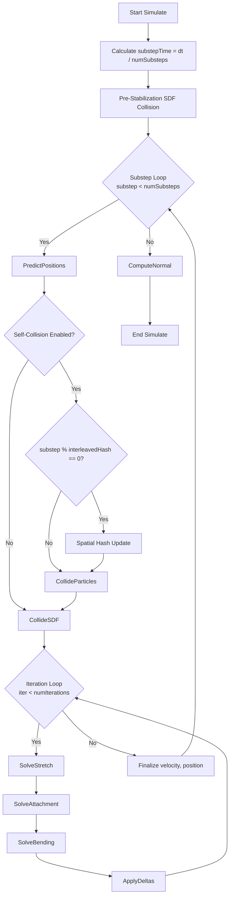

# Velvet-Inspired XPBD Cloth Simulation Improvement Plan

## Executive Summary

This document provides a comprehensive architecture plan to improve our DirectX 11 cloth simulation by adopting key patterns from the Velvet CUDA-based XPBD cloth engine. The plan focuses on simulation stability, reducing excessive stretching, and achieving more natural cloth behavior through improved solver architecture and constraint formulations.

**Primary Goals:**
1. Implement substep and fixed timestep logic for stability
2. Refactor constraint solving to match Velvet's delta accumulation pattern
3. Improve distance, bending, and attachment constraint formulations
4. Add velocity finalization and clamping
5. Prepare architecture for future SDF/particle collision integration

**Approach:** Incremental, phase-based implementation that preserves existing batched architecture while upgrading solver quality.

---

## Table of Contents

1. [Analysis of Velvet's Architecture](#1-analysis-of-velvets-architecture)
2. [Current System Analysis](#2-current-system-analysis)
3. [Key Differences and Improvement Opportunities](#3-key-differences-and-improvement-opportunities)
4. [Improvement Plan Phase 1: Core Simulation Flow](#4-improvement-plan-phase-1-core-simulation-flow)
5. [Improvement Plan Phase 2: Constraint Refinements](#5-improvement-plan-phase-2-constraint-refinements)
6. [Improvement Plan Phase 3: Collision Architecture](#6-improvement-plan-phase-3-collision-architecture)
7. [Implementation Roadmap](#7-implementation-roadmap)
8. [Validation Strategy](#8-validation-strategy)
9. [Parameter Tuning Guidelines](#9-parameter-tuning-guidelines)
10. [CUDA to DirectX Translation Notes](#10-cuda-to-directx-translation-notes)

---

## 1. Analysis of Velvet's Architecture

### 1.1 Simulation Loop Structure

**File:** [`VtClothSolverGPU.hpp::Simulate()`](C:/Users/hgchoi11/source/repos/Velvet/Velvet/VtClothSolverGPU.hpp:56)



**Key Observations:**

1. **Substep Division**: Frame time is divided into `numSubsteps` (default: 2)
   - Each substep uses smaller `substepTime = frameTime / numSubsteps`
   - This is the core of "small steps XPBD" for stability

2. **Pre-Stabilization**: SDF collision before substep loop
   - Prevents fast-moving external colliders from causing instability
   - Does NOT affect velocity (uses frame deltaTime)

3. **Predict-Project-Finalize Pattern**:
   - **Predict**: Semi-implicit Euler integration (velocity first, then position)
   - **Project**: Constraint iterations with delta accumulation
   - **Finalize**: Update velocity from position change, clamp, apply damping

4. **Interleaved Spatial Hashing**: Only updates hash every N substeps
   - Reduces expensive neighbor search cost
   - Default: `interleavedHash = 3` (every 3 substeps)

### 1.2 Constraint Solving Pattern (Jacobi-Style Delta Accumulation)

**File:** [`VtClothSolverGPU.cu::SolveStretch_Kernel`](C:/Users/hgchoi11/source/repos/Velvet/Velvet/VtClothSolverGPU.cu:65)

**Pattern:**
```
1. Each constraint computes corrections independently
2. Atomic accumulation to shared delta/count buffers:
   - deltas[particleID] += correction
   - deltaCounts[particleID] += 1
3. After all constraints: ApplyDeltas averages and applies:
   - predicted[i] += (deltas[i] / deltaCounts[i]) * relaxationFactor
   - Clear deltas and counts
```

**Benefits:**
- Fully parallel (no dependency between constraints)
- Naturally handles multiple constraints affecting same particle
- Relaxation factor controls convergence rate

**Distance Constraint Formulation** (PBD, compliance = 0):
```cpp
// Compute error
glm::vec3 diff = predicted[idx1] - predicted[idx2];
float distance = glm::length(diff);
float error = distance - expectedDistance;
glm::vec3 gradient = diff / (distance + EPSILON);

// Weights
float w1 = invMasses[idx1];
float w2 = invMasses[idx2];
float denom = w1 + w2;

// Lambda (no compliance, so pure PBD)
float lambda = (distance - expectedDistance) / denom;

// Corrections
glm::vec3 correction1 = -w1 * lambda * gradient;
glm::vec3 correction2 =  w2 * lambda * gradient;

// Atomic accumulate
AtomicAdd(deltas, idx1, correction1, reorder);
AtomicAdd(deltas, idx2, correction2, reorder);
atomicAdd(&deltaCounts[idx1], 1);
atomicAdd(&deltaCounts[idx2], 1);
```

**Bending Constraint Formulation** (XPBD with compliance):
```cpp
// Dihedral angle constraint (4 particles)
// Compute gradients d0, d1, d2, d3
// Compute lambda with compliance
float xpbd_bend = d_params.bendCompliance / deltaTime / deltaTime;
lambda = (phi - restAngle) / (lambda_denom + xpbd_bend);

// Apply corrections with weights
AtomicAdd(deltas, idx0, -w0 * lambda * d0, reorder);
// ... similar for idx1, idx2, idx3
```

**Attachment Constraint**:
```cpp
// Long-range attachment (e.g., flag to pole)
glm::vec3 slotPos = attachSlotPositions[slotID];
float targetDist = attachDistances[id] * longRangeStretchiness;

if (dist > targetDist) {
    glm::vec3 correction = -diff + diff / dist * targetDist;
    AtomicAdd(deltas, pid, correction, id);
    atomicAdd(&deltaCounts[pid], 1);
}
```

### 1.3 Velocity Finalization

**File:** [`VtClothSolverGPU.cu::Finalize_Kernel`](C:/Users/hgchoi11/source/repos/Velvet/Velvet/VtClothSolverGPU.cu:388)

```cpp
glm::vec3 new_pos = predicted[id];
glm::vec3 raw_vel = (new_pos - positions[id]) / deltaTime;

// Clamp velocity to maxSpeed
float raw_vel_len = glm::length(raw_vel);
if (raw_vel_len > d_params.maxSpeed) {
    raw_vel = raw_vel / raw_vel_len * d_params.maxSpeed;
    new_pos = positions[id] + raw_vel * deltaTime;
}

// Apply damping
velocities[id] = raw_vel * (1 - d_params.damping * deltaTime);
positions[id] = new_pos;
```

**Key Points:**
- Velocity derived from position change (implicit velocity update)
- Max velocity clamping prevents explosions
- Damping applied to velocity, not position
- Uses **substep** deltaTime for accuracy

### 1.4 Key Parameters

**File:** [`Common.hpp::VtSimParams`](C:/Users/hgchoi11/source/repos/Velvet/Velvet/Common.hpp:19)

```cpp
int numSubsteps = 2;           // Small steps for stability
int numIterations = 4;         // Constraint iterations per substep
float maxSpeed = 50;           // Velocity clamping
float gravity = -9.8f;
float bendCompliance = 0.0f;   // Note: Bending doesn't work well with Jacobi
float damping = 0.25f;
float relaxationFactor = 1.0f; // Jacobi convergence control
float longRangeStretchiness = 1.2f; // Attachment constraint slack
float collisionMargin = 0.06f;
```

**Recommended maxSpeed Calculation:**
```cpp
maxSpeed = 2 * particleDiameter / fixedDeltaTime * numSubsteps
```

---

## 2. Current System Analysis

### 2.1 Current Simulation Flow

**File:** [`ClothBatchedSolver.cpp::Simulate()`](EngineSIU/EngineSIU/Engine/Source/Runtime/Engine/Cloth/ClothBatchedSolver.cpp) (inferred structure)

```
Current Flow:
1. UpdateConstantBuffers(DeltaTime)
2. ClearAccumulationBuffers()
3. DispatchIntegration() - Semi-implicit Euler
4. For each iteration (NumIterations):
   - DispatchConstraintSolver()
   - DispatchBendConstraintSolver()
   - DispatchApplyDeltas()
   - DispatchApplyKinematicTargets()
5. DispatchUpdateNormals()
```

### 2.2 Current Shader Implementation

**Integration** ([`ClothIntegrate.hlsl`](EngineSIU/EngineSIU/Shaders/Cloth/ClothIntegrate.hlsl)):
- Semi-implicit Euler (good)
- Per-instance parameters (good)
- Velocity damping applied during integration (different from Velvet)

**Distance Constraint** ([`ClothConstraintSolver.hlsl`](EngineSIU/EngineSIU/Shaders/Cloth/ClothConstraintSolver.hlsl)):
- Has delta accumulation pattern (good)
- PBD formulation exists (good)
- XPBD path exists but may not be used correctly
- Stiffness multiplier applied directly

**Apply Deltas** ([`ClothApplyDelta.hlsl`](EngineSIU/EngineSIU/Shaders/Cloth/ClothApplyDelta.hlsl)):
- Averages deltas by weight (good)
- **Issue**: Updates velocity as `delta / DeltaTime`
  - This overwrites velocity from integration
  - Should derive velocity from final position change

**Bending Constraint** ([`ClothBendConstraintSolver.hlsl`](EngineSIU/EngineSIU/Shaders/Cloth/ClothBendConstraintSolver.hlsl)):
- Dihedral angle approach (good)
- Simplified gradient calculation (may be inaccurate)

### 2.3 Missing Features

1. **No substep logic**: Single large timestep per frame
2. **No fixed timestep accumulation**: Variable timestep can cause instability
3. **No velocity finalization pass**: Velocity updated incorrectly in ApplyDeltas
4. **No max velocity clamping**: Can lead to explosions
5. **No pre-stabilization collision**: Fast colliders may cause issues
6. **No relaxation factor**: Cannot tune Jacobi convergence

---

## 3. Key Differences and Improvement Opportunities

| Aspect | Velvet (CUDA) | Our System (DX11) | Improvement Action |
|--------|---------------|-------------------|-------------------|
| **Timestep** | Fixed substeps (2x default) | Single variable timestep | Add substep loop + fixed timestep accumulation |
| **Velocity Update** | Finalize pass: `v = Δpos/dt`, clamp, damp | In ApplyDeltas: `v = delta/dt` | Add Finalize compute shader |
| **Constraint Iterations** | Inner loop per substep | Outer loop entire frame | Move to substep loop |
| **Relaxation Factor** | Configurable (default 1.0) | Implicit 1.0 | Add parameter, apply in ApplyDeltas |
| **Max Velocity** | Clamped in Finalize | Crude clamp in integration | Proper clamping in Finalize |
| **Damping** | Applied to velocity in Finalize | Applied in integration | Move to Finalize |
| **Pre-Stabilization** | SDF collision before substeps | None | Add (Phase 3) |
| **Bending Compliance** | XPBD with compliance | PBD-style | Use XPBD formulation |

**Root Cause of Stretching Issues:**
1. Large timestep → large velocity changes → large position errors
2. No velocity clamping → explosions possible
3. Incorrect velocity update → accumulates error over time

---

## 4. Improvement Plan Phase 1: Core Simulation Flow

### 4.1 Overview

**Goal:** Implement Velvet's substep and velocity finalization pattern to improve stability and reduce stretching.

**Success Criteria:**
- Cloth remains stable with varying frame rates
- Less stretching observed in high-tension scenarios
- Natural motion preserved

### 4.2 Changes Required

#### 4.2.1 Add Substep Loop (CPU-Side)

**File to Modify:** [`ClothBatchedSolver.cpp`](EngineSIU/EngineSIU/Engine/Source/Runtime/Engine/Cloth/ClothBatchedSolver.cpp)

**Current Structure:**
```cpp
void FClothBatchedSolver::Simulate(float DeltaTime)
{
    UpdateConstantBuffers(DeltaTime);
    // ... dispatch shaders once
}
```

**New Structure:**
```cpp
void FClothBatchedSolver::Simulate(float DeltaTime)
{
    // Fixed timestep accumulation
    AccumulatedTime += DeltaTime;
    int32 NumSubsteps = 0;
    
    while (AccumulatedTime >= FixedSubstepTime && NumSubsteps < MaxSubstepsPerFrame)
    {
        SimulateSubstep(FixedSubstepTime);
        AccumulatedTime -= FixedSubstepTime;
        NumSubsteps++;
    }
    
    // Final normal update (once per frame)
    DispatchUpdateNormals(UsedTriangleCount);
}

void FClothBatchedSolver::SimulateSubstep(float SubstepDeltaTime)
{
    UpdateConstantBuffers(SubstepDeltaTime);
    ClearAccumulationBuffers(UsedParticleCount);
    
    // Integration (predict)
    DispatchIntegration(UsedParticleCount);
    
    // TODO Phase 3: Pre-stabilization collision
    
    // Constraint iterations (project)
    for (int32 Iter = 0; Iter < Config.NumIterations; Iter++)
    {
        DispatchConstraintSolver(UsedConstraintCount);
        DispatchBendConstraintSolver(UsedBendConstraintCount);
        DispatchApplyDeltas(UsedParticleCount);  // Applies to predicted positions
    }
    
    DispatchApplyKinematicTargets(UsedKinematicTargetCount);
    
    // Velocity finalization (NEW)
    DispatchFinalize(UsedParticleCount);
}
```

**New Members to Add:**
```cpp
// In ClothBatchedSolver.h
private:
    float FixedSubstepTime = 1.0f / 120.0f;  // 120 Hz substeps
    float AccumulatedTime = 0.0f;
    int32 MaxSubstepsPerFrame = 5;  // Prevent death spiral
    int32 NumSubsteps = 2;  // Velvet default
    
    ID3D11ComputeShader* FinalizeCS;  // NEW shader
    
    void SimulateSubstep(float SubstepDeltaTime);
    void DispatchFinalize(uint32 ParticleCount);
```

**New Configuration Parameters:**
```cpp
// In ClothSimulationData.h::FClothConfig
struct FClothConfig
{
    // ... existing ...
    
    // NEW: Substep settings
    int32 NumSubsteps = 2;  // How many substeps per frame time
    float FixedSubstepTime = 1.0f / 120.0f;  // Target substep dt
    int32 MaxSubstepsPerFrame = 5;  // Safety limit
    float MaxSpeed = 1000.0f;  // Velocity clamping (cm/s)
    float RelaxationFactor = 1.0f;  // Jacobi convergence
};
```

#### 4.2.2 Create Velocity Finalize Shader

**New File:** `EngineSIU/EngineSIU/Shaders/Cloth/ClothFinalize.hlsl`

```hlsl
/**
 * Cloth Velocity Finalization
 * Updates velocity from position change, clamps max velocity, applies damping
 * Based on Velvet's Finalize_Kernel
 */

#include "ClothCommon.hlsli"

// Read buffers
StructuredBuffer<FClothParticle> OldPositionRead : register(t0);
StructuredBuffer<FClothParticle> NewPositionRead : register(t1);
StructuredBuffer<float> InvMassBuffer : register(t2);
StructuredBuffer<FClothInstanceParameters> InstanceParams : register(t3);

// Write buffers
RWStructuredBuffer<FClothParticle> PositionWrite : register(u0);
RWStructuredBuffer<FClothVelocity> VelocityWrite : register(u1);

cbuffer FinalizeConstants : register(b1)
{
    float SubstepDeltaTime;
    float MaxSpeed;
    float Padding0;
    float Padding1;
};

[numthreads(64, 1, 1)]
void FinalizeVelocityCS(uint3 DTid : SV_DispatchThreadID)
{
    uint idx = DTid.x;
    if (idx >= NumParticles) return;
    
    FClothParticle oldPos = OldPositionRead[idx];
    FClothParticle newPos = NewPositionRead[idx];
    float invMass = InvMassBuffer[idx];
    
    // Skip fixed particles
    if (invMass == 0.0f)
    {
        PositionWrite[idx] = newPos;
        // Velocity stays zero
        return;
    }
    
    // Get per-instance parameters
    uint instanceID = newPos.InstanceID;
    FClothInstanceParameters params = InstanceParams[instanceID];
    
    // Calculate raw velocity from position change
    float3 positionDelta = newPos.Position - oldPos.Position;
    float3 rawVelocity = positionDelta / SubstepDeltaTime;
    
    // Clamp velocity magnitude
    float velMagnitude = length(rawVelocity);
    float maxVel = MaxSpeed;
    
    if (velMagnitude > maxVel)
    {
        rawVelocity = (rawVelocity / velMagnitude) * maxVel;
        // Adjust position to match clamped velocity
        newPos.Position = oldPos.Position + rawVelocity * SubstepDeltaTime;
    }
    
    // Apply velocity damping (per-instance)
    float3 finalVelocity = rawVelocity * (1.0f - params.Damping * SubstepDeltaTime);
    
    // Write outputs
    PositionWrite[idx] = newPos;
    
    FClothVelocity vel;
    vel.Velocity = finalVelocity;
    vel.Padding = 0.0f;
    VelocityWrite[idx] = vel;
}
```

**Shader Loading** (in [`ClothBatchedSolver.cpp`](EngineSIU/EngineSIU/Engine/Source/Runtime/Engine/Cloth/ClothBatchedSolver.cpp)):
```cpp
bool FClothBatchedSolver::LoadComputeShaders()
{
    // ... existing shaders ...
    
    // NEW: Finalize shader
    FinalizeCS = ShaderManager->GetComputeShader(L"Shaders/Cloth/ClothFinalize.hlsl", "FinalizeVelocityCS");
    if (!FinalizeCS) return false;
    
    return true;
}

void FClothBatchedSolver::DispatchFinalize(uint32 ParticleCount)
{
    // Set shader
    Graphics->GetDeviceContext()->CSSetShader(FinalizeCS, nullptr, 0);
    
    // Set SRVs (old and new positions)
    ID3D11ShaderResourceView* srvs[] = {
        UnifiedPositionSRV[1 - CurrentBufferIndex],  // Old position
        UnifiedPositionSRV[CurrentBufferIndex],      // New position
        UnifiedInvMassSRV,
        InstanceParameterSRV
    };
    Graphics->GetDeviceContext()->CSSetShaderResources(0, 4, srvs);
    
    // Set UAVs
    ID3D11UnorderedAccessView* uavs[] = {
        UnifiedPositionUAV[CurrentBufferIndex],  // Write position
        UnifiedVelocityUAV                       // Write velocity
    };
    Graphics->GetDeviceContext()->CSSetUnorderedAccessViews(0, 2, uavs, nullptr);
    
    // Set constant buffer (SubstepDeltaTime, MaxSpeed)
    // TODO: Create FinalizeConstants cbuffer
    
    // Dispatch
    uint32 ThreadGroups = GetDispatchCount(ParticleCount, THREAD_GROUP_SIZE);
    Graphics->GetDeviceContext()->Dispatch(ThreadGroups, 1, 1);
    
    // Unbind
    ID3D11ShaderResourceView* nullSRVs[4] = {nullptr};
    Graphics->GetDeviceContext()->CSSetShaderResources(0, 4, nullSRVs);
    ID3D11UnorderedAccessView* nullUAVs[2] = {nullptr};
    Graphics->GetDeviceContext()->CSSetUnorderedAccessViews(0, 2, nullUAVs, nullptr);
}
```

#### 4.2.3 Modify ApplyDeltas Shader

**File to Modify:** [`ClothApplyDelta.hlsl`](EngineSIU/EngineSIU/Shaders/Cloth/ClothApplyDelta.hlsl)

**Current Issue:** Line 48 overwrites velocity
```hlsl
velocity.Velocity = delta / DeltaTime;  // WRONG - overwrites integration
```

**Fix:** Remove velocity update (handled in Finalize now)
```hlsl
[numthreads(64, 1, 1)]
void ApplyConstraintDeltasCS(uint3 DTid : SV_DispatchThreadID)
{
    uint i = DTid.x;
    if (i >= NumParticles) return;

    FClothParticle p = PositionRead[i];
    float invMass = InvMassBuffer[i];

    if (invMass == 0.0f)
    {
        PositionWrite[i] = p;
        PositionDelta[i] = int3(0, 0, 0);
        PositionWeight[i] = 0;
        return;
    }
    
    int w = PositionWeight[i];
    float3 avgDelta = (float3(PositionDelta[i]) / kScale) / max(1, w);
    float3 delta = (w > 0) ? avgDelta : float3(0, 0, 0);

    // Apply relaxation factor (NEW)
    p.Position += delta * RelaxationFactor;  // NEW parameter
    
    PositionWrite[i] = p;
    
    // REMOVED: velocity update (now in Finalize shader)
    
    PositionDelta[i] = int3(0, 0, 0);
    PositionWeight[i] = 0;
}
```

**Add RelaxationFactor to constant buffer:**
```hlsl
// In ClothCommon.hlsli
cbuffer ClothSimConstants : register(b0)
{
    // ... existing ...
    float RelaxationFactor;  // NEW
    float MaxSpeed;          // NEW
    float Padding2;
};
```

#### 4.2.4 Update Integration Shader

**File to Modify:** [`ClothIntegrate.hlsl`](EngineSIU/EngineSIU/Shaders/Cloth/ClothIntegrate.hlsl)

**Change:** Remove damping (now in Finalize)
```hlsl
// Acceleration
float3 acceleration = force * invMass;

// Semi-implicit Euler
velocity.Velocity += acceleration * DeltaTime;

// REMOVED: Velocity damping (now in Finalize)
// velocity.Velocity *= (1.0f - params.Damping);

// Clamp velocity (keep as safety, but Finalize does final clamp)
float maxVelocity = MaxSpeed * 2.0f;  // Generous limit
float velMagnitude = length(velocity.Velocity);
if (velMagnitude > maxVelocity)
{
    velocity.Velocity = (velocity.Velocity / velMagnitude) * maxVelocity;
}

particle.Position += velocity.Velocity * DeltaTime;
```

### 4.3 Testing Phase 1

**Test Cases:**
1. **Fixed Timestep**: Run at varying frame rates (30fps, 60fps, 144fps)
   - Behavior should be identical (deterministic)
2. **Substep Count**: Test with NumSubsteps = 1, 2, 4
   - More substeps = more stable, less stretchy
3. **Velocity Clamping**: Apply large impulse force
   - Should not explode, should recover gracefully
4. **Relaxation Factor**: Test 0.5, 1.0, 1.5
   - Higher values = faster convergence but may oscillate

**Expected Improvements:**
- Reduced stretching under tension
- More consistent behavior across frame rates
- No velocity explosions

---

## 5. Improvement Plan Phase 2: Constraint Refinements

### 5.1 Overview

**Goal:** Refine constraint formulations to exactly match Velvet's proven implementations, particularly for distance and bending constraints.

**Success Criteria:**
- Constraints behave identically to Velvet (accounting for DirectX differences)
- Bending uses proper XPBD compliance
- Attachment constraints use long-range stretchiness parameter

### 5.2 Distance Constraint Refinement

**File to Modify:** [`ClothConstraintSolver.hlsl`](EngineSIU/EngineSIU/Shaders/Cloth/ClothConstraintSolver.hlsl)

**Current Implementation:** Mostly correct, but review formulation

**Velvet Reference:**
```cpp
// VtClothSolverGPU.cu::SolveStretch_Kernel
glm::vec3 diff = predicted[idx1] - predicted[idx2];
float distance = glm::length(diff);
float w1 = invMasses[idx1];
float w2 = invMasses[idx2];

if (distance != expectedDistance && w1 + w2 > 0)
{
    glm::vec3 gradient = diff / (distance + EPSILON);
    float denom = w1 + w2;
    float lambda = (distance - expectedDistance) / denom;
    glm::vec3 common = lambda * gradient;
    
    glm::vec3 correction1 = -w1 * common;
    glm::vec3 correction2 =  w2 * common;
    
    AtomicAdd(deltas, idx1, correction1, reorder);
    AtomicAdd(deltas, idx2, correction2, reorder);
}
```

**Our Implementation (Verify Match):**
```hlsl
// ClothConstraintSolver.hlsl (lines 56-78)
float3 correctionA, correctionB;

if (!UseXPBD)
{
    // PBD path (compliance = 0, like Velvet)
    float lambda = -error / wSum;  // error = currentLength - restLength
    correctionA = stiffness * lambda * w1 * (-dir);  // stiffness should be 1.0 for hard constraint
    correctionB = stiffness * lambda * w2 * dir;
}
else
{
    // XPBD path (not used by Velvet for distance)
    float alpha = constraint.Compliance;
    float lambda = constraint.Lambda;
    float alphaTilde = alpha / (DeltaTime * DeltaTime);
    float denom = wSum + alphaTilde;

    if (denom > 1e-6f)
    {
        float dLambda = (-error - alphaTilde * lambda) / denom;
        lambda += dLambda;
    }

    correctionA = stiffness * lambda * w1 * (-dir);
    correctionB = stiffness * lambda * w2 * dir;
}
```

**Issue:** Our `lambda` has opposite sign and extra stiffness multiplication

**Corrected Version:**
```hlsl
if (!UseXPBD)
{
    // PBD (compliance = 0) - Match Velvet exactly
    float lambda = error / wSum;  // Positive lambda for positive error
    float3 common = lambda * dir;
    
    correctionA = -w1 * common;  // Stiffness handled by per-instance multiplier
    correctionB =  w2 * common;
    
    // Apply per-instance stiffness as multiplier
    correctionA *= params.StretchStiffness;
    correctionB *= params.StretchStiffness;
}
```

### 5.3 Bending Constraint Refinement

**File to Modify:** [`ClothBendConstraintSolver.hlsl`](EngineSIU/EngineSIU/Shaders/Cloth/ClothBendConstraintSolver.hlsl)

**Current Issue:** Simplified gradient calculation, no XPBD compliance

**Velvet Implementation:**
```cpp
// VtClothSolverGPU.cu::SolveBending_Kernel (lines 117-189)
// Proper gradient calculation
glm::vec3 e = p3 - p2;  // Shared edge
glm::vec3 n1 = glm::cross(p2 - p0, p3 - p0);  // Normal 1
glm::vec3 n2 = glm::cross(p3 - p1, p2 - p1);  // Normal 2

n1 /= glm::dot(n1, n1);  // Normalize by squared length
n2 /= glm::dot(n2, n2);

// Gradients
glm::vec3 d0 = elen * n1;
glm::vec3 d1 = elen * n2;
glm::vec3 d2 = glm::dot(p0 - p3, e) * invElen * n1 + glm::dot(p1 - p3, e) * invElen * n2;
glm::vec3 d3 = glm::dot(p2 - p0, e) * invElen * n1 + glm::dot(p2 - p1, e) * invElen * n2;

// Compute lambda denominator
float lambda_denom = 
    w0 * glm::dot(d0, d0) +
    w1 * glm::dot(d1, d1) +
    w2 * glm::dot(d2, d2) +
    w3 * glm::dot(d3, d3);

// XPBD compliance
float xpbd_bend = bendCompliance / deltaTime / deltaTime;
lambda = (phi - restAngle) / (lambda_denom + xpbd_bend);

// Apply corrections
correction0 = -w0 * lambda * d0;
// ... etc
```

**New Implementation:**
```hlsl
/**
 * Cloth Bend Constraint Solver
 * Solves dihedral angle bending constraints using proper gradients and XPBD compliance
 * Based on Velvet's SolveBending_Kernel
 */

#include "ClothCommon.hlsli"

StructuredBuffer<FClothParticle> PositionRead : register(t0);
StructuredBuffer<FBendConstraint> BendConstraintBuffer : register(t1);
StructuredBuffer<float> InvMassBuffer : register(t2);
StructuredBuffer<FClothInstanceParameters> InstanceParams : register(t3);

RWStructuredBuffer<int3> PositionDelta : register(u0);
RWStructuredBuffer<int> PositionWeight : register(u1);

static const float kScale = 1000.0f;
static const float EPSILON = 1e-6f;

[numthreads(64, 1, 1)]
void SolveBendConstraintsCS(uint3 DTid : SV_DispatchThreadID)
{
    uint idx = DTid.x;
    if (idx >= NumBendConstraints) return;

    FBendConstraint constraint = BendConstraintBuffer[idx];

    // Load particles (Velvet naming: p0, p1 = opposite vertices; p2, p3 = shared edge)
    FClothParticle particle0 = PositionRead[constraint.ParticleA];
    FClothParticle particle1 = PositionRead[constraint.ParticleB];
    FClothParticle particle2 = PositionRead[constraint.ParticleC];
    FClothParticle particle3 = PositionRead[constraint.ParticleD];

    float3 p0 = particle0.Position;
    float3 p1 = particle1.Position;
    float3 p2 = particle2.Position;
    float3 p3 = particle3.Position;

    // Shared edge
    float3 e = p3 - p2;
    float elen = length(e);
    if (elen < EPSILON) return;  // Degenerate
    
    float invElen = 1.0f / elen;

    // Compute normals (not normalized yet)
    float3 n1 = cross(p2 - p0, p3 - p0);
    float3 n2 = cross(p3 - p1, p2 - p1);
    
    float n1LenSq = dot(n1, n1);
    float n2LenSq = dot(n2, n2);
    
    if (n1LenSq < EPSILON || n2LenSq < EPSILON) return;  // Degenerate triangle
    
    // Normalize by squared length (Velvet's approach)
    n1 /= n1LenSq;
    n2 /= n2LenSq;

    // Compute current angle
    float3 n1Norm = normalize(cross(p2 - p0, p3 - p0));
    float3 n2Norm = normalize(cross(p3 - p1, p2 - p1));
    float cosAngle = clamp(dot(n1Norm, n2Norm), -1.0f, 1.0f);
    float phi = acos(cosAngle);

    // Determine sign
    if (dot(cross(n1Norm, n2Norm), e) > 0.0f)
        phi = -phi;

    // Compute gradients (Velvet formulation)
    float3 d0 = elen * n1;
    float3 d1 = elen * n2;
    float3 d2 = dot(p0 - p3, e) * invElen * n1 + dot(p1 - p3, e) * invElen * n2;
    float3 d3 = dot(p2 - p0, e) * invElen * n1 + dot(p2 - p1, e) * invElen * n2;

    // Inverse masses
    float w0 = InvMassBuffer[constraint.ParticleA];
    float w1 = InvMassBuffer[constraint.ParticleB];
    float w2 = InvMassBuffer[constraint.ParticleC];
    float w3 = InvMassBuffer[constraint.ParticleD];

    // Lambda denominator
    float lambda_denom =
        w0 * dot(d0, d0) +
        w1 * dot(d1, d1) +
        w2 * dot(d2, d2) +
        w3 * dot(d3, d3);

    if (lambda_denom < EPSILON) return;

    // Get per-instance parameters
    uint instanceID = particle0.InstanceID;
    FClothInstanceParameters params = InstanceParams[instanceID];
    
    if (params.IsActive == 0) return;

    // XPBD compliance (Velvet uses bendCompliance / dt^2)
    // For DirectX: Use per-instance BendStiffness to modulate compliance
    float bendCompliance = constraint.Compliance;  // From constraint data
    float xpbd_bend = bendCompliance / (DeltaTime * DeltaTime);
    
    // Compute lambda
    float angleError = phi - constraint.RestAngle;
    float lambda = angleError / (lambda_denom + xpbd_bend);

    // Apply per-instance stiffness
    lambda *= params.BendStiffness;

    // Compute corrections
    float3 corr0 = -w0 * lambda * d0;
    float3 corr1 = -w1 * lambda * d1;
    float3 corr2 = -w2 * lambda * d2;
    float3 corr3 = -w3 * lambda * d3;

    // Atomic accumulation
    int3 delta0 = int3(corr0 * kScale);
    int3 delta1 = int3(corr1 * kScale);
    int3 delta2 = int3(corr2 * kScale);
    int3 delta3 = int3(corr3 * kScale);

    InterlockedAdd(PositionDelta[constraint.ParticleA].x, delta0.x);
    InterlockedAdd(PositionDelta[constraint.ParticleA].y, delta0.y);
    InterlockedAdd(PositionDelta[constraint.ParticleA].z, delta0.z);
    InterlockedAdd(PositionWeight[constraint.ParticleA], 1);

    InterlockedAdd(PositionDelta[constraint.ParticleB].x, delta1.x);
    InterlockedAdd(PositionDelta[constraint.ParticleB].y, delta1.y);
    InterlockedAdd(PositionDelta[constraint.ParticleB].z, delta1.z);
    InterlockedAdd(PositionWeight[constraint.ParticleB], 1);

    InterlockedAdd(PositionDelta[constraint.ParticleC].x, delta2.x);
    InterlockedAdd(PositionDelta[constraint.ParticleC].y, delta2.y);
    InterlockedAdd(PositionDelta[constraint.ParticleC].z, delta2.z);
    InterlockedAdd(PositionWeight[constraint.ParticleC], 1);

    InterlockedAdd(PositionDelta[constraint.ParticleD].x, delta3.x);
    InterlockedAdd(PositionDelta[constraint.ParticleD].y, delta3.y);
    InterlockedAdd(PositionDelta[constraint.ParticleD].z, delta3.z);
    InterlockedAdd(PositionWeight[constraint.ParticleD], 1);
}
```

### 5.4 Attachment Constraint Refinement

**File:** [`ClothApplyKinematicTargets.hlsl`](EngineSIU/EngineSIU/Shaders/Cloth/ClothApplyKinematicTargets.hlsl) (needs review)

**Velvet Pattern:**
```cpp
// Attachment with long-range stretchiness
float targetDist = attachDistances[id] * longRangeStretchiness;
if (invMass[pid] == 0 && targetDist > 0) return;  // Skip kinematic with non-zero distance

glm::vec3 pred = predicted[pid];
glm::vec3 diff = pred - slotPos;
float dist = glm::length(diff);

if (dist > targetDist)
{
    glm::vec3 correction = -diff + diff / dist * targetDist;
    AtomicAdd(deltas, pid, correction, id);
    atomicAdd(&deltaCounts[pid], 1);
}
```

**Key Points:**
- Only enforce if distance exceeds target (one-way constraint)
- Allows `longRangeStretchiness` parameter (default 1.2)
- If `invMass == 0` and `targetDist == 0`: Hard kinematic (position fixed)

**Review and Update:** Check if our kinematic target system matches this pattern

### 5.5 Testing Phase 2

**Test Cases:**
1. **Distance Constraints**: Create uniform grid, measure stretch under gravity
   - Should maintain edge lengths accurately
2. **Bending Constraints**: Fold cloth, measure bending resistance
   - Should resist bending proportional to stiffness
3. **Attachment**: Pin cloth corners, apply wind
   - Should allow slight stretching with `longRangeStretchiness`

---

## 6. Improvement Plan Phase 3: Collision Architecture

### 6.1 Overview

**Goal:** Prepare architecture for SDF and particle collision, following Velvet's approach.

**Priority:** Lower than Phase 1 and 2 (constraints first, collisions later)

**Success Criteria:**
- Architecture in place for collision kernels
- Pre-stabilization collision implemented
- SDF collision framework ready (sphere, box, plane)

### 6.2 Pre-Stabilization Collision

**Purpose:** Prevent fast-moving external colliders from causing instability

**Implementation:**
```cpp
void FClothBatchedSolver::Simulate(float DeltaTime)
{
    AccumulatedTime += DeltaTime;
    int32 NumSubsteps = 0;
    
    // Pre-stabilization (once per frame, before substeps)
    if (Config.bEnableCollision)
    {
        DispatchSDFCollision(UsedParticleCount, DeltaTime);  // Uses frame dt, not substep
    }
    
    while (AccumulatedTime >= FixedSubstepTime && NumSubsteps < MaxSubstepsPerFrame)
    {
        SimulateSubstep(FixedSubstepTime);
        AccumulatedTime -= FixedSubstepTime;
        NumSubsteps++;
    }
    
    DispatchUpdateNormals(UsedTriangleCount);
}

void FClothBatchedSolver::SimulateSubstep(float SubstepDeltaTime)
{
    // ... predict, constraints ...
    
    // Per-substep collision
    if (Config.bEnableCollision)
    {
        DispatchSDFCollision(UsedParticleCount, SubstepDeltaTime);
    }
    
    // ... finalize ...
}
```

### 6.3 SDF Collision Shader

**New File:** `EngineSIU/EngineSIU/Shaders/Cloth/ClothSDFCollision.hlsl`

**Structure:**
```hlsl
/**
 * SDF Collision Shader
 * Resolves collisions with SDF primitives (sphere, box, plane)
 * Based on Velvet's CollideSDF_Kernel
 */

#include "ClothCommon.hlsli"

// SDF Collider structure
struct FSDFCollider
{
    uint Type;  // 0=Sphere, 1=Plane, 2=Box
    float3 Position;
    float3 Scale;
    float3x3 Rotation;
    float CollisionMargin;
    // TODO: Add velocity for friction
};

StructuredBuffer<FClothParticle> PositionRead : register(t0);
StructuredBuffer<FSDFCollider> Colliders : register(t1);
StructuredBuffer<float> InvMassBuffer : register(t2);

RWStructuredBuffer<FClothParticle> PositionWrite : register(u0);

cbuffer CollisionConstants : register(b1)
{
    uint NumColliders;
    float Friction;
    float Padding0;
    float Padding1;
};

// SDF functions (sphere, plane, box)
float3 ComputeSphereSDF(float3 pos, FSDFCollider collider)
{
    float3 diff = pos - collider.Position;
    float dist = length(diff);
    float offset = dist - (collider.Scale.x + collider.CollisionMargin);
    
    if (offset < 0.0f)
    {
        float3 dir = diff / (dist + 1e-6f);
        return -offset * dir;  // Correction vector
    }
    
    return float3(0, 0, 0);
}

float3 ComputePlaneSDF(float3 pos, FSDFCollider collider)
{
    // Assume plane normal is (0, 1, 0) for simplicity
    float offset = pos.y - (collider.Position.y + collider.CollisionMargin);
    
    if (offset < 0.0f)
    {
        return float3(0, -offset, 0);
    }
    
    return float3(0, 0, 0);
}

// TODO: Implement box SDF (complex, see Velvet)

[numthreads(64, 1, 1)]
void CollideSDFCS(uint3 DTid : SV_DispatchThreadID)
{
    uint idx = DTid.x;
    if (idx >= NumParticles) return;
    
    FClothParticle particle = PositionRead[idx];
    float invMass = InvMassBuffer[idx];
    
    if (invMass == 0.0f)
    {
        PositionWrite[idx] = particle;
        return;
    }
    
    float3 pos = particle.Position;
    
    // Check all colliders
    for (uint i = 0; i < NumColliders; i++)
    {
        FSDFCollider collider = Colliders[i];
        float3 correction = float3(0, 0, 0);
        
        if (collider.Type == 0)
            correction = ComputeSphereSDF(pos, collider);
        else if (collider.Type == 1)
            correction = ComputePlaneSDF(pos, collider);
        // else if (collider.Type == 2) box...
        
        pos += correction;
        
        // TODO: Add friction (requires velocity from collider movement)
    }
    
    particle.Position = pos;
    PositionWrite[idx] = particle;
}
```

### 6.4 Particle Self-Collision (Future)

**Note:** Velvet uses spatial hashing for efficient neighbor finding. This is complex and should be a separate phase.

**Approach:**
- Implement spatial hash grid on GPU
- Update hash every N substeps (interleaved hashing)
- Particle-particle collision using neighbor lists

**Complexity:** High - requires additional buffers and compute passes

---

## 7. Implementation Roadmap

### Phase 1: Core Simulation Flow (1-2 weeks)

**Week 1:**
- [ ] Add substep loop to `FClothBatchedSolver::Simulate()`
- [ ] Implement fixed timestep accumulation
- [ ] Add `NumSubsteps`, `FixedSubstepTime`, `MaxSubstepsPerFrame` parameters
- [ ] Create `ClothFinalize.hlsl` shader
- [ ] Load and dispatch Finalize shader
- [ ] Modify `ClothApplyDelta.hlsl` to remove velocity update
- [ ] Add `RelaxationFactor` and `MaxSpeed` parameters
- [ ] Update `ClothIntegrate.hlsl` to remove damping

**Week 2:**
- [ ] Test fixed timestep at varying frame rates
- [ ] Test substep counts (1, 2, 4, 8)
- [ ] Test relaxation factors (0.5, 1.0, 1.5)
- [ ] Measure and compare stretching behavior
- [ ] Debug and stabilize

### Phase 2: Constraint Refinements (1-2 weeks)

**Week 3:**
- [ ] Review and correct `ClothConstraintSolver.hlsl` distance formulation
- [ ] Implement proper `ClothBendConstraintSolver.hlsl` with gradients
- [ ] Add XPBD compliance to bending
- [ ] Review attachment constraint implementation
- [ ] Add `longRangeStretchiness` parameter if needed

**Week 4:**
- [ ] Test constraint accuracy (measure edge lengths, angles)
- [ ] Compare constraint behavior to Velvet (qualitative)
- [ ] Parameter tuning
- [ ] Documentation

### Phase 3: Collision Architecture (2-3 weeks)

**Week 5-6:**
- [ ] Design SDF collider data structure
- [ ] Implement `ClothSDFCollision.hlsl`
- [ ] Add sphere, plane, box SDF functions
- [ ] Implement pre-stabilization pass
- [ ] Test basic collision

**Week 7 (Optional):**
- [ ] Research spatial hashing on GPU
- [ ] Design particle collision architecture
- [ ] Implement if time allows

---

## 8. Validation Strategy

### 8.1 Quantitative Metrics

1. **Stretch Error**:
   - Measure: Average edge length deviation from rest length
   - Formula: `AvgError = Sum(|currentLength - restLength|) / numConstraints`
   - Goal: < 1% error with default settings

2. **Bending Resistance**:
   - Measure: Angle deviation under gravity
   - Test: Hang cloth from one edge, measure fold angle
   - Goal: Controllable with BendStiffness parameter

3. **Energy Conservation**:
   - Measure: Total kinetic + potential energy over time
   - Goal: Gradual decay due to damping, no explosions

4. **Frame Rate Independence**:
   - Measure: Position differences at 30fps vs 60fps vs 144fps
   - Goal: < 0.1% difference with fixed timestep

### 8.2 Qualitative Tests

1. **Flag in Wind**: Should flutter naturally, not stretch excessively
2. **Draped Cloth**: Should fold and settle realistically
3. **Swinging Pendulum**: Should maintain length, oscillate smoothly
4. **Collision**: Should bounce off sphere/plane without tunneling

### 8.3 Regression Tests

- Save reference simulation results
- Compare new implementation frame-by-frame
- Flag deviations > threshold

---

## 9. Parameter Tuning Guidelines

### 9.1 Recommended Starting Values

Based on Velvet defaults:

```cpp
FClothConfig DefaultConfig;
DefaultConfig.NumSubsteps = 2;
DefaultConfig.FixedSubstepTime = 1.0f / 120.0f;  // 120 Hz
DefaultConfig.NumIterations = 4;
DefaultConfig.RelaxationFactor = 1.0f;
DefaultConfig.MaxSpeed = 1000.0f;  // cm/s (10 m/s)
DefaultConfig.Damping = 0.25f;
DefaultConfig.Gravity = FVector(0, 0, -980.0f);  // cm/s^2
DefaultConfig.StretchStiffness = 1.0f;  // Hard constraint
DefaultConfig.BendStiffness = 0.5f;  // Softer for natural draping
DefaultConfig.BendCompliance = 0.0f;  // Start with PBD
```

### 9.2 Tuning for Different Cloth Types

**Heavy Fabric (Canvas, Denim):**
- Damping = 0.3 - 0.4
- BendStiffness = 0.3 - 0.5
- Mass = 1.5 - 2.0

**Light Fabric (Silk, Satin):**
- Damping = 0.1 - 0.2
- BendStiffness = 0.1 - 0.3
- Mass = 0.5 - 0.8

**Flags:**
- NumSubsteps = 3 - 4 (more stable in wind)
- BendStiffness = 0.2 - 0.4
- Wind-responsive

### 9.3 Performance vs Quality Trade-offs

| Setting | Performance | Quality | Notes |
|---------|-------------|---------|-------|
| NumSubsteps | High cost | High benefit | Most important for stability |
| NumIterations | Medium cost | Medium benefit | Diminishing returns > 4 |
| RelaxationFactor | Free | Tuning | > 1.0 can cause instability |
| BendStiffness | Free | Quality | Too high → unrealistic |

---

## 10. CUDA to DirectX Translation Notes

### 10.1 Atomic Operations

**CUDA:**
```cpp
atomicAdd(&deltas[idx].x, value.x);
atomicAdd(&deltas[idx].y, value.y);
atomicAdd(&deltas[idx].z, value.z);
```

**DirectX HLSL:**
```hlsl
InterlockedAdd(PositionDelta[idx].x, intValue.x);
InterlockedAdd(PositionDelta[idx].y, intValue.y);
InterlockedAdd(PositionDelta[idx].z, intValue.z);
```

**Note:** HLSL `InterlockedAdd` only supports `int` or `uint`, hence we use integer scaling (`kScale = 1000.0f`)

### 10.2 Reordering for Bank Conflicts

**CUDA (Velvet's trick):**
```cpp
__device__ inline void AtomicAdd(glm::vec3* address, int index, glm::vec3 val, int reorder)
{
    int r1 = reorder % 3;
    int r2 = (reorder + 1) % 3;
    int r3 = (reorder + 2) % 3;
    atomicAdd(&(address[index].x) + r1, val[r1]);
    atomicAdd(&(address[index].x) + r2, val[r2]);
    atomicAdd(&(address[index].x) + r3, val[r3]);
}
```

**Purpose:** Reduce CUDA memory bank conflicts

**DirectX:** Not applicable (different memory architecture), can use standard order

### 10.3 Thread Group Sizes

**CUDA:** Flexible, but typically 128 or 256 threads per block

**DirectX:** Our standard: `[numthreads(64, 1, 1)]`

**Recommendation:** Keep 64 (works well for most GPU architectures)

### 10.4 Constant Buffers vs Device Constants

**CUDA:**
```cpp
__device__ __constant__ VtSimParams d_params;
cudaMemcpyToSymbolAsync(d_params, hostParams, sizeof(VtSimParams));
```

**DirectX:**
```hlsl
cbuffer ClothSimConstants : register(b0)
{
    // Parameters
};
```

**Translation:** Straightforward, just ensure structure layout matches (16-byte alignment)

---

## 11. Appendix: File Modification Checklist

### Phase 1 Files

**C++ Files:**
- [ ] `ClothBatchedSolver.h` - Add substep methods and members
- [ ] `ClothBatchedSolver.cpp` - Implement substep loop
- [ ] `ClothSimulationData.h` - Add new config parameters

**HLSL Files:**
- [ ] `ClothCommon.hlsli` - Add RelaxationFactor, MaxSpeed
- [ ] `ClothFinalize.hlsl` - **NEW** - Velocity finalization
- [ ] `ClothApplyDelta.hlsl` - Remove velocity update
- [ ] `ClothIntegrate.hlsl` - Remove damping

### Phase 2 Files

**HLSL Files:**
- [ ] `ClothConstraintSolver.hlsl` - Verify distance formulation
- [ ] `ClothBendConstraintSolver.hlsl` - Complete rewrite with proper gradients
- [ ] `ClothApplyKinematicTargets.hlsl` - Review attachment pattern

### Phase 3 Files

**HLSL Files:**
- [ ] `ClothSDFCollision.hlsl` - **NEW** - SDF collision
- [ ] `ClothCommon.hlsli` - Add SDF collider structure

**C++ Files:**
- [ ] `ClothBatchedSolver.h/cpp` - Add collision dispatch methods
- [ ] `ClothSimulationData.h` - Add collision parameters

---

## 12. Conclusion

This architecture plan provides a concrete, phase-based approach to improving our cloth simulation by adopting Velvet's proven XPBD patterns. The plan prioritizes:

1. **Stability** through substeps and fixed timestep
2. **Accuracy** through proper constraint formulations
3. **Robustness** through velocity clamping and finalization
4. **Maintainability** through incremental, testable changes

By following this plan, we expect to achieve:
- **Reduced stretching** (primary goal)
- **More natural motion** (secondary goal)
- **Frame-rate independence** (stability goal)
- **Foundation for advanced features** (collisions, self-collision)

The plan is designed to work within our existing DirectX 11 batched architecture, requiring minimal disruption to the current codebase while delivering significant quality improvements.

**Next Steps:**
1. Review and approve this plan
2. Begin Phase 1 implementation
3. Test and validate at each phase
4. Iterate based on results

---

**Document Version:** 1.0  
**Date:** 2026-01-26  
**Author:** Architecture Team  
**Status:** Ready for Review
